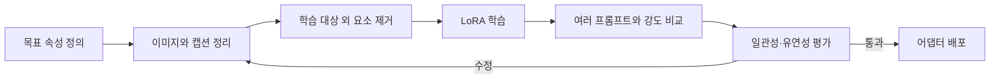

> [!abstract] 한 줄 요약
> 이미지 LoRA의 품질은 “몇 장을 넣었는가”보다, **학습 대상만 남긴 데이터와 적용 강도를 검토하는 과정**에서 결정된다.

강의는 Stable Diffusion 계열의 LoRA, DreamBooth, VAE, 의상·캐릭터·스타일 학습 사례를 다룬다. 이 문서는 결과 이미지를 재현하지 않고, 작은 어댑터를 만들기 전후에 무엇을 통제해야 하는지에 집중한다.

```html preview h=180
<div style="font-family:system-ui,sans-serif;padding:16px;color:var(--foreground);background:var(--card);border:1px solid var(--border);border-radius:var(--radius)">
  <div style="font-weight:700;margin-bottom:9px">이미지 LoRA의 학습-적용 루프</div>
  <svg viewBox="0 0 720 118" width="100%" role="img" aria-label="데이터 선별, 캡션, LoRA 학습, 가중치 조정, 결과 검토를 잇는 독자 제작 도식">
    <g font-family="system-ui,sans-serif" text-anchor="middle"><rect x="12" y="36" width="126" height="48" rx="12" fill="var(--card)" stroke="var(--chart-1)"/><text x="75" y="63" font-size="13" font-weight="700" fill="currentColor">데이터 선별</text><rect x="156" y="36" width="126" height="48" rx="12" fill="var(--card)" stroke="var(--chart-4)"/><text x="219" y="63" font-size="13" font-weight="700" fill="currentColor">캡션·조건</text><rect x="300" y="36" width="126" height="48" rx="12" fill="var(--card)" stroke="var(--chart-5)"/><text x="363" y="63" font-size="13" font-weight="700" fill="currentColor">LoRA 학습</text><rect x="444" y="36" width="126" height="48" rx="12" fill="var(--card)" stroke="var(--chart-3)"/><text x="507" y="63" font-size="13" font-weight="700" fill="currentColor">강도 적용</text><rect x="588" y="36" width="120" height="48" rx="12" fill="var(--chart-2)"/><text x="648" y="63" font-size="13" font-weight="700" fill="white">결과 검토</text><path d="M142 60h8M286 60h8M430 60h8M574 60h8" stroke="var(--muted-foreground)" stroke-width="3"/><path d="M150 60l-7-5v10zM294 60l-7-5v10zM438 60l-7-5v10zM582 60l-7-5v10z" fill="var(--muted-foreground)"/></g>
  </svg>
</div>
```

## 무엇을 학습시키는가

| 목표 | 데이터에서 유지해야 할 것 | 특히 조심할 혼입 |
| :-- | :-- | :-- |
| 캐릭터 | 얼굴·의상·특징적 소품 | 배경이나 촬영 각도만 반복되는 편향 |
| 스타일 | 선·색·질감·조명 경향 | 특정 피사체까지 스타일로 고정되는 현상 |
| 의상·제품 | 형태·재질·디테일 | 마네킹·모델의 얼굴이나 포즈가 함께 학습되는 현상 |
| 공간 | 구조·재료·분위기 | 실제 치수·구조 타당성을 모델이 안다고 가정하는 오류 |

> [!important] 데이터는 분리해서 본다
> 의상 LoRA라면 의상 자체를 배우게 해야 한다. 같은 사람의 얼굴·같은 배경·같은 포즈가 계속 등장하면, 모델은 의도하지 않은 요소까지 목표의 일부로 배울 수 있다.

## 적용 강도와 결과 변화

<Tabs>
  <Tab label="낮은 강도">
    기본 모델의 일반성을 더 많이 남긴다. 대상의 특징이 약하게 나타날 수 있지만, 프롬프트 변화에는 유연할 수 있다.
  </Tab>
  <Tab label="중간 강도">
    목표 특징과 기본 모델의 균형을 탐색하는 구간이다. 하나의 대표 프롬프트만 보지 말고 여러 조건에서 비교한다.
  </Tab>
  <Tab label="높은 강도">
    학습한 특징이 강하게 드러난다. 과도하면 원하지 않는 스타일·얼굴·배경까지 고정되거나 프롬프트 통제가 약해질 수 있다.
  </Tab>
</Tabs>

```html preview h=165
<div style="font-family:system-ui,sans-serif;padding:16px;color:var(--foreground)">
  <div style="font-size:14px;font-weight:700;margin-bottom:10px">가중치는 품질 점수가 아니라 조절 손잡이다</div>
  <div style="display:flex;align-items:center;gap:10px"><span style="font-size:12px">기본 모델</span><div style="flex:1;height:16px;border-radius:999px;background:linear-gradient(90deg,var(--chart-1),var(--chart-4),var(--chart-5))"></div><span style="font-size:12px">LoRA 특징</span></div>
  <div style="display:flex;justify-content:space-between;font-size:12px;color:var(--muted-foreground);margin-top:8px"><span>낮게: 유연성 확인</span><span>중간: 균형 비교</span><span>높게: 과적합 점검</span></div>
</div>
```

## 학습 전후의 검토 흐름



## DreamBooth와 LoRA

| 방식 | 강의에서 강조한 방향 | 판단할 점 |
| :-- | :-- | :-- |
| DreamBooth | 적은 사용자 지정 이미지로 특정 대상에 맞추는 추가 학습 | 대상 충실도와 일반성의 균형 |
| LoRA | 큰 모델의 일부 변화만 작은 모듈로 학습 | 비용·속도·여러 어댑터 관리 |
| VAE 선택 | 생성된 이미지의 표현을 보정하는 구성 요소 | 모델·스타일과의 호환성 |

<details>
<summary>이미지 데이터 준비 체크리스트</summary>

- 학습하고 싶은 대상이 이미지마다 충분히 보이는가
- 각도·거리·조명·배경이 어느 정도 다양하게 포함되는가
- 대상 외에 반복되는 얼굴·로고·배경을 줄였는가
- 캡션이 대상과 변형 가능 속성을 구분하는가
- 학습 결과를 볼 별도 평가 프롬프트와 참조 조건을 마련했는가

</details>

> [!warning] 원문 표기
> 의상 학습 사례의 설명에는 `felxible`이라는 표기가 있다. 이는 **원문 오류**로 표시하며, 표기는 원문 그대로 보존한다.

## 핵심 정리

| 개념 | 기억할 점 |
| :-- | :-- |
| 이미지 LoRA | 특정 스타일·대상에 대한 작은 추가 학습 모듈 |
| 캡션 | 모델이 무엇을 학습해야 하는지 구분하는 언어적 조건 |
| 가중치 | LoRA 특징을 얼마나 강하게 적용할지 조절 |
| 데이터 다양성 | 목표 특징과 무관한 요소의 고정을 줄이는 방법 |
| 평가 | 충실도뿐 아니라 다양한 프롬프트에서의 유연성을 확인 |

> [!question]- 스스로 점검
> 같은 인물과 같은 배경만 반복한 데이터로 의상 LoRA를 학습하면 어떤 문제가 생길 수 있는가?
>
> **답:** 의상만이 아니라 인물의 얼굴·배경·포즈까지 함께 연관 지을 수 있다. 목적 외 반복 요소를 줄이고 다양한 조건을 넣어야 한다.
