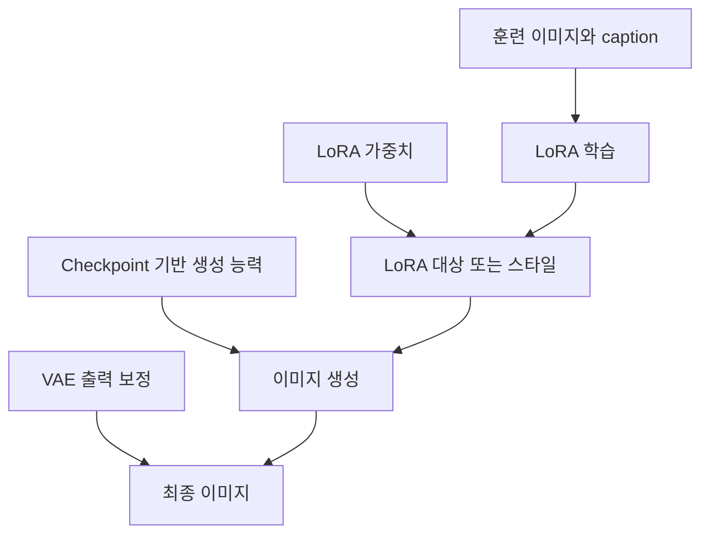

> [!abstract] 이 강의가 답하는 질문
> Stable Diffusion에서 checkpoint·LoRA·VAE를 어떻게 구분하고, 작은 이미지 데이터로 캐릭터나 의류를 학습할 때 가중치·데이터 다양성·정규화의 trade-off를 어떻게 기록해야 하는가?

## Stable Diffusion 작업은 여러 파일의 역할을 구분하는 데서 시작한다

자료는 Stable Diffusion 설치에서 checkpoint 추가, txt2img, img2img, LoRA, VAE, embedding, 배경 삭제, pose 제어, tag keyword까지 이어지는 일련의 주제를 제시한다. 이 목록은 하나의 파일이 모든 기능을 수행한다는 뜻이 아니다. 기반 생성 능력, 추가로 학습한 스타일이나 대상, 출력 보정처럼 역할이 다른 요소를 조합하는 환경이라는 뜻이다.

==Checkpoint==는 기존 학습 모델로서 이미지 생성의 기반을 제공한다. ==LoRA==는 그 기반에 새 이미지나 스타일을 추가로 학습한 작은 모델 파일로 설명된다. 사용자가 직접 만들 수도 있고 배포 사이트에서 내려받아 적용할 수도 있다. 게임 주인공처럼 반복해서 유지해야 할 캐릭터를 LoRA로 만들어 여러 장면의 이미지를 생성하는 예가 자료에 나온다.

==VAE==는 생성된 이미지가 흐리거나 품질 보정이 필요할 때 적용하는 요소로 소개된다. 자료는 VAE도 스타일에 맞춰 고르며 크게 2D animation style과 photorealistic image 범주를 구분한다고 설명한다. 이 세 요소를 섞어 부르면 결과 변화의 원인을 찾기 어렵다.



> [!important] 역할을 먼저 적고 파일명을 나중에 적는다
> 어떤 checkpoint를 기반으로 했는지, 어떤 LoRA를 어떤 가중치로 적용했는지, 어떤 VAE를 썼는지를 분리해 기록해야 같은 prompt에서도 결과가 달라진 이유를 추적할 수 있다.

<Tabs>
  <Tab label="Checkpoint">사전 학습된 기반 모델이다. LoRA가 추가하는 대상과 스타일이 표현될 바탕을 제공한다.</Tab>
  <Tab label="LoRA">기존 모델에 새 이미지·캐릭터·의류·스타일을 학습한 추가 파일이다. 직접 만들거나 배포된 파일을 적용할 수 있다.</Tab>
  <Tab label="VAE">생성 결과가 흐리거나 표현 보정이 필요할 때 선택한다. 자료는 2D style과 실사 이미지에 맞는 선택을 구분한다.</Tab>
</Tabs>

## LoRA 가중치는 정답 점수가 아니라 적용 강도다

자료가 제시하는 LoRA 가중치 범위는 ==0.1에서 1.0==이다. 값 1은 LoRA를 100% 적용한다는 의미로 설명된다. 이 범위는 사용자가 학습한 특징이 결과에 얼마나 강하게 드러날지 탐색하기 위한 제어다. 높을수록 언제나 더 좋은 결과가 된다는 성능 점수가 아니다.

```html preview
<div style="font-family:system-ui,sans-serif;padding:20px;color:var(--foreground)">
  <label for="amt" style="font-size:14px;font-weight:600">LoRA 가중치</label>
  <div id="out" style="font-size:30px;font-weight:700;color:var(--chart-1);margin:6px 0">1.0</div>
  <input id="amt" type="range" min="0.1" max="1.0" step="0.1" value="1.0"
    style="width:100%;accent-color:var(--primary)" />
  <p style="font-size:13px;color:var(--muted-foreground)">자료의 0.1–1.0 범위에서 적용 강도를 확인한다. 1은 100% 적용을 뜻한다.</p>
  <script>
    var amt = document.getElementById('amt');
    var out = document.getElementById('out');
    amt.addEventListener('input', function () {
      out.textContent = Number(amt.value).toFixed(1);
    });
  </script>
</div>
```

Slider는 자료에 적힌 범위만 보여 준다. 특정 캐릭터나 스타일에 가장 좋은 값은 제시되어 있지 않다. 결과를 비교할 때에는 prompt와 seed, checkpoint, VAE를 그대로 두고 LoRA 가중치만 바꾸어야 강도 변화의 영향을 분리할 수 있다. 이 비교 원칙은 재현을 위한 운영 해석이며, 자료에 없는 최적값을 만들어 내기 위한 것이 아니다.

> [!caution] 범위를 권장값으로 바꾸지 않는다
> 0.1–1.0은 자료가 설명한 적용 범위이고 1은 100% 적용이라는 뜻이다. 1이 품질 최고점이라는 의미도, 모든 LoRA가 같은 값에서 안정적이라는 의미도 아니다.

<details>
<summary>가중치 비교에서 고정해야 할 항목</summary>

가중치의 영향만 보려면 checkpoint, prompt, seed, VAE, 함께 적용한 다른 LoRA를 동일하게 유지해야 한다. 여러 조건을 동시에 바꾸면 스타일이 강해진 원인을 가중치 하나에 돌릴 수 없다.

비교 기록에는 사용한 LoRA 이름, trigger, 가중치, 기반 checkpoint, VAE 종류와 관찰한 변화가 포함되어야 한다. 자료는 구체적인 최적화 절차를 제시하지 않으므로, 이 기록은 source 수치를 확대하기 위한 것이 아니라 적용 조건을 잃지 않기 위한 최소 단위다.

</details>

## BlindBox 사례는 새 버전과 안정 버전을 구분한다

BlindBox Artstyle 설명은 V3에서 눈 표현을 조정했다고 밝힌다. 동시에 V3는 아직 experimental 성격이며, 안정성 관점에서는 v1_mix를 추천한다고 적는다. 최신 버전이라는 사실과 안정적으로 권장되는 버전이 같지 않을 수 있음을 보여 주는 사례다.

이 사례를 단순히 “V3가 더 좋다”로 요약하면 자료의 핵심 경계가 사라진다. V3의 변경점은 눈이고, 현재 상태는 실험적이며, 안정성 추천은 v1_mix다. 어느 버전이 특정 prompt나 checkpoint에서 우수한지는 별도의 결과가 필요하다. 추출 텍스트에는 비교 점수나 시험 횟수가 없다.

> [!example] 버전 선택 기록
> 기능 변화는 V3의 눈 조정, 성숙도는 experimental, 안정성 추천은 v1_mix로 나누어 적는다. 세 정보를 한 줄의 순위로 합치지 않는다.

## 의류 LoRA의 데이터 준비는 여덟 단계로 읽는다

의류 학습 사례는 plastic mannequin이나 실제 인물이 입은 옷 사진을 사용해 새 인물, 자세, 배경에 옷을 적용하려는 목적을 설명한다. 옷만 찍은 사진으로도 학습할 수 있지만 mannequin을 사용한 결과가 더 좋았다고 적고, caption과 데이터셋 준비로 생성 이미지에서 mannequin의 영향을 줄이는 방향을 제시한다.

자료의 여덟 항목은 단순한 실행 순서라기보다 데이터 구성과 학습 trade-off를 함께 보여 준다.

1. **이미지 수** — 훈련에는 1장부터 20장까지 사용할 수 있으며 많을수록 좋다고 설명한다.
2. **각도와 착용 상태** — 옷을 서로 다른 angle에서 보고 plastic mannequin 또는 실제 인물이 입은 모습도 포함하는 것이 이상적이다.
3. **얼굴 반복 방지** — 대부분의 이미지에서 같은 mannequin이나 인물 얼굴이 반복되면 모델이 얼굴까지 학습할 수 있으므로 반복을 피한다.
4. **색상 변경 가능성** — 대부분의 경우 prompt로 옷 색을 이후에 바꿀 수 있다고 적는다.
5. **Regularization trade-off** — regularization은 모델을 더 flexible하게 만들 수 있지만 resemblance를 조금 줄일 수 있다.
6. **다중 subject의 부담** — 여러 subject를 함께 학습할 수 있지만 subject마다 필요한 training step이 다를 수 있어 단일 subject보다 번거롭고 덜 flexible할 수 있다.
7. **얼굴 후처리** — training target의 full body face 품질을 위해 After Detailer 사용을 제안한다.
8. **여러 sample prompt** — Kohya ss의 sample image generation box에 prompt를 한 줄씩 넣어 여러 prompt를 생성할 수 있다고 설명한다.

여기서 ==데이터 다양성==은 이미지 장수만 뜻하지 않는다. 서로 다른 angle과 착용 상태가 있어야 옷 자체와 특정 mannequin의 자세를 구분할 가능성이 생긴다. 같은 얼굴이 반복되면 옷과 무관한 정체성이 학습될 수 있다는 경고는 데이터셋의 공통 요소가 곧 모델의 학습 신호가 된다는 뜻이다.

| 데이터 결정 | 기대하는 효과 | 자료가 밝힌 비용 또는 위험 |
| :-- | :-- | :-- |
| 1–20장 사용, 더 많은 이미지 | 옷의 여러 모습을 제공 | 장수만으로 다양성이 보장되지는 않음 |
| 여러 angle과 착용 모습 | 자세·배경 변화에 대응 | 특정 mannequin 요소가 반복될 수 있음 |
| 얼굴 반복 줄이기 | 얼굴 정체성의 불필요한 학습 방지 | 데이터 수집 구성이 더 까다로움 |
| Regularization 사용 | 더 flexible한 모델 | resemblance가 조금 감소할 수 있음 |
| 다중 subject 학습 | 여러 대상을 한 번에 다룸 | subject별 step 차이로 번거롭고 덜 flexible할 수 있음 |
| Caption과 데이터 준비 | mannequin 영향 분리 | 부정확한 caption은 분리 기준을 흐릴 수 있음 |

마지막 표의 caption 위험 문장은 데이터 준비가 mannequin 제거에 쓰인다는 자료 설명에서 직접 이어지는 운영 경계다. 정량 손실이나 자동 제거 성공률은 제시되지 않으므로 그런 값을 추가하지 않는다.

<details>
<summary>Regularized와 non-regularized 결과를 비교할 때</summary>

자료는 두 결과를 비교한다고 밝히고 regularization이 flexibility를 높일 수 있지만 resemblance를 조금 낮출 수 있다고 설명한다. 따라서 비교 질문은 어느 쪽이 절대적으로 좋은지가 아니라, 새 자세·배경·색상으로 바꿀 여지를 얼마나 얻었고 원래 의류의 닮음이 얼마나 유지되었는가가 된다.

다중 subject는 가능한 기능이지만 subject마다 필요한 training step이 다를 수 있다. 하나의 공통 step을 모든 의류에 적용해도 같은 학습 정도가 된다고 가정하면 안 된다. 추출 텍스트에는 구체적인 step 수가 없으므로 임의의 epoch나 반복 횟수를 제안하지 않는다.

</details>

## DreamBooth와 LoRA는 조정 범위와 산출물을 구분한다

자료는 Stable Diffusion fine-tuning의 대표 방법으로 DreamBooth와 LoRA를 함께 소개한다. DreamBooth는 사용자 지정 데이터셋과 소수 이미지를 사용해 특정 인물이나 스타일을 위한 전용 모델을 만드는 방향으로 설명된다. 세밀한 특징을 학습해 일관된 결과를 만들고 높은 품질을 지향한다는 항목이 제시된다.

LoRA는 사전 학습 모델 전체 가중치를 갱신하지 않고 특정 부분의 low-rank matrix만 갱신하는 효율적인 fine-tuning으로 설명된다. 기존 모델 대부분을 유지해 학습이 빠르고, 상대적으로 적은 데이터로도 조정할 수 있다는 항목이 나온다. 이 설명은 DreamBooth가 항상 느리고 LoRA가 항상 우수하다는 benchmark가 아니다. 어떤 산출물을 만들고 어느 범위를 수정하는가를 구분하기 위한 개념 비교다.

| 비교 축 | DreamBooth | LoRA |
| :-- | :-- | :-- |
| 자료의 초점 | 특정 인물·스타일에 맞춘 전용 모델 | 기존 모델에 효율적인 저랭크 조정 |
| 학습 범위 설명 | 사용자 지정 데이터셋으로 모델을 세부 조정 | 전체 가중치 대신 특정 low-rank 부분 갱신 |
| 제시된 장점 | 소수 이미지, 세밀한 특징, 일관된 결과 | 메모리·계산 효율, 빠른 학습, 적은 데이터 |
| 이 자료에 없는 것 | 훈련 시간·메모리·정확한 파일 크기 | 동일 데이터에서 DreamBooth와 비교한 정량 성능 |

> [!tip] 방법 이름보다 요구사항을 먼저 적는다
> 전용 모델이 필요한지, 작은 추가 모듈이 필요한지, 원래 대상의 resemblance와 새로운 자세·배경의 flexibility 중 어디에 무게를 둘지를 먼저 적어야 방법 선택을 설명할 수 있다.

## 후반 자료는 sparse 범위를 넘겨 읽지 않는다

후반에는 DreamBooth 구현, IP-Adapter 활용, PEFT inference 문서가 링크 제목으로 제시된다. 이어서 여러 연구·블로그 링크, 영상 자료, 자동차 디자인과 Kia design 페이지, 제조업을 위한 생성형 AI 기반 제품 설계와 virtual product development 환경이라는 표제가 나온다.

하지만 이 범위의 추출 텍스트는 대부분 링크와 짧은 제목뿐이다. IP-Adapter의 구조, PEFT inference 설정, 자동차 디자인의 절차나 성능, 제조 설계 시스템의 단계는 확인할 수 없다. 따라서 이 노트는 “관련 후속 주제가 제시된다”는 사실까지만 보존하고, 링크 제목을 근거로 구현 방법이나 산업 성과를 만들어 내지 않는다.

> [!warning] Sparse source의 사용 한계
> 제목과 링크만 남은 항목은 후속 학습 경로이지 완성된 근거가 아니다. DreamBooth·IP-Adapter·자동차 디자인·제조 제품 설계의 세부 주장은 텍스트가 충분한 별도 근거가 확보되기 전까지 추가하지 않는다.

## 적용 전 점검

- 기반 checkpoint와 추가 LoRA를 같은 파일로 부르지 않았는가?
- VAE의 역할을 학습 자체와 혼동하지 않았는가?
- LoRA 가중치를 0.1–1.0 범위 밖으로 확장하거나 1을 품질 최고점으로 쓰지 않았는가?
- BlindBox V3의 눈 조정, experimental 상태, v1_mix 안정성 추천을 분리했는가?
- 의류 이미지 수뿐 아니라 angle, 착용 상태, 반복 얼굴, caption을 함께 기록했는가?
- Regularization의 flexibility 증가와 resemblance 감소를 동시에 보았는가?
- 다중 subject에 동일한 training step을 가정하지 않았는가?
- Sparse 후반 링크에서 확인되지 않은 절차나 수치를 만들지 않았는가?

> [!question]- 의류 LoRA에서 같은 옷 사진을 많이 모으는 것만으로 충분하지 않은 이유는 무엇인가?
> **답.** 서로 다른 angle과 착용 상태가 없고 같은 얼굴이나 mannequin이 반복되면 모델이 옷뿐 아니라 특정 자세·정체성까지 함께 학습할 수 있기 때문이다. 이미지 수, 다양성, 반복 요소, regularization의 trade-off를 함께 관리해야 한다.
