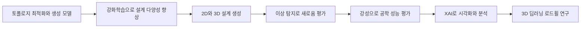

> [!abstract] 한 줄 요약
> 제조 생성 설계 사례는 생성 모델과 강화학습으로 후보를 만들고, 새로움·강성·XAI와 3D 딥러닝으로 설계 결과를 다룬다.

## 자료 맥락과 전체 파이프라인

이 구간은 나니아랩스와 KAIST 강남우 교수의 제조업 제품 설계·디자인 자료다.

- **기관** — 주식회사 나니아랩스.
- **발표자** — KAIST 조천식모빌리티대학원 강남우 교수.
- **주제** — 제조업을 위한 생성형 AI 기반 제품 설계 및 디자인.



## 세 연구의 역할

세 논문은 기술 통합, 다양성 향상, 3D CAD 개념휠을 각각 다룬다.

| 연도 | 연구 | 발표 자료의 연결 |
| :-- | :-- | :-- |
| 2019 | Oh, Jung, Kim, Lee, Kang, “Deep Generative Design: Integration of Topology Optimization and Generative Models” | 토폴로지 최적화와 생성 모델 통합 |
| 2022 | Jang, Yoo, Kang, “Generative Design by Reinforcement Learning: Enhancing the Diversity of Topology Optimization Designs” | 토폴로지 최적화 설계의 다양성 향상 |
| 2021 | Yoo, Lee, Kim, Hwang, Park, Kang, “Integrating Deep Learning into CAD/CAE System: Generative Design and Evaluation of 3D Conceptual Wheel” | 3D 개념휠의 생성과 평가 |

<details>
<summary>학술지 표기</summary>

- **2019** — Journal of Mechanical Design, 141(11), 111405.
- **2021** — Structural and Multidisciplinary Optimization, 64(4), 2725–2747.
- **2022** — Computer-Aided Design 146권으로 표기된다.

</details>

## 생성 규모와 2D·3D 구분

발표 자료는 2D와 3D 설계의 생성 규모를 서로 다른 표현으로 제시한다.

```html preview
<div style="font-family:system-ui,sans-serif;padding:20px">
  <div id="cards" style="display:flex;gap:14px;flex-wrap:wrap"></div>
  <script>
    var stats = [
      ['새로운 2D 설계', '수만 개', '원문 규모 표현', 'var(--chart-2)'],
      ['새로운 3D 설계', '수천 개', '원문 규모 표현', 'var(--chart-1)'],
      ['3D 개념휠 연구', '2021', 'CAD/CAE 통합', 'var(--chart-5)']
    ];
    document.getElementById('cards').innerHTML = stats.map(function (s) {
      return '<div style="flex:1;min-width:150px;padding:16px;background:var(--card);' +
        'color:var(--card-foreground);border:1px solid var(--border);' +
        'border-radius:var(--radius)">' +
        '<div style="font-size:13px;color:var(--muted-foreground)">' + s[0] + '</div>' +
        '<div style="font-size:26px;font-weight:700;margin-top:4px">' + s[1] + '</div>' +
        '<div style="font-size:12px;font-weight:600;margin-top:4px;color:' + s[3] + '">' +
        s[2] + '</div>' +
        '</div>';
    }).join('');
  </script>
</div>
```

<Tabs>
  <Tab label="2D 설계">
  **배치** — 토폴로지 최적화, 생성 모델, 강화학습 기반 다양성 화면 뒤에 놓인다.

  **원문 용어** — novel 2D designs.
  </Tab>
  <Tab label="3D 설계">
  **표제** — 3D CAD Data Generation.

  **원문 용어** — novel 3D designs.
  </Tab>
</Tabs>

| 비교 축 | 2D | 3D |
| :-- | :-- | :-- |
| 앞선 화면 | 강화학습으로 설계 다양성 향상 | 3D CAD 데이터 생성 |
| 연결 연구 | Jang, Yoo, Kang, 2022 | Yoo 등, 2021 |
| 이어지는 내용 | 대량 후보 화면 | 개념휠 평가 화면 |

> [!warning] 규모 수치의 한계
> 정확한 개수, 데이터셋 크기, 생성 조건, 유효 후보 수는 추출문에 없다. 범주형 규모를 정수나 성능값으로 바꾸지 않는다.

## 새로움·강성·XAI

세 화면은 3D 개념휠 연구의 평가·분석 항목을 순서대로 제시한다.

<Tabs>
  <Tab label="새로움">
  **원문 제목** — Novelty Evaluation by Anomaly Detection.

  **참고문헌** — Oh 등의 2019년 Deep Generative Design.
  </Tab>
  <Tab label="강성">
  **원문 제목** — Engineering Performance - Stiffness.

  **참고문헌** — Yoo 등의 2021년 3D 개념휠 연구.
  </Tab>
  <Tab label="XAI">
  **원문 제목** — Visualization and analysis - EXplainable AI (XAI).

  **참고문헌** — Yoo 등의 2021년 3D 개념휠 연구.
  </Tab>
</Tabs>

> [!warning] 평가 정보의 한계
> 이상 탐지 방법, 강성 계산, XAI 기법, 평가 결과값은 추출문에 없다. 화면 제목과 참고문헌 연결만 확정한다.

## 3D 딥러닝과 로드휠 연구

마지막 화면은 3D 딥러닝 네트워크와 현대자동차 로드휠 연구를 함께 제시한다.

<details>
<summary>현대자동차 연구 표기</summary>

- **연구명** — 딥러닝을 활용한 데이터 기반 로드휠 성능 예측 기법 연구.
- **기간** — 2020.2–2020.10.
- **화면 제목** — 3D Deep Learning Network.

</details>

> [!warning] 연구 정보의 한계
> 네트워크 구조, 입력 데이터, 예측 수치, 적용 결과는 추출문에 없다. 연구명과 기간만 기록한다.

## 원문 오류와 추출 artifact

오류 표기는 세부 정보로 격리하고 정상 수치로 사용하지 않는다.

<details>
<summary>원문 그대로 보존할 항목</summary>

- **절단 참고문헌** — 첫 참고문헌은 “Computer-Aided Design, 146, 103.”에서 끊긴다.
- **숫자 혼입** — 3D 개념휠 제목에 “Generative Design and 36 Evaluation”이 나타난다.
- **대소문자** — XAI 화면은 “EXplainable AI”로 적혀 있다.
- **기간 원문** — 연구 기간은 “2020.2-2020.10”으로 적혀 있다.

</details>

> [!warning] 해석 금지
> “146, 103.” 뒤의 값과 숫자 36의 의미를 추정하지 않는다. 본문은 기간만 2020.2–2020.10으로 읽기 쉽게 표기한다.
