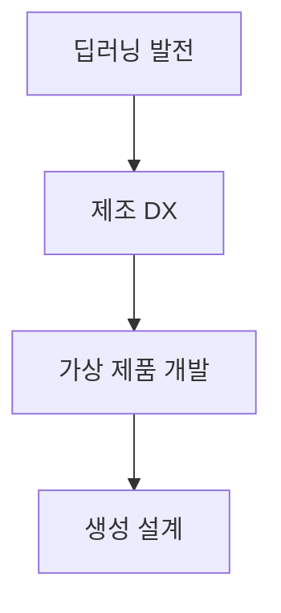
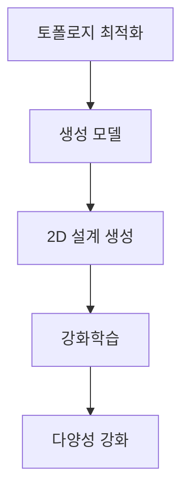
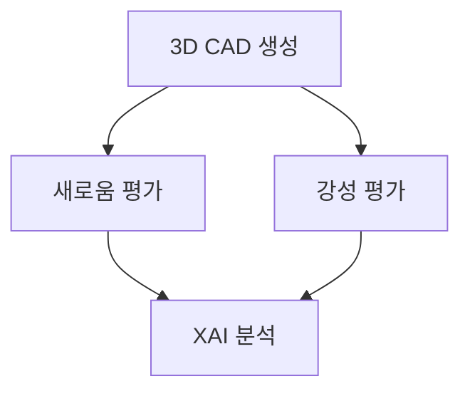

> [!NOTE]
> 제조 생성 설계는 딥러닝과 제조 DX가 만든 가상제품개발 환경에서 설계안을 넓게 탐색하고, 3D CAD·새로움·강성·XAI로 후보를 평가하는 흐름이다.

---

## 제조 DX에서 생성 설계로

**핵심:** 기술 발전 자체보다 가상제품개발 환경과 설계 의사결정의 연결이 중요하다.

| 출발점 | 원문이 제시한 변화 | 설계 관점의 연결 |
| :-- | :-- | :-- |
| 딥러닝 기술의 빠른 발전 | 학습 기반 설계 기술의 배경 | 생성 모델과 성능 예측의 기반 |
| Digital Transformation | 제조 업무의 디지털 전환 | 가상제품개발 환경으로 확장 |
| 가상제품개발 | 실물 제작 전 디지털 탐색 | 생성·평가·해석을 하나의 흐름으로 연결 |

> [!IMPORTANT]
> 이 구간은 나니아랩스와 KAIST 조천식모빌리티대학원 강남우 교수의 제조업용 생성형 AI 제품 설계·디자인 자료를 중심으로 전개된다.

---

## 2D 설계 탐색과 다양성

**핵심:** 토폴로지 최적화와 생성 모델의 결합이 설계 생성을 담당하고, 강화학습은 생성된 설계의 다양성을 넓히는 역할로 제시된다.

<Tabs>
  <Tab label="생성 결합">2019년 연구는 토폴로지 최적화와 생성 모델을 통합한 딥 생성 설계를 제시한다. 원문은 결과 규모를 정확한 개수가 아닌 수만 개 수준의 새로운 2D 설계로 표현한다.</Tab>
  <Tab label="다양성 강화">2022년 연구는 강화학습을 이용해 토폴로지 최적화 설계의 다양성을 높이는 문제를 다룬다.</Tab>
</Tabs>

2D 설계 연구의 서지 흐름

- Oh, Jung, Kim, Lee, Kang의 2019년 연구는 토폴로지 최적화와 생성 모델의 통합을 다룬다.
- Jang, Yoo, Kang의 2022년 연구는 강화학습으로 설계 다양성을 높이는 접근을 다룬다.
- 두 연구는 각각 생성 구조와 다양성 확장이라는 서로 다른 역할을 맡는다.

---

## 3D CAD 생성과 다중 평가

**핵심:** 3D 단계에서는 많은 후보를 만드는 것만으로 충분하지 않으며, 새로움·공학 성능·설명 가능성을 분리해 확인해야 한다.

| 평가 축 | 원문 표현 | 판단 대상 |
| :-- | :-- | :-- |
| 형상 생성 | 3D CAD Data Generation | 개념 휠의 3D 설계 후보 |
| 새로움 | Anomaly Detection | 기존 설계와 다른 정도 |
| 공학 성능 | Stiffness | 구조적 강성 |
| 해석 | Visualization and XAI | 예측·평가 결과의 설명 가능성 |

> [!TIP]
> 새로움 평가는 설계가 낯선지를 묻고, 강성 평가는 설계가 공학적으로 버틸 수 있는지를 묻는다. 두 기준은 서로 대체되지 않는다.

3D 개념 휠 연구의 연결

Yoo, Lee, Kim, Hwang, Park, Kang의 2021년 연구는 딥러닝을 CAD·CAE 시스템에 통합해 3D 개념 휠을 생성하고 평가하는 흐름을 제시한다. 원문은 결과 규모를 정확한 개수가 아닌 수천 개 수준의 새로운 3D 설계로 표현한다.

---

## 로드휠 성능 예측으로의 확장

**핵심:** 생성 설계의 평가 흐름은 3D 딥러닝 네트워크를 활용한 실제 제조 성능 예측 연구로 이어진다.

| 연구 주체 | 연구 초점 | 기간 |
| :-- | :-- | :-- |
| 현대자동차 | 딥러닝을 활용한 데이터 기반 로드휠 성능 예측 | 2020.2–2020.10 |

수량 표현을 읽는 방법

2D와 3D 설계 수는 각각 수만 개 수준과 수천 개 수준이라는 규모 표현이다. 정확한 표본 수가 아니므로 두 값을 막대 높이, 비율, 증감률처럼 정밀 비교하지 않는다.

> [!WARNING]
> 원문 구간에는 텍스트가 매우 적어 별도 렌더가 필요했던 슬라이드가 여럿 있으며, 공개 노트에는 그 원본 이미지를 넣지 않았다. 구간 첫 자료는 두 개의 참조 주소만 남아 있어 구체적인 자동차 디자인 사례를 단정하지 않는다. 또한 2022년 서지의 권·문서 번호가 “146, 103”으로 끝나고, 2021년 논문 제목 중간에는 “36”이 끼어 있어 추출 또는 편집 흔적으로 보이지만 임의로 보완하지 않았다.

---

## 설계 판단의 순서

| 질문 | 대응 방법 | 경계 |
| :-- | :-- | :-- |
| 설계 공간을 어떻게 넓힐까? | 토폴로지 최적화와 생성 모델, 강화학습 | 생성량과 다양성을 성능으로 오해하지 않는다 |
| 3D 후보가 새로운가? | 이상 탐지 기반 새로움 평가 | 새로움만으로 공학 성능을 보장하지 않는다 |
| 구조적으로 적합한가? | 강성 평가와 CAD·CAE 연결 | 평가 조건이 없으면 수치 비교를 만들지 않는다 |
| 결과를 이해할 수 있는가? | 시각화와 XAI | 설명과 실제 성능 검증을 구분한다 |