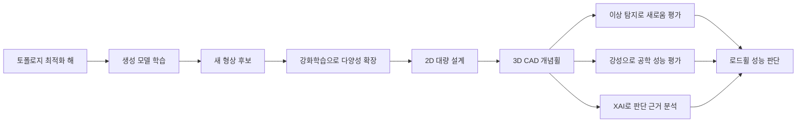

> [!abstract] 생성에서 검증까지
> 이 강의 구간은 형상을 많이 만드는 기술보다, 토폴로지 최적화가 만든 설계 지식을 생성 모델과 강화학습으로 확장하고 2D·3D 후보를 새로움·강성·설명가능성으로 다시 검증하는 연구 사슬을 보여준다.

## 연구 사슬을 먼저 읽기



출발점은 아무 형상이나 그리는 이미지 생성이 아니다. ==토폴로지 최적화== 는 하중과 경계 조건, 재료 사용 같은 공학 조건 아래에서 형상을 탐색한다. 이 과정이 만든 해 집합은 생성 모델이 배워야 할 설계 분포이자, 이후 후보가 공학적으로 타당한지 비교할 기준이다. 생성 모델은 최적화를 없애는 대체물이 아니라 계산으로 확보한 설계 지식을 더 넓은 후보 공간으로 옮기는 확장 장치다.

강의에 제시된 Deep Generative Design 연구는 토폴로지 최적화와 생성 모델의 통합을 전면에 둔다. 핵심 질문은 최적화가 이미 만든 해를 그대로 고르는가가 아니라, 그 해들에서 형상 규칙을 학습해 아직 보지 못한 후보를 만들 수 있는가이다. 생성된 후보가 새로워 보인다는 사실만으로는 답이 되지 않는다. 후보가 학습 분포와 어떤 관계에 있는지, 구조 성능을 유지하는지, 분석 결과를 설계자가 해석할 수 있는지까지 이어져야 연구의 폐쇄 고리가 완성된다.

> [!important] 생성 모델의 역할
> 생성 모델의 가치는 최적화 결과를 장식적으로 변형하는 데 있지 않다. 기존 해 집합의 구조적 규칙을 학습해 탐색 범위를 넓히되, 만들어진 후보를 다시 공학 평가로 돌려보낼 수 있어야 한다.

## 토폴로지 최적화와 생성 모델의 결합

Oh, Jung, Kim, Lee, Kang의 연구 제목은 “Deep Generative Design: Integration of Topology Optimization and Generative Models”다. 토폴로지 최적화는 물리 제약을 반영한 예시를 제공하고, 생성 모델은 그 예시들 사이와 바깥의 형상 가능성을 탐색한다. 이 구분은 생성 결과의 시각적 다양성과 공학적 유효성을 같은 말로 취급하지 않게 한다.

학습 데이터가 모두 비슷한 최적화 해로 구성되면 생성 모델도 그 주변에서만 변형을 만들 가능성이 크다. 반대로 분포를 넓히기만 하고 물리 조건을 잃으면 새로운 후보는 많아져도 설계로 쓸 수 없다. 이 연구 흐름은 ==다양성== 과 ==성능 보존== 을 서로 다른 축으로 둔다. 생성 단계는 후보 수와 형상 폭을 넓히고, 평가 단계는 각 후보가 실제 설계 문제의 조건을 유지하는지 확인한다.

<Tabs>
  <Tab label="토폴로지 최적화">하중·재료·경계 조건 아래에서 공학적으로 의미 있는 해 집합을 만든다.</Tab>
  <Tab label="생성 모델">해 집합의 형상 분포를 학습해 기존 결과만으로는 드러나지 않던 후보를 제안한다.</Tab>
  <Tab label="후속 평가">새로움, 강성, 설명가능성을 분리해 생성 후보가 설계 지식으로 남을 수 있는지 판정한다.</Tab>
</Tabs>

## 강화학습으로 설계 다양성 넓히기

Jang, Yoo, Kang의 연구 제목은 “Generative Design by Reinforcement Learning: Enhancing the Diversity of Topology Optimization Designs”다. 이 제목은 강화학습의 목적을 제한한다. 강화학습이 토폴로지 최적화를 대신해 모든 설계 문제를 해결한다는 주장이 아니라, 최적화 설계의 ==다양성 향상== 에 초점을 둔 것이다.

강화학습 관점에서는 후보를 만드는 선택이 연속적으로 이어지고 그 결과가 설계 공간의 폭과 제약 충족 여부에 영향을 준다. 같은 유형의 형상만 반복해서 얻는다면 탐색은 충분히 넓지 않다. 그렇다고 차이를 크게 만드는 행동만 장려하면 물리적 타당성을 잃을 수 있다. 다양성은 단순한 이미지 간 거리나 눈에 띄는 형태 변화가 아니라, 토폴로지 최적화가 제공한 설계 조건 안에서 서로 다른 유효 해를 발견하는 능력으로 읽어야 한다.

최적화 해는 학습의 출발점이고, 강화학습은 그 해 집합을 둘러싼 탐색 정책을 바꾼다. 그 결과가 실제로 가치 있으려면 이후의 새로움 탐지와 강성 평가가 필요하다. 다양성을 높였다는 결과는 최종 판정이 아니라 평가 파이프라인에 더 많은 후보를 공급했다는 중간 성과다.

## 2D 대량 생성에서 3D CAD 개념휠로

```html preview
<div style="font-family:system-ui,sans-serif;padding:20px">
  <div id="cards" style="display:flex;gap:14px;flex-wrap:wrap"></div>
  <script>
    var stats = [
      ['2D 새 설계', '수만 개', '형상 후보 규모', 'var(--chart-1)'],
      ['3D 새 설계', '수천 개', 'CAD 후보 규모', 'var(--chart-2)'],
      ['평가 관점', '3개', '새로움·강성·XAI', 'var(--chart-3)']
    ];
    document.getElementById('cards').innerHTML = stats.map(function (s) {
      return '<div style="flex:1;min-width:150px;padding:16px;background:var(--card);' +
        'color:var(--card-foreground);border:1px solid var(--border);' +
        'border-radius:var(--radius)">' +
        '<div style="font-size:13px;color:var(--muted-foreground)">' + s[0] + '</div>' +
        '<div style="font-size:26px;font-weight:700;margin-top:4px">' + s[1] + '</div>' +
        '<div style="font-size:12px;font-weight:600;margin-top:4px;color:' + s[3] + '">' +
        s[2] + '</div>' +
        '</div>';
    }).join('');
  </script>
</div>
```

강의는 규모를 “수만 개의 새로운 2D 설계”와 “수천 개의 새로운 3D 설계”로 구분한다. 이 차이는 같은 후보를 차원만 바꿔 세었다는 뜻이 아니다. 2D에서는 많은 형상 변형을 빠르게 생성해 분포와 다양성을 살필 수 있지만, 3D CAD에서는 부피와 곡면, 조립과 해석에 필요한 형상 표현까지 다뤄야 한다. 후보 수가 줄어드는 대신 설계 객체가 담아야 할 공학 정보의 차원이 커진다.

Yoo, Lee, Kim, Hwang, Park, Kang의 연구는 딥러닝을 CAD/CAE 시스템에 통합해 3D 개념휠을 생성하고 평가하는 문제를 다룬다. ==개념휠== 은 단순한 렌더 이미지가 아니라 구조 해석과 성능 예측으로 이어질 수 있는 설계 대상이다. 이 사례에서 3D 생성은 끝점이 아니다. 생성된 휠 형상이 얼마나 새로운지, 하중을 받았을 때 충분한 강성을 보이는지, 네트워크가 어떤 형상 특징을 근거로 판단했는지 분석하는 단계가 뒤따른다.

2D와 3D 규모를 함께 제시하는 이유는 생성 설계의 확장 방향을 보여주기 위해서다. 2D 대량 후보는 탐색 폭을 확보하고, 3D CAD 후보는 실제 설계 시스템과의 연결 가능성을 시험한다. 두 규모를 한 숫자로 합치면 차이가 사라진다. 후보 수는 더 많을수록 우수하다는 순위가 아니라, 각 표현 단계에서 가능한 탐색과 검증의 범위를 나타내는 근거다.

## 세 가지 평가를 분리한다

### 새로움은 이상 탐지로 확인한다

강의는 novelty evaluation 방법으로 anomaly detection을 제시한다. 여기서 이상은 오류라는 뜻만이 아니다. 학습된 설계 분포와 충분히 다른 후보를 찾아 기존 결과의 복사인지, 새로운 형상 영역을 탐색했는지 판단하는 신호다. 그러나 분포에서 멀다는 이유만으로 좋은 설계가 되지는 않는다. 이상 탐지는 새로움의 후보를 골라낼 뿐 구조 성능을 보증하지 않는다.

### 강성은 공학 성능을 묻는다

engineering performance 항목은 stiffness를 직접 지목한다. 휠과 같은 구조 부품에서 강성은 하중에 대한 변형 저항을 보여주는 핵심 성능이다. 생성 모델이 흥미로운 형상을 만들더라도 필요한 강성을 확보하지 못하면 채택할 수 없다. 이 평가는 생성 이미지의 선호도와 완전히 다른 질문이며 CAD/CAE 통합이 필요한 이유를 드러낸다.

### XAI는 결과를 설계 판단으로 바꾼다

강의는 visualization and analysis 단계에서 Explainable AI, 즉 XAI를 제시한다. 성능 예측값 하나만 얻는 것으로는 어떤 형상 특징이 결과에 기여했는지 알기 어렵다. XAI는 네트워크가 주목한 영역과 설계 변수의 영향을 시각화하고 분석해 예측 결과를 설계자가 검토할 수 있는 근거로 바꾼다. 설명 자체가 최종 성능이라는 뜻이 아니라 생성·예측·설계 판단 사이의 추적성을 높이는 과정이다.

| 평가 축 | 강의가 제시한 방법·대상 | 답하려는 질문 | 단독 사용의 한계 |
| :-- | :-- | :-- | :-- |
| 설계 다양성 | 강화학습으로 토폴로지 최적화 해의 폭 확장 | 서로 다른 유효 후보를 더 탐색했는가 | 물리 성능을 보증하지 않는다 |
| 새로움 | 이상 탐지 | 기존 분포와 다른 후보인가 | 분포 밖 후보가 곧 우수한 설계는 아니다 |
| 공학 성능 | 강성 | 하중 조건에서 구조적으로 쓸 수 있는가 | 새로움과 설계 의도를 설명하지 않는다 |
| 설명가능성 | XAI 기반 시각화·분석 | 예측과 선택의 근거를 검토할 수 있는가 | 설명은 실험이나 해석을 대체하지 않는다 |
| 제품 연결 | 3D 개념휠과 로드휠 성능 예측 | 생성 결과를 CAD/CAE 판단으로 넘길 수 있는가 | 실제 설계 조건과 검증 절차가 필요하다 |

## 평가 순서가 결과의 의미를 바꾼다

새로움, 강성, XAI는 한 번에 합쳐 읽을 지표가 아니다. 먼저 생성 단계가 토폴로지 최적화 해와 다른 후보를 만들었는지 살피고, 이상 탐지로 분포상의 차이를 확인한다. 그다음 강성 평가가 그 후보를 실제 구조 부품으로 검토할 수 있는지 가른다. 마지막으로 XAI 분석을 통해 예측이 어느 형상 특징에 의존했는지 확인하면, 설계자는 후보를 채택하거나 다시 생성 단계로 돌려보낼 근거를 얻는다.

순서를 거꾸로 하면 해석이 흐려질 수 있다. 강성이 높은 후보만 먼저 남기면 기존 최적화 해와 거의 같은 형상이 반복되어 생성 모델의 탐색 가치가 사라질 수 있다. 반대로 새로움만 먼저 극대화하면 공학적으로 사용할 수 없는 후보가 평가 자원을 차지한다. XAI를 성능 검증 전에 붙이면 설명 가능한 오류를 얻을 뿐이다. 세 단계는 경쟁 지표가 아니라 서로 다른 실패를 걸러내는 연속 검사다.

이 구조는 연구 결과를 비교할 때도 유용하다. 2D 후보 수는 탐색 규모를, 3D CAD 결과는 표현의 복잡도를, 강성은 물리 타당성을, XAI는 판단의 추적성을 말한다. 서로 다른 질문에 답한 값을 단일 성공률로 압축하면 어떤 단계가 개선됐는지 알 수 없다. 연구 성과를 읽을 때는 생성량, 새로움, 공학 성능, 설명가능성을 각각의 증거로 남겨야 한다.

<details>
<summary>세 연구를 하나의 파이프라인으로 연결해 읽는 법</summary>

첫째, 토폴로지 최적화와 생성 모델 통합 연구는 공학 해 집합에서 새로운 형상을 만드는 생성 기반을 제공한다. 둘째, 강화학습 기반 연구는 그 기반 위에서 후보 다양성을 더 넓히는 탐색 전략을 제시한다. 셋째, 3D 개념휠 연구는 생성된 형상을 CAD/CAE 표현으로 옮기고 새로움·강성·XAI 평가까지 연결한다.

세 연구는 같은 실험을 반복한 것이 아니다. 생성 분포 구축, 탐색 정책 확장, 3D 제품 평가라는 서로 다른 병목을 다룬다. 이들을 연결하면 “많이 생성했다”에서 끝나지 않고 “어떤 조건에서 생성했고, 무엇으로 걸러냈으며, 제품 성능 판단에 어떻게 넘겼는가”라는 전체 흐름이 보인다.

</details>

## 로드휠 성능 예측으로 이어지는 이유

마지막에 제시된 현대자동차 연구 과제는 “딥러닝을 활용한 데이터 기반 로드휠 성능 예측 기법 연구”다. 이 항목은 앞선 생성 설계가 제품 후보 생성에 머물지 않고 실제 부품의 성능 예측 문제로 이어짐을 보여준다. 토폴로지 최적화와 생성 모델이 후보를 만들고, 3D CAD/CAE가 평가 가능한 형식으로 옮기며, 딥러닝이 성능 예측을 지원하는 연속선이다.

이 연속선에서 역할을 섞으면 안 된다. 생성 모델은 후보를 제안하고, 강성 해석이나 데이터 기반 예측은 공학 성능을 확인하며, XAI는 판단 근거를 살핀다. 어느 한 단계도 나머지를 자동으로 대신하지 않는다. ==생성 설계 시스템== 은 하나의 모델 이름이 아니라 생성·물리 평가·예측·설명·선택이 연결된 작업 체계다.

<details>
<summary>원문 표기와 추출 artifact</summary>

3D 개념휠 논문 제목을 추출한 문장에는 “Generative Design and 36 Evaluation of 3D Conceptual Wheel”처럼 숫자 36이 중간에 끼어 있다. 이 숫자는 설계 개수나 성능값으로 쓰지 않고, 슬라이드 레이아웃이 텍스트로 변환되며 섞인 추출 artifact로 보존한다.

XAI 항목은 원문에서 “EXplainable AI”처럼 대문자가 비정상적으로 섞여 있다. 본문에서는 통용 표기인 Explainable AI를 사용했지만 원문 표기 자체는 여기 기록한다.

</details>

> [!warning] 숫자의 해석 경계
> 수만 개의 2D 후보와 수천 개의 3D 후보는 탐색 규모를 말한다. 후보 수, 새로움, 강성, XAI 결과를 하나의 우열 점수로 합치면 각 근거가 답하는 질문이 사라진다.

이 경계를 실제 후보 판정에 적용하면 다음 질문으로 이어진다.

> [!question]- 설계 검토
> **Q.** 이상 탐지에서 매우 새로운 3D 휠 후보가 나왔지만 강성이 낮고 XAI 분석에서 판단 근거도 불안정하다면, 새로운 설계라는 이유만으로 다음 단계에 채택해도 되는가?
>
> **A.** 채택하면 안 된다. 이상 탐지는 기존 분포와의 차이를 보여줄 뿐이다. 강성으로 공학 조건을 확인하고, XAI로 예측 근거를 검토하며, CAD/CAE와 성능 예측 절차에서 재검증해야 한다.
