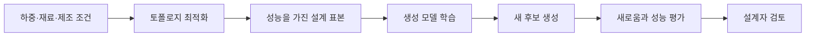

> [!abstract] 한 줄 요약
> 제조 생성 설계의 목표는 새로운 형상을 많이 만드는 것이 아니라, **다양성과 공학 성능을 함께 만족하는 후보를 찾는 것**이다.

강의는 토폴로지 최적화와 생성 모델의 결합, 강화학습으로 설계 다양성을 높이는 접근, 2D·3D 설계 생성, 새로움과 강성 평가를 연결한다. 이미지 생성과 달리 물리적 제품은 시각적 차별성 외에 성능 검증이 필요하다.

```html preview h=180
<div style="font-family:system-ui,sans-serif;padding:16px;color:var(--foreground);background:var(--card);border:1px solid var(--border);border-radius:var(--radius)">
  <div style="font-weight:700;margin-bottom:9px">생성 설계는 후보 생성과 공학 평가를 분리하지 않는다</div>
  <svg viewBox="0 0 720 118" width="100%" role="img" aria-label="설계 제약, 최적화와 생성, 새로움 평가, 성능 평가를 연결한 독자 제작 도식">
    <g font-family="system-ui,sans-serif" text-anchor="middle"><rect x="12" y="36" width="126" height="48" rx="12" fill="var(--card)" stroke="var(--chart-5)"/><text x="75" y="63" font-size="13" font-weight="700" fill="currentColor">설계 제약</text><rect x="156" y="36" width="140" height="48" rx="12" fill="var(--card)" stroke="var(--chart-1)"/><text x="226" y="63" font-size="13" font-weight="700" fill="currentColor">최적화·생성</text><rect x="314" y="36" width="140" height="48" rx="12" fill="var(--card)" stroke="var(--chart-4)"/><text x="384" y="63" font-size="13" font-weight="700" fill="currentColor">후보 집합</text><rect x="472" y="20" width="108" height="40" rx="11" fill="var(--card)" stroke="var(--chart-3)"/><text x="526" y="45" font-size="12" font-weight="700" fill="currentColor">새로움 평가</text><rect x="472" y="70" width="108" height="40" rx="11" fill="var(--card)" stroke="var(--chart-2)"/><text x="526" y="95" font-size="12" font-weight="700" fill="currentColor">성능 평가</text><rect x="610" y="36" width="98" height="48" rx="12" fill="var(--chart-2)"/><text x="659" y="63" font-size="13" font-weight="700" fill="white">선택</text><path d="M142 60h8M300 60h8M458 42h8M458 90h8M586 42h18M586 90h18" stroke="var(--muted-foreground)" stroke-width="3"/></g>
  </svg>
</div>
```

## 생성 설계의 세 가지 질문

| 질문 | 뜻 | 평가의 예 |
| :-- | :-- | :-- |
| 제약을 지켰는가 | 설계 요구·제조 조건을 만족하는가 | 형상 제약, 재료, 치수 |
| 새로운가 | 기존 후보를 단순 반복하지 않는가 | 이상치 탐지, 분포 비교 |
| 성능이 있는가 | 물리적·기능적 목표를 충족하는가 | 강성, 하중, 안정성 |

> [!important] 다양성과 성능은 별개의 축
> 낯선 형태라고 좋은 설계는 아니다. 반대로 성능이 높아도 모두 같은 형태만 나오면 탐색의 장점이 줄어든다. 생성 설계는 두 축을 함께 관리한다.

## 토폴로지 최적화와 생성 모델

<Tabs>
  <Tab label="토폴로지 최적화">
    주어진 하중·경계·재료 조건에서 구조의 재료 분포를 최적화하는 접근이다. 성능 제약이 분명한 설계 후보를 얻는 데 쓰인다.
  </Tab>
  <Tab label="생성 모델">
    기존 설계 분포에서 새로운 후보를 제안한다. 후보 공간을 빠르게 넓힐 수 있지만 성능 검증이 별도로 필요하다.
  </Tab>
  <Tab label="결합">
    최적화 결과를 생성 모델의 학습·평가와 연결하면, 성능 단서를 유지하면서 더 다양한 후보를 탐색할 수 있다.
  </Tab>
</Tabs>



## 새로움을 평가하는 이유

```html preview h=164
<div style="font-family:system-ui,sans-serif;padding:16px;color:var(--foreground)">
  <div style="display:flex;gap:12px;flex-wrap:wrap">
    <div style="flex:1;min-width:180px;padding:14px;border:1px solid var(--chart-5);border-radius:var(--radius);background:var(--card)"><b>너무 익숙함</b><br><span style="font-size:13px;color:var(--muted-foreground)">기존 후보의 거의 같은 반복</span></div>
    <div style="flex:1;min-width:180px;padding:14px;border:1px solid var(--chart-3);border-radius:var(--radius);background:var(--card)"><b>유의미한 새로움</b><br><span style="font-size:13px;color:var(--muted-foreground)">제약을 지키면서 다른 대안</span></div>
    <div style="flex:1;min-width:180px;padding:14px;border:1px solid var(--chart-5);border-radius:var(--radius);background:var(--card)"><b>무효한 이상치</b><br><span style="font-size:13px;color:var(--muted-foreground)">새롭지만 성능·제조 조건을 위반</span></div>
  </div>
</div>
```

강의는 이상치 탐지를 새로움 평가에 활용하는 관점을 제시한다. 다만 이상치라는 통계적 판단만으로 좋은 설계를 뜻하지는 않는다. 공학 성능과 설계 의도를 함께 봐야 한다.

<details>
<summary>후보 설계 평가표</summary>

- 입력 제약과 충돌하는 형상이 있는가
- 기존 후보와 비교해 실제로 다른 선택지를 제안하는가
- 강성 등 핵심 성능 지표가 기준을 만족하는가
- 2D 시안이 3D 형상·제조 맥락에서도 성립하는가
- 결과를 설명할 수 있도록 평가 근거와 선택 이유가 남아 있는가

</details>

> [!note] 설명 가능성
> 강의는 시각화와 XAI를 평가 맥락에 둔다. 설계 후보를 채택하려면 점수만이 아니라 어떤 특성과 제약이 선택에 영향을 주었는지도 검토할 필요가 있다.

## 핵심 정리

| 개념 | 기억할 점 |
| :-- | :-- |
| 생성 설계 | 제약 아래에서 새로운 설계 후보를 탐색 |
| 토폴로지 최적화 | 성능 조건을 고려해 구조 분포를 찾는 방법 |
| 다양성 | 후보들이 서로 다른 가능성을 보이는 정도 |
| 새로움 평가 | 기존 분포에서의 차이를 점검하는 보조 기준 |
| 공학 성능 | 채택 가능성을 결정하는 필수 검증 축 |

> [!question]- 스스로 점검
> 이상치 탐지에서 멀리 떨어진 후보를 바로 “혁신적 설계”라고 부를 수 없는 이유는 무엇인가?
>
> **답:** 통계적 새로움은 성능·안전·제조 가능성을 보장하지 않는다. 설계 제약과 공학 평가를 통과해야 의미 있는 대안이 된다.
