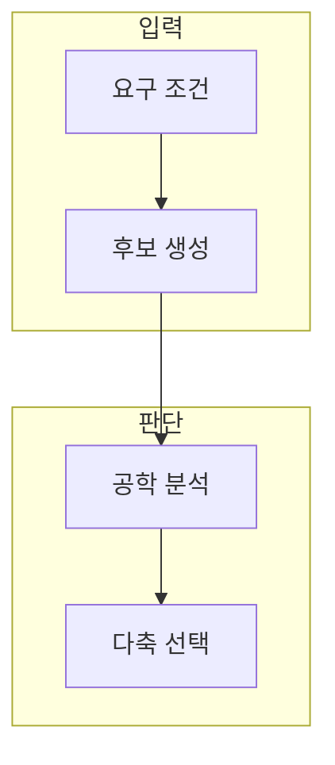

> [!abstract] 한 줄 요약
> 제조 맥락의 생성 설계는 새로운 형상뿐 아니라 성능·제조·안전의 조건 안에서 후보를 비교해야 한다.

## 이 노트의 지도



## 1. 생성 설계의 세 질문

후보 공간의 다양성, 기존 해법과의 새로움, 요구 조건을 만족하는 성능은 서로 다른 평가 축이다. ==다목적 평가== 는 서로 다른 기준의 우선순위와 결과를 함께 드러내는 비교 방식.

> [!note] 판단 기준
> 새로움은 성능의 대체물이 아니며, 성능 하나도 설계 가치 전체를 대신하지 않는다.

## 2. 토폴로지 최적화와 생성 모델

형상 후보를 만들 때는 하중·재료·제조 조건처럼 검증 가능한 제약을 함께 기록한다.

<details>
<summary>가중 평가의 형태</summary>

세 기준의 우선순위를 표시하는 한 가지 표현은 다음과 같다.

$$
J(x) = w_d D(x) + w_n N(x) + w_p P(x), \qquad w_d + w_n + w_p = 1
$$

</details>

## 데이터로 보기

```html preview
<div style="font-family:system-ui,sans-serif;padding:20px;color:var(--foreground)">
  <h3 style="margin:0 0 14px;font-size:15px;font-weight:600">후보 평가 축</h3>
  <div id="bars" style="display:flex;align-items:flex-end;gap:14px;height:170px"></div>
  <script>
    var data = [["다양성",1],["새로움",1],["공학 성능",1]];
    var max = Math.max.apply(null, data.map(function (d) { return d[1]; }));
    document.getElementById('bars').innerHTML = data.map(function (d, i) {
      return '<div style="flex:1;display:flex;flex-direction:column;align-items:center;' +
        'gap:6px;height:100%;justify-content:flex-end">' +
        '<span style="font-size:12px;font-weight:600">' + d[1] + '</span>' +
        '<div style="width:100%;height:' + (d[1] / max * 100) + '%;' +
        'background:var(--chart-' + (i + 1) + ');' +
        'border-radius:var(--radius) var(--radius) 0 0"></div>' +
        '<span style="font-size:12px;color:var(--muted-foreground)">' + d[0] + '</span>' +
        '</div>';
    }).join('');
  </script>
</div>
```

값 1은 세 축 모두 별도 근거가 필요하다는 표시다. 실제 후보 점수나 성능 수치가 아니다.

> [!important] 해석의 경계
> 이 차트는 실제 후보의 우열을 나타내지 않는다. 각 축에 대한 해석·시험·제조 근거를 따로 남긴다.

## 핵심 정리

| 개념 | 정의 | 왜 중요한가 |
| :-- | :-- | :-- |
| 다양성 | 후보 공간의 폭 | 대안 탐색 범위를 드러낸다 |
| 새로움 | 기존 해법과의 차이 | 다른 가능성을 설명한다 |
| 성능 | 요구 조건 충족 | 채택 근거를 만든다 |

## 관련 개념

- 다목적 최적화: 여러 기준의 상충을 다루는 방법
- 설계 검증: 해석·시험으로 조건 충족을 확인하는 방법

> [!question]- 스스로 점검
> **Q.** 다목적 점수 하나만 보고 최종 설계를 선택하면 왜 위험한가?
>
> **A.** 가중치가 담은 가치 판단과 안전·제조·불확실성의 차이를 숨길 수 있으므로 원래 지표도 함께 검토해야 한다.
