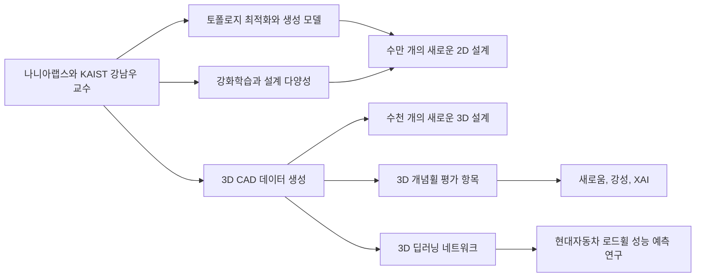

> [!abstract] 제조 생성 설계의 연구 묶음
> 이 구간은 주식회사 나니아랩스와 KAIST 조천식모빌리티대학원 강남우 교수의 제조업 제품 설계·디자인 자료다. 토폴로지 최적화와 생성 모델의 결합, 강화학습을 이용한 설계 다양성 향상, 대규모 2D·3D 설계 생성, 3D 개념휠의 새로움·강성·설명가능성 항목, 로드휠 성능 예측 연구를 한 묶음으로 제시한다.

## 자료의 연구 지형



반복되는 머리말은 이 열 장이 독립적인 일반 이론이 아니라 특정 제조 생성 설계 연구를 설명하는 자료임을 알려 준다. 소속 표기는 ==주식회사 나니아랩스== 와 ==KAIST 조천식모빌리티대학원 강남우 교수== 다. 따라서 본문에 등장하는 연구 제목과 규모 표현은 이 발표 맥락에서 읽어야 한다. 추출문에는 각 연구의 전체 실험 설정이나 모델 구조가 실려 있지 않으므로 제목과 화면에 명시된 항목을 넘어 세부 절차를 보충하지 않는다.

첫 화면은 Jang, Yoo, Kang의 2022년 논문을 이 자료의 대표 참고문헌처럼 놓는다. 논문 제목은 “Generative Design by Reinforcement Learning: Enhancing the Diversity of Topology Optimization Designs”이며 학술지는 Computer-Aided Design으로 적혀 있다. 이 제목이 보장하는 핵심은 강화학습과 토폴로지 최적화 설계의 다양성 향상이 연결된다는 사실이다. 보상 구성, 행동 선택 규칙, 학습 데이터 구성은 해당 추출 구간에 제시되지 않는다.

> [!important] 근거를 읽는 범위
> 화면은 연구 주제·논문 제목·생성 규모·평가 항목을 제공하지만 세부 알고리즘과 실험 조건은 제공하지 않는다. 이 노트는 명시된 연결을 정리하고, 비어 있는 방법론을 임의로 채우지 않는다.

## 토폴로지 최적화와 생성 모델

“Topology Optimization + Generative Model”이라는 짧은 제목 아래에는 Oh, Jung, Kim, Lee, Kang의 2019년 연구가 제시된다. 논문 제목은 “Deep Generative Design: Integration of Topology Optimization and Generative Models”이고, Journal of Mechanical Design 141권 11호, 111405로 표기된다. 제목 자체가 두 기술의 ==통합== 을 연구 대상으로 삼는다는 점은 분명하지만, 이 화면만으로 특정 생성 모델 종류나 학습 절차를 결정할 수는 없다.

이 구간에서 토폴로지 최적화는 생성 모델과 함께 언급되는 출발 기술이고, 생성 모델은 통합 대상이다. 발표 자료는 두 요소의 결합을 한 문구와 참고문헌으로 고정한 뒤, 다음 화면에서 강화학습을 통한 다양성 향상으로 이동한다. 그러므로 둘을 하나의 동일한 연구로 합치기보다 2019년의 통합 연구와 2022년의 강화학습 연구를 구분해 기억하는 편이 정확하다.

<Tabs>
  <Tab label="2019 통합 연구">Oh 등은 토폴로지 최적화와 생성 모델의 통합을 Deep Generative Design이라는 제목으로 제시한다. 출처 표기는 Journal of Mechanical Design 141(11), 111405다.</Tab>
  <Tab label="2022 다양성 연구">Jang, Yoo, Kang은 강화학습을 이용해 토폴로지 최적화 설계의 다양성을 높이는 연구를 Computer-Aided Design에 발표한 것으로 적혀 있다.</Tab>
  <Tab label="2021 3D 개념휠">Yoo 등은 딥러닝을 CAD/CAE 시스템에 통합해 3D 개념휠을 생성하고 평가하는 연구를 Structural and Multidisciplinary Optimization에 발표한 것으로 제시된다.</Tab>
</Tabs>

세 연구는 같은 문장을 반복하지 않는다. 2019년 자료는 기술 통합을, 2022년 자료는 다양성 향상을, 2021년 자료는 3D CAD/CAE와 개념휠 생성·평가를 제목 수준에서 구분한다. 이 구분을 유지하면 생성량, 평가 항목, 제품 연구가 어느 참고문헌과 가까운지 추적하기 쉬워진다.

## 강화학습으로 설계 다양성 향상

다음 화면의 제목은 “Enhance Design Diversity Using Reinforcement Learning”이다. 이 문구와 Jang, Yoo, Kang의 논문 제목은 강화학습이 이 구간에서 맡는 역할을 ==설계 다양성 향상== 으로 한정한다. 발표 자료는 강화학습의 구성 요소를 풀이하지 않고, 연구 목적과 참고문헌만 제시한다.

따라서 이 자료에서 확인할 수 있는 것은 토폴로지 최적화 설계와 강화학습 기반 생성 설계가 다양성이라는 연구 질문으로 연결된다는 점이다. 어떤 선택 규칙을 썼는지, 다양성을 어떤 척도로 계산했는지, 비교군이 무엇이었는지는 추출문에 없다. 특히 다음 화면의 “수만 개”를 다양성 점수나 성능 향상률로 바꾸어 읽어서는 안 된다. 그 표현은 생성된 새로운 2D 설계의 규모다.

## 2D와 3D 생성 규모

```html preview
<div style="font-family:system-ui,sans-serif;padding:20px">
  <div id="cards" style="display:flex;gap:14px;flex-wrap:wrap"></div>
  <script>
    var stats = [
      ['새로운 2D 설계', '수만 개', '원문 규모 표현', 'var(--chart-2)'],
      ['새로운 3D 설계', '수천 개', '원문 규모 표현', 'var(--chart-1)'],
      ['로드휠 연구', '2020.2–2020.10', '현대자동차 표기 기간', 'var(--chart-5)']
    ];
    document.getElementById('cards').innerHTML = stats.map(function (s) {
      return '<div style="flex:1;min-width:150px;padding:16px;background:var(--card);' +
        'color:var(--card-foreground);border:1px solid var(--border);' +
        'border-radius:var(--radius)">' +
        '<div style="font-size:13px;color:var(--muted-foreground)">' + s[0] + '</div>' +
        '<div style="font-size:26px;font-weight:700;margin-top:4px">' + s[1] + '</div>' +
        '<div style="font-size:12px;font-weight:600;margin-top:4px;color:' + s[3] + '">' +
        s[2] + '</div>' +
        '</div>';
    }).join('');
  </script>
</div>
```

발표는 “Tens of Thousands of novel 2D designs”와 “Thousands of novel 3D designs”를 별도 화면에 둔다. 따라서 한국어로는 각각 ==수만 개의 새로운 2D 설계== 와 ==수천 개의 새로운 3D 설계== 로 옮길 수 있다. 두 표현 모두 정확한 개수를 제공하지 않으며, 특정 실험의 성공률도 아니다. 또한 이 자료에는 두 규모를 직접 비교할 조건이 없으므로 수만 개와 수천 개의 차이에 별도 원인을 붙이지 않는다.

2D 규모 다음에는 “3D CAD Data Generation”이 등장한다. 이 화면의 참고문헌은 Yoo, Lee, Kim, Hwang, Park, Kang의 2021년 논문이다. 제목은 “Integrating Deep Learning into CAD/CAE System: Generative Design and Evaluation of 3D Conceptual Wheel”로 복원해 읽을 수 있고, Structural and Multidisciplinary Optimization 64권 4호, 2725–2747쪽으로 적혀 있다. 이어지는 화면은 “Thousands of novel 3D designs”라고 규모를 제시한다.

> [!note] 규모 표현의 한계
> “수만 개”와 “수천 개”는 발표 자료가 제공한 범주형 규모다. 데이터셋 크기, 생성 반복 횟수, 유효 후보 수, 최종 채택 수를 구분할 추가 설명은 추출문에 없다. 이 노트는 두 문구를 그대로 보존하고 정확한 정수로 환산하지 않는다.

## 3D 개념휠에 붙은 평가 항목

3D 설계 규모 뒤에는 서로 다른 세 화면이 이어진다. 제목은 “Novelty Evaluation by Anomaly Detection”, “Engineering Performance - Stiffness”, “Visualization and analysis - EXplainable AI (XAI)”다. 이를 각각 ==이상 탐지를 이용한 새로움 평가==, ==강성이라는 공학 성능==, ==설명가능한 AI를 이용한 시각화와 분석== 으로 정리할 수 있다.

중요한 것은 발표가 이 세 항목의 이름을 제공할 뿐 계산식이나 결과값을 제공하지 않는다는 점이다. 이상 탐지 화면에는 Oh 등의 2019년 Deep Generative Design 논문이 다시 적혀 있다. 강성과 XAI 화면에는 Yoo 등의 2021년 3D 개념휠 논문이 반복된다. 이 배치를 보면 새로움 항목은 2019년 연구와, 강성·XAI 항목은 2021년 개념휠 연구와 연결되어 제시되지만, 모든 항목이 한 실험의 단일 점수라고 말할 근거는 없다.

| 화면 제목 | 명시된 대상 | 함께 제시된 연구 | 추출문이 제공하지 않는 것 |
| :-- | :-- | :-- | :-- |
| Novelty Evaluation by Anomaly Detection | 새로움 평가와 이상 탐지 | Oh 등, 2019 | 탐지 모델, 판정 기준, 결과값 |
| Engineering Performance - Stiffness | 공학 성능과 강성 | Yoo 등, 2021 | 강성 계산 방법, 시험 조건, 수치 |
| Visualization and analysis - EXplainable AI | 시각화·분석과 XAI | Yoo 등, 2021 | 설명 기법, 시각화 결과, 정량 평가 |

이 표는 평가 절차의 우선순위를 새로 만들기 위한 것이 아니라 원문 화면과 참고문헌을 대응시키기 위한 것이다. 자료는 세 항목을 차례로 보여 주지만 반드시 그 순서로 판정해야 한다고 설명하지 않는다. 새로움, 강성, XAI를 하나의 합산 점수로 묶거나 세 항목의 통과 기준을 상상하면 원문을 넘어선다.

<details>
<summary>세 평가 화면에서 확정할 수 있는 문장</summary>

새로움 화면은 anomaly detection을 명시한다. 공학 성능 화면은 stiffness를 명시한다. 시각화와 분석 화면은 XAI를 명시한다. 각 화면의 제목과 참고문헌 연결은 확인할 수 있지만, 이상 탐지의 세부 방법, 강성 수치, XAI 기법은 이 추출 구간만으로 확정할 수 없다.

</details>

## 3D 딥러닝 네트워크와 로드휠 연구

마지막 화면의 큰 제목은 “3D Deep Learning Network”다. 그 아래에는 현대자동차의 “딥러닝을 활용한 데이터 기반 로드휠 성능 예측 기법 연구”가 적혀 있고, 기간은 ==2020.2–2020.10== 으로 제시된다. 이 화면은 앞선 3D CAD와 개념휠 연구 다음에 실제 로드휠 성능 예측 과제를 놓는다.

여기서 확정할 수 있는 것은 연구 주체 표기, 연구 제목, 기간, 3D 딥러닝 네트워크라는 화면 제목이다. 사용된 네트워크 구조, 입력 데이터, 예측 정확도, 현장 적용 결과는 적혀 있지 않다. 따라서 이 항목은 제품 성능 예측으로 관심이 확장된 사례로 읽되, 완료 성과나 성능 수치를 추가하지 않는다.

> [!tip] 연구 흐름을 복습하는 기준
> 2019년에는 토폴로지 최적화와 생성 모델 통합, 2022년에는 강화학습을 이용한 설계 다양성 향상, 2021년에는 CAD/CAE에 딥러닝을 통합한 3D 개념휠 생성·평가가 제시된다. 별도로 현대자동차 로드휠 성능 예측 연구 기간이 2020.2–2020.10으로 적혀 있다.

## 참고문헌이 맡는 역할

발표 구간에는 세 논문과 한 연구 과제가 반복해서 등장한다. Oh, Jung, Kim, Lee, Kang의 2019년 논문은 토폴로지 최적화와 생성 모델 통합 화면과 이상 탐지를 이용한 새로움 평가 화면에 놓인다. Jang, Yoo, Kang의 2022년 논문은 시작 화면과 강화학습으로 설계 다양성을 향상하는 화면에 놓인다. Yoo, Lee, Kim, Hwang, Park, Kang의 2021년 논문은 3D CAD 데이터 생성, 강성, XAI 화면에 놓인다. 현대자동차 연구 과제는 마지막 3D 딥러닝 네트워크 화면에 놓인다.

이 대응은 어떤 화면이 어떤 연구를 가리키는지 확인하는 출처 지도다. 2019년 논문의 학술지 정보는 Journal of Mechanical Design 141(11), 111405다. 2021년 논문의 학술지 정보는 Structural and Multidisciplinary Optimization 64(4), 2725–2747이다. 2022년 논문은 Computer-Aided Design 146권으로 적히지만 뒤쪽 식별 정보는 절단되어 있다. 연도와 학술지 표기를 보존하면 비슷한 제목의 연구를 섞지 않고 추적할 수 있다.

화면 배열은 “기술 결합”, “다양성 향상”, “2D 규모”, “3D CAD 생성”, “3D 규모”, “평가 항목”, “제품 성능 예측”으로 관심이 옮겨 가는 모습을 보여 준다. 다만 화면 배열만으로 모든 연구가 하나의 공동 실험이거나 앞 연구의 출력이 곧바로 다음 연구의 입력이었다고 단정할 수는 없다. 이 자료가 실제로 제공하는 것은 여러 연구를 제조 생성 설계라는 발표 주제 아래 모아 보여 주는 구성이다.

> [!info] 연구별로 구분할 질문
> Oh 등의 연구에서는 통합과 새로움 평가가 명시되고, Jang 등의 연구에서는 강화학습과 다양성 향상이 명시되며, Yoo 등의 연구에서는 3D CAD/CAE, 개념휠, 강성, XAI가 명시된다. 현대자동차 과제에서는 3D 딥러닝 네트워크, 데이터 기반 로드휠 성능 예측, 연구 기간이 명시된다.

## 화면 제목으로 확인하는 핵심 어휘

영문 화면 제목은 이 자료가 직접 보장하는 가장 짧은 근거다. “Topology Optimization + Generative Model”은 토폴로지 최적화와 생성 모델의 결합을, “Enhance Design Diversity Using Reinforcement Learning”은 강화학습을 이용한 설계 다양성 향상을 가리킨다. “3D CAD Data Generation”과 “Thousands of novel 3D designs”는 3D CAD 생성과 새로운 3D 설계 규모를 분리해 표시한다.

평가 화면도 같은 방식으로 읽는다. “Novelty Evaluation by Anomaly Detection”에서 평가 대상은 novelty이고 명시된 방법은 anomaly detection이다. “Engineering Performance - Stiffness”에서 공학 성능 항목은 stiffness다. “Visualization and analysis - EXplainable AI (XAI)”에서는 시각화와 분석의 표제로 XAI가 등장한다. 이 제목 대응은 확정할 수 있지만, 각 방법이 어떤 데이터와 기준을 썼는지는 제목만으로 알 수 없다.

마지막 “3D Deep Learning Network”는 현대자동차 연구 과제 제목과 같은 화면에 있다. 그러므로 3D 딥러닝 네트워크와 로드휠 성능 예측 연구가 이 발표에서 함께 소개되었다고 말할 수 있다. 그러나 네트워크 계층, 학습 절차, 평가 수치가 제공되었다고 말할 수는 없다. 화면에 있는 정보와 없는 정보를 함께 적어 두는 것이 이 짧은 자료를 과도하게 일반화하지 않는 방법이다.

## 원문 표기와 추출 artifact

<details>
<summary>숫자와 철자를 그대로 보존해야 하는 부분</summary>

첫 참고문헌의 끝은 “Computer-Aided Design, 146, 103.”에서 끊긴다. ==“146, 103.”은 추출문이 중간에서 절단된 bibliographic artifact== 로 보이며, 이 노트에서는 뒤 숫자나 논문 식별자를 추정해 완성하지 않는다.

3D 개념휠 논문 제목에는 “Generative Design and 36 Evaluation of 3D Conceptual Wheel”처럼 숫자 36이 끼어 있다. 다른 화면에는 숫자 없이 제목이 나타나므로 36은 성능값이나 설계 개수가 아니라 추출 레이아웃 artifact로 기록한다.

XAI 화면은 “EXplainable AI”처럼 대소문자가 섞여 있다. 본문에서는 Explainable AI를 사용했지만 원문 철자는 artifact로 남긴다. 현대자동차 연구 기간의 원문은 “2020.2-2020.10”이며 본문에서는 읽기 쉽게 2020.2–2020.10으로 표기했다.

</details>

> [!warning] 출처 경계
> 이 열 장은 주제 연결과 참고문헌, 규모, 평가 항목, 연구 기간을 제공한다. 모델 세부 구조나 실험 결과가 비어 있다는 사실도 근거의 일부다. 빠진 정보를 일반 지식으로 메우면 이 강의 자료가 실제로 말한 범위를 구별할 수 없게 된다.

## 학습 점검

> [!question]- 스스로 점검
> **Q.** 이 자료만 보고 이상 탐지 방법, 강성 수치, XAI 알고리즘을 특정할 수 있는가?
> **A.** 특정할 수 없다. 확인 가능한 것은 각 평가 화면의 제목, 함께 적힌 참고문헌, 2D·3D 생성 규모 표현, 현대자동차 연구 제목과 기간이다. 세부 방법과 결과는 별도 원문을 확인해야 한다.
