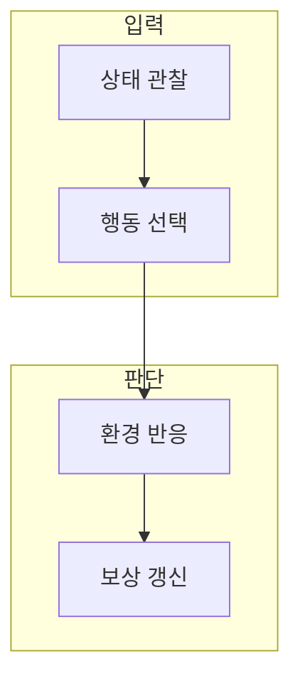

> [!abstract] 한 줄 요약
> 보상 함수를 설계 문제에 쓰면 무엇이 학습 목표를 대신 정의하는가?

## 이 노트의 지도



## 1. 강화학습의 구성 요소

에이전트는 상태에서 행동을 고르고, 환경 반응과 보상을 이용해 다음 행동 선택을 바꾼다. ==보상== 는 좋은 행동을 수치 신호로 나타내 정책 갱신에 쓰는 기준.

> [!note] 먼저 구분할 것
> 쉽게 측정되는 한 지표만 보상으로 두면 실제 목표와 다른 지름길을 학습할 수 있다.

## 2. 탐험과 활용

새 후보를 시도하는 탐험과 현재 좋은 후보를 쓰는 활용의 비율은 문제 단계와 위험도에 따라 달라진다.

<details>
<summary>반환값의 표현</summary>

미래 보상까지 포함한 반환값은 다음처럼 나타낼 수 있다.

$$
G_t = \sum_{k=0}^{\infty} \gamma^k r_{t+k+1}
$$

</details>

## 데이터로 보기

```html preview
<div style="font-family:system-ui,sans-serif;padding:20px;color:var(--foreground)">
  <h3 style="margin:0 0 14px;font-size:15px;font-weight:600">보상에 포함할 검토 범주</h3>
  <div id="bars" style="display:flex;align-items:flex-end;gap:14px;height:170px"></div>
  <script>
    var data = [["성능",1],["제약 위반",1],["안전 여유",1]];
    var max = Math.max.apply(null, data.map(function (d) { return d[1]; }));
    document.getElementById('bars').innerHTML = data.map(function (d, i) {
      return '<div style="flex:1;display:flex;flex-direction:column;align-items:center;' +
        'gap:6px;height:100%;justify-content:flex-end">' +
        '<span style="font-size:12px;font-weight:600">' + d[1] + '</span>' +
        '<div style="width:100%;height:' + (d[1] / max * 100) + '%;' +
        'background:var(--chart-' + (i + 1) + ');' +
        'border-radius:var(--radius) var(--radius) 0 0"></div>' +
        '<span style="font-size:12px;color:var(--muted-foreground)">' + d[0] + '</span>' +
        '</div>';
    }).join('');
  </script>
</div>
```

막대는 보상 설계에서 함께 검토할 범주를 표시한다. 각 범주의 실제 가중치나 성능을 뜻하지 않는다.

```html preview
<div style="font-family:system-ui,sans-serif;padding:20px;color:var(--foreground)">
  <label for="amt" style="font-size:14px;font-weight:600">예시 탐험 비율</label>
  <div id="out" style="font-size:30px;font-weight:700;color:var(--chart-1);margin:6px 0">탐험 30</div>
  <input id="amt" type="range" min="0" max="100" step="5" value="30"
    style="width:100%;accent-color:var(--primary)" />
  <p style="font-size:13px;color:var(--muted-foreground)">값을 바꿔 새 후보 탐색과 현재 정책 검증의 균형을 생각한다.</p>
  <script>
    var amt = document.getElementById('amt');
    var out = document.getElementById('out');
    amt.addEventListener('input', function () {
      out.textContent = '탐험 ' + Number(amt.value).toLocaleString();
    });
  </script>
</div>
```

> [!important] 해석의 경계
> 탐험 비율만으로 정책 품질은 예측할 수 없다. 환경의 충실도와 보상·안전 제약을 함께 검증한다.

## 핵심 정리

| 개념 | 정의 | 왜 중요한가 |
| :-- | :-- | :-- |
| 상태 | 현재 환경의 표현 | 행동 선택의 입력 |
| 행동 | 에이전트의 선택 | 환경과 상호작용 |
| 보상 | 행동 결과의 신호 | 목표를 대신 정의한다 |

## 관련 개념

- 시뮬레이션: 실제 조건을 근사해 정책을 검토하는 환경
- 다목적 평가: 단일 보상에 빠진 요구 조건을 확인하는 방법

> [!question]- 스스로 점검
> **Q.** 높은 보상을 얻은 정책이 항상 좋은 설계 정책은 아닌 이유는 무엇인가?
>
> **A.** 보상 함수가 실제 요구 조건을 완전하게 담지 못할 수 있기 때문이다. 별도의 안전·성능·현실성 평가가 필요하다.
