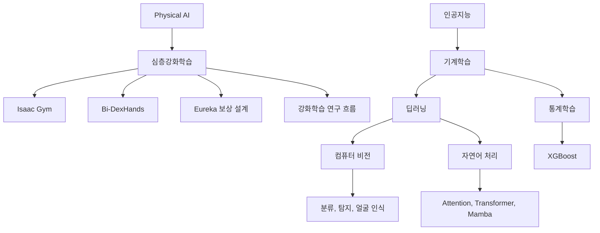

> [!abstract] Physical AI에서 선수 지식까지
> Physical AI는 물리 세계에서 지능적으로 작동하는 시스템을 만드는 것을 핵심으로 삼는다. 강의는 심층강화학습의 역할에서 출발해 Isaac Gym·Bi-DexHands·Eureka 사례를 살펴보고, 강화학습 연구 연도, 인공지능·기계학습·딥러닝의 관계, 컴퓨터 비전·자연어 처리·통계학습과 XGBoost까지 학습 지도를 확장한다.

## 강의 구간의 전체 지도



첫 화면은 심층강화학습을 Physical AI의 핵심 기술로 설명한다. 자료의 표현에 따르면 Physical AI의 목표는 물리 세계에서 지능적으로 작동하는 시스템을 구축하는 것이다. 심층강화학습은 이러한 시스템이 자율적으로 작동하고, 고차원 입력을 처리하고, 계속 학습하도록 돕는다. 특히 복잡하고 비표준적인 환경에서 중요성이 커진다고 적혀 있다.

이 정의는 뒤의 사례를 읽는 기준이 된다. Isaac Gym은 많은 시뮬레이션을 GPU에서 병렬 실행하는 환경을, Bi-DexHands는 양손 정밀 조작 과제 집합을, Eureka는 코딩 LLM을 이용한 보상 설계를 보여 준다. 이어지는 선수 지식 화면은 Physical AI를 이해하기 위해 강화학습만이 아니라 딥러닝, 비전, 언어, 통계학습을 함께 공부해야 한다는 강의 구성으로 연결된다.

## Isaac Gym과 Bi-DexHands

Isaac Gym은 NVIDIA가 개발한 GPU 기반 물리 시뮬레이션 환경으로 소개된다. 로봇 연구자와 강화학습 개발자가 GPU만 사용해 수천 개의 시뮬레이션을 병렬 실행하며 학습할 수 있도록 설계되었다는 설명이 붙는다. 자료는 Isaac Gym 저장소에 NeurIPS 2021 데이터셋·벤치마크 논문과 관련된 예시 강화학습 환경 아홉 개가 있다고 적는다.

예시 이름은 Isaac, ==Allegro hand==, Ant, Humanoid, Quadcopter, Franka cabinet이다. 이 목록은 화면에 보이는 로봇·환경 예시이며 아홉 과제 전체의 완전한 명칭 목록이라고 단정할 수 없다. 특히 Allegro hand는 손 조작 예시가 화면에 명시되어 있으므로 누락하지 않고 보존한다.

Bi-DexHands는 PKU-MARL 팀이 개발한 양손 정밀 조작 강화학습 벤치마크로 설명된다. NeurIPS 2022에 발표되었고, “Bidexterous Manipulation benchmark”에 스무 과제가 있다고 적혀 있다. 화면의 Dexterity 예시는 Switch, Lift, Door close inward, Block stacking, Hand over다. 추출문은 벤치마크의 목적과 과제 수, 예시 이름을 제공하지만 각 과제의 세부 구성은 제공하지 않는다.

<Tabs>
  <Tab label="Isaac Gym">GPU 기반 물리 시뮬레이션 환경이다. 수천 개 시뮬레이션의 병렬 실행과 아홉 개 예시 강화학습 환경이 명시된다.</Tab>
  <Tab label="로봇 예시">Isaac, Allegro hand, Ant, Humanoid, Quadcopter, Franka cabinet이 화면에 나열된다.</Tab>
  <Tab label="Bi-DexHands">PKU-MARL의 양손 정밀 조작 벤치마크다. NeurIPS 2022와 스무 과제가 명시되고, 다섯 조작 예시가 보인다.</Tab>
</Tabs>

> [!note] 숫자와 목록의 범위
> 아홉과 스물은 각각 Isaac Gym 예시 환경과 Bi-DexHands 벤치마크 과제 수다. 화면에 보이는 로봇 이름 여섯 개와 조작 이름 다섯 개는 예시 목록이므로 과제 수와 일대일로 맞추어 새 목록을 만들지 않는다.

## Eureka가 제시한 두 비율

Eureka의 제목은 “Human-Level Reward Design via Coding Large Language Models”다. 강의는 LLM이 로봇 과제의 고수준 의미 계획자로 뛰어난 성과를 냈지만, 펜 돌리기 같은 복잡한 저수준 과제를 학습하는 데 사용할 수 있는지는 해결되지 않은 문제였다고 소개한다.

자료에 따르면 Eureka는 열 가지 로봇 형태를 포함한 스물아홉 개 오픈소스 강화학습 환경에서 평가되었다. 결과로 두 비율이 제시된다. 하나는 전체 작업 가운데 인간 전문가를 능가한 작업의 비율이고, 다른 하나는 평균 정규화 개선이다. 두 값은 분모와 의미가 다르므로 같은 성공률 두 개로 읽어서는 안 된다.

```html preview
<div style="font-family:system-ui,sans-serif;padding:20px;color:var(--foreground)">
  <h3 style="margin:0 0 14px;font-size:15px;font-weight:600">Eureka source metrics</h3>
  <div id="bars" style="display:flex;align-items:flex-end;gap:14px;height:170px"></div>
  <script>
    var data = [['인간 전문가 상회 작업 비율 (%)', 83], ['평균 정규화 개선 (%)', 52]];
    var max = Math.max.apply(null, data.map(function (d) { return d[1]; }));
    document.getElementById('bars').innerHTML = data.map(function (d, i) {
      return '<div style="flex:1;display:flex;flex-direction:column;align-items:center;' +
        'gap:6px;height:100%;justify-content:flex-end">' +
        '<span style="font-size:12px;font-weight:600">' + d[1] + '</span>' +
        '<div style="width:100%;height:' + (d[1] / max * 100) + '%;' +
        'background:var(--chart-' + (i + 1) + ');' +
        'border-radius:var(--radius) var(--radius) 0 0"></div>' +
        '<span style="font-size:12px;color:var(--muted-foreground)">' + d[0] + '</span>' +
        '</div>';
    }).join('');
  </script>
</div>
```

==83%== 는 Eureka가 인간 전문가를 능가한 작업의 비율이다. ==52%== 는 평균적으로 제시된 정규화 개선 비율이다. 앞의 값은 작업을 세는 비율이고, 뒤의 값은 개선 정도의 평균이므로 서로 대체할 수 없다. 차트 라벨에 퍼센트 단위를 명시했으며 막대 높이는 두 출처 값을 시각적으로 구분하는 용도다.

강의는 Eureka의 일반화 능력과 함께 모델 학습 없이 생성된 보상의 품질과 안전성을 향상시키기 위한 gradient-free in-context learning 접근법을 적고, 인간 입력을 RLHF로 통합할 수 있다고 설명한다. 또한 Eureka 보상을 커리큘럼 학습 환경에서 사용해 시뮬레이션된 Shadow Hand가 빠르게 펜 회전 기술을 수행한 사례를 제시한다. 이는 화면에 명시된 Eureka 설명이며 다른 로봇으로의 실제 적용 성과를 뜻하지 않는다.

## 강화학습 학습 항목과 연구 연도

강화학습 화면은 Frozen Lake의 활용과 탐색, Q-table·Q-function approximation·Q-Network, Markov Decision Process, Deep Q Learning과 DQN을 학습 항목으로 나열한다. 이 노트는 수식을 추가하지 않고 화면의 용어와 대표 연구 연도만 정리한다.

| 연도 | 화면에 제시된 연구 | 출처 표기 | 강의에서 연결되는 항목 |
| :-- | :-- | :-- | :-- |
| 2013 | Playing Atari with Deep Reinforcement Learning | NIPS Deep Learning Workshop | Deep Q Learning, DQN |
| 2014 | Recurrent Models of Visual Attention | NIPS | Recurrent Attention Model |
| 2015 | Human-level control through deep reinforcement learning | Nature 518, 529–533 | 심층강화학습 제어 |
| 2016 | Mastering the game of Go with deep neural networks and tree search | Nature 529, 484–489 | 딥 신경망과 탐색 |
| 2024 | Eureka: Human-Level Reward Design via Coding Large Language Models | ICLR 2024 | 코딩 LLM 기반 보상 설계 |

이 연도들은 강화학습 연구가 한 해에 완성되었다는 뜻이 아니라 강의가 선수 지식의 대표 참고문헌을 시간 순서로 식별할 수 있게 해 준다. 2013년 Atari 연구, 2015년 인간 수준 제어, 2016년 바둑 연구는 DQN과 심층강화학습의 흐름에 놓이고, 2014년 시각 주의 연구는 RAM 항목에, 2024년 Eureka는 코딩 LLM 기반 보상 설계에 대응한다.

<details>
<summary>강화학습 화면의 항목을 그대로 확인하기</summary>

첫 항목은 “RN on Frozen Lake - Exploit VS Exploration”으로 적혀 있다. 이어서 Q-table, Q-function approximation, Q-Network, Markov Decision Process, Deep Q Learning, Deep Q Network, Recurrent Models of Visual Attention, Recurrent Attention Model, Eureka가 나온다. “RN”은 문맥상 별도 설명이 없으므로 다른 약어로 고쳐 확정하지 않고 원문 artifact로 남긴다.

</details>

## 인공지능·기계학습·딥러닝 관계

강의는 인공지능을 인간 지능을 모방하는 모든 시스템, 기계학습을 데이터 기반 학습 시스템, 딥러닝을 깊은 신경망 기반 모델로 설명한다. 이 세 문장을 선수 지식의 계층으로 읽으면 인공지능이 가장 넓은 범주이고, 기계학습은 데이터에서 배우는 접근, 딥러닝은 깊은 신경망을 사용하는 모델군으로 정리된다.

> [!warning] 원문 목록 누락
> 인공지능 화면에는 “AI systems perform better than the humans in the following fields”라는 문장이 있지만, 그 뒤의 분야 목록은 추출문에 없다. 따라서 어떤 분야인지, 몇 개인지, 어떤 기준으로 인간보다 낫다는 것인지를 이 노트에서 보충하지 않는다. 문장과 목록 사이의 누락 자체가 출처 caveat다.

다음 화면은 대표 딥러닝 모델을 데이터 종류와 문제 유형에 따라 구분한다. 항목은 ANN·MLP·FNN, RNN과 LSTM·GRU, CNN, 객체 분류·탐지, Attention·Transformer, GAN·VAE다. 이미지·텍스트·음성 같은 데이터와 분류·생성·순차 예측 같은 문제에 따라 대표 구조가 다르게 쓰인다는 설명이 붙는다.

## 컴퓨터 비전 선수 지식

컴퓨터 비전 화면은 딥러닝이 AI 연구와 산업 응용에서 핵심 역할을 하며, 기계가 세계를 이해하고 판단하도록 하는 “AI의 눈”과 같은 역할을 한다고 설명한다. 도전적인 문제의 예시는 ==이미지 분류, 객체 탐지, 얼굴 인식== 이다. 얼굴 인식은 이 화면에 명시된 세 번째 예시이므로 분류와 탐지만 남기고 생략하면 안 된다.

이어지는 커리큘럼은 열 항목이다. 선형 분류기를 이용한 이미지 분류, 정규화와 최적화, 신경망과 역전파, CNN 이미지 분류, 순환 신경망, Attention과 Transformer, 객체 탐지와 이미지 분할, 비디오 이해, 생성 모델, 3D 비전 및 비전·언어가 순서대로 제시된다. 설명문은 CNN을 중심으로 이미지 분류, 객체 인식, 비디오 이해를 딥러닝과 실습으로 학습한다고 적는다.

<details>
<summary>컴퓨터 비전 열 항목</summary>

1. Image Classification with Linear Classifiers
2. Regularization and Optimization
3. Neural Networks and Backpropagation
4. Image Classification with CNNs
5. Recurrent Neural Networks
6. Attention and Transformers
7. Object Detection, Image Segmentation
8. Video Understanding
9. Generative Models
10. 3D Vision, Vision and Language

</details>

## 자연어 처리 선수 지식

자연어 처리 화면은 NLP를 사람들이 정보를 공유하는 방식을 모델링하는 인공지능의 중요한 부분으로 설명한다. 최근 딥러닝 접근법이 여러 NLP 과제에서 높은 성능을 얻었다는 설명과 함께 RNN·LSTM·GRU, Word2Vec, Seq2Seq, Attention, Transformer, Mamba를 학습 항목으로 둔다.

Attention과 Transformer에는 “Attention Is All You Need”가 연결되고, 저자 목록과 ==NIPS 2017== 표기가 나온다. Mamba에는 “Mamba: Linear-Time Sequence Modeling with Selective State Spaces”가 연결되며, Albert Gu는 Carnegie Mellon University, Tri Dao는 Princeton University로 적혀 있고 시점은 ==2023년 12월== 이다. 이 자료에서 확인되는 것은 제목·저자·소속·시점이며 내부 구조나 성능 수치는 제시되지 않는다.

> [!info] 두 시점을 구분하기
> Attention Is All You Need는 2017년, Mamba 자료는 2023년 12월로 제시된다. 두 항목은 자연어 처리 선수 지식 목록의 서로 다른 세대 자료이며, 화면에는 둘의 성능 비교가 없다.

## 통계학습과 Python 사례

통계학습 화면은 “An Introduction to Statistical Learning with Applications in Python”을 최신 입문서로 소개한다. 설명문에는 Gareth James, Daniela Witten, Trevor Hastie, Robert Tibshirani, Jonathan Taylor가 저자로 적혀 있고, ==Springer에서 2023년 6월 출간== 되었다고 한다. 인기 교재 ISLR의 R 기반 구성을 바탕으로 Python 환경에 맞춘 실습과 코드 예제를 제공한다는 점이 강조된다.

학습 항목은 선형 회귀, 분류, 재표집 방법, 선형 모델 선택과 정규화, 비선형성으로의 확장, 트리 기반 방법과 Boosting·XGBoost, 서포트 벡터 머신이다. 이 목록은 Physical AI 전용 모델 목록이 아니라 강의가 제시한 기계학습·통계학습 선수 지식이다. Python 사례는 책의 실습 환경을 설명하는 근거이고, 앞선 로봇 벤치마크의 구현 언어를 단정하는 근거가 아니다.

<Tabs>
  <Tab label="도서 정보">An Introduction to Statistical Learning with Applications in Python, Springer, 2023년 6월로 제시된다.</Tab>
  <Tab label="저자 표기">설명문에는 Gareth James, Daniela Witten, Trevor Hastie, Robert Tibshirani, Jonathan Taylor 다섯 명이 적혀 있다.</Tab>
  <Tab label="Python 사례">R 기반 ISLR을 바탕으로 Python 환경에 맞춘 실습과 코드 예제를 제공한다고 설명한다.</Tab>
</Tabs>

## XGBoost의 출처상 위치

마지막 화면은 XGBoost를 트리 부스팅을 위해 설계·최적화된 라이브러리로 설명한다. Friedman 등의 gradient boosting trees 모델을 언급하고, 멀티스레드와 정규화를 수용해 계산 능력과 예측 정확도를 높였다고 적는다. 네이티브 인터페이스는 C++, R, Python, Julia, Java로 나열되며 데이터 탐색과 실제 운영 환경 모두에서 사용된다고 설명한다.

강의는 Kaggle 기계학습 도전의 우승 솔루션 가운데 절반 이상이 XGBoost를 채택했다고 서술한 뒤 “Incomplete list”라고 표시한다. 따라서 이 문장을 모든 대회의 완전한 통계로 확대하지 않는다. 이 화면은 XGBoost를 통계학습의 트리 기반 방법 항목과 연결하지만, 앞선 로봇 학습 사례의 비교 모델이라고 말하지 않는다.

| 선수 지식 | 화면의 대표 항목 | 이 구간에서 확인되는 범위 |
| :-- | :-- | :-- |
| 강화학습 | Frozen Lake, Q-table, DQN, RAM, Eureka | 항목과 대표 연구 연도 |
| 딥러닝 | ANN, RNN, CNN, Attention, GAN, VAE | 데이터·문제 유형별 대표 구조 |
| 컴퓨터 비전 | 분류, 탐지, 얼굴 인식, 열 항목 커리큘럼 | 학습 주제와 적용 문제 |
| 자연어 처리 | Word2Vec, Seq2Seq, Transformer, Mamba | 대표 모델과 2017·2023년 자료 |
| 통계학습 | ISLP Python판, 회귀·분류·재표집·트리·SVM | 도서 정보와 주제 목록 |
| XGBoost | 트리 부스팅, 멀티스레드, 정규화, 다언어 인터페이스 | 라이브러리 설명과 불완전한 Kaggle 주장 |


강의가 제시한 선수 지식은 단순 나열이 아니라 서로 다른 자료 유형을 함께 사용한다. 강화학습은 대표 논문과 발표 연도를, 컴퓨터 비전과 자연어 처리는 커리큘럼 항목을, 통계학습은 입문서와 실습 환경을, XGBoost는 라이브러리 특징과 언어 인터페이스를 통해 소개된다. 따라서 각 항목의 근거 형식이 다르며 모든 항목을 동일한 성능 비교표로 바꿀 수는 없다.

## 원문 표기와 추출 artifact

<details>
<summary>고쳐 쓰지 않고 경계로 남기는 항목</summary>

Frozen Lake 항목은 “RN on Frozen Lake”로 적혀 있어 RN의 의미가 불명확하다. Eureka 설명 중 한 곳은 “Eurka”로 철자가 빠져 있다. 자연어 처리 설명에는 “Inintroduction”이라는 중복 철자 artifact가 있다.

인공지능 화면은 인간보다 나은 분야가 뒤따른다고 말하지만 실제 목록이 추출되지 않았다. ISLP 설명문은 Jonathan Taylor를 포함한 다섯 저자를 적는 반면 화면의 책 제목 아래 보이는 저자 행은 Gareth James, Daniela Witten, Trevor Hastie, Robert Tibshirani 네 명만 표시한다. 이 차이를 임의로 하나로 통일하지 않고 설명문과 표시행의 불일치로 기록한다.

XGBoost의 Kaggle 문장은 “Incomplete list”라는 자체 caveat를 포함한다. 따라서 절반 이상이라는 표현은 자료의 진술로 보존하되 완전한 대회 통계로 검증된 값처럼 확장하지 않는다.

</details>

> [!question]- 스스로 점검
> **Q.** Eureka의 83%와 52%를 같은 뜻의 정확도 두 개로 비교해도 되는가?
>
> **A.** 안 된다. 83%는 인간 전문가를 능가한 작업의 비율이고, 52%는 평균 정규화 개선이다. 두 값은 측정 대상이 다르며, 열 가지 로봇 형태와 스물아홉 개 오픈소스 강화학습 환경이라는 평가 맥락에서 따로 읽어야 한다.
