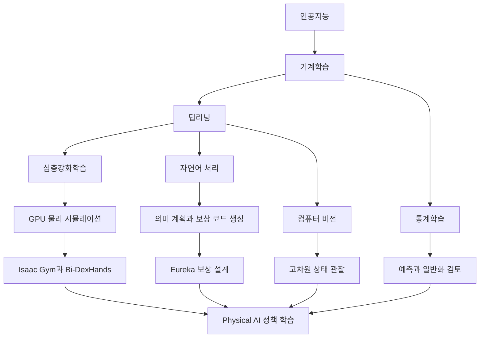

> [!abstract] 물리 세계에서 학습하는 AI
> Physical AI는 물리 세계에서 지능적으로 작동하는 시스템을 목표로 한다. 심층강화학습은 고차원 관측을 처리하고 행동을 반복 학습하게 하지만, 실제 로봇 학습을 이해하려면 시뮬레이션·보상 설계뿐 아니라 컴퓨터 비전·자연어 처리·통계학습의 선수 지식까지 함께 연결해야 한다.

## Physical AI의 학습 지도를 펼치기



강의는 Physical AI의 핵심을 “물리 세계에서 지능적으로 작동하는 시스템”으로 설명한다. 이 시스템은 정해진 입력에 답만 내는 것이 아니라 환경을 관찰하고, 행동을 선택하고, 결과를 다시 받아 다음 선택을 바꿔야 한다. ==심층강화학습== 은 이 반복을 고차원 입력과 복잡한 환경까지 확장하는 핵심 기술로 제시된다.

중요한 점은 Physical AI를 로봇 제어 알고리즘 하나로 좁히지 않는 것이다. 카메라와 센서에서 상태를 읽는 능력은 컴퓨터 비전에 의존하고, 복잡한 목표를 의미 단위로 해석하는 일은 자연어 처리와 연결된다. 정책을 학습하고 평가하는 과정은 기계학습의 일반화와 통계학습의 검증 문제를 피할 수 없다. 강화학습은 이 지식들을 물리적 행동의 연속 과정으로 묶는 역할을 한다.

> [!important] Physical AI의 범위
> 자율적으로 행동한다는 말은 현실에서 무제한으로 시행착오를 허용한다는 뜻이 아니다. 물리 시뮬레이션에서 많은 경험을 만들고, 보상과 안전 조건을 검토한 뒤, 실제 시스템으로 옮길 수 있는 정책인지 확인해야 한다.

## GPU 물리 시뮬레이션: Isaac Gym

Isaac Gym은 NVIDIA가 개발한 GPU 기반 물리 시뮬레이션 환경으로 소개된다. 로봇 연구자와 강화학습 개발자가 하나의 GPU 기반 체계에서 ==수천 개의 시뮬레이션을 병렬로 실행== 하며 정책을 효율적으로 학습하도록 설계되었다. 실제 로봇 한 대로 순차 실험하는 방식과 비교하면 경험을 모으는 속도와 실험 반복 가능성이 크게 달라진다.

강의는 Isaac Gym 예제 환경을 9개 작업으로 표시하고 Ant, Humanoid, Quadcopter, Franka cabinet 같은 대상을 함께 보여준다. 이 목록은 단순한 로봇 도감이 아니다. 보행, 전신 균형, 비행, 물체와의 상호작용처럼 서로 다른 동역학과 행동 공간을 한 시뮬레이션 학습 체계에서 다룬다는 뜻이다. 정책이 특정 로봇 형태에만 맞는지, 여러 물리 문제에서도 학습 절차가 유지되는지 살펴볼 수 있다.

GPU 병렬화가 모든 문제를 해결하지는 않는다. 빠르게 생성한 경험은 시뮬레이터가 표현한 물리 법칙과 센서 모델의 범위 안에서만 유효하다. 접촉, 마찰, 질량, 지연이 실제와 다르면 시뮬레이션에서 높은 성과를 얻은 정책도 현실에서 실패할 수 있다. 따라서 병렬 실험 규모는 학습 효율의 근거이지 현실 타당성의 자동 보증이 아니다.

## 양손 정밀 조작: Bi-DexHands

Bi-DexHands는 PKU-MARL 팀이 개발한 양손 정밀 조작 강화학습 benchmark로 소개되며, 20개 작업을 포함한다. 강의에는 switch, lift, door close inward, block stacking, hand over와 같은 예가 제시된다. 이 작업들은 한 손의 단순 이동보다 훨씬 긴 상호작용과 정밀한 접촉을 요구한다.

양손 조작에서는 두 손의 행동이 서로 독립적이지 않다. 한 손이 물체를 지지하는 동안 다른 손이 회전하거나, 두 손이 동시에 힘의 균형을 맞춰야 한다. 상태 공간에는 손가락 관절, 물체 자세, 접촉 정보가 포함되고 행동 공간도 커진다. ==양손 협응== 은 정책이 개별 동작을 잘 수행하는지뿐 아니라, 시간에 따라 두 행동을 맞추는지를 시험한다.

<Tabs>
  <Tab label="Isaac Gym">GPU 병렬 물리 환경에서 여러 로봇 형태와 작업의 정책 학습을 빠르게 반복한다.</Tab>
  <Tab label="Bi-DexHands">20개 양손 정밀 조작 작업으로 접촉·협응·긴 행동 순서를 시험한다.</Tab>
  <Tab label="공통 과제">시뮬레이션 경험을 실제 물리 조건과 혼동하지 않고, 환경 충실도와 정책 일반화를 따로 검토한다.</Tab>
</Tabs>

## Eureka: 언어모델이 보상 코드를 설계할 때

Eureka는 “Human-Level Reward Design via Coding Large Language Models”라는 제목으로 제시된다. 출발 질문은 언어모델이 로봇 작업의 고수준 의미 계획에 강점을 보였더라도, 펜 돌리기 같은 복잡한 저수준 기술을 학습하도록 보상을 만들 수 있는가이다. Eureka는 코드를 생성하는 대규모 언어모델을 이용해 보상 설계를 반복하고, 그 보상으로 강화학습 정책을 훈련하는 접근을 보여준다.

```html preview
<div style="font-family:system-ui,sans-serif;padding:20px;color:var(--foreground)">
  <h3 style="margin:0 0 14px;font-size:15px;font-weight:600">Eureka가 보고한 비율 지표</h3>
  <div id="bars" style="display:flex;align-items:flex-end;gap:14px;height:170px"></div>
  <script>
    var data = [['인간 전문가 상회 작업', 83], ['평균 정규화 개선', 52]];
    var max = Math.max.apply(null, data.map(function (d) { return d[1]; }));
    document.getElementById('bars').innerHTML = data.map(function (d, i) {
      return '<div style="flex:1;display:flex;flex-direction:column;align-items:center;' +
        'gap:6px;height:100%;justify-content:flex-end">' +
        '<span style="font-size:12px;font-weight:600">' + d[1] + '</span>' +
        '<div style="width:100%;height:' + (d[1] / max * 100) + '%;' +
        'background:var(--chart-' + (i + 1) + ');' +
        'border-radius:var(--radius) var(--radius) 0 0"></div>' +
        '<span style="font-size:12px;color:var(--muted-foreground)">' + d[0] + '</span>' +
        '</div>';
    }).join('');
  </script>
</div>
```

강의가 제시한 실험 범위는 10가지 로봇 형태와 29개의 오픈소스 강화학습 환경이다. 그 안에서 Eureka 보상은 83%의 작업에서 인간 전문가가 만든 보상을 능가했고, 평균적으로 52%의 정규화된 개선을 보였다. 두 비율은 같은 분모의 한 지표가 아니다. 앞의 값은 전문가 보상을 넘어선 작업의 비율이고, 뒤의 값은 성능 개선의 정규화 평균이다.

Eureka는 모델을 다시 학습하지 않고 문맥 안에서 보상 후보를 개선하는 gradient-free in-context learning 접근으로 설명된다. 또한 인간 입력을 쉽게 결합해 생성된 보상의 품질과 안전성을 높이는 흐름을 Reinforcement Learning from Human Feedback과 연결한다. 여기서 인간 입력은 정책의 모든 행동을 직접 시연하는 방식만을 뜻하지 않는다. 생성된 보상 코드가 실제 목표와 안전 조건을 잘 나타내는지 검토하고 개선 방향을 제공하는 역할이다.

대표 결과는 시뮬레이션된 Shadow Hand가 펜을 빠르게 회전하는 기술을 학습한 사례다. 강의는 Eureka 보상을 커리큘럼 학습 환경에서 사용해 이 저수준 조작을 달성했다고 설명한다. 높은 수준의 언어 지시를 이해하는 능력과 실제 손가락 관절을 연속 제어하는 능력 사이에는 큰 간격이 있다. 보상 코드 생성과 강화학습이 이 간격을 연결하되, 시뮬레이션과 인간 검토가 함께 필요하다.

> [!warning] 비율을 합치지 않는다
> 83%는 인간 전문가 보상을 상회한 작업 비율이고, 52%는 평균 정규화 개선이다. 두 값을 더하거나 하나의 성공률로 읽으면 안 된다. 10가지 로봇 형태와 29개 환경은 이 결과가 관찰된 실험 범위를 말한다.

## 강화학습 학습 경로

강의가 제시한 강화학습 순서는 탐험과 활용의 직관에서 시작해 값 표현, 의사결정 과정, 심층 신경망 정책으로 확장된다. 첫 항목은 Frozen Lake에서 exploit와 exploration을 비교한다. 이미 좋은 것으로 알려진 행동을 반복하는 활용과, 더 나은 경로를 찾기 위해 새로운 행동을 시도하는 탐험의 균형을 가장 단순한 환경에서 확인하는 단계다.

다음은 Q-table, Q-function approximation, Q-Network다. 상태와 행동 조합을 표로 기록할 수 있는 작은 문제에서 출발해, 상태 공간이 커졌을 때 함수 근사와 신경망으로 값 추정을 확장하는 흐름이다. Markov Decision Process는 상태·행동·전이·보상으로 순차 의사결정 문제를 조직하는 언어를 제공한다. 이 선수 개념 없이 DQN만 외우면 네트워크가 무엇을 근사하고 어떤 경험을 학습하는지 설명하기 어렵다.

Deep Q Learning과 DQN의 연구 계보로는 Atari를 다룬 초기 연구, 인간 수준의 제어를 보인 후속 연구, 딥 신경망과 트리 탐색으로 바둑을 학습한 연구가 제시된다. 이 계보는 게임 성과 목록이 아니라, 고차원 관측에서 행동 가치를 학습하고 긴 의사결정 과정을 다루는 방법이 확장된 순서를 보여준다.

Recurrent Models of Visual Attention과 RAM은 모든 시각 정보를 한 번에 처리하지 않고, 필요한 위치를 순차적으로 주의하며 판단하는 문제를 다룬다. 마지막에 Eureka가 놓이는 이유도 이 확장선에 있다. 이제 학습 대상은 정책만이 아니라, 정책을 이끄는 보상 설계 과정까지 포함한다.

| 학습 단계 | source에 제시된 항목 | 먼저 이해할 질문 | Physical AI와의 연결 |
| :-- | :-- | :-- | :-- |
| 탐험과 활용 | Frozen Lake | 새 행동과 현재 최선 행동을 어떻게 배분하는가 | 안전한 시뮬레이션에서 탐색 범위를 정한다 |
| 값 표현 | Q-table, Q-function approximation, Q-Network | 상태·행동의 장기 가치를 어떻게 표현하는가 | 큰 상태 공간을 신경망으로 근사한다 |
| 순차 결정 | Markov Decision Process | 상태 전이와 보상을 어떤 구조로 기술하는가 | 로봇과 환경의 반복 상호작용을 조직한다 |
| 심층 정책 | Deep Q Learning, DQN, Atari, 바둑 | 고차원 입력에서 행동 선택을 어떻게 학습하는가 | 센서 관측과 복잡한 행동을 연결한다 |
| 선택적 관찰 | Recurrent Visual Attention, RAM | 어디를 보고 다음 판단을 할 것인가 | 시각 관측 비용과 행동 판단을 함께 다룬다 |
| 보상 설계 | Eureka | 목표를 정책이 학습할 수 있는 신호로 어떻게 바꾸는가 | 언어모델·인간 검토·로봇 학습을 잇는다 |

## AI·ML·DL 선수 개념

강의는 인공지능을 인간 지능을 모방하는 모든 시스템, 기계학습을 데이터 기반 학습 시스템, 딥러닝을 깊은 신경망 기반 모델로 구분한다. 이 세 범주는 동의어가 아니다. Physical AI가 인공지능의 응용 목표라면, 기계학습은 경험 데이터에서 행동과 예측을 개선하는 방법이고, 딥러닝은 이미지·텍스트·센서처럼 복잡한 입력을 표현하는 모델 계열이다.

대표 딥러닝 구조 목록에는 ANN·MLP·FNN, RNN·LSTM·GRU, CNN, 객체 분류와 탐지, Attention과 Transformer, GAN과 VAE가 포함된다. 각각은 데이터와 문제 유형이 다를 때 선택되는 도구다. 로봇 상태를 벡터로 처리하는 다층 신경망, 시간 순서를 다루는 순환 구조, 시각 관측을 처리하는 CNN, 중요한 정보 관계를 찾는 Attention, 데이터를 생성하는 GAN·VAE가 Physical AI의 서로 다른 부분과 만난다.

<details>
<summary>선수 지식을 한 줄로 연결하기</summary>

컴퓨터 비전은 로봇이 장면과 물체를 관찰하게 하고, 자연어 처리는 사람의 목표와 언어 정보를 모델이 다룰 수 있게 한다. 통계학습은 예측이 새로운 데이터에도 유지되는지 검토하는 기준을 제공한다. 강화학습은 이 표현과 예측을 행동 선택의 시간축 위에 놓는다.

따라서 선수 지식 지도는 강화학습과 경쟁하는 별도 과목 목록이 아니다. Physical AI가 상태를 보고, 목표를 해석하고, 행동하고, 결과를 평가하는 각 단계에 필요한 기반이다.

</details>

## 컴퓨터 비전과 자연어 처리의 역할

컴퓨터 비전 학습 항목은 선형 분류기, 정규화와 최적화, 신경망과 역전파, CNN 이미지 분류에서 시작한다. 이어 순환 신경망, Attention과 Transformer, 객체 탐지와 분할, 비디오 이해, 생성 모델, 3D 비전, vision-language로 확장된다. 로봇은 단일 이미지를 분류하는 데서 멈추지 않고 물체 위치와 장면 구조, 시간 변화, 3차원 관계를 알아야 하므로 이 순서가 Physical AI의 관찰 계층을 이룬다.

자연어 처리 항목은 RNN·LSTM·GRU, Word2Vec, Seq2Seq, Attention, Transformer, Mamba를 제시한다. 순차 텍스트 표현에서 단어 임베딩, 입력과 출력 시퀀스 변환, 관계 기반 Attention, Transformer, 선택적 상태 공간 계열로 이어지는 흐름이다. Eureka 사례에서는 언어모델이 고수준 의미 계획과 보상 코드 생성에 관여하므로, 자연어 처리의 역할이 로봇 명령 해석을 넘어 학습 절차 설계까지 확장된다.

두 영역이 만나는 지점은 vision-language와 Physical AI다. 로봇이 장면을 보고 사람의 지시를 이해해 행동하려면 시각 표현과 언어 표현이 같은 과제 안에서 결합돼야 한다. 하지만 표현을 결합했다고 안전한 행동이 자동으로 나오지는 않는다. 강화학습 환경, 보상 검토, 실제 물리 조건에 대한 별도 검증이 필요하다.

## 통계학습과 XGBoost가 남기는 검증 관점

통계학습 선수 항목은 선형 회귀, 분류, 재표본화, 선형 모델 선택과 정규화, 비선형 관계, 트리 기반 방법, boosting과 XGBoost, support vector machine을 포함한다. 이 목록은 딥러닝 이전 기법을 지나간 역사로 두지 않는다. 데이터 분할, 일반화, 정규화, 모델 선택이라는 검증 원리는 심층강화학습과 로봇 정책 평가에도 그대로 필요하다.

XGBoost는 트리 boosting을 위해 설계되고 최적화된 library로 설명된다. 다중 thread와 정규화를 활용하고 C++, R, Python, Julia, Java 인터페이스를 제공하며, 데이터 탐색과 production 상황 모두에서 쓰인다고 제시된다. 강의는 Kaggle 우승 해법의 절반 이상이 XGBoost를 채택했다고 설명하면서 목록이 완전하지 않다는 단서를 함께 둔다. 이 문장은 특정 비율의 엄밀한 전체 조사라기보다 XGBoost의 실용적 영향력을 강조하는 source 진술로 제한해 읽어야 한다.

Physical AI에서 모든 하위 문제를 심층강화학습 하나로 풀 필요는 없다. 구조화된 표 데이터의 성능 예측, 센서 특징 기반 분류, 정책 결과의 사후 분석에서는 통계학습과 트리 모델이 더 해석하기 쉬운 기준선이 될 수 있다. 강화학습 정책을 평가할 때도 단순 모델과 비교해야 복잡한 모델이 실제로 추가 가치를 만드는지 확인할 수 있다.

<details>
<summary>원문 오류와 추출 artifact</summary>

강화학습 목록의 첫 항목은 “RN on Frozen Lake”로 추출되어 있다. 문맥상 RL을 가리킬 가능성이 있지만 본문에서 원문을 몰래 고치지 않고 이 표기를 source 오류 후보로 보존한다.

Eureka 설명에는 “Eurka 보상”이라는 표기가 한 번 나타난다. 본문은 논문·프로젝트의 일관된 이름인 Eureka를 사용하되, 이 오탈자는 원문 오류로 기록한다.

자연어 처리 설명에는 “Inintroduction”이 섞여 있다. 이는 introduction 앞부분이 중복된 원문 또는 추출 오류로 보이며 개념어로 사용하지 않는다.

</details>

> [!question]- Physical AI 종합 점검
> **Q.** Eureka가 인간 전문가 보상을 상회한 비율이 높고 Isaac Gym에서 수천 개 시뮬레이션을 병렬 실행할 수 있다면, 생성된 보상을 검토하지 않고 바로 실제 양손 로봇에 적용해도 되는가?
>
> **A.** 적용하면 안 된다. Eureka 수치는 제한된 로봇 형태와 오픈소스 환경에서 얻은 결과이고, Isaac Gym의 병렬성은 시뮬레이션 경험을 빠르게 모으는 능력이다. Bi-DexHands 같은 정밀 조작에서는 접촉과 협응 오차가 커질 수 있으므로 인간의 보상 검토, 환경 충실도 확인, 일반화 평가와 실제 안전 검증이 별도로 필요하다.
