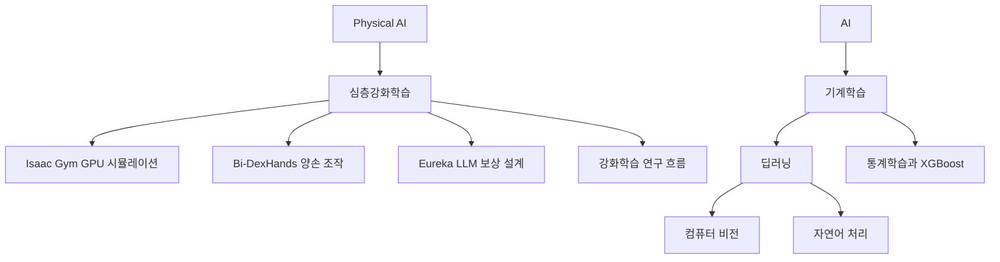

> [!abstract] 한 줄 요약
> Physical AI의 DRL 사례는 GPU 시뮬레이션·양손 조작·LLM 보상 설계를 보여 주며, 비전·언어·통계학습이 선수 지식으로 이어진다.

## Physical AI와 DRL 사례 지도

심층강화학습은 물리 세계에서 작동하는 시스템의 자율 작동과 지속 학습을 지원한다.



- **Physical AI** — 물리 세계에서 지능적으로 작동하는 시스템을 구축한다.
- **자율 작동** — DRL이 autonomous operation을 가능하게 한다.
- **입력 처리** — DRL이 고차원 입력을 처리한다.
- **지속 학습** — DRL이 continuous learning을 가능하게 한다.
- **적용 맥락** — 복잡하고 비표준적인 환경에서 중요성이 커진다.

## Isaac Gym과 Bi-DexHands

두 사례는 GPU 병렬 시뮬레이션과 양손 정밀 조작 벤치마크를 각각 보여 준다.

<Tabs>
  <Tab label="Isaac Gym">
  **개발사** — NVIDIA.

  **기반** — GPU 물리 시뮬레이션.

  **규모** — GPU만으로 수천 개 시뮬레이션을 병렬 실행.

  **과제** — 예시 강화학습 환경 9개.
  </Tab>
  <Tab label="Bi-DexHands">
  **개발팀** — PKU-MARL.

  **대상** — bilateral precision manipulation.

  **발표** — NeurIPS 2022.

  **과제** — 양손 조작 벤치마크 20개.
  </Tab>
</Tabs>

| 구분 | 화면의 예시 |
| :-- | :-- |
| Isaac Gym 로봇·환경 | Isaac, Allegro hand, Ant, Humanoid, Quadcopter, Franka cabinet |
| Dexterity 과제 | Switch, Lift, Door close inward, Block stacking, Hand over |

- **Isaac Gym 출처** — NeurIPS 2021 GPU 기반 로봇 학습 환경으로 제시된다.
- **Isaac Gym 사용자** — robotics researchers와 RL developers를 대상으로 설명된다.
- **Isaac Gym 목적** — GPU 병렬 실행으로 policy learning을 지원한다.
- **Bi-DexHands 저자** — Yuanpei Chen, Yaodong Yang, Tianhao Wu, Shengjie Wang, Xidong Feng, Jiechuang Jiang, Hao Dong, Zongqing Lu, Song-chun Zhu.
- **Bi-DexHands 기관** — Peking University.

> [!warning] 목록 범위
> 화면의 로봇·조작 이름은 예시다. 여섯 로봇 이름을 9개 환경 전체 목록으로, 다섯 조작 이름을 20개 과제 전체 목록으로 확장하지 않는다.

## Eureka 보상 설계

Eureka는 코딩 LLM을 이용해 로봇 과제의 보상을 설계하는 사례다.

- **연구 질문** — LLM은 고수준 의미 계획을 넘어 펜 돌리기 같은 저수준 과제를 학습할 수 있는가?
- **발표** — ICLR 2024.
- **논문 제목** — Eureka: Human-Level Reward Design via Coding Large Language Models.
- **저자** — Jason Ma, William Liang, Guanzhi Wang, De-An Huang, Osbert Bastani, Dinesh Jayaraman, Yuke Zhu, Linxi Jim Fan, Anima Anandkumar.
- **기관 표기** — NVIDIA, UPenn, Caltech, UT Austin.
- **지도 표기** — Equal Advising.

```html preview
<div style="font-family:system-ui,sans-serif;padding:20px">
  <div id="cards" style="display:flex;gap:14px;flex-wrap:wrap"></div>
  <script>
    var stats = [
      ['인간 전문가 상회 작업', '83%', '작업 비율', 'var(--chart-2)'],
      ['정규화 개선', '평균 52%', '개선량 평균', 'var(--chart-1)'],
      ['오픈소스 RL 환경', '29개', '10가지 로봇 형태 포함', 'var(--chart-5)']
    ];
    document.getElementById('cards').innerHTML = stats.map(function (s) {
      return '<div style="flex:1;min-width:150px;padding:16px;background:var(--card);' +
        'color:var(--card-foreground);border:1px solid var(--border);' +
        'border-radius:var(--radius)">' +
        '<div style="font-size:13px;color:var(--muted-foreground)">' + s[0] + '</div>' +
        '<div style="font-size:26px;font-weight:700;margin-top:4px">' + s[1] + '</div>' +
        '<div style="font-size:12px;font-weight:600;margin-top:4px;color:' + s[3] + '">' +
        s[2] + '</div>' +
        '</div>';
    }).join('');
  </script>
</div>
```

> [!important] 서로 다른 지표
> 작업 비율과 개선량 평균은 의미가 다르다. 두 값을 하나의 막대축에서 직접 비교하지 않는다.

- **학습 방식** — gradient-free in-context learning이 명시된다.
- **모델 학습** — 별도 모델 학습 없이 생성한 보상을 다룬다.
- **인간 입력** — RLHF를 통해 보상 품질과 안전성 향상에 인간 입력을 통합한다.
- **커리큘럼** — Eureka 보상을 curriculum learning 환경에서 사용한다.
- **로봇 사례** — 시뮬레이션된 Shadow Hand가 처음으로 빠르고 능숙하게 펜 회전을 수행한다.

## 강화학습 항목과 연구 연도

강의는 기초 용어에서 DQN·RAM·Eureka로 이어지는 연구 흐름을 제시한다.

<Tabs>
  <Tab label="기초 항목">
  **Frozen Lake** — Exploit와 Exploration.

  **값 표현** — Q-table, Q-function approximation, Q-Network.

  **과정 모델** — Markov Decision Process.
  </Tab>
  <Tab label="심층강화학습">
  **방법** — Deep Q Learning, Deep Q Network.

  **대표 과제** — Atari와 인간 수준 제어.
  </Tab>
  <Tab label="확장 항목">
  **시각 주의** — Recurrent Attention Model.

  **보상 설계** — Eureka와 Coding LLM.
  </Tab>
</Tabs>

1. **2013** — Playing Atari with Deep Reinforcement Learning, NIPS Deep Learning Workshop.
2. **2014** — Recurrent Models of Visual Attention, NIPS.
3. **2015** — Human-level control through deep reinforcement learning, Nature 518, 529–533.
4. **2016** — Mastering the game of Go with deep neural networks and tree search, Nature 529, 484–489.
5. **2024** — Eureka: Human-Level Reward Design via Coding Large Language Models, ICLR.

<details>
<summary>강화학습 논문의 저자 표기</summary>

- **2013 저자** — Volodymyr Mnih, Koray Kavukcuoglu, David Silver, Alex Graves, Ioannis Antonoglou, Daan Wierstra, Martin Riedmiller.
- **2013 기관** — University of Toronto.
- **2015 저자 1** — Volodymyr Mnih, Koray Kavukcuoglu, David Silver, Andrei A. Rusu, Joel Veness, Marc G. Bellemare, Alex Graves.
- **2015 저자 2** — Martin Riedmiller, Andreas K. Fidjeland, Georg Ostrovski, Stig Petersen, Charles Beattie, Amir Sadik.
- **2015 저자 3** — Ioannis Antonoglou, Helen King, Dharshan Kumaran, Daan Wierstra, Shane Legg, Demis Hassabis.
- **2015 기관** — Google DeepMind.
- **2016 저자 1** — David Silver, Aja Huang, Chris J. Maddison, Arthur Guez, Laurent Sifre, George van den Driessche.
- **2016 저자 2** — Julian Schrittwieser, Ioannis Antonoglou, Veda Panneershelvam, Marc Lanctot, Sander Dieleman, Dominik Grewe.
- **2016 저자 3** — John Nham, Nal Kalchbrenner, Ilya Sutskever, Timothy Lillicrap, Madeleine Leach, Koray.
- **2016 기관** — Google DeepMind.

</details>

## AI·ML·DL과 대표 모델

인공지능·기계학습·딥러닝의 정의와 대표 구조가 선수 지식의 뼈대를 이룬다.

| 범주 | 원문 정의 |
| :-- | :-- |
| Artificial Intelligence | 인간 지능을 모방하는 모든 시스템 |
| Machine Learning | 데이터 기반 학습 시스템 |
| Deep Learning | 깊은 신경망 기반 모델 |

- **데이터 유형** — 이미지, 텍스트, 음성이 예시로 제시된다.
- **문제 유형** — 분류, 생성, 순차 예측이 예시로 제시된다.

<Tabs>
  <Tab label="신경망">
  **기본 구조** — ANN, MLP, FNN.

  **순차 구조** — RNN, LSTM, GRU.

  **시각 구조** — CNN.
  </Tab>
  <Tab label="문제 유형">
  **비전** — Object Classification, Detection.

  **주의·언어** — Attention, Transformer.

  **생성** — GAN, VAE.
  </Tab>
</Tabs>

> [!warning] 누락된 원문 목록
> “AI systems perform better than the humans in the following fields”라는 문장은 있으나 분야 목록은 추출되지 않았다. 분야명과 개수를 보충하지 않는다.

## 컴퓨터 비전 선수 지식

컴퓨터 비전 구간은 딥러닝의 역할, 대표 문제, 열 개 학습 항목을 제시한다.

- **역할** — 딥러닝 기반 비전은 AI의 눈으로 설명된다.
- **적용** — AI 연구와 산업 응용에서 핵심 역할을 한다고 적혀 있다.
- **대표 문제** — 이미지 분류, 객체 탐지, 얼굴 인식.
- **학습 초점** — CNN을 중심으로 분류, 객체 인식, 비디오 이해를 실습한다.
- **기계 판단** — 이미지를 인식하는 범위를 넘어 세계의 이해와 판단을 돕는 기술로 설명된다.

| 순서 | 학습 항목 |
| :-- | :-- |
| 1 | Image Classification with Linear Classifiers |
| 2 | Regularization and Optimization |
| 3 | Neural Networks and Backpropagation |
| 4 | Image Classification with CNNs |
| 5 | Recurrent Neural Networks |
| 6 | Attention and Transformers |
| 7 | Object Detection, Image Segmentation |
| 8 | Video Understanding |
| 9 | Generative Models |
| 10 | 3D Vision, Vision and Language |

## 자연어 처리 선수 지식

자연어 처리 구간은 순차 모델에서 Attention·Transformer·Mamba까지 이어진다.

- **NLP 역할** — 사람들이 정보를 공유하는 방식을 모델링하는 AI의 핵심 영역으로 설명된다.
- **딥러닝 성과** — 최근 여러 NLP 과제에서 높은 성능을 얻었다고 적혀 있다.
- **수업 범위** — 최신 NLP 신경망을 소개하는 과정으로 제시된다.
- **학습 항목** — RNN, LSTM, GRU, Word2Vec, Seq2Seq, Attention, Transformer, Mamba.
- **Attention 논문** — Attention Is All You Need, NIPS 2017.
- **Attention 저자** — Ashish Vaswani, Noam Shazeer, Niki Parmar, Jakob Uszkoreit, Llion Jones, Aidan N. Gomez, Lukasz Kaiser, Illia Polosukhin.
- **Mamba 논문** — Mamba: Linear-Time Sequence Modeling with Selective State Spaces.
- **Mamba 저자** — Albert Gu, Carnegie Mellon University; Tri Dao, Princeton University.
- **Mamba 시점** — 2023년 12월.
- **화면 표기** — Transformer model architecture 그림 제목이 함께 제시된다.

## 통계학습·ISLP·XGBoost

통계학습 구간은 Python 입문서와 트리 부스팅 라이브러리를 함께 제시한다.

<Tabs>
  <Tab label="ISLP">
  **도서** — An Introduction to Statistical Learning with Applications in Python.

  **위상** — 최신 statistical learning 입문서로 소개된다.

  **출판** — Springer, 2023년 6월.

  **기반** — R 기반 ISLR.

  **실습** — Python 환경용 lab과 code example.
  </Tab>
  <Tab label="XGBoost">
  **정의** — tree boosting을 위해 설계·최적화된 library.

  **기반** — Friedman 등의 gradient boosting trees.

  **사용** — data exploration과 production scenario의 real-world ML 문제.
  </Tab>
</Tabs>

- **ISLP 설명문 저자** — Gareth James, Daniela Witten, Trevor Hastie, Robert Tibshirani, Jonathan Taylor.
- **ISLP 주제** — 선형 회귀, 분류, 재표집, 선형 모델 선택·정규화, 비선형성, 트리 기반 방법, SVM.
- **트리 주제** — Boosting과 XGBoost가 포함된다.
- **XGBoost 특징** — multi-threads와 regularization이 명시된다.
- **XGBoost 효과** — 더 높은 계산 능력과 더 정확한 예측으로 설명된다.
- **XGBoost 인터페이스** — C++, R, Python, Julia, Java.
- **Kaggle 진술** — 우승 해법의 절반 이상이 XGBoost를 채택했다고 적혀 있다.

## 원문 오류와 근거 한계

오류·누락·불완전 목록은 출처의 경계로만 보존한다.

<details>
<summary>원문 그대로 보존할 항목</summary>

- **RN 표기** — Frozen Lake 항목은 “RN on Frozen Lake”로 적혀 있다.
- **Eurka 표기** — Eureka 설명 한 곳은 “Eurka”로 적혀 있다.
- **Inintroduction 표기** — NLP 설명에는 “Inintroduction”이 나타난다.
- **분야 목록 누락** — 인간보다 잘하는 분야를 예고하지만 실제 목록은 추출되지 않았다.
- **ISLP 저자 불일치** — 설명문은 Jonathan Taylor를 포함하지만 도서 제목 아래 저자 행에는 네 명만 보인다.
- **Kaggle caveat** — XGBoost 진술 뒤에 “Incomplete list”가 붙는다.
- **2016 저자 절단** — 바둑 논문의 저자 목록은 “Koray”에서 끝나며 뒤 이름은 추출되지 않았다.

</details>

> [!warning] 확장 금지
> 누락된 분야, ISLP 저자 불일치, Kaggle의 불완전 목록을 외부 정보로 완성하지 않는다. 화면에 없는 모델 구조·성능값도 추가하지 않는다.
