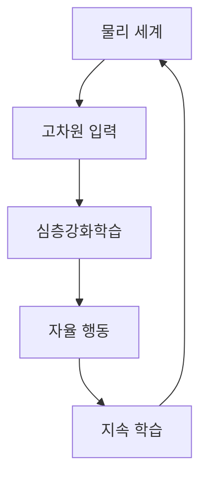

> [!NOTE]
> Physical AI에서 심층강화학습은 고차원 입력을 처리하고 물리 세계에서 자율적으로 행동하며 계속 학습하는 시스템을 만드는 핵심 기술로 제시된다.

---

## Physical AI와 심층강화학습

**핵심:** 심층강화학습의 가치는 정형화된 화면 안이 아니라 복잡하고 비표준적인 물리 환경에서 인지·행동·학습을 연결하는 데 있다.



| 범주 | 원문 정의 | 초점 |
| :-- | :-- | :-- |
| Artificial Intelligence | 인간 지능을 모방하는 시스템 | 지능적 기능의 가장 넓은 범주 |
| Machine Learning | 데이터 기반 학습 시스템 | 데이터에서 규칙을 학습 |
| Deep Learning | 심층 신경망 기반 모델 | 깊은 신경망으로 표현을 학습 |

> [!IMPORTANT]
> 이 구간은 딥러닝이 인간보다 우수하다고 제시된 분야가 있음을 언급하지만, 분야·측정 기준·수치는 추출 텍스트에 남아 있지 않으므로 우열을 일반화하지 않는다.

---

## GPU 시뮬레이션과 로봇 과제

Isaac Gym과 Bi-DexHands는 모두 로봇 강화학습을 다루지만, 전자는 GPU 병렬 물리 시뮬레이션 환경이고 후자는 양손 정밀 조작 벤치마크다.

```html preview
<div style="font-family:system-ui,sans-serif;padding:20px;color:var(--foreground)">
  <h3 style="margin:0 0 14px;font-size:15px;font-weight:600">로봇 강화학습 과제 수</h3>
  <div id="bars" style="display:flex;align-items:flex-end;gap:14px;height:170px"></div>
  <script>
    var data = [['Isaac Gym', 9], ['Bi-DexHands', 20]];
    var max = Math.max.apply(null, data.map(function (d) { return d[1]; }));
    document.getElementById('bars').innerHTML = data.map(function (d, i) {
      return '<div style="flex:1;display:flex;flex-direction:column;align-items:center;' +
        'gap:6px;height:100%;justify-content:flex-end">' +
        '<span style="font-size:12px;font-weight:600">' + d[1] + '</span>' +
        '<div style="width:100%;height:' + (d[1] / max * 100) + '%;' +
        'background:var(--chart-' + (i + 1) + ');' +
        'border-radius:var(--radius) var(--radius) 0 0"></div>' +
        '<span style="font-size:12px;color:var(--muted-foreground)">' + d[0] + '</span>' +
        '</div>';
    }).join('');
  </script>
</div>
```

<Tabs>
  <Tab label="Isaac Gym">NVIDIA가 개발한 GPU 기반 물리 시뮬레이션 환경이다. GPU만으로 수천 개 시뮬레이션을 병렬 실행해 정책 학습을 효율화하며, NeurIPS 2021 자료와 연결된다.</Tab>
  <Tab label="Bi-DexHands">PKU-MARL 팀의 양손 정밀 조작 강화학습 벤치마크다. 인간 수준의 양손 손재주 조작을 목표로 하며, NeurIPS 2022 자료와 연결된다.</Tab>
</Tabs>

<details>
<summary>원문에 제시된 과제 예시</summary>

- Isaac 계열 예시: Allegro hand, Ant, Humanoid, Quadcopter, Franka cabinet
- Dexterity 계열 예시: Switch, Lift, Door close inward, Block stacking, Hand over

</details>

---

## Eureka의 보상 설계

<Tabs>
  <Tab label="남은 문제">LLM은 로봇 과제의 상위 수준 의미 계획에서는 성과를 보였지만, 펜 돌리기처럼 복잡한 하위 수준 기술을 직접 학습시키는 문제는 미해결 과제로 제시된다.</Tab>
  <Tab label="접근">Eureka는 코딩 LLM으로 보상을 설계하고, 모델을 다시 학습하지 않는 gradient-free in-context learning에 인간 입력을 결합해 생성 보상의 품질과 안전성을 높이는 방향을 제시한다.</Tab>
</Tabs>

```html preview
<div style="font-family:system-ui,sans-serif;padding:20px">
  <div id="cards" style="display:flex;gap:14px;flex-wrap:wrap"></div>
  <script>
    var stats = [
      ['로봇 형태', '10종', '다양한 형태', 'var(--chart-2)'],
      ['오픈소스 환경', '29개', '강화학습 환경', 'var(--chart-1)'],
      ['전문가 초과 작업', '83%', '작업 기준', 'var(--chart-5)']
    ];
    document.getElementById('cards').innerHTML = stats.map(function (s) {
      return '<div style="flex:1;min-width:150px;padding:16px;background:var(--card);' +
        'color:var(--card-foreground);border:1px solid var(--border);' +
        'border-radius:var(--radius)">' +
        '<div style="font-size:13px;color:var(--muted-foreground)">' + s[0] + '</div>' +
        '<div style="font-size:26px;font-weight:700;margin-top:4px">' + s[1] + '</div>' +
        '<div style="font-size:12px;font-weight:600;margin-top:4px;color:' + s[3] + '">' +
        s[2] + '</div>' +
        '</div>';
    }).join('');
  </script>
</div>
```

> [!NOTE]
>
> - Eureka는 평균적으로 52%의 정규화된 개선을 보였다고 보고한다.
> - 생성 보상을 커리큘럼 학습에 사용해 시뮬레이션된 Shadow Hand가 빠르게 펜 회전 기술을 수행한 사례를 제시한다.

---

## 강화학습 개념과 연구 이정표

| 학습 요소 | 원문에 제시된 범위 |
| :-- | :-- |
| 행동 선택 | Frozen Lake 맥락의 exploitation과 exploration |
| 가치 표현 | Q-table, Q-function approximation, Q-Network |
| 의사결정 구조 | Markov Decision Process |
| 심층 가치 학습 | Deep Q Learning, Deep Q Network |
| 시각적 주의 | Recurrent Models of Visual Attention, RAM |
| 보상 생성 | Eureka와 Coding LLM |

| 연도 | 연구 또는 발표 | 연결 의미 |
| :-- | :-- | :-- |
| 2013 | Playing Atari with Deep Reinforcement Learning | 심층 신경망과 Atari 제어 |
| 2014 | Recurrent Models of Visual Attention | 순환 주의 모델 |
| 2015 | Human-level control through deep reinforcement learning | 인간 수준 제어 결과 |
| 2016 | Mastering the game of Go with deep neural networks and tree search | 심층 신경망과 탐색의 결합 |
| 2024 | Eureka, ICLR | 코딩 LLM 기반 보상 설계 |

---

## 딥러닝 모델 어휘

| 문제 구조 | 대표 모델 또는 작업 |
| :-- | :-- |
| 기본 신경망 | ANN, MLP, FNN |
| 순차 데이터 | RNN, LSTM, GRU |
| 시각 특징 | CNN |
| 시각 작업 | 이미지 분류·객체 탐지·얼굴 인식 |
| 장거리 관계 | Attention, Transformer |
| 생성 모델 | GAN, VAE |

---

## 선수 지식의 세 갈래

| 학습 영역 | 주제 수 | 중심 질문 |
| :-- | --: | :-- |
| Computer Vision | 10 | 이미지·영상·3D와 언어를 어떻게 이해할까? |
| Natural Language Processing | 6 | 순차 표현에서 선택적 상태공간 모델까지 어떻게 확장할까? |
| Statistical Learning | 7 | 회귀·분류에서 트리와 마진 기반 방법까지 어떻게 검증할까? |

<Tabs>
  <Tab label="Computer Vision">
  
  1. 선형 분류기를 이용한 이미지 분류
  2. 정규화와 최적화
  3. 신경망과 역전파
  4. CNN 이미지 분류
  5. 순환 신경망
  6. Attention과 Transformer
  7. 객체 탐지와 이미지 분할
  8. 비디오 이해
  9. 생성 모델
  10. 3D Vision, Vision and Language
  
  </Tab>
  <Tab label="NLP">
  
  1. RNN, LSTM, GRU
  2. Word2Vec
  3. Seq2Seq
  4. Attention
  5. Transformer — Attention Is All You Need, NIPS 2017
  6. Mamba — 선택적 상태공간 모델, 2023년 12월
  
  </Tab>
  <Tab label="Statistical Learning">
  
  1. 선형 회귀
  2. 분류
  3. 재표집 방법
  4. 선형 모델 선택과 정규화
  5. 비선형성 확장
  6. 트리 기반 방법, Boosting, XGBoost
  7. Support Vector Machines
  
  교재 설명은 Gareth James, Daniela Witten, Trevor Hastie, Robert Tibshirani, Jonathan Taylor의 5인 저자, Springer 2023년 6월 출간, R 기반 ISLR을 잇는 Python 실습·코드 예시를 제시한다.
  
  </Tab>
</Tabs>

<details>
<summary>부스팅과 XGBoost의 위치</summary>

원문은 gradient boosting trees의 기원을 Friedman 등에게 두고, XGBoost를 트리 부스팅에 맞춰 설계·최적화된 라이브러리로 설명한다. 다중 스레드와 정규화를 도입해 계산 성능과 예측 정확도를 높이고, 데이터 탐색과 실제 운영 문제에 사용되며 C++, R, Python, Julia, Java 인터페이스를 제공한다고 정리한다.

</details>

> [!WARNING]
> 원문 오류와 불완전한 표기는 그대로 식별해야 한다. “Eurka”, “RN on Frozen Lake”, “Inintroduction”은 오탈자 또는 불명확한 표기다. 통계학습 도서 설명에는 Jonathan Taylor까지 저자로 적혀 있지만 바로 아래 제목 줄에는 Gareth James, Daniela Witten, Trevor Hastie, Robert Tibshirani 네 명만 표시되어 저자 정보가 일치하지 않는다. 또한 Kaggle 우승 해법의 절반 이상이 XGBoost를 사용했다는 문장에는 “Incomplete list”가 붙어 있으므로 완전한 조사 결과로 읽지 않는다.

---

## 학습 경로 정리

| 단계 | 먼저 확인할 것 | 다음 연결 |
| :-- | :-- | :-- |
| 물리 환경 | 고차원 입력과 자율 행동 | DRL 정책 학습 |
| 시뮬레이션 | GPU 병렬 환경과 조작 벤치마크 | 로봇 과제 평가 |
| 보상 설계 | 상위 계획과 하위 기술의 간극 | Eureka와 인간 피드백 |
| 기초 이론 | MDP, Q 계열, DQN, RAM | 연구 이정표 |
| 선수 과목 | CV, NLP, 통계학습 | 실제 생성 설계 문제 |
