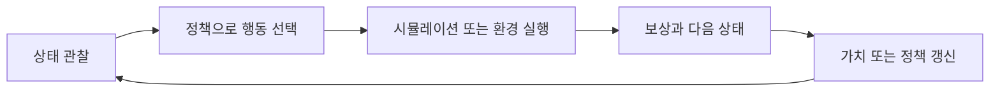

> [!abstract] 한 줄 요약
> 강화학습은 정답 예시를 직접 주기보다, 환경에서 행동하고 **보상을 통해 더 나은 선택을 찾는 학습**이다.

강의 후반은 물리 환경에서의 강화학습, 시뮬레이션 기반 로봇 과제, LLM을 활용한 보상 설계 사례를 소개한 뒤 AI·머신러닝·딥러닝의 기초 모델을 복습한다. 생성 설계와 연결하면, 후보를 만드는 모델과 후보를 평가하는 환경을 함께 다루는 관점이 된다.

```html preview h=180
<div style="font-family:system-ui,sans-serif;padding:16px;color:var(--foreground);background:var(--card);border:1px solid var(--border);border-radius:var(--radius)">
  <div style="font-weight:700;margin-bottom:9px">강화학습의 반복 고리</div>
  <svg viewBox="0 0 720 118" width="100%" role="img" aria-label="에이전트가 환경에 행동하고 상태와 보상을 받아 정책을 갱신하는 독자 제작 도식">
    <g font-family="system-ui,sans-serif" text-anchor="middle"><rect x="78" y="34" width="160" height="52" rx="12" fill="var(--card)" stroke="var(--chart-4)"/><text x="158" y="57" font-size="14" font-weight="700" fill="currentColor">에이전트</text><text x="158" y="75" font-size="10" fill="var(--muted-foreground)">정책으로 행동 선택</text><rect x="484" y="34" width="160" height="52" rx="12" fill="var(--card)" stroke="var(--chart-2)"/><text x="564" y="57" font-size="14" font-weight="700" fill="currentColor">환경</text><text x="564" y="75" font-size="10" fill="var(--muted-foreground)">상태 변화와 보상</text><path d="M244 48h232" stroke="var(--chart-1)" stroke-width="3"/><path d="M476 48l-10-6v12z" fill="var(--chart-1)"/><text x="360" y="40" text-anchor="middle" font-size="12" fill="var(--muted-foreground)">행동</text><path d="M478 74H246" stroke="var(--chart-5)" stroke-width="3"/><path d="M246 74l10-6v12z" fill="var(--chart-5)"/><text x="360" y="103" text-anchor="middle" font-size="12" fill="var(--muted-foreground)">다음 상태와 보상</text></g>
  </svg>
</div>
```

## 강화학습의 구성 요소

| 요소 | 역할 | 설계 문제로 비유하면 |
| :-- | :-- | :-- |
| 상태 | 현재 환경이 어떤 상황인지 표현 | 현재 형상·조건·성능 |
| 행동 | 에이전트가 선택하는 변화 | 형상 수정·제어 입력 |
| 보상 | 행동이 얼마나 좋았는지 알려 주는 신호 | 성능·안전·비용 점수 |
| 정책 | 상태에서 행동을 고르는 규칙 | 다음 설계 시도를 정하는 방법 |

> [!important] 보상은 목표를 대신 정의한다
> 보상에 포함하지 않은 것은 학습이 중요하게 여기지 않을 수 있다. 빠른 설계만 보상하면 안전성·다양성·제조 가능성을 희생할 수 있으므로, 보상 설계가 문제 정의의 일부가 된다.

## 탐험과 활용

<Tabs>
  <Tab label="탐험">
    아직 모르는 행동을 시도해 새로운 가능성을 찾는다. 너무 적으면 같은 해법에 갇히고, 너무 많으면 좋은 선택을 축적하기 어렵다.
  </Tab>
  <Tab label="활용">
    지금까지 높은 보상을 준 행동을 더 자주 선택한다. 안정된 성능을 얻지만 더 나은 해법을 놓칠 수 있다.
  </Tab>
  <Tab label="균형">
    학습 단계와 위험 수준에 따라 두 비중을 조절한다. 물리적 시스템에서는 실제 장비 대신 시뮬레이션으로 탐험 범위를 넓히는 이유가 된다.
  </Tab>
</Tabs>



## 시뮬레이션의 위치

```html preview h=165
<div style="font-family:system-ui,sans-serif;padding:16px;color:var(--foreground)">
  <div style="display:flex;gap:12px;align-items:stretch;flex-wrap:wrap">
    <div style="flex:1;min-width:180px;padding:14px;border:1px solid var(--chart-1);border-radius:var(--radius);background:var(--card)"><b>시뮬레이션</b><br><span style="font-size:13px;color:var(--muted-foreground)">많은 조건을 병렬로 시험하고 보상 구조를 수정</span></div>
    <div style="flex:1;min-width:180px;padding:14px;border:1px solid var(--chart-3);border-radius:var(--radius);background:var(--card)"><b>검증</b><br><span style="font-size:13px;color:var(--muted-foreground)">현실 제약과 안전 요구를 다시 확인</span></div>
    <div style="flex:1;min-width:180px;padding:14px;border:1px solid var(--chart-2);border-radius:var(--radius);background:var(--card)"><b>적용</b><br><span style="font-size:13px;color:var(--muted-foreground)">제한된 조건에서 정책의 성능을 관찰</span></div>
  </div>
</div>
```

강의의 로봇 시뮬레이션 사례는 고차원 행동과 반복 실행이 필요한 물리 과제에서 GPU 기반 병렬 환경이 유용함을 보여 준다. 그러나 시뮬레이션에서 받은 보상이 실제 환경의 모든 위험과 제약을 포함한다는 뜻은 아니다.

## AI·ML·DL 복습

| 층위 | 범위 | 예 |
| :-- | :-- | :-- |
| 인공지능 | 사람의 지능적 행동을 흉내 내는 넓은 범주 | 규칙·검색·학습 시스템 |
| 머신러닝 | 데이터에서 규칙을 학습하는 방법 | 분류, 회귀, 군집화 |
| 딥러닝 | 깊은 신경망을 사용하는 머신러닝 | CNN, RNN, Transformer, 생성 모델 |

<details>
<summary>강의가 제시한 딥러닝 학습 지도</summary>

- 이미지: 선형 분류기, CNN, 객체 인식·분할, 영상 이해, 생성 모델
- 언어: RNN·LSTM·GRU, Word2Vec, Seq2Seq, Attention, Transformer, 상태공간 모델
- 일반 학습: 회귀·분류, 정규화, 재표본화, 트리 기반 방법, SVM
- 강화학습: MDP, Q 함수, Q 네트워크, DQN, 보상 설계

각 모델은 데이터 형태와 문제 종류에 따라 선택한다. 모델 이름을 많이 아는 것보다, 입력·목표·평가 기준을 맞추는 것이 먼저다.

</details>

> [!warning] 원문 표기 오류
> 강의 추출문에서 보상 설계 연구의 이름이 한 차례 잘못 쓰여 있다. 이 노트에서는 통용 표기인 **Eureka**로 바로잡는다.

## 핵심 정리

| 개념 | 기억할 점 |
| :-- | :-- |
| 강화학습 | 행동의 결과로 받은 보상에서 정책을 학습 |
| 보상 설계 | 모델이 무엇을 중요하게 여길지 정하는 문제 정의 |
| 시뮬레이션 | 다양한 조건의 반복 실험을 돕는 환경 |
| 탐험과 활용 | 새 행동 탐색과 좋은 행동 반복의 균형 |
| 딥러닝 | 데이터와 과제에 맞게 신경망 구조를 선택하는 방법 |

> [!question]- 스스로 점검
> 높은 보상을 받는 정책이 실제 제품 설계에서도 바로 좋은 정책이라고 할 수 없는 이유는 무엇인가?
>
> **답:** 보상과 시뮬레이션은 모델로 표현한 조건만 반영한다. 현실의 안전·제조·사용성 제약이 빠져 있으면 높은 보상도 실제 품질을 보장하지 않는다.
