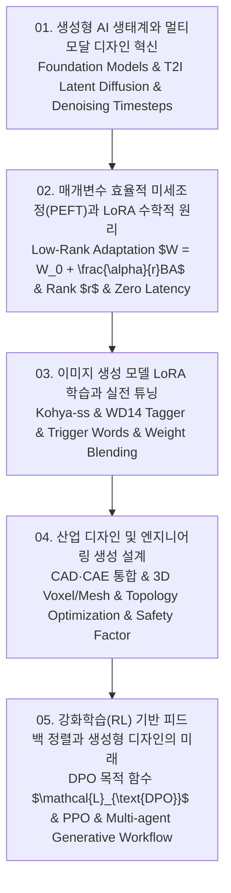

# 📚 생성형 AI 미세조정 및 생성 설계 (Generative AI Fine-Tuning & Generative Design) 전체 강의 로드맵

파운데이션 모델 생태계와 T2I 잠재 확산 모델(Latent Diffusion Models), 매개변수 효율적 미세조정 PEFT와 저차원 행렬 분해 LoRA($W = W_0 + \frac{\alpha}{r}BA$)의 수학적 기초, Stable Diffusion WebUI 및 Kohya-ss 기반 이미지/스타일 LoRA 학습 및 가중치 블렌딩, CAD/CAE 통합 기반 산업용 3D 콘셉트 형상 생성 설계(Generative Design) 및 위상 최적화, 그리고 DPO/RLHF 인간 피드백 기반 미학적 정렬 기술까지 최신 생성형 AI 응용 엔지니어링을 포괄합니다.

---

## 🗺️ 강의 목차 (Curriculum Overview)

---

## 📑 개별 정리 문서 목록

1. [01. 생성형 AI 생태계와 멀티모달 디자인 혁신 - 파운데이션 모델, T2I 확산 모델과 인터페이스 제어](file:///Users/um-yunsang/work/edu/ComputerScience/03_ai-ml-data/generative-ai-fine-tuning/notes/01.%20%EC%83%9D%EC%84%B1%ED%98%95%20AI%20%EC%83%9D%ED%83%9C%EA%B3%84%EC%99%80%20%EB%A9%80%ED%8B%B0%EB%AA%A8%EB%8B%AC%20%EB%94%94%EC%9E%90%EC%9D%B8%20%ED%98%81%EC%8B%A0%20-%20%ED%8C%8C%EC%9A%B4%EB%8D%B0%EC%9D%B4%EC%85%98%20%EB%AA%A8%EB%8D%B8,%20T2I%20%ED%99%95%EC%82%B0%20%EB%AA%A8%EB%8D%B8%EA%B3%BC%20%EC%9D%B8%ED%84%B0%ED%8E%98%EC%9D%B4%EC%8A%A4%20%EC%A0%9C%EC%96%B4.md)
   - 잠재 확산 모델(LDM) 아키텍처, 텍스트-이미지 생성 파이프라인, 대화형 디노이징 타임스텝 시뮬레이터
2. [02. 매개변수 효율적 미세조정(PEFT)과 LoRA 수학적 원리 - 저차원 행렬 분해(W = W0 + BA), 랭크 r과 스케일링 알파](file:///Users/um-yunsang/work/edu/ComputerScience/03_ai-ml-data/generative-ai-fine-tuning/notes/02.%20%EB%A7%A4%EA%B0%9C%EB%B3%80%EC%88%98%20%ED%9A%A8%EC%9C%A8%EC%A0%81%20%EB%AF%B8%EC%84%B8%EC%A1%B0%EC%A0%95(PEFT)%EA%B3%BC%20LoRA%20%EC%88%98%ED%95%99%EC%A0%81%20%EC%9B%90%EB%A6%AC%20-%20%EC%A0%80%EC%B0%A8%EC%9B%90%20%ED%96%89%EB%87%AC%20%EB%B6%84%ED%95%B4(W%20=%20W0%20+%20BA),%20%EB%9E%AD%ED%81%AC%20r%EA%B3%BC%20%EC%8A%A4%EC%BC%80%EC%9D%BC%EB%A7%81%20%EC%95%8C%ED%8C%8C.md)
   - LoRA 저랭크 행렬 분해 수식, 랭크 $r$과 스케일링 $\alpha$, 대화형 파라미터 절감 계산기
3. [03. 이미지 생성 모델 LoRA 학습과 실전 튜닝 - Stable Diffusion Checkpoint, 캡셔닝 태깅과 체크포인트 병합](file:///Users/um-yunsang/work/edu/ComputerScience/03_ai-ml-data/generative-ai-fine-tuning/notes/03.%20%EC%9D%B4%EB%AF%B8%EC%A7%80%20%EC%83%9D%EC%84%B1%20%EB%AA%A8%EB%8D%B8%20LoRA%20%ED%95%99%EC%8A%B5%EA%B3%BC%20%EC%8B%A4%EC%A0%84%20%ED%8A%9C%EB%8B%9D%20-%20Stable%20Diffusion%20Checkpoint,%20%EC%BA%cap%EC%85%94%EB%8B%9D%20%ED%83%9C%EA%B9%85%EA%B3%BC%20%EC%B2%B4%ED%81%AC%ED%8F%AC%EC%9D%B8%ED%8A%B8%20%EB%B3%91%ED%95%A9.md)
   - 이미지 정제 및 트리거 워드 주입, Kohya-ss 학습 설정, 대화형 LoRA 가중치 블렌더 시뮬레이터
4. [04. 산업 디자인 및 엔지니어링 생성 설계(Generative Design) - CAD·CAE 통합 3D 형상 생성과 성능 최적화](file:///Users/um-yunsang/work/edu/ComputerScience/03_ai-ml-data/generative-ai-fine-tuning/notes/04.%20%EC%82%B0%EC%97%85%20%EB%94%94%EC%9E%90%EC%9D%B8%20%EB%B0%8F%20%EC%97%94%EC%A7%80%EB%8B%88%EC%96%B4%EB%A7%81%20%EC%83%9D%EC%84%B1%20%EC%84%A4%EA%B3%84(Generative%20Design)%20-%20CAD%C2%B7CAE%20%ED%86%B5%ED%95%A9%203D%20%ED%98%95%EC%83%81%20%EC%83%9D%EC%84%B1%EA%B3%BC%20%EC%84%B1%EB%8A%A5%20%EC%B5%9C%EC%A0%81%ED%99%94.md)
   - CAD/CAE 통합 파이프라인, 기아차 휠 생성 사례, 대화형 위상 최적화 경량화 시뮬레이터
5. [05. 강화학습(RL) 기반 피드백 정렬과 생성형 디자인의 미래 - DPO, PPO 인간 피드백 및 최신 생성 모델](file:///Users/um-yunsang/work/edu/ComputerScience/03_ai-ml-data/generative-ai-fine-tuning/notes/05.%20%EA%B0%95%ED%99%94%ED%95%99%EC%8A%B5(RL)%20%EA%B8%B0%EB%B0%98%20%ED%94%BC%EB%93%9C%EB%B0%B1%20%EC%A0%95%EB%A0%AC%EA%B3%BC%20%EC%83%9D%EC%84%B1%ED%98%95%20%EB%94%94%EC%9E%90%EC%9D%B8%EC%9D%98%20%EB%AF%B8%EB%9E%98%20-%20DPO,%20PPO%20%EC%9D%B8%EA%B0%84%20%ED%94%BC%EB%93%9C%EB%B0%B1%20%EB%B0%8F%20%EC%B5%9C%EC%8B%A0%20%EC%83%9D%EC%84%B1%20%EB%AA%A8%EB%8D%B8.md)
   - DPO 직접 선호 최적화 손실 함수, 미학적 피드백 정렬, 대화형 DPO 손실 계산기
