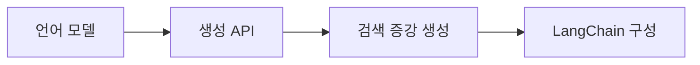

> [!abstract] 과목 개요
> 대규모 언어모델의 구조와 생성 API, 검색 증강 생성, LangChain 기반 실행 구성을 개념·실습 설계 관점에서 정리한다.

## 학습 흐름

| 흐름 | 다루는 질문 |
| :-- | :-- |
| 언어 모델 | 토큰·문맥·다음 토큰 예측은 어떻게 연결되는가 |
| 생성 API | 요청·응답·대화 문맥을 어떻게 설계하고 검토하는가 |
| RAG | 외부 지식을 어떤 검색 파이프라인으로 생성에 연결하는가 |
| LangChain | 프롬프트·모델·파서·도구를 어떤 계약으로 조합하는가 |

## OpenAI API 흐름

| 시작 슬라이드 | 정리문서 | 핵심 주제 |
| :--: | :-- | :-- |
| 04 | [LLM과 NLP의 발전](<./notes/OpenAI API 04. LLM과 NLP의 발전.md>) | 언어 처리 모델의 변화 |
| 16 | [LLM과 GPT 구조](<./notes/OpenAI API 16. LLM과 GPT 구조.md>) | 토큰·문맥·생성 구조 |
| 27 | [ChatGPT 모델과 학습](<./notes/OpenAI API 27. ChatGPT 모델과 학습.md>) | 프롬프트 적응과 Fine-Tuning |
| 44 | [API 요청과 모델 호환성](<./notes/OpenAI API 44. API 요청과 모델 호환성.md>) | 요청 계약과 응답 검토 |
| 57 | [Chat Completion과 스트리밍](<./notes/OpenAI API 57. Chat Completion과 스트리밍.md>) | 역할·문맥·도구 연결 |
| 67 | [텍스트 생성과 프롬프트](<./notes/OpenAI API 67. 텍스트 생성과 프롬프트.md>) | 생성 제어와 출력 계약 |
| 84 | [텍스트 편집과 이미지 생성](<./notes/OpenAI API 84. 텍스트 편집과 이미지 생성.md>) | 변환 지시와 결과 검수 |
| 106 | [Tokenizer와 Embedding](<./notes/OpenAI API 106. Tokenizer와 Embedding.md>) | 토큰화와 의미 검색 |
| 116 | [오디오, Moderation, 추론](<./notes/OpenAI API 116. 오디오, Moderation, 추론.md>) | 멀티모달 출력과 안전 신호 |
| 128 | [Fine-Tuning](<./notes/OpenAI API 128. Fine-Tuning.md>) | 데이터 검증과 학습 평가 |
| 139 | [개발환경과 키 관리](<./notes/OpenAI API 139. 개발환경과 키 관리.md>) | 비밀값·비용·추적 관리 |

## RAG와 LangChain 흐름

| 시작 슬라이드 | 정리문서 | 핵심 주제 |
| :--: | :-- | :-- |
| 04 | [RAG의 원리와 파이프라인](<./notes/RAG LangChain 04. RAG의 원리와 파이프라인.md>) | 검색과 생성의 결합 |
| 19 | [데이터 로드와 검색 최적화](<./notes/RAG LangChain 19. 데이터 로드와 검색 최적화.md>) | 분할·검색·재정렬 |
| 51 | [LlamaIndex와 벡터 저장소](<./notes/RAG LangChain 51. LlamaIndex와 벡터 저장소.md>) | 인덱스·메타데이터·검색 전략 |
| 82 | [LangChain 모듈과 에이전트](<./notes/RAG LangChain 82. LangChain 모듈과 에이전트.md>) | Chain·Agent·Tool·Memory |
| 109 | [Runnable, LCEL, 프롬프트](<./notes/RAG LangChain 109. Runnable, LCEL, 프롬프트.md>) | 조합 가능한 입출력 계약 |

> [!tip] 학습 순서
> 먼저 모델과 생성 API의 입력·출력 구조를 잡고, 그 다음 검색 파이프라인과 프레임워크 조합으로 넘어간다. 실행 예시는 반드시 현재 환경에서 입력 계약과 비밀값 처리를 다시 점검한다.
