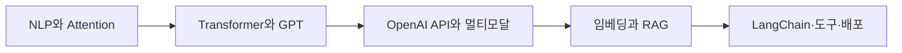

> [!ABSTRACT]
> ==언어 모델의 작동 원리에서 출발해 API 실행 계약을 익히고, 외부 지식 검색과 LangChain 구성 요소로 응용 범위를 넓힌다.==

- **모델 층:** NLP 처리, Attention, Transformer, GPT 학습
- **API 층:** 요청·응답, 대화·이미지·오디오, 임베딩, 파인튜닝, 개발 환경
- **검색 층:** 문서 분할, 벡터 저장, 검색 최적화, RAG
- **오케스트레이션 층:** Chain, Agent, Memory, LCEL, 도구와 출력 파서

---

## 강의 흐름 지도

[00. large-language-models 강의 흐름 지도](<./notes/00. large-language-models 강의 흐름 지도.md>)

## 학습 경로



> [!TIP]
> 모델 이름보다 **입력 표현 → 생성 구조 → API 계약 → 검색 근거 → 실행 관찰**의 연결을 따라가면 두 원본의 내용을 하나의 시스템으로 이해할 수 있다.

---

## 두 원본의 역할

<Tabs>
  <Tab label="OpenAI API">

NLP와 GPT 계열의 구조·학습 흐름을 먼저 잡고, 요청·응답과 Completion·Chat, 이미지·오디오·모더레이션을 거쳐 토큰화·임베딩·Faiss, 파인튜닝, Windows 환경과 키 관리로 확장한다.

  </Tab>
  <Tab label="RAG·LangChain">

외부 문서 로딩·분할·임베딩·인덱싱에서 출발해 검색 최적화와 LlamaIndex·벡터 저장소를 비교하고, Chain·Agent·Memory·LCEL과 Few-shot·파서·도구·추적 환경으로 이어 간다.

  </Tab>
</Tabs>

---

## 정리문서

| 번호 | 문서 | 핵심 질문 | 근거 상태 |
| :-- | :-- | :-- | :-- |
| 01 | [NLP 처리에서 어텐션까지](notes/01.%20NLP%20처리에서%20어텐션까지.md) | 규칙 기반 처리에서 Attention까지 어떤 병목이 해결되었는가 | 반영 |
| 11 | [Transformer와 언어 모델 계열](notes/11.%20Transformer와%20언어%20모델%20계열.md) | 인코더·디코더 구조와 언어 모델 계열은 어떻게 구분되는가 | 반영 |
| 19 | [GPT 구조와 학습 전략](notes/19.%20GPT%20구조와%20학습%20전략.md) | GPT 규모·문맥 학습·미세조정·RLHF는 어떻게 연결되는가 | 반영 |
| 40 | [ChatGPT 모델 선택과 활용 한계](notes/40.%20ChatGPT%20모델%20선택과%20활용%20한계.md) | 모델 선택과 활용 영역의 한계를 어떻게 판별하는가 | 반영 |
| 49 | [OpenAI API 요청·응답과 도구 호출](notes/49.%20OpenAI%20API%20요청·응답과%20도구%20호출.md) | 요청 계약·응답 필드·스트리밍·도구 실행의 책임은 무엇인가 | 반영 |
| 62 | [Completion API 매개변수와 텍스트 생성](notes/62.%20Completion%20API%20매개변수와%20텍스트%20생성.md) | 생성 매개변수와 legacy API 예제를 어떻게 해석하는가 | 반영 |
| 73 | [Chat Completion 대화 설계와 편집](notes/73.%20Chat%20Completion%20대화%20설계와%20편집.md) | 메시지 역할·문맥·출력 제어를 어떻게 조합하는가 | 반영 |
| 86 | [이미지 생성·편집·변형 API](notes/86.%20이미지%20생성·편집·변형%20API.md) | 생성·마스크 편집·변형의 입력과 제한은 어떻게 다른가 | 반영 |
| 92 | [토큰화·임베딩·Faiss 유사도 검색](notes/92.%20토큰화·임베딩·Faiss%20유사도%20검색.md) | 텍스트가 토큰과 벡터를 거쳐 최근접 검색으로 이어지는가 | 반영 |
| 104 | [오디오·모더레이션·추론 모델 API](notes/104.%20오디오·모더레이션·추론%20모델%20API.md) | 음성·검토·추론 모델의 요청과 시점 제약은 무엇인가 | 반영 |
| 116 | [파인튜닝 데이터·작업·한계](notes/116.%20파인튜닝%20데이터·작업·한계.md) | 학습 데이터와 작업 생명주기를 어떻게 검증하는가 | 반영 |
| 131 | [Windows AI 개발환경 구성](notes/131.%20Windows%20AI%20개발환경%20구성.md) | Conda·Git·PowerShell·VS Code를 어떤 순서로 준비하는가 | 반영 |
| 144 | [OpenAI API 키·결제·환경변수](notes/144.%20OpenAI%20API%20키·결제·환경변수.md) | 결제·한도·키·환경변수를 어떻게 분리 관리하는가 | 반영 |
| 04 | [RAG의 원리와 인덱싱](notes/04.%20RAG의%20원리와%20인덱싱.md) | 외부 자료가 검색 가능한 지식 구조로 바뀌는 과정은 무엇인가 | 반영 |
| 19 | [검색 최적화와 LlamaIndex·벡터 저장소](notes/19.%20검색%20최적화와%20LlamaIndex·벡터%20저장소.md) | 검색기·재순위화·저장소를 어떤 기준으로 조합하는가 | 반영 |
| 51 | [LangChain 체인·에이전트·메모리와 LCEL](notes/51.%20LangChain%20체인·에이전트·메모리와%20LCEL.md) | 고정 체인과 동적 에이전트의 실행·상태 관리는 어떻게 다른가 | 반영 |
| 82 | [Few-shot 프롬프트·모델·출력 파서와 도구](notes/82.%20Few-shot%20프롬프트·모델·출력%20파서와%20도구.md) | 예시·모델·파서·도구를 안정된 실행 단위로 어떻게 묶는가 | 반영 |
| 109 | [개발 환경·API 키와 보충 사례](notes/109.%20개발%20환경·API%20키와%20보충%20사례.md) | 환경 설정과 모델·데이터 보충 사례를 어떻게 구분하는가 | 반영 |

---

## 과정 스냅샷

```html preview
<div style="font-family:system-ui,sans-serif;padding:20px">
  <div id="cards" style="display:flex;gap:14px;flex-wrap:wrap"></div>
  <script>
    var stats = [
      ['학습 노트', '18', '서로 겹치지 않는 주제 구간', 'var(--chart-2)'],
      ['원본 파일', '2', 'OpenAI API와 RAG·LangChain', 'var(--chart-1)'],
      ['저밀도 블록', '67', '추정하지 않고 경계 표시', 'var(--chart-5)']
    ];
    document.getElementById('cards').innerHTML = stats.map(function (s) {
      return '<div style="flex:1;min-width:150px;padding:16px;background:var(--card);' +
        'color:var(--card-foreground);border:1px solid var(--border);' +
        'border-radius:var(--radius)">' +
        '<div style="font-size:13px;color:var(--muted-foreground)">' + s[0] + '</div>' +
        '<div style="font-size:26px;font-weight:700;margin-top:4px">' + s[1] + '</div>' +
        '<div style="font-size:12px;font-weight:600;margin-top:4px;color:' + s[3] + '">' +
        s[2] + '</div>' +
        '</div>';
    }).join('');
  </script>
</div>
```

---

## 본문 배정 규모

```html preview
<div style="font-family:system-ui,sans-serif;padding:20px;color:var(--foreground)">
  <h3 style="margin:0 0 14px;font-size:15px;font-weight:600">노트 본문에 배정된 원본 블록</h3>
  <div id="bars" style="display:flex;align-items:flex-end;gap:14px;height:170px"></div>
  <script>
    var data = [['OpenAI API', 158], ['RAG·LangChain', 125]];
    var max = Math.max.apply(null, data.map(function (d) { return d[1]; }));
    document.getElementById('bars').innerHTML = data.map(function (d, i) {
      return '<div style="flex:1;display:flex;flex-direction:column;align-items:center;' +
        'gap:6px;height:100%;justify-content:flex-end">' +
        '<span style="font-size:12px;font-weight:600">' + d[1] + '</span>' +
        '<div style="width:100%;height:' + (d[1] / max * 100) + '%;' +
        'background:var(--chart-' + (i + 1) + ');' +
        'border-radius:var(--radius) var(--radius) 0 0"></div>' +
        '<span style="font-size:12px;color:var(--muted-foreground)">' + d[0] + '</span>' +
        '</div>';
    }).join('');
  </script>
</div>
```

- 두 막대는 같은 단위인 추출 블록 수만 비교한다.
- 나머지 블록은 표지·목차·종결 화면 또는 두 원본의 중복 부록과 반복 내용이다.
- 중복 부록은 RAG·LangChain 쪽에서 한 번만 설명하고, OpenAI API 쪽에는 별도 노트를 만들지 않는다.

---

## 범위 판정

```html preview
<div style="font-family:system-ui,sans-serif;padding:20px;display:flex;align-items:center;gap:20px;color:var(--foreground)">
  <svg width="120" height="120" viewBox="0 0 120 120" role="img" aria-label="301 of 301 source blocks reviewed">
    <circle cx="60" cy="60" r="46" stroke-width="14" style="fill: none; stroke: var(--border)" />
    <circle cx="60" cy="60" r="46" stroke-width="14"
      stroke-linecap="round" stroke-dasharray="289" stroke-dashoffset="0"
      transform="rotate(-90 60 60)" style="fill: none; stroke: var(--chart-1)" />
    <text x="60" y="67" text-anchor="middle" font-size="22" font-weight="700"
      style="fill: var(--foreground)">100%</text>
  </svg>
  <div>
    <div style="font-weight:600;font-size:15px">원본 추출 블록 판정</div>
    <div style="font-size:13px;color:var(--muted-foreground);margin-top:2px">301개 중 301개를 배정·중복·구조 범위로 분류</div>
  </div>
</div>
```

<details>
<summary>중복·구조 범위 판정 기준</summary>

- 두 원본에서 정규화 텍스트가 같은 블록은 동일한 설명을 두 노트에 반복하지 않는다.
- 표지·목차·종결 화면은 새로운 기술 설명이 없으면 독립 노트를 만들지 않는다.
- 텍스트가 희박한 블록은 주변 그림을 추정하지 않고 담당 노트에서 근거 한계로 표시한다.
- 모든 공개 노트는 원본 이미지·PDF 링크·텍스트형 페이지 인용 없이 추출 내용만 재구성한다.

</details>

---

## 근거 범위

| 원본 식별자 | 담당 문서 | 판정 |
| :-- | :-- | :-- |
| OpenAI API.pdf | NLP·GPT·API·멀티모달·임베딩·파인튜닝·환경 13편 | 고유 본문 반영, 후반 중복 부록·반복·종결 범위는 별도 노트 미생성 |
| RAG_LangChain.pdf | RAG·검색·LangChain·도구·보충 사례 5편 | 고유 본문 반영, 표지·목차·종결 범위는 별도 노트 미생성 |

> [!WARNING]
> 두 원본 사이에서 넓게 겹치는 블록 쌍 17개와 정규화 텍스트가 정확히 같은 쌍 11개를 확인했다. LangSmith·외부 API 키·확장 도구 부록은 RAG·LangChain 노트에서만 담당한다. 원문에 노출된 키·조직 식별자와 잘못된 API·JSON 표기는 재현하지 않고 각 담당 노트에서 오류·보안 경계로 기록한다.
