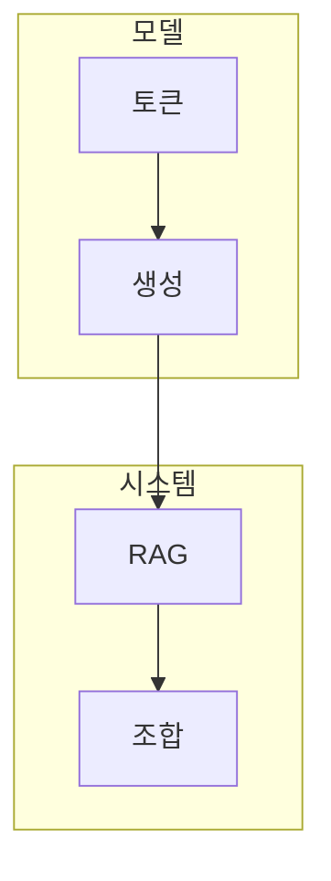

> [!abstract] 언어 모델의 토큰·문맥·생성 원리에서 API 계약, 검색 증강, 조합 가능한 실행 흐름까지를 검증 가능한 입출력 관점으로 학습한다.

## 학습 경로



## 학습 범위

```html preview
<div style="font-family:system-ui,sans-serif;padding:20px;color:var(--foreground)">
  <h3 style="margin:0 0 14px;font-size:15px;font-weight:600">현재 학습 경로의 노트 수</h3>
  <div id="bars" style="display:flex;align-items:flex-end;gap:14px;height:170px"></div>
  <script>
    var data = [['모델·API', 11], ['RAG·LangChain', 5]];
    var max = Math.max.apply(null, data.map(function (d) { return d[1]; }));
    document.getElementById('bars').innerHTML = data.map(function (d, i) {
      return '<div style="flex:1;display:flex;flex-direction:column;align-items:center;' +
        'gap:6px;height:100%;justify-content:flex-end">' +
        '<span style="font-size:12px;font-weight:600">' + d[1] + '</span>' +
        '<div style="width:100%;height:' + (d[1] / max * 100) + '%;' +
        'background:var(--chart-' + (i + 1) + ');' +
        'border-radius:var(--radius) var(--radius) 0 0"></div>' +
        '<span style="font-size:12px;color:var(--muted-foreground)">' + d[0] + '</span>' +
        '</div>';
    }).join('');
  </script>
</div>
```

> [!important] 인덱스의 경계
> 이 인덱스는 공개 학습 노트의 흐름과 실제 Markdown 경로만 제공한다. 원본 PDF·자산·페이지 근거는 포함하지 않는다.

## 모델과 API 노트

| # | 노트 | 다루는 것 |
| :-- | :-- | :-- |
| 04 | [LLM과 NLP의 발전](<./notes/OpenAI API 04. LLM과 NLP의 발전.md>) | 언어 처리 관점의 변화 |
| 16 | [LLM과 GPT 구조](<./notes/OpenAI API 16. LLM과 GPT 구조.md>) | 토큰·주의·다음 예측 |
| 27 | [ChatGPT 모델과 학습](<./notes/OpenAI API 27. ChatGPT 모델과 학습.md>) | 맥락·학습·평가 적응 |
| 44 | [API 요청과 모델 호환성](<./notes/OpenAI API 44. API 요청과 모델 호환성.md>) | 엔드포인트와 요청 계약 |
| 57 | [Chat Completion과 스트리밍](<./notes/OpenAI API 57. Chat Completion과 스트리밍.md>) | 역할·부분 응답·상태 |
| 67 | [텍스트 생성과 프롬프트](<./notes/OpenAI API 67. 텍스트 생성과 프롬프트.md>) | 목적·맥락·출력 계약 |
| 84 | [텍스트 편집과 이미지 생성](<./notes/OpenAI API 84. 텍스트 편집과 이미지 생성.md>) | 유지·변환·검수 |
| 106 | [Tokenizer와 Embedding](<./notes/OpenAI API 106. Tokenizer와 Embedding.md>) | 입력 단위와 의미 검색 |
| 116 | [오디오, Moderation, 추론](<notes/116.%20%ED%8C%8C%EC%9D%B8%ED%8A%9C%EB%8B%9D%20%EB%8D%B0%EC%9D%B4%ED%84%B0%C2%B7%EC%9E%91%EC%97%85%C2%B7%ED%95%9C%EA%B3%84.md>) | 작업별 검증 경계 |
| 128 | [Fine-Tuning](<./notes/OpenAI API 128. Fine-Tuning.md>) | 목표·데이터·평가 분리 |
| 139 | [개발환경과 키 관리](<./notes/OpenAI API 139. 개발환경과 키 관리.md>) | 비밀값·권한·운영 기록 |

## RAG와 LangChain 노트

| # | 노트 | 다루는 것 |
| :-- | :-- | :-- |
| 04 | [RAG의 원리와 파이프라인](<notes/04.%20RAG%EC%9D%98%20%EC%9B%90%EB%A6%AC%EC%99%80%20%EC%9D%B8%EB%8D%B1%EC%8B%B1.md>) | 검색과 생성의 연결 |
| 19 | [데이터 로드와 검색 최적화](<notes/19.%20%EA%B2%80%EC%83%89%20%EC%B5%9C%EC%A0%81%ED%99%94%EC%99%80%20LlamaIndex%C2%B7%EB%B2%A1%ED%84%B0%20%EC%A0%80%EC%9E%A5%EC%86%8C.md>) | 분할·검색·재정렬 |
| 51 | [LlamaIndex와 벡터 저장소](<notes/51.%20LangChain%20%EC%B2%B4%EC%9D%B8%C2%B7%EC%97%90%EC%9D%B4%EC%A0%84%ED%8A%B8%C2%B7%EB%A9%94%EB%AA%A8%EB%A6%AC%EC%99%80%20LCEL.md>) | 인덱스·벡터·메타데이터 |
| 82 | [LangChain 모듈과 에이전트](<notes/82.%20Few-shot%20%ED%94%84%EB%A1%AC%ED%94%84%ED%8A%B8%C2%B7%EB%AA%A8%EB%8D%B8%C2%B7%EC%B6%9C%EB%A0%A5%20%ED%8C%8C%EC%84%9C%EC%99%80%20%EB%8F%84%EA%B5%AC.md>) | 체인·에이전트·도구·추적 |
| 109 | [Runnable, LCEL, 프롬프트](<notes/109.%20%EA%B0%9C%EB%B0%9C%20%ED%99%98%EA%B2%BD%C2%B7API%20%ED%82%A4%EC%99%80%20%EB%B3%B4%EC%B6%A9%20%EC%82%AC%EB%A1%80.md>) | 입력·출력 계약의 조합 |

## 이 과목이 연결되는 곳

- **prerequisite** — 프로그래밍·데이터·확률 기초 : 요청·표현·평가의 바탕이 된다.
- **applies-to** — 검색 시스템·대화 서비스·에이전트 워크플로 : 언어 모델을 실제 입력·출력 흐름에 연결한다.

> [!question]- 학습 순서 점검
> **Q.** RAG를 학습하기 전에 먼저 이해해야 할 모델 개념은 무엇인가?
>
> **A.** 토큰·문맥·임베딩·생성 요청의 입력과 출력 구조다.
