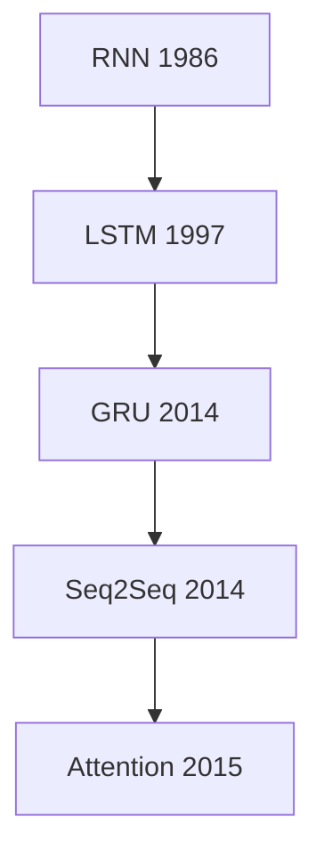
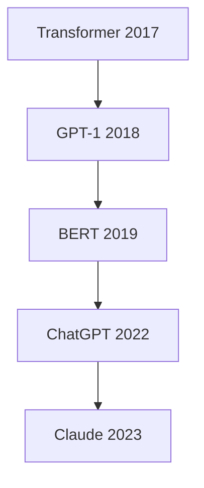
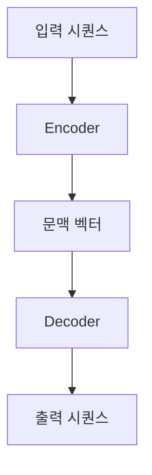
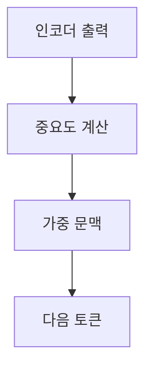

## NLP 처리에서 어텐션까지

> [!NOTE]
> 자연어 처리는 규칙과 통계 중심 접근에서 순환 신경망을 거쳐, 입력 전체에서 필요한 정보를 직접 골라 쓰는 Attention으로 발전했다.

이 구간의 핵심 질문은 두 가지다. 텍스트를 모델 입력으로 만들기까지 어떤 처리가 필요한가, 그리고 고정 길이 문맥 벡터의 정보 손실을 어떻게 줄이는가?

---

## 자연어 처리 관점의 이동

| 기술 | 원본의 정의 |
| :-- | :-- |
| n-gram | 연속된 단어 그룹을 바탕으로 확률을 계산하는 모델 |
| HMM | 관찰할 수 없는 상태와 관찰 가능한 데이터 사이의 확률 관계를 모델링 |
| RNN | 텍스트·음성·동영상 같은 순차 데이터를 처리하도록 설계된 신경망 |
| Seq2Seq | Encoder와 Decoder로 입력 시퀀스를 출력 시퀀스로 변환 |
| Attention | 입력 시퀀스에서 중요한 부분에 집중해 처리 성능을 높이는 구조 |
| Transformer | Attention으로 순차 계산을 줄이고 병렬 처리를 확대하는 아키텍처 |

### 순환 신경망에서 Attention까지

### Transformer 이후의 전개

> [!IMPORTANT]
> 정의 표는 각 기술이 무엇을 하는지, 타임라인은 원본이 제시한 주요 등장 시점을 담당한다.

---

## NLP 처리의 7단계

| 단계 | 처리 | 목적 |
| :-- | :-- | :-- |
| 1 | Cleaning | HTML 태그·특수 문자 등 불필요한 데이터와 노이즈 제거 |
| 2 | Tokenization | 텍스트를 모델이 다룰 작은 단위로 분할 |
| 3 | Normalization | 표기 변형을 줄여 데이터의 일관성 확보 |
| 4 | 품사 태깅 | 각 토큰에 명사·동사 등의 품사 부여 |
| 5 | Embedding | 토큰을 수치 벡터로 변환 |
| 6 | Training | 분류·번역 등 목표 작업의 패턴 학습 |
| 7 | 생성 및 분류 | 학습된 표현으로 결과 산출 |

정규화에 포함되는 세부 처리

- **어간 추출:** 접사를 제거해 기본 어간을 찾는다.
- **표제어 추출:** 단어를 사전에 등록된 표제어 형태로 바꾼다.
- **형태소 분석:** 단어를 형태소 단위로 나누어 구조를 파악한다.

---

## Seq2Seq의 기본 계약

**핵심:** 서로 길이가 다른 입력과 출력도 인코더와 디코더의 연결로 처리한다.

<Tabs>
  <Tab label="Encoder">

입력 시퀀스를 단계별로 읽어 고정 길이 문맥 벡터로 압축한다. 원문은 RNN, LSTM, GRU 계열을 대표 구현으로 제시한다.

  </Tab>
  <Tab label="Decoder">

문맥 벡터와 직전에 생성한 토큰을 이용해 다음 토큰을 반복 예측하고, 이를 이어 출력 시퀀스를 만든다.

  </Tab>
</Tabs>

---

## 고정 길이 벡터가 만드는 병목

> [!CAUTION]
> 초기 Seq2Seq는 모든 입력 정보를 마지막 문맥 벡터 하나에 집중한다. 입력이 길어질수록 앞부분의 정보가 약해지는 장기 의존성 문제가 커질 수 있다.

| 관찰 | 영향 | 필요한 변화 |
| :-- | :-- | :-- |
| 입력 전체를 하나의 벡터로 압축 | 긴 시퀀스의 정보 손실 | 디코더가 입력 위치를 다시 참조 |
| 마지막 인코더 상태에 의존 | 특정 단어의 영향 구분이 어려움 | 출력 시점마다 중요도 계산 |
| 같은 문맥 벡터를 반복 사용 | 생성 단계별 초점 변화 반영이 약함 | 동적인 문맥 벡터 구성 |

---

## Attention의 전환

Attention은 디코더가 출력 토큰을 만들 때 인코더의 모든 시점 출력을 참고하고, 현재 예측에 중요한 위치에 더 큰 비중을 두게 한다.

- 각 입력 위치에는 Attention Score가 계산된다.
- 원문은 점수에 Softmax를 적용한 가중치가 문맥 벡터에 반영된다고 설명한다.
- 출력 시점이 바뀌면 집중하는 입력 위치도 달라질 수 있다.

---

## Attention의 세 가지 관점

<Tabs>
  <Tab label="Supervised">

주석이나 레이블이 있는 학습 데이터를 이용해 어떤 부분에 집중해야 하는지 학습한다.

  </Tab>
  <Tab label="Multi-head">

여러 헤드가 입력의 서로 다른 측면에 동시에 집중한다. 각 헤드의 표현을 결합해 더 다양한 관계를 포착한다.

  </Tab>
  <Tab label="Self-Attention">

한 시퀀스 안의 각 위치가 다른 모든 위치와 어떻게 상호 작용하는지 모델링한다.

  </Tab>
</Tabs>

---

## 원본 해석 경계

> [!WARNING]
> 첫 세 장은 추출 텍스트가 매우 적어 제목과 목차 수준으로만 확인된다. 또한 원본의 연대표는 일부 기술과 제품을 한 축에 함께 배치하므로, 엄밀한 계보보다 강의의 발전 방향을 보여 주는 도식으로 읽어야 한다.

원본에 포함된 외부 사례의 범위

원본은 ChatGPT, Claude, Perplexity를 생성 AI 사례로 열거한다. 이 노트에서는 제품별 현재 기능을 확장하지 않고, 자연어 처리 기술이 텍스트 생성·검색·대화로 확장되었다는 원본의 맥락만 유지한다.

---

## 정리

| 핵심 개념 | 의미 | 다음 단계 |
| :-- | :-- | :-- |
| NLP 처리 과정 | 정제부터 생성·분류까지 이어지는 준비와 학습 절차 | 각 단계의 입력·출력 확인 |
| Seq2Seq | 인코더와 디코더로 서로 다른 길이의 시퀀스를 변환 | 문맥 벡터 병목 점검 |
| Attention | 출력 시점마다 중요한 입력 위치를 선택 | 전체 토큰 관계 학습 |
| Multi-head | 여러 관점의 Attention을 병렬로 학습 | Transformer 구조로 확장 |
