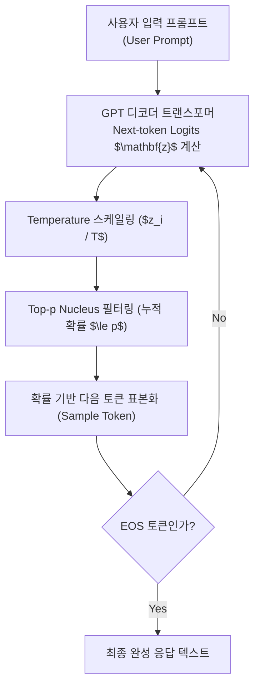

> [!abstract] 핵심 요약
> **거대언어모델(LLM, Large Language Model)**은 수천억 개의 텍스트 토큰을 사전자습(Pre-training)하여 다음 토큰의 조건부 확률 $P(w_t \mid w_1, \dots, w_{t-1})$을 예측하는 자기회귀(Autoregressive) 신경망이다.
> OpenAI Chat Completion API는 `system`, `user`, `assistant`의 3중 페르소나 역할을 통해 지시를 수행하며, **Temperature($T$)**를 통한 소프트맥스 로짓 스케일링($z_i / T$)과 누적 확률 상위 $p$만을 선택하는 **Top-p 핵 샘플링**으로 생성문의 창의성과 결정론적 정확도를 정밀하게 제어한다.

---

## 1. Softmax Temperature 로짓 변환 수식

$$P(y_i \mid \mathbf{z}, T) = \frac{\exp(z_i / T)}{\sum_j \exp(z_j / T)}$$

- **$T \to 0$ (Argmax 결정론적 탐욕 탐색 Greedy Search)**: 가장 로짓이 높은 1개 토큰의 확률이 1.0으로 수렴하여 항상 동일한 답변 생성 (수학, 코딩, 사실 기반 질의에 적합).
- **$T > 1.0$ (확률 분포 균일화 Softening)**: 로짓 간의 차이가 완화되어 저확률 토큰이 선택될 가능성이 증가 (창의적 글쓰기, 브레인스토밍에 적합).



---

## 2. 생성 제어 하이퍼파라미터 비교

| 파라미터 | 기본값 | 범위 | 물리적 작동 원리 및 권장 사용처 |
| :-- | :-- | :-- | :-- |
| `temperature` | 1.0 | $0.0 \sim 2.0$ | 로짓 스케일링. 사실적 질의는 $0.0 \sim 0.2$, 창의적 작문은 $0.7 \sim 1.2$ |
| `top_p` | 1.0 | $0.0 \sim 1.0$ | 누적 확률 상위 $p$ 비율 토큰만 후보군으로 유지 (Temperature와 동시 수정 비권장) |
| `frequency_penalty` | 0.0 | $-2.0 \sim 2.0$ | 이미 생성된 토큰의 **등장 빈도 수에 비례하여 로짓 차감** (단어 반복 절대 억제) |
| `presence_penalty` | 0.0 | $-2.0 \sim 2.0$ | 텍스트에 한 번이라도 등장했는지 여부에 따라 **고정값 로짓 차감** (새로운 주제 전환 촉진) |

---

## 3. 실시간 LLM Temperature & Top-p 확률 분포 시뮬레이터

```html preview
<div style="font-family:system-ui,-apple-system,sans-serif;padding:20px;background:var(--card);color:var(--card-foreground);border:1px solid var(--border);border-radius:var(--radius)">
  <div style="font-size:16px;font-weight:700;margin-bottom:14px;color:var(--primary);display:flex;align-items:center;gap:8px">
    <span>🎛️ LLM 생성 파라미터(Temperature & Top-p) 실시간 확률 분포기</span>
  </div>

  <div style="display:grid;grid-template-columns:1fr 1fr;gap:12px;margin-bottom:14px">
    <div>
      <div style="display:flex;justify-content:space-between;font-size:11px;color:var(--muted-foreground)">
        <span>Temperature (온도 T):</span>
        <span id="llmTempVal" style="font-weight:700;color:var(--primary)">T = 0.70</span>
      </div>
      <input id="inLlmTemp" type="range" min="0.1" max="2.0" step="0.1" value="0.7" style="width:100%" />
    </div>
    <div>
      <div style="display:flex;justify-content:space-between;font-size:11px;color:var(--muted-foreground)">
        <span>Top-p (핵 샘플링 Nucleus):</span>
        <span id="llmTopPVal" style="font-weight:700;color:var(--chart-1)">p = 0.90</span>
      </div>
      <input id="inLlmTopP" type="range" min="0.1" max="1.0" step="0.05" value="0.9" style="width:100%" />
    </div>
  </div>

  <div style="padding:10px;background:var(--background);border:1px solid var(--border);border-radius:var(--radius);margin-bottom:12px">
    <div style="font-size:10px;color:var(--muted-foreground);margin-bottom:6px">후보 단어 로짓 [A: 3.0, B: 2.0, C: 1.0, D: 0.2] 샘플링 확률:</div>
    <div id="llmTokenProbs" style="font-family:monospace;font-size:12px;line-height:1.8">
      • Token "AI" (Logit 3.0): <b>65.2%</b> [██████░░░░]<br/>
      • Token "Data" (Logit 2.0): <b>24.0%</b> [██░░░░░░░░]<br/>
      • Token "Model" (Logit 1.0): <b>8.8%</b> [█░░░░░░░░░]<br/>
      • Token "Code" (Logit 0.2): <b>2.0%</b> [░░░░░░░░░░]
    </div>
  </div>

  <div id="llmParamDesc" style="padding:10px;background:var(--background);border:1px solid var(--border);border-radius:var(--radius);font-size:11px">
    T=0.7로 적당한 창의성과 문맥 일관성을 유지하며 최상위 토큰 "AI"가 65% 확률로 우세하게 선택됩니다.
  </div>

  <script>
    function updateLlmParams() {
      var t = parseFloat(document.getElementById('inLlmTemp').value);
      var p = parseFloat(document.getElementById('inLlmTopP').value);
      document.getElementById('llmTempVal').textContent = "T = " + t.toFixed(2);
      document.getElementById('llmTopPVal').textContent = "p = " + p.toFixed(2);

      var logits = [3.0, 2.0, 1.0, 0.2];
      var names = ['"AI"', '"Data"', '"Model"', '"Code"'];

      var expZ = logits.map(function(z) { return Math.exp(z / t); });
      var sumExp = expZ.reduce(function(a, b) { return a + b; }, 0);
      var probs = expZ.map(function(e) { return e / sumExp; });

      var html = "";
      var cum = 0;
      for (var i = 0; i < probs.length; i++) {
        cum += probs[i];
        var isIncluded = cum <= p + probs[i] * 0.99;
        var pPct = (probs[i] * 100).toFixed(1);
        var bars = "█".repeat(Math.round(probs[i] * 10)) + "░".repeat(10 - Math.round(probs[i] * 10));
        html += "• Token " + names[i] + " (Logit " + logits[i] + "): <b>" + pPct + "%</b> [" + bars + "] " + (isIncluded ? "" : "<span style='color:var(--destructive,#ef4444);font-size:10px'>[Top-p 탈락]</span>") + "<br/>";
      }
      document.getElementById('llmTokenProbs').innerHTML = html;

      if (t <= 0.2) {
        document.getElementById('llmParamDesc').innerHTML = "🔒 <b>[결정론적 모드]</b> 거의 Argmax 탐욕 탐색처럼 작동하여 항상 가장 높은 로짓의 토큰만 반복 출력합니다.";
      } else if (t >= 1.5) {
        document.getElementById('llmParamDesc').innerHTML = "🎲 <b>[높은 무작위성]</b> 모든 단어의 확률이 고르게 퍼져 기발하지만 환각(Hallucination) 위험이 커집니다.";
      } else {
        document.getElementById('llmParamDesc').textContent = "균형 잡힌 대화형 생성 모드입니다.";
      }
    }

    ['inLlmTemp', 'inLlmTopP'].forEach(function(id) {
      document.getElementById(id).addEventListener('input', updateLlmParams);
    });
    updateLlmParams();
  </script>
</div>
```
