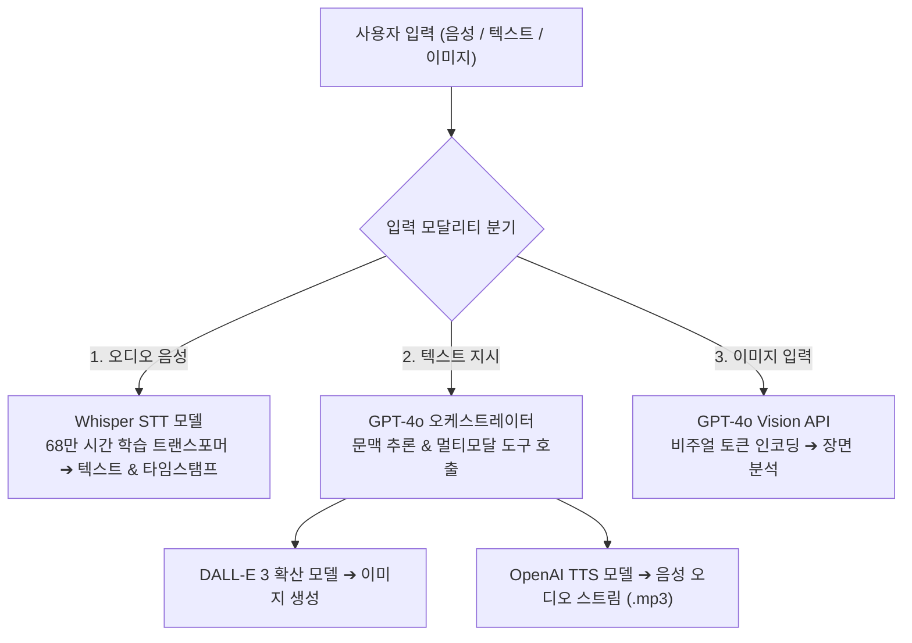

> [!abstract] 핵심 요약
> 현대 생성형 AI는 텍스트 LLM에 국한되지 않고 시각 및 음성 신호를 자유롭게 넘나드는 **멀티모달(Multimodal) 인공지능**으로 진화했다.
> **DALL-E 3**는 LLM 프롬프트 리라이팅(Rewriting)과 확산 모델(Diffusion)을 결합하여 복잡한 지시를 완벽히 반영하는 고화질 이미지를 생성하며, **Whisper**는 68만 시간의 방대한 다국어 오디오 데이터셋으로 사전학습된 인코더-디코더 트랜스포머 구조로 주변 소음과 방언에 강건한 음성 인식을 실현한다.

---

## 1. OpenAI 멀티모달 API 아키텍처 워크플로



---

## 2. DALL-E vs Whisper vs TTS API 사양 비교

| API 모델 | 입력 (Input) | 출력 (Output) | 주요 옵션 및 파라미터 |
| :-- | :-- | :-- | :-- |
| **DALL-E 3** | Text Prompt (자동 개선) | High-Res PNG/URL ($1024 \times 1024$, $1792 \times 1024$) | `quality: "hd"`, `style: "vivid" \| "natural"` |
| **Whisper-1** | Audio File (mp3, wav, m4a $\le 25\text{MB}$) | Transcribed Text / SRT 자막 | `response_format: "verbose_json"`, `temperature` |
| **TTS-1 / TTS-1-HD** | Raw Text ($\le 4096$ chars) | Audio Stream (mp3, opus, aac, flac) | `voice: "alloy" \| "echo" \| "fable" \| "onyx"`, `speed` |

---

## 3. 실시간 멀티모달 파이프라인 인터랙티브 시뮬레이터

```html preview
<div style="font-family:system-ui,-apple-system,sans-serif;padding:20px;background:var(--card);color:var(--card-foreground);border:1px solid var(--border);border-radius:var(--radius)">
  <div style="font-size:16px;font-weight:700;margin-bottom:14px;color:var(--primary);display:flex;align-items:center;gap:8px">
    <span>🎙️ 멀티모달 AI 엔드투엔드 처리 파이프라인 시뮬레이터</span>
  </div>

  <div style="display:flex;gap:10px;align-items:center;margin-bottom:14px">
    <label style="font-size:12px;font-weight:700">시나리오 선택:</label>
    <select id="multiModeSelect" style="padding:4px 8px;background:var(--background);color:var(--foreground);border:1px solid var(--border);border-radius:var(--radius);font-weight:700">
      <option value="voice_to_img">1. 음성 명령 ➔ DALL-E 3 이미지 생성 (Whisper + DALL-E)</option>
      <option value="text_to_speech">2. LLM 요약 ➔ 자연스러운 한국어 음성 낭독 (GPT + TTS)</option>
    </select>
  </div>

  <div style="display:grid;grid-template-columns:1fr 1fr;gap:12px;margin-bottom:12px">
    <div style="padding:10px;background:var(--background);border:1px solid var(--border);border-radius:var(--radius)">
      <div style="font-size:10px;color:var(--muted-foreground)">1단계: 입력 신호 처리</div>
      <div id="step1Out" style="font-family:monospace;font-size:12px;font-weight:700;margin-top:4px;color:var(--primary)">🎙️ Whisper STT: "미래 도시를 그려줘"</div>
    </div>
    <div style="padding:10px;background:var(--background);border:1px solid var(--border);border-radius:var(--radius)">
      <div style="font-size:10px;color:var(--muted-foreground)">2단계: 멀티모달 생성 결과</div>
      <div id="step2Out" style="font-family:monospace;font-size:12px;font-weight:700;margin-top:4px;color:var(--chart-1)">🎨 DALL-E 3: 사이버펑크 네온 도시 1024x1024 PNG</div>
    </div>
  </div>

  <script>
    document.getElementById('multiModeSelect').onchange = function() {
      var m = this.value;
      if (m === 'voice_to_img') {
        document.getElementById('step1Out').innerHTML = "🎙️ <b>Whisper STT:</b> 음성 파일 디코딩 ➔ '미래 도시를 그려줘'";
        document.getElementById('step2Out').innerHTML = "🎨 <b>DALL-E 3:</b> 프롬프트 자동 확장 ➔ 1024x1024 초고화질 렌더링";
      } else {
        document.getElementById('step1Out').innerHTML = "🤖 <b>GPT-4o:</b> 텍스트 핵심 요약문 생성 완료";
        document.getElementById('step2Out').innerHTML = "🔊 <b>TTS-1:</b> 'Alloy' 음색으로 24kHz 오디오 스트리밍";
      }
    };
  </script>
</div>
```
