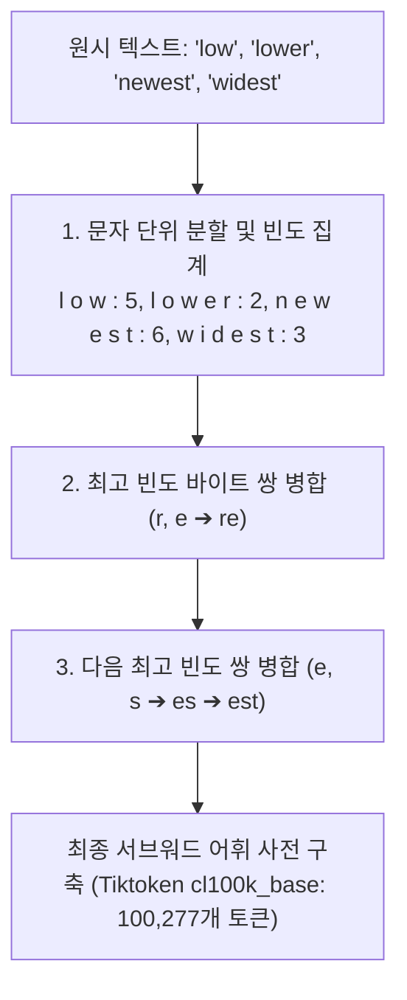

> [!abstract] 핵심 요약
> 거대언어모델의 모든 연산은 문자열이 아닌 **토큰 ID 정수 시퀀스**와 이를 수치화한 **고차원 밀집 임베딩 벡터($\mathbb{R}^d$)** 위에서 수행된다.
> 서브워드(Subword) 분절 알고리즘인 **BPE(Byte Pair Encoding)**를 통해 미등록어(OOV) 문제를 완벽히 해결하며, `text-embedding-3-small` (1536차원) 등으로 생성된 의미 벡터는 **Faiss**의 역파일 색인(IVFFlat)과 Voronoi 클러스터링을 통해 수억 건의 데이터베이스에서도 밀리초 단위로 최근접 이웃(k-NN) 검색을 수행할 수 있다.

---

## 1. BPE(Byte Pair Encoding) 토큰화 알고리즘 동작 원리



---

## 2. Faiss 벡터 인덱스 유형 비교

| 인덱스 명칭 | 수학적 탐색 방식 | 검색 속도 | 메모리 사용량 | 정확도 (Recall) |
| :-- | :-- | :-- | :-- | :-- |
| **IndexFlatL2** | $O(N \cdot d)$ 전수 조사 (Exhaustive Brute-force) | 느림 ($N$ 증가 시 선형 비례) | 기준치 (무압축) | **100% (정확한 1등 보장)** |
| **IndexIVFFlat** | $k$-Means Voronoi 셀 분할 ➔ 인접 셀만 탐색 | **매우 빠름 ($O(nprobe \cdot N/k)$)** | 기준치 + 인덱스 오버헤드 | $95 \sim 99\%$ (근사 ANN) |
| **IndexIVFPQ** | 곱 양자화 (Product Quantization) 서브벡터 압축 | **초고속** | **1/4 ~ 1/16로 극적 절감** | $85 \sim 95\%$ (메모리 제약 환경) |

---

## 3. 실시간 Faiss Voronoi 클러스터링 기반 벡터 검색 시뮬레이터

```html preview
<div style="font-family:system-ui,-apple-system,sans-serif;padding:20px;background:var(--card);color:var(--card-foreground);border:1px solid var(--border);border-radius:var(--radius)">
  <div style="font-size:16px;font-weight:700;margin-bottom:14px;color:var(--primary);display:flex;align-items:center;gap:8px">
    <span>⚡ Faiss 고차원 벡터 밀집 검색(Dense Retrieval) 시뮬레이터</span>
  </div>

  <div style="display:flex;gap:10px;align-items:center;margin-bottom:14px">
    <label style="font-size:12px;font-weight:700">Faiss 인덱스 구조:</label>
    <select id="faissTypeSelect" style="padding:4px 8px;background:var(--background);color:var(--foreground);border:1px solid var(--border);border-radius:var(--radius);font-weight:700">
      <option value="flat">IndexFlatL2 (전수 브루트포스 검색)</option>
      <option value="ivf">IndexIVFFlat (Voronoi 100개 클러스터 nprobe=4)</option>
    </select>
  </div>

  <div style="display:grid;grid-template-columns:repeat(3, 1fr);gap:10px;margin-bottom:12px">
    <div style="padding:10px;background:var(--background);border:1px solid var(--border);border-radius:var(--radius);text-align:center">
      <div style="font-size:10px;color:var(--muted-foreground)">검색 대상 벡터 수</div>
      <div style="font-family:monospace;font-size:14px;font-weight:800">1,000,000 건</div>
    </div>
    <div style="padding:10px;background:var(--background);border:1px solid var(--border);border-radius:var(--radius);text-align:center">
      <div style="font-size:10px;color:var(--muted-foreground)">비교 연산 횟수</div>
      <div id="faissOpsOut" style="font-family:monospace;font-size:14px;font-weight:800;color:var(--primary)">1,000,000 회</div>
    </div>
    <div style="padding:10px;background:var(--background);border:1px solid var(--border);border-radius:var(--radius);text-align:center">
      <div style="font-size:10px;color:var(--muted-foreground)">쿼리 지연 시간 (Latency)</div>
      <div id="faissLatOut" style="font-family:monospace;font-size:14px;font-weight:800;color:var(--destructive,#ef4444)">45.0 ms</div>
    </div>
  </div>

  <div id="faissDesc" style="padding:10px;background:var(--background);border:1px solid var(--border);border-radius:var(--radius);font-size:11px">
    IndexFlatL2: 백만 개의 1536차원 벡터를 모두 유클리디안 거리로 전수 조사하여 완벽한 정확도를 제공하나 속도가 느립니다.
  </div>

  <script>
    document.getElementById('faissTypeSelect').onchange = function() {
      var t = this.value;
      if (t === 'flat') {
        document.getElementById('faissOpsOut').textContent = "1,000,000 회";
        document.getElementById('faissLatOut').textContent = "45.0 ms";
        document.getElementById('faissLatOut').style.color = "var(--destructive,#ef4444)";
        document.getElementById('faissDesc').textContent = "IndexFlatL2: 백만 개 벡터를 전수 조사하여 100% 정확한 이웃을 찾습니다.";
      } else {
        document.getElementById('faissOpsOut').textContent = "40,000 회 (96% 절감!)";
        document.getElementById('faissLatOut').textContent = "1.8 ms (25배 가속)";
        document.getElementById('faissLatOut').style.color = "var(--primary)";
        document.getElementById('faissDesc').innerHTML = "✨ <b>[IndexIVFFlat]</b> 쿼리 벡터가 속한 인접 4개 보로노이 셀 내부의 4만 개 벡터만 선별 검사하여 1.8ms 만에 검색을 완료합니다.";
      }
    };
  </script>
</div>
```
