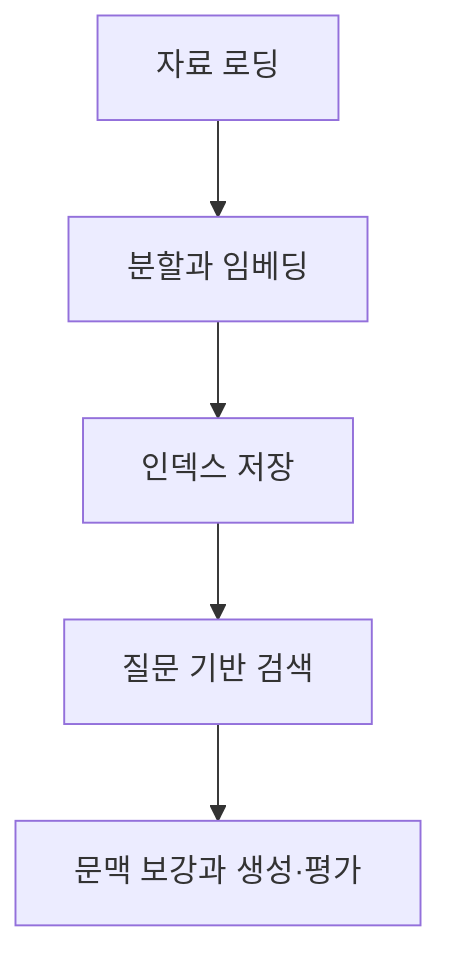

## RAG의 원리와 인덱싱

> [!NOTE]
> RAG는 모델의 지식을 다시 학습시키는 대신, 질문과 관련된 외부 자료를 찾아 생성 입력에 결합한다. 핵심은 **검색 가능한 지식 구조**와 **근거를 반영하는 생성 절차**를 함께 설계하는 것이다.

---

## 왜 외부 지식이 필요한가

| 생성 모델의 한계 | RAG의 대응 |
| --- | --- |
| 학습 시점에 지식이 고정됨 | 외부 저장소에서 최신 자료를 검색 |
| 전문 영역의 깊이가 부족함 | 도메인 자료를 별도 지식원으로 연결 |
| 사용자 상황을 충분히 반영하기 어려움 | 질문과 직접 관련된 문맥을 선별 |
| 사실처럼 보이는 잘못된 답을 만들 수 있음 | 검색 문서를 근거로 응답을 구성 |

<Tabs>
  <Tab label="생성 모델">매개변수에 저장된 일반 지식으로 답하며, 최신성이나 조직 내부 자료 접근에는 한계가 있다.</Tab>
  <Tab label="RAG">질문마다 외부 문서를 검색해 문맥을 추가하므로 지식 갱신과 근거 제시가 비교적 쉽다.</Tab>
</Tabs>

---

## 전체 파이프라인



- **로딩**: 텍스트, PDF, 웹, 데이터베이스, API 등에서 자료를 가져온다.
- **인덱싱**: 작은 단위로 분할하고 의미를 벡터로 표현한다.
- **저장**: 임베딩과 출처·시간 같은 메타데이터를 재사용 가능한 저장소에 둔다.
- **질의와 평가**: 관련 문서를 찾고 정확성·충실도·속도를 점검한다.

---

## 로더와 문서 객체

| 로더 | 적합한 입력 |
| --- | --- |
| WebBaseLoader | 웹페이지와 웹 기반 API |
| TextLoader·DirectoryLoader | 단일 텍스트와 여러 파일 |
| CSVLoader | 행과 열로 구성된 표 데이터 |
| PyPDFLoader·PyMuPDFLoader | 일반 PDF 텍스트 |
| UnstructuredPDFLoader | 레이아웃이 복잡한 PDF |
| OnlinePDFLoader·PyPDFDirectoryLoader | 웹 PDF 또는 디렉터리의 여러 PDF |

로더의 결과는 본문과 메타데이터를 가진 문서 객체이며, 이후 분할 단계의 입력이 된다.

<details>
<summary>웹 문서를 불러오는 최소 흐름</summary>

```python
from langchain_community.document_loaders import WebBaseLoader

loader = WebBaseLoader("웹 문서 주소")
docs = loader.load()
print(len(docs))
print(docs[0].page_content[:500])
```

</details>

---

## 텍스트를 왜 나누는가

LLM 입력 한계와 검색 정밀도를 함께 고려해야 한다. 너무 큰 청크는 여러 주제를 섞고, 너무 작은 청크는 문맥을 끊는다.

| 방식 | 특징 |
| --- | --- |
| CharacterTextSplitter | 문자 수를 기준으로 분할 |
| RecursiveCharacterTextSplitter | 문맥 보존을 시도하며 재귀적으로 분할 |
| Sentence·Paragraph splitter | 문장 또는 단락 경계 활용 |
| SlidingWindowTextSplitter | 겹치는 창으로 연속성 유지 |
| FixedSizeTextSplitter | 일정 길이 블록을 일관되게 생성 |

---

## 청크와 중첩의 예

```html preview
<div style="font-family:system-ui,sans-serif;padding:20px;display:flex;align-items:center;gap:20px;color:var(--foreground)">
  <svg width="120" height="120" viewBox="0 0 120 120" role="img" aria-label="20 percent overlap">
    <circle cx="60" cy="60" r="46" stroke-width="14" style="fill: none; stroke: var(--border)" />
    <circle cx="60" cy="60" r="46" stroke-width="14"
      stroke-linecap="round" stroke-dasharray="289" stroke-dashoffset="231.2"
      transform="rotate(-90 60 60)" style="fill: none; stroke: var(--chart-1)" />
    <text x="60" y="67" text-anchor="middle" font-size="22" font-weight="700"
      style="fill: var(--foreground)">20%</text>
  </svg>
  <div>
    <div style="font-weight:600;font-size:15px">청크 중첩 비율</div>
    <div style="font-size:13px;color:var(--muted-foreground);margin-top:2px">1000자 중 200자를 다음 청크와 공유</div>
  </div>
</div>
```

이 예는 청크 크기 1,000자와 중첩 200자를 사용한다. 별도 최적화 지침은 약 2,000~3,000자와 약 500자 중첩을 제안하므로, 두 값은 고정 규칙이 아니라 서로 다른 설정 예로 구분한다.

<details>
<summary>재귀 분할 예시</summary>

```python
from langchain.text_splitter import RecursiveCharacterTextSplitter

splitter = RecursiveCharacterTextSplitter(
    chunk_size=1000,
    chunk_overlap=200,
)
splits = splitter.split_documents(docs)
```

</details>

---

## 임베딩과 벡터 저장소

| 단계 | 산출물 | 설계 질문 |
| --- | --- | --- |
| 임베딩 생성 | 텍스트 의미를 담은 벡터 | 어떤 모델과 언어 범위를 쓸 것인가 |
| 메타데이터 부착 | 출처·시간·문서 구분 | 검색 후 근거를 추적할 수 있는가 |
| 벡터 저장 | 검색 가능한 인덱스 | 재사용·갱신·대량 처리가 가능한가 |
| 유사도 검색 | 관련 문서 후보 | 질문과 문서의 의미가 충분히 가까운가 |

OpenAI, Hugging Face, spaCy 계열 임베딩이 예시로 제시된다. 자료는 특정 임베딩 모델에서 1,536차원을 대표 설정으로 설명하지만, 이는 모델별 속성으로 읽어야 한다.

---

## 인덱싱의 실행 흐름

```python
from langchain_community.vectorstores import Chroma
from langchain_openai import OpenAIEmbeddings

vectorstore = Chroma.from_documents(
    documents=splits,
    embedding=OpenAIEmbeddings(),
)
docs = vectorstore.similarity_search("질문을 입력하세요")
```

인덱싱 품질은 청크 크기만으로 결정되지 않는다.

- 노이즈 제거와 포맷 정규화
- 출처·시간 메타데이터
- 임베딩 모델과 차원
- 대규모 입력의 배치 처리

---

## 검색·보강·생성

| 단계 | 동작 |
| --- | --- |
| Retrieval | 질문을 표현하고 유사도 검색, TF-IDF, BM25, dense vector search 등으로 후보를 찾음 |
| Augmentation | 검색 결과를 질문과 함께 모델 입력 문맥에 배치 |
| Generation | 검색 문맥을 참고해 자연어 응답을 생성 |
| Evaluation | 응답의 정확성·충실도·속도와 근거 적합성을 확인 |

검색 결과를 그대로 복사하는 것이 아니라, 질문과 근거 문서를 함께 해석하는 것이 목표다.

---

## 적용 장면

| 분야 | 외부 지식 | 기대 결과 |
| --- | --- | --- |
| 사내 지식 관리 | 정책·업무 절차·내부 문서 | 직원 질의에 최신 근거 제공 |
| 의료 의사결정 | 연구 결과·환자 기록 | 관련 연구와 유사 사례 제시 |
| 금융 자문 | 시장 데이터·개인 재무 정보 | 상황에 맞춘 분석 보조 |
| 고객 서비스 | 제품 정보·FAQ·고객 이력 | 정확하고 맥락화된 응대 |

---

## RAG와 미세 조정의 구분

- **미세 조정**은 모델 자체의 행동이나 도메인 패턴을 학습시킨다.
- **RAG**는 질문 시점에 외부 지식을 찾아 모델이 참고하게 한다.
- RAG는 별도의 재학습 없이 자료를 갱신하고 근거를 제시하기 쉽다.
- 두 방법은 배타적 선택이 아니라, 행동 적응과 지식 검색이라는 서로 다른 문제를 맡을 수 있다.

> [!WARNING]
> 원문 코드에는 URL 줄바꿈과 메타데이터 속성 철자 오류가 있다. 또한 특정 임베딩 모델명과 차원 설명은 작성 시점에 묶인 정보이므로 현재의 일반 표준처럼 확대 해석하지 않는다.

---

## 핵심 정리

1. RAG는 검색과 생성을 결합해 최신성·전문성·근거성을 보강한다.
2. 지식 구축은 로딩, 분할, 임베딩, 저장의 순서로 진행한다.
3. 실행 시 질문을 검색 표현으로 바꾸고 관련 문맥을 생성 입력에 추가한다.
4. 청크·중첩·임베딩 설정은 데이터와 평가 결과에 맞춰 조정한다.
