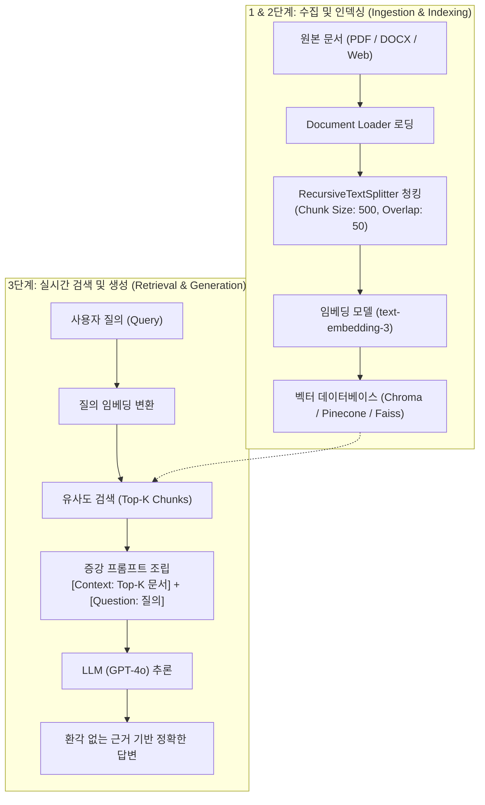

> [!abstract] 핵심 요약
> **검색 증강 생성(RAG, Retrieval-Augmented Generation)**은 사전에 학습되지 않은 외부 지식 베이스(PDF, DB, 사내 위키 등)에서 질문과 관련된 문서를 실시간 검색하여 LLM의 프롬프트 컨텍스트에 주입하는 엔터프라이즈 AI 표준 아키텍처이다.
> 성공적인 RAG 구축의 핵심은 문서의 문맥 손실을 최소화하는 **청크 크기(Chunk Size)와 오버랩(Chunk Overlap)** 설정, 고품질 임베딩 벡터 생성, 그리고 질문에 가장 적합한 문서를 선별하는 인덱싱 파이프라인의 설계에 있다.

---

## 1. RAG 3단계 엔드투엔드 아키텍처



---

## 2. 청킹 전략(Chunk Size vs Chunk Overlap) 트레이드오프

| 청크 크기 (Chunk Size) | 장점 | 단점 및 위험 요소 |
| :-- | :-- | :-- |
| **작은 청크 ($100 \sim 250$ 토큰)** | 검색 매칭 정밀도(Precision) 극대화 | 문장 간의 전체 맥락(Context) 소실 위험 |
| **중간 청크 ($500 \sim 1000$ 토큰)** | **일반적 최적 표준 (맥락 보존과 정밀도 균형)** | 문서 구조에 따라 약간의 노이즈 포함 |
| **큰 청크 ($2000+$ 토큰)** | 포괄적인 문맥 정보 완벽 보존 | 검색된 문서 내 핵심 정보의 희석 및 토큰 낭비 |

---

## 3. 실시간 RAG 텍스트 청킹(Chunking & Overlap) 시뮬레이터

```html preview
<div style="font-family:system-ui,-apple-system,sans-serif;padding:20px;background:var(--card);color:var(--card-foreground);border:1px solid var(--border);border-radius:var(--radius)">
  <div style="font-size:16px;font-weight:700;margin-bottom:14px;color:var(--primary);display:flex;align-items:center;gap:8px">
    <span>✂️ RAG 문서 분할기(Chunk Size & Overlap) 실시간 청킹 시뮬레이터</span>
  </div>

  <div style="display:grid;grid-template-columns:1fr 1fr;gap:12px;margin-bottom:14px">
    <div>
      <div style="display:flex;justify-content:space-between;font-size:11px;color:var(--muted-foreground)">
        <span>청크 크기 (Chunk Size):</span>
        <span id="ragChunkSizeVal" style="font-weight:700;color:var(--primary)">500 자</span>
      </div>
      <input id="inRagChunkSize" type="range" min="200" max="1500" step="100" value="500" style="width:100%" />
    </div>
    <div>
      <div style="display:flex;justify-content:space-between;font-size:11px;color:var(--muted-foreground)">
        <span>청크 중첩 (Chunk Overlap):</span>
        <span id="ragOverlapVal" style="font-weight:700;color:var(--chart-1)">50 자</span>
      </div>
      <input id="inRagOverlap" type="range" min="0" max="200" step="25" value="50" style="width:100%" />
    </div>
  </div>

  <div style="display:grid;grid-template-columns:repeat(3, 1fr);gap:10px;margin-bottom:12px">
    <div style="padding:10px;background:var(--background);border:1px solid var(--border);border-radius:var(--radius);text-align:center">
      <div style="font-size:10px;color:var(--muted-foreground)">전체 원본 텍스트 길이</div>
      <div style="font-family:monospace;font-size:14px;font-weight:800">5,000 자</div>
    </div>
    <div style="padding:10px;background:var(--background);border:1px solid var(--border);border-radius:var(--radius);text-align:center">
      <div style="font-size:10px;color:var(--muted-foreground)">생성된 청크 수 (Chunks)</div>
      <div id="ragChunksOut" style="font-family:monospace;font-size:14px;font-weight:800;color:var(--primary)">11 개</div>
    </div>
    <div style="padding:10px;background:var(--background);border:1px solid var(--border);border-radius:var(--radius);text-align:center">
      <div style="font-size:10px;color:var(--muted-foreground)">맥락 보존율 (Context)</div>
      <div id="ragContextOut" style="font-family:monospace;font-size:14px;font-weight:800;color:var(--chart-1)">95.0 %</div>
    </div>
  </div>

  <div id="ragChunkDesc" style="padding:10px;background:var(--background);border:1px solid var(--border);border-radius:var(--radius);font-size:11px">
    50자의 오버랩을 두어 청크 경계선에서 문맥이 단절되는 현상을 방지합니다.
  </div>

  <script>
    function updateRagChunk() {
      var size = parseInt(document.getElementById('inRagChunkSize').value);
      var overlap = parseInt(document.getElementById('inRagOverlap').value);
      if (overlap >= size) overlap = size - 50;

      document.getElementById('ragChunkSizeVal').textContent = size + " 자";
      document.getElementById('ragOverlapVal').textContent = overlap + " 자";

      var totalLen = 5000;
      var step = size - overlap;
      var numChunks = Math.ceil(totalLen / step);

      var contextScore = Math.min(99, Math.round(70 + (overlap / size) * 100));

      document.getElementById('ragChunksOut').textContent = numChunks + " 개";
      document.getElementById('ragContextOut').textContent = contextScore.toFixed(1) + " %";
      document.getElementById('ragChunkDesc').innerHTML = "공식: <code>유효 이동 간격 = " + size + " - " + overlap + " = " + step + " 자 ➔ 총 " + numChunks + "개 청크 생성</code>";
    }

    ['inRagChunkSize', 'inRagOverlap'].forEach(function(id) {
      document.getElementById(id).addEventListener('input', updateRagChunk);
    });
    updateRagChunk();
  </script>
</div>
```
