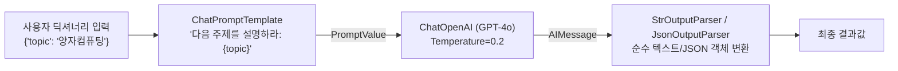

> [!abstract] 핵심 요약
> **LangChain**은 파편화된 LLM 호출 코드를 체계적인 컴포넌트로 추상화하는 오케스트레이션 프레임워크이다.
> **LCEL(LangChain Expression Language)**은 유닉스 파이프 연산자(`|`)를 통해 `Prompt ➔ LLM ➔ OutputParser` 흐름을 선언적으로 결합하며, 내장된 **Runnable 인터페이스** 덕분에 코드 수정 없이 동기/비동기 호출(`invoke`/`ainvoke`), 스트리밍(`stream`), 배치 병렬 처리(`batch`) 및 LangSmith 추적을 기본 지원한다.

---

## 1. LCEL 표준 파이프라인 아키텍처



---

## 2. Runnable 4대 표준 메서드

| 메서드 | 실행 방식 | 사용 목적 및 특징 |
| :-- | :-- | :-- |
| `invoke(input)` | 동기 단일 호출 | 단일 요청에 대한 즉각적인 전체 응답 반환 |
| `stream(input)` | **실시간 토큰 스트리밍** | 토큰이 생성되는 즉시 청크 단위로 웹 UI에 실시간 출력 |
| `batch([inputs])` | **병렬 일괄 배치 처리** | 여러 개의 입력을 멀티스레드로 동시 처리하여 처리량 극대화 |
| `ainvoke / astream` | **비동기(Async) 이벤트 루프** | FastAPI 등 비동기 웹 서버와의 논블로킹(Non-blocking) 결합 |

---

## 3. 실시간 LCEL 체인 조립 & 데이터 흐름 시뮬레이터

```html preview
<div style="font-family:system-ui,-apple-system,sans-serif;padding:20px;background:var(--card);color:var(--card-foreground);border:1px solid var(--border);border-radius:var(--radius)">
  <div style="font-size:16px;font-weight:700;margin-bottom:14px;color:var(--primary);display:flex;align-items:center;gap:8px">
    <span>🔗 LCEL (LangChain Expression Language) 체인 파이프라인 시뮬레이터</span>
  </div>

  <div style="margin-bottom:12px">
    <div style="font-family:monospace;font-size:12px;background:var(--background);padding:8px;border:1px solid var(--border);border-radius:var(--radius);color:var(--primary)">
      chain = {"context": retriever, "question": RunnablePassthrough()} | prompt | model | JsonOutputParser()
    </div>
  </div>

  <div style="display:grid;grid-template-columns:repeat(4, 1fr);gap:8px;margin-bottom:12px">
    <div style="padding:8px;background:var(--background);border:1px solid var(--border);border-radius:var(--radius);text-align:center">
      <div style="font-size:10px;color:var(--muted-foreground)">1. Input</div>
      <div style="font-size:11px;font-weight:700">"환율 전망"</div>
    </div>
    <div style="padding:8px;background:var(--background);border:1px solid var(--border);border-radius:var(--radius);text-align:center">
      <div style="font-size:10px;color:var(--muted-foreground)">2. Prompt</div>
      <div style="font-size:11px;font-weight:700">템플릿 포맷팅</div>
    </div>
    <div style="padding:8px;background:var(--background);border:1px solid var(--border);border-radius:var(--radius);text-align:center">
      <div style="font-size:10px;color:var(--muted-foreground)">3. Model</div>
      <div style="font-size:11px;font-weight:700">GPT-4o 추론</div>
    </div>
    <div style="padding:8px;background:var(--background);border:1px solid var(--border);border-radius:var(--radius);text-align:center">
      <div style="font-size:10px;color:var(--muted-foreground)">4. Output</div>
      <div style="font-size:11px;font-weight:700;color:var(--chart-1)">Structured JSON</div>
    </div>
  </div>

  <div style="padding:10px;background:var(--background);border:1px solid var(--border);border-radius:var(--radius);font-size:11px">
    LCEL을 통해 각 단계의 입출력 타입 검증 및 스트리밍 지원이 자동으로 결합됩니다.
  </div>
</div>
```
