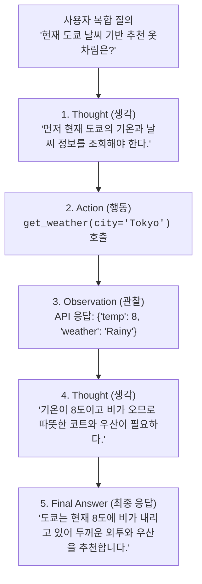

> [!abstract] 핵심 요약
> **AI 에이전트(Agent)**는 LLM을 단순한 응답기가 아니라 목표 달성을 위해 스스로 계획(Planning)을 수립하고, 적절한 도구(Tool)를 선택하여 실행한 뒤, 결과를 관찰(Observation)하여 다음 행동을 결정하는 **추론 엔진(Reasoning Engine)**으로 활용하는 시스템이다.
> **ReAct (Reason + Act)** 프레임워크와 **함수 호출(Function Calling)** 인터페이스를 결합하여 실시간 웹 검색, 데이터베이스 쿼리, 사내 API 호출을 자유자재로 수행하며 복잡한 다단계 문제를 자율적으로 해결한다.

---

## 1. ReAct 에이전트 반복 루프 (Thought ➔ Action ➔ Observation)



---

## 2. 3대 핵심 대화 메모리(Memory) 구조 비교

| 메모리 유형 | 저장 방식 | 장점 | 단점 및 컨텍스트 한계 |
| :-- | :-- | :-- | :-- |
| **ConversationBufferMemory** | 모든 이전 대화 메시지를 있는 그대로 저장 | 완벽한 원본 대화 히스토리 보존 | 대화가 길어지면 **토큰 한도 초과 및 비용 급증** |
| **ConversationBufferWindowMemory** | 최근 $K$개의 대화 쌍만 유지 (Sliding Window) | 고정된 토큰 사용량 보장 | $K$턴 이전의 과거 핵심 약속/정보 망각 |
| **ConversationSummaryMemory** | 이전 대화를 LLM이 점진적으로 요약 압축 | **장기 대화에서도 최소한의 토큰으로 핵심 맥락 유지** | 요약 시 세부 디테일(숫자, 고유명사) 유실 가능성 |

---

## 3. 실시간 ReAct 추론 루프 & 도구 호출 시뮬레이터

```html preview
<div style="font-family:system-ui,-apple-system,sans-serif;padding:20px;background:var(--card);color:var(--card-foreground);border:1px solid var(--border);border-radius:var(--radius)">
  <div style="font-size:16px;font-weight:700;margin-bottom:14px;color:var(--primary);display:flex;align-items:center;gap:8px">
    <span>🤖 ReAct AI 에이전트 도구 호출(Function Calling) 추론기</span>
  </div>

  <div style="display:flex;gap:8px;margin-bottom:12px">
    <button id="btnRunAgent" style="padding:6px 14px;background:var(--primary);color:#fff;border:none;border-radius:var(--radius);font-weight:700;cursor:pointer">🚀 에이전트 추론 루프 1단계 진행</button>
    <button id="btnResetAgent" style="padding:6px 10px;background:var(--muted);color:var(--foreground);border:1px solid var(--border);border-radius:var(--radius);font-size:11px;cursor:pointer">초기화</button>
  </div>

  <div style="padding:10px;background:var(--background);border:1px solid var(--border);border-radius:var(--radius);margin-bottom:12px">
    <div style="font-size:10px;color:var(--muted-foreground);margin-bottom:4px">에이전트 추론 진행 로그:</div>
    <div id="agentTraceOut" style="font-family:monospace;font-size:12px;line-height:1.8">
      • [User]: "엔비디아 최근 주가에 15를 곱한 값은 얼마야?"
    </div>
  </div>

  <script>
    var agentStep = 0;
    document.getElementById('btnRunAgent').onclick = function() {
      agentStep++;
      var out = document.getElementById('agentTraceOut');
      if (agentStep === 1) {
        out.innerHTML += "<br/>• <span style='color:var(--primary)'>[Thought 1]:</span> 최신 주가를 알아야 하므로 Stock_API를 호출한다.";
        out.innerHTML += "<br/>• <span style='color:var(--chart-1)'>[Action 1]:</span> <code>get_stock_price(ticker='NVDA')</code>";
      } else if (agentStep === 2) {
        out.innerHTML += "<br/>• <span style='color:var(--chart-2)'>[Observation 1]:</span> {'price': 120.00}";
        out.innerHTML += "<br/>• <span style='color:var(--primary)'>[Thought 2]:</span> 120에 15를 곱하기 위해 Calculator_API를 호출한다.";
        out.innerHTML += "<br/>• <span style='color:var(--chart-1)'>[Action 2]:</span> <code>calculator(expr='120 * 15')</code>";
      } else if (agentStep === 3) {
        out.innerHTML += "<br/>• <span style='color:var(--chart-2)'>[Observation 2]:</span> 1800";
        out.innerHTML += "<br/>• <span style='color:var(--primary)'>[Thought 3]:</span> 모든 계산이 완료되었으므로 최종 답변을 작성한다.";
        out.innerHTML += "<br/>• <span style='color:var(--primary);font-weight:700'>[Final Answer]:</span> 엔비디아의 최근 주가($120)에 15를 곱한 값은 <b>$1,800</b>입니다.";
      }
    };

    document.getElementById('btnResetAgent').onclick = function() {
      agentStep = 0;
      document.getElementById('agentTraceOut').innerHTML = "• [User]: \"엔비디아 최근 주가에 15를 곱한 값은 얼마야?\"";
    };
  </script>
</div>
```
