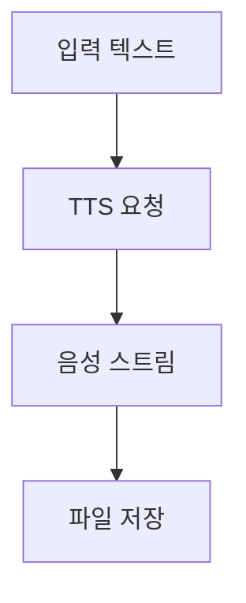

> [!NOTE]
> 이 구간은 하나의 API가 아니라 오디오 생성·인식, 콘텐츠 위험 분류, 추론 모델 호출을 묶는다. 입력 형식과 출력 형식, 모델 세대가 서로 다르므로 같은 요청 규칙으로 합치면 안 된다.

---

## 오디오 입출력 조합

| 입력 | 출력 | 원문이 든 용도 |
| :-- | :-- | :-- |
| 텍스트 | 텍스트와 오디오 | 질문에 음성 답변 생성 |
| 오디오 | 텍스트와 오디오 | 녹음 내용을 이해하고 음성으로 답변 |
| 오디오 | 텍스트 | 녹음에서 감정 분석 |
| 텍스트와 오디오 | 텍스트와 오디오 | 두 입력을 함께 반영한 멀티모달 응답 |
| 텍스트와 오디오 | 텍스트 | 멀티모달 입력을 텍스트로 정리 |

<Tabs>
  <Tab label="오디오 출력">요청의 `modalities`에 텍스트와 오디오를 넣고, 목소리와 파일 형식을 지정한다.</Tab>
  <Tab label="오디오 입력">바이너리 오디오를 Base64 문자열로 인코딩해 `input_audio` 데이터로 전달한다.</Tab>
  <Tab label="응답 저장">응답의 오디오 데이터를 Base64 디코딩한 뒤 바이너리 파일로 기록한다.</Tab>
</Tabs>

<details>
<summary>Base64가 필요한 이유</summary>

JSON 요청은 바이너리 파일을 그대로 담기 어렵다. 원문 예제는 오디오 바이트를 ASCII 문자열로 바꾸어 전송하고, 응답 문자열을 다시 바이트로 복원한다.

</details>

---

## 텍스트 음성 변환

**핵심:** TTS는 텍스트를 음성으로 변환하고, 원문 예제는 `client.audio.speech.create` 응답을 파일 스트림으로 저장한다.

| 항목 | 원문 내용 |
| :-- | :-- |
| 모델 예 | `tts-1` |
| 목소리 예 | `alloy` |
| 기본 출력 | MP3 |
| 다른 형식 | Opus, AAC, FLAC, PCM |
| 전달 방식 | 실시간 스트리밍 지원 |
| 언어 범위 | 대체로 Whisper 지원 언어를 따른다고 설명 |



> [!WARNING]
> 원문은 “6개의 내장 목소리”라고 쓰면서 alloy, ash, coral, echo, fable, onyx, nova, sage, shimmer의 9개 이름을 열거한다. 숫자와 목록이 충돌하므로 임의로 하나를 정답으로 고치지 않는다.

---

## 음성 텍스트 변환

| 기능 | 원문 호출 | 출력 |
| :-- | :-- | :-- |
| 전사 | `client.audio.transcriptions.create` | 원래 언어의 텍스트 |
| 번역 | `client.audio.translations.create` | 다른 언어로 변환된 텍스트 |
| 단어 타임스탬프 | `response_format="verbose_json"`과 `timestamp_granularities=["word"]` | 단어별 시간 정보 |
| 지원 입력 형식 | mp3, mp4, mpeg, mpga, m4a, wav, webm | 업로드할 오디오·비디오 파일 형식 |

<details>
<summary>파일 크기와 분할</summary>

원문은 업로드를 25MB 이하로 제한하고, 더 큰 파일은 분할하거나 압축 형식을 사용하라고 안내한다. PyDub은 분할 도구의 예로 제시된다.

</details>

> [!CAUTION]
> 설명에는 “large-v2 Whisper 모델 기반”이라는 표현이 나오지만 코드의 API 모델 이름은 `whisper-1`이다. 구현에서는 설명용 기반 모델 명칭과 엔드포인트에 전달하는 모델 식별자를 구분해야 한다.

---

## 모더레이션

**핵심:** 모더레이션은 텍스트나 이미지가 잠재적으로 해로운지 확인하며, 원문은 콘텐츠 필터링과 문제 사용자 계정 개입을 시정 조치의 예로 든다.

| 모델 | 원문 입력 범위 | 상태 표기 |
| :-- | :-- | :-- |
| `omni-moderation-latest` | 텍스트와 이미지 | 더 많은 분류와 멀티모달 입력 |
| `text-moderation-latest` | 텍스트만 | Legacy |

<Tabs>
  <Tab label="텍스트">문자열을 `input`으로 보내 분류 결과를 받는다.</Tab>
  <Tab label="이미지 포함">텍스트 항목과 `image_url` 항목을 배열에 함께 넣는다.</Tab>
  <Tab label="시정 조치">원문은 콘텐츠 필터링과 문제 사용자 계정 개입을 예로 든다.</Tab>
</Tabs>

> [!IMPORTANT]
> 원문은 모더레이션 엔드포인트를 무료라고 설명한다. 가격, 모델 상태, 분류 범주는 변경될 수 있는 시점 정보이므로 현재 운영 정책을 별도로 확인해야 한다.

---

## 추론 모델의 컨텍스트 윈도우

```html preview
<div style="font-family:system-ui,sans-serif;padding:20px;color:var(--foreground)">
  <h3 style="margin:0 0 14px;font-size:15px;font-weight:600">원문에 제시된 컨텍스트 윈도우</h3>
  <div id="bars" style="display:flex;align-items:flex-end;gap:14px;height:170px"></div>
  <script>
    var data = [['o1', 200000], ['o1-mini', 128000]];
    var max = Math.max.apply(null, data.map(function (d) { return d[1]; }));
    document.getElementById('bars').innerHTML = data.map(function (d, i) {
      return '<div style="flex:1;display:flex;flex-direction:column;align-items:center;' +
        'gap:6px;height:100%;justify-content:flex-end">' +
        '<span style="font-size:12px;font-weight:600">' + d[1] + '</span>' +
        '<div style="width:100%;height:' + (d[1] / max * 100) + '%;' +
        'background:var(--chart-' + (i + 1) + ');' +
        'border-radius:var(--radius) var(--radius) 0 0"></div>' +
        '<span style="font-size:12px;color:var(--muted-foreground)">' + d[0] + '</span>' +
        '</div>';
    }).join('');
  </script>
</div>
```

| 모델 | 원문 최대 출력 토큰 | 원문 설명 |
| :-- | --: | :-- |
| o1 | 100,000 | 광범위한 일반 지식으로 어려운 문제 추론 |
| o1-mini | 65,536 | 코딩·수학·과학 작업에 빠르고 저렴한 선택으로 설명 |

<details>
<summary>왜 출력 값은 별도 표인가</summary>

컨텍스트 윈도우와 최대 출력 토큰은 서로 다른 한도다. 원문이 두 모델에 대해 두 종류의 수치를 제공하므로, 한 차트 축에서 하나의 지표처럼 섞지 않는다.

</details>

---

## 호출 경계와 시점 경고

| 영역 | 원문 예 | 확인할 경계 |
| :-- | :-- | :-- |
| 오디오 대화 | `gpt-4o-audio-preview` | preview 모델·지원 모달리티 |
| TTS | `tts-1` | 목소리·형식·스트리밍 방식 |
| STT | `whisper-1` | 업로드 한도·응답 형식 |
| 모더레이션 | `omni-moderation-latest` | 분류 범주·멀티모달 지원 |
| 추론 | `o1`, `o1-mini` | 컨텍스트·출력 한도와 호출 API |

> [!WARNING]
> 모든 모델 이름, 최대 토큰 수, 파일 크기, 무료 여부, 출력 형식은 원문 작성 시점의 스냅샷이다. 특히 preview·latest 식별자는 고정 사양이 아니므로 현재 문서와 실제 응답 스키마를 확인한다.

코드 표기 자체에도 복사 위험이 있다.

> [!CAUTION]
> 모더레이션 이미지 예제의 Base64 주석 끝에는 방향이 다른 스마트 따옴표가 섞여 있다. 그대로 복사하면 문자열 경계를 잘못 읽을 수 있으므로 원문 오탈자로 기록한다.

---

## 정리

- 오디오 대화는 입력·출력 모달리티와 Base64 경계를 함께 관리한다.
- TTS와 STT는 서로 다른 엔드포인트이며 파일 형식과 결과 구조도 다르다.
- 원문은 모더레이션 뒤의 시정 조치 예로 콘텐츠 필터링과 문제 사용자 계정 개입을 든다.
- o1 계열의 컨텍스트 윈도우와 출력 한도는 별도 지표이며 모두 시점 정보다.
