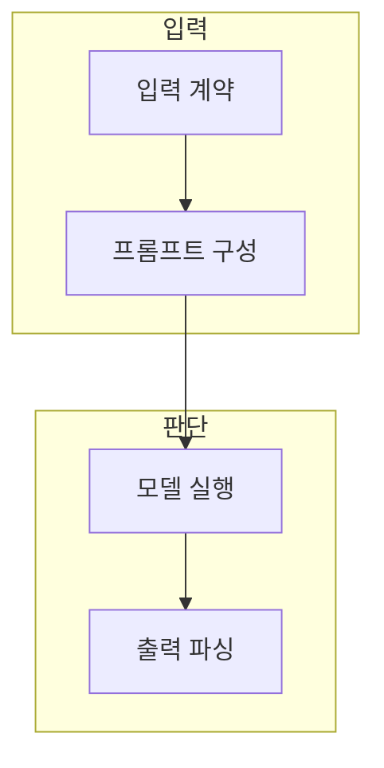

> [!abstract] 한 줄 요약
> 조합 가능한 실행 흐름은 각 단계의 입력·출력 계약을 명확히 할 때 교체·테스트·오류 분리가 쉬워진다.

## 이 노트의 지도



## 1. Runnable과 조합

Runnable은 입력을 받아 출력을 내는 단위를 같은 인터페이스로 다루어, 프롬프트·모델·파서·도구를 연결하게 한다. ==입출력 계약== 는 각 단계가 받는 값과 내보내는 값의 구조·형식·오류 조건.

> [!note] 인터페이스
> 연결 문법이 짧아도 중간 값의 구조를 모르면 오류 원인을 찾기 어렵다.

## 2. 프롬프트와 파서

템플릿은 필요한 변수를 명시하고, 출력 파서는 모델 텍스트를 후속 단계가 처리할 구조로 바꾼다.

<details>
<summary>조합 전 확인</summary>

- 각 단계의 입력 키와 타입
- 누락 변수와 기본값
- 출력 파싱 실패 처리
- 중간 결과의 관찰 위치

</details>

## 데이터로 보기

```html preview
<div style="font-family:system-ui,sans-serif;padding:20px">
  <div id="cards" style="display:flex;gap:14px;flex-wrap:wrap"></div>
  <script>
    var stats = [["입력","1","계약 확인","var(--chart-1)"],["프롬프트","1","변수 구성","var(--chart-2)"],["파서","1","출력 구조","var(--chart-3)"]];
    document.getElementById('cards').innerHTML = stats.map(function (s) {
      return '<div style="flex:1;min-width:150px;padding:16px;background:var(--card);' +
        'color:var(--card-foreground);border:1px solid var(--border);' +
        'border-radius:var(--radius)">' +
        '<div style="font-size:13px;color:var(--muted-foreground)">' + s[0] + '</div>' +
        '<div style="font-size:26px;font-weight:700;margin-top:4px">' + s[1] + '</div>' +
        '<div style="font-size:12px;font-weight:600;margin-top:4px;color:' + s[3] + '">' +
        s[2] + '</div>' +
        '</div>';
    }).join('');
  </script>
</div>
```

> [!note] 조합 지표의 한계
> 카드의 1은 실제 실행 횟수나 성공률이 아니라, 조합 흐름의 세 인터페이스를 구분한다.

## 핵심 정리

| 개념 | 정의 | 왜 중요한가 |
| :-- | :-- | :-- |
| Runnable | 입출력 단위 | 재사용·조합의 공통 형태 |
| Template | 변수화된 프롬프트 | 입력 누락을 드러낸다 |
| Parser | 텍스트를 구조화 | 후속 처리 계약을 만든다 |

## 관련 개념

- 프롬프트 설계: 목적·맥락·출력 형식을 명시하는 방법
- API 계약: 입력·출력·오류를 검증하는 방법

> [!question]- 스스로 점검
> **Q.** 출력 파서를 쓰는 흐름에서 파싱 실패를 따로 다뤄야 하는 이유는 무엇인가?
>
> **A.** 모델이 형식과 다른 텍스트를 낼 수 있어, 실패를 조용히 통과시키면 후속 단계의 오류 원인을 잃기 때문이다.
