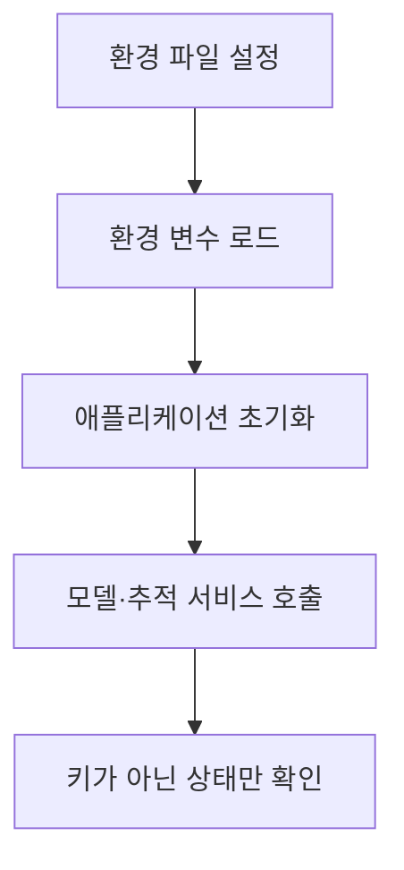

## 개발 환경·API 키와 보충 사례

> [!NOTE]
> 이 구간은 환경 설정 뒤에 데이터셋, NLP 응용, Gemma와 Groq 사례가 이어지는 부록이다. **실제 키나 조직 식별자는 기록하지 않고**, 원문 수치와 절차의 적용 범위를 구분한다.

---

> [!WARNING]
> LangSmith 키 발급·추적, 외부 제공자 키, 브라우저 확장 도구 안내는 같은 강의 묶음의 다른 원본에도 중복 수록된 내용이다. 여기서는 중복 사실과 역할만 보존하며, 고유한 환경 설정·데이터·모델 사례와 분리한다.

---

## 고유 내용과 중복 부록의 경계

| 구분 | 내용 |
| --- | --- |
| 고유 환경 설정 | 프로젝트의 환경 파일, 환경 변수 로드, 키 존재 여부 확인 |
| 중복 부록 | LangSmith 추적, 외부 API 제공자 키, 확장 프로그램 |
| 고유 보충 자료 | 한국어 데이터셋, NLP 적용 사례, Gemma, Groq |

중복 부록은 새 지식처럼 반복하지 않고 개발 환경에서 맡는 책임만 요약한다.

---

## 비밀정보를 다루는 흐름



- 환경 파일은 프로젝트 코드와 분리한다.
- 키 값 자체를 로그·노트·화면에 출력하지 않는다.
- 존재 여부나 인증 성공 상태로 설정을 확인한다.
- 서비스별 키와 프로젝트 이름을 서로 다른 변수로 관리한다.

---

## 기본 환경 설정

<details>
<summary>키 값을 노출하지 않는 로드 예시</summary>

```python
import os
from dotenv import load_dotenv

load_dotenv()
configured = bool(os.getenv("OPENAI_API_KEY"))
print("API key configured:", configured)
```

</details>

> [!CAUTION]
> 원문은 환경 변수의 키 값을 그대로 출력하는 예를 포함한다. 이는 비밀정보를 노출할 수 있으므로 값 출력 대신 설정 여부만 확인한다.

---

## LangSmith 추적 부록

| 환경 항목 | 역할 |
| --- | --- |
| tracing flag | 추적 활성화 여부 |
| endpoint | 추적 서비스의 전송 대상 |
| API key | 서비스 인증 |
| project | 실행을 묶어 볼 프로젝트 이름 |

LangSmith는 실행 단계, 검색 문서, 모델 입출력, 오류, 토큰 사용을 추적하는 용도로 설명된다. 편의 패키지는 프로젝트 이름으로 추적을 켜고 끄는 인터페이스를 제공한다.

중복 원문에 포함된 특정 조직 주소와 실제 키 발급 화면은 재현하지 않는다.

---

## 외부 제공자와 도구 부록

<Tabs>
  <Tab label="모델·검색 API">Hugging Face, Anthropic, Google AI, 검색 서비스의 인증 진입점이 제시된다. 키 문자열은 보관 대상이지 학습 노트의 내용이 아니다.</Tab>
  <Tab label="브라우저 확장">번역, 공유, 최신 웹 정보, 프롬프트 모음, 웹 문서·PDF·영상 요약 도구가 예시로 열거된다.</Tab>
</Tabs>

Hugging Face는 원문 작성 시점에 120k 이상 모델, 20k 데이터셋, 50k 데모 앱을 가진 플랫폼으로 소개된다. 첫 값이 하한 표현이고 수치가 시점 의존적이므로 동일 축의 정확한 비교 차트로 사용하지 않는다.

---

## 한국어 데이터 자료

| 자료 | 용도 |
| --- | --- |
| 네이버 영화 리뷰 | 한국어 리뷰·감성 분석용 텍스트 |
| 한국어 네이버 뉴스 데이터셋 | 뉴스와 표준·기술 분야 텍스트 |

원문에는 저장소와 변경 이력 주소가 일부 줄바꿈된 채 제시된다. 데이터의 현재 가용성이나 라이선스는 이 자료만으로 확정할 수 없다.

---

## NLP 응용 분야

| 분야 | 대표 작업과 사례 |
| --- | --- |
| 문서·정보 검색 | 검색, 자동 요약, 주제·카테고리 분류 |
| 고객 서비스 | 챗봇, 감정 분석, 요청 분류·라우팅 |
| 번역·언어 처리 | 기계 번역, 언어 인식과 변환 |
| 음성 | 음성-텍스트 변환, TTS, 가상 비서 |
| 의료·생명 과학 | 임상 문서 분석, 진단 지원 |
| 금융·비즈니스 | 뉴스 분석, 계약서 자동 검토 |
| 교육 | 문법·문체 교정, 개인화 학습 |

제품과 기관 이름은 적용 사례로 제시된 것이며 성능 비교 자료는 아니다.

---

## Gemma 제품군의 크기

```html preview
<div style="font-family:system-ui,sans-serif;padding:20px;color:var(--foreground)">
  <h3 style="margin:0 0 14px;font-size:15px;font-weight:600">Gemma 제품군 매개변수 규모(B)</h3>
  <div id="bars" style="display:flex;align-items:flex-end;gap:14px;height:170px"></div>
  <script>
    var data = [['Gemma 2 2B', 2], ['9B 변형', 9], ['27B 변형', 27]];
    var max = Math.max.apply(null, data.map(function (d) { return d[1]; }));
    document.getElementById('bars').innerHTML = data.map(function (d, i) {
      return '<div style="flex:1;display:flex;flex-direction:column;align-items:center;' +
        'gap:6px;height:100%;justify-content:flex-end">' +
        '<span style="font-size:12px;font-weight:600">' + d[1] + '</span>' +
        '<div style="width:100%;height:' + (d[1] / max * 100) + '%;' +
        'background:var(--chart-' + (i + 1) + ');' +
        'border-radius:var(--radius) var(--radius) 0 0"></div>' +
        '<span style="font-size:12px;color:var(--muted-foreground)">' + d[0] + '</span>' +
        '</div>';
    }).join('');
  </script>
</div>
```

원문은 2B 모델을 크기와 효율성의 균형이 있는 소비자 기기용 모델로 설명하고, 9B·27B 변형과 함께 비교한다.

---

## 원문이 제시한 독립 수치

```html preview
<div style="font-family:system-ui,sans-serif;padding:20px">
  <div id="cards" style="display:flex;gap:14px;flex-wrap:wrap"></div>
  <script>
    var stats = [
      ['학습 데이터', '2T', 'Gemma 2 2B 토큰', 'var(--chart-2)'],
      ['Arena 점수', '1,130', '원문 벤치마크 주장', 'var(--chart-1)'],
      ['Groq 처리량', '300 tok/s', '사용자당 원문 주장', 'var(--chart-5)']
    ];
    document.getElementById('cards').innerHTML = stats.map(function (s) {
      return '<div style="flex:1;min-width:150px;padding:16px;background:var(--card);' +
        'color:var(--card-foreground);border:1px solid var(--border);' +
        'border-radius:var(--radius)">' +
        '<div style="font-size:13px;color:var(--muted-foreground)">' + s[0] + '</div>' +
        '<div style="font-size:26px;font-weight:700;margin-top:4px">' + s[1] + '</div>' +
        '<div style="font-size:12px;font-weight:600;margin-top:4px;color:' + s[3] + '">' +
        s[2] +
        '</div>' +
        '</div>';
    }).join('');
  </script>
</div>
```

세 값은 단위와 의미가 다른 독립 지표이며 하나의 공통 축으로 비교하지 않는다.

---

## 로컬·글로벌 어텐션 교차

<Tabs>
  <Tab label="Local Attention">각 토큰이 주변 범위에 집중한다. 계산 효율이 높고 가까운 문맥을 포착한다.</Tab>
  <Tab label="Global Attention">각 토큰이 전체 시퀀스를 본다. 장거리 의존성에 유리하지만 계산량이 크다.</Tab>
  <Tab label="Interleaving">로컬과 글로벌 주의를 번갈아 적용해 근거리·원거리 정보를 함께 다루려는 전략이다.</Tab>
</Tabs>

원문은 입력을 global context와 local context로 나누는 첫 단계만 제시하고 이후 절차는 생략한다.

---

## Groq 사례

Groq API는 LLM 추론 가속 장치인 LPU를 이용하는 언어 모델 API로 설명된다. 원문은 Llama-2 70B를 사용자당 초당 300토큰으로 처리한다는 수치를 제시한다.

이 값에는 모델 정밀도, 배치, 프롬프트 길이, 하드웨어·서비스 조건이 함께 제시되지 않으므로 재현 가능한 성능 보장으로 해석하지 않는다.

> [!WARNING]
> 플랫폼 규모, 모델 점수와 처리량은 작성 시점·측정 조건에 의존한다. 원문의 공유 주소는 추출 과정에서 분절되었고, 로컬·글로벌 어텐션 절차도 첫 단계에서 끝난다. 이러한 빈칸을 외부 정보로 보완하지 않는다.

---

## 핵심 정리

1. 키는 환경 변수로 읽되 값 자체를 출력하거나 문서화하지 않는다.
2. 중복된 키·추적 부록은 역할만 남기고 다른 원본과의 중복을 명시한다.
3. 한국어 데이터셋과 NLP 사례는 모델 학습·검색 실습의 보충 자료다.
4. Gemma와 Groq 수치는 제품군 규모와 원문 성능 주장으로 분리해 읽는다.
5. 조건이 빠진 성능 수치와 불완전한 절차는 경고와 함께 보존한다.
