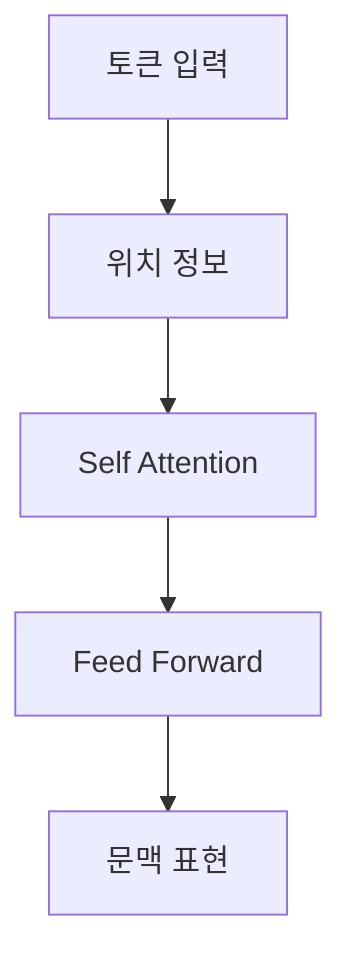
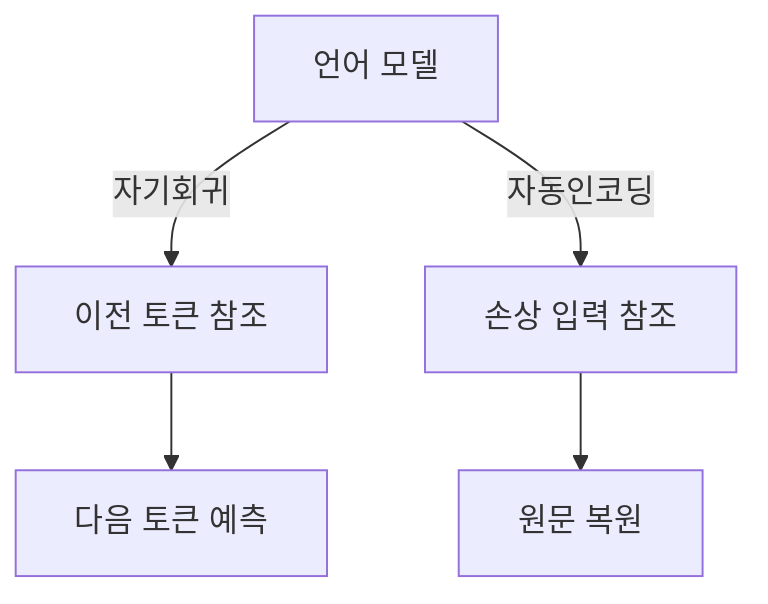

## Transformer와 언어 모델 계열

> [!NOTE]
> Transformer는 시퀀스를 순서대로 압축하는 대신 토큰 사이의 관계를 동시에 계산하며, 인코더와 디코더의 사용 방식에 따라 이해 중심 모델과 생성 중심 모델로 나뉜다.

---

## Transformer가 바꾼 처리 방식

| 구성 | 원본의 설명 | 기능 |
| :-- | :-- | :-- |
| Self-Attention | 입력의 모든 부분이 서로 상호 작용 | 문맥 관계를 동시에 고려 |
| Multi-Head Attention | 여러 헤드가 서로 다른 부분에서 정보 추출 | 다양한 관점의 표현 학습 |
| Positional Encoding | 시퀀스의 위치 정보를 입력에 포함 | 병렬 처리에서도 순서 유지 |
| Layered Architecture | 여러 인코더·디코더 층을 반복 | 복잡한 패턴과 관계 학습 |



> [!IMPORTANT]
> 순차 계산의 필요성을 줄이면서도 위치 정보를 별도로 더하는 것이 Transformer의 핵심 절충이다.

---

## 인코더와 디코더의 역할

<Tabs>
  <Tab label="Encoder">

입력 전체를 양방향으로 참고해 문맥을 이해하고 고차원 표현으로 변환하는 데 적합하다. 분류, 관계 분석, 유사성 평가, 질의응답이 원본의 대표 작업이다.

  </Tab>
  <Tab label="Decoder">

이미 주어진 문맥을 바탕으로 다음 토큰을 이어 생성하는 데 적합하다. 생성 시 미래 토큰을 보지 못하도록 마스크를 적용할 수 있다.

  </Tab>
</Tabs>

---

## 한 블록 안의 처리

원본은 텍스트와 위치 임베딩 뒤에 Transformer Block이 반복되는 구조를 제시한다.

| 요소 | 역할 | 학습 효과 |
| :-- | :-- | :-- |
| Text & Position Embed | 토큰 의미와 위치를 하나의 입력 표현으로 구성 | 내용과 순서를 함께 보존 |
| Masked Multi Self Attention | 허용된 범위의 토큰 관계에서 중요 정보 선택 | 문맥 관계 학습 |
| Layer Norm | 층 출력을 정규화 | 학습 안정화와 수렴 지원 |
| Feed Forward | 각 위치에 독립적인 비선형 변환 적용 | 표현력 확장 |

<details>
<summary>블록 수의 해석</summary>

카드에 제시된 블록 수는 원본의 설명 대상 구조에 해당한다. 모든 Transformer나 모든 LLM에 같은 수를 적용하는 일반 규칙은 아니다.

</details>

---

## 원본의 세 가지 규모 지표

```html preview
<div style="font-family:system-ui,sans-serif;padding:20px">
  <div id="cards" style="display:flex;gap:14px;flex-wrap:wrap"></div>
  <script>
    var stats = [
      ['Transformer Block', '12개', '원본의 설명 구조', 'var(--chart-2)'],
      ['LLM 파라미터', '수천억 개 이상', '원본의 강의용 기준', 'var(--chart-1)'],
      ['SLM 파라미터', '1,500만 개 미만', '원본의 강의용 기준', 'var(--chart-5)']
    ];
    document.getElementById('cards').innerHTML = stats.map(function (s) {
      return '<div style="flex:1;min-width:150px;padding:16px;background:var(--card);' +
        'color:var(--card-foreground);border:1px solid var(--border);' +
        'border-radius:var(--radius)">' +
        '<div style="font-size:13px;color:var(--muted-foreground)">' + s[0] + '</div>' +
        '<div style="font-size:26px;font-weight:700;margin-top:4px">' + s[1] + '</div>' +
        '<div style="font-size:12px;font-weight:600;margin-top:4px;color:' + s[3] + '">' +
        s[2] + '</div>' +
        '</div>';
    }).join('');
  </script>
</div>
```

---

## 두 가지 언어 모델 방식

인코더·디코더 Tabs가 구조의 역할을 설명했다면, 아래 흐름은 두 언어 모델이 학습·예측할 때 사용하는 정보의 차이를 보여 준다.



---

## 대표 모델의 설계 초점

| 모델 | 원본의 계열 설명 | 강점 또는 활용 |
| :-- | :-- | :-- |
| BERT-Large | 양방향 Transformer | 분류, 감성 분석, 개체명 인식, 질의응답 |
| GPT | 디코더 기반 자기회귀 | 문장 완성, 요약, 대화, 창작, 코드 |
| T5 | 모든 NLP 문제를 텍스트 생성으로 변환 | 번역, 요약, 분류 |
| RoBERTa | BERT의 학습 방식 개선 | 자연어 이해와 질문응답 |
| ELECTRA | Generator와 Discriminator로 구성 | 계산 효율적인 표현 학습 |

> [!TIP]
> 모델 이름을 외우기보다 입력을 어떻게 참고하고 어떤 출력 계약으로 학습하는지를 비교하면 계열 차이가 선명해진다.

---

## LLM의 범위와 원본 기준

원본은 LLM을 Transformer 기반으로 방대한 텍스트를 학습하고, 질문 응답·글쓰기·대화·분류·추론을 수행하며 특정 분야에 맞게 미세조정할 수 있는 모델로 설명한다.

- 데이터 예시는 인터넷 텍스트, 책, 논문, 기사다.
- 예시 모델로 GPT-3.5 Turbo, GPT-4, BERT, Gemini, PaLM2, LLaMA2를 열거한다.
- 규모 경계는 앞선 카드에 원본 표현 그대로 분리했다.

> [!CAUTION]
> 카드의 파라미터 경계는 원본의 강의용 분류이며 보편적으로 합의된 정의가 아니다.

---

## 원본 오류와 추출 한계

> [!WARNING]
> Transformer 역할 그림이 있는 두 번째 슬라이드는 추출 텍스트가 적어 인코더는 이해, 디코더는 생성에 강하다는 문구만 확인된다. 자동인코딩 설명의 “전체 입력에 전근”은 문맥상 오타 또는 추출 오류로 보이지만 원문 오류로 보존한다. 또한 T5를 “파인튜닝 없이 여러 작업을 해결한 최초의 LLM”이라고 한 표현과 모델별 연도·범주는 강의 원문의 주장으로만 다룬다.

---

## 정리

| 판단 질문 | 확인할 구조 | 대표 계열 |
| :-- | :-- | :-- |
| 입력 전체를 이해해야 하는가 | 양방향 문맥을 만드는 인코더 | BERT, RoBERTa, ELECTRA |
| 다음 토큰을 이어 생성해야 하는가 | 미래를 가리는 디코더 | GPT |
| 여러 작업을 텍스트 생성으로 통일하는가 | 입력과 출력을 텍스트로 구성 | T5 |
| 모델 크기를 비교하는가 | 파라미터 외 학습 데이터·목표도 함께 확인 | LLM 전반 |
