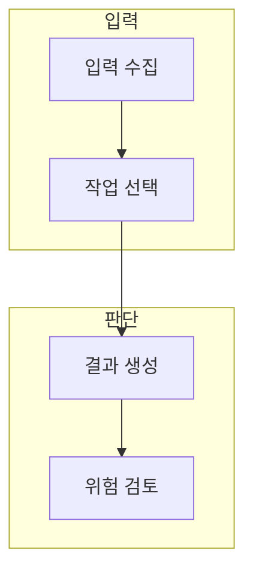

> [!abstract] 한 줄 요약
> 오디오·안전 검토·추론은 각각 다른 입력·출력·실패 조건을 가지므로 하나의 성공 기준으로 묶을 수 없다.

## 이 노트의 지도



## 1. 세 작업의 경계

오디오는 음성·텍스트 변환을, Moderation은 위험 신호 분류를, 추론 작업은 복잡한 문제의 단계적 처리를 다룬다. ==안전 신호== 는 추가 검토·차단·에스컬레이션이 필요한 위험 가능성을 나타내는 정보.

> [!warning] 안전 신호
> 안전 검토 결과는 문맥과 정책 판단을 대체하지 않으며, 임계값과 후속 절차가 필요하다.

## 2. 입출력 검증

음성 인식에는 전사 오류, 음성 합성에는 오해 가능성, 안전 검토에는 오탐·누락, 추론에는 근거 검증이 각각 필요하다.

<details>
<summary>작업별 확인</summary>

- 오디오: 화자·언어·전사 불확실성
- Moderation: 신호·정책·후속 처리
- 추론: 입력 조건·근거·최종 검증

</details>

## 데이터로 보기

```html preview
<div style="font-family:system-ui,sans-serif;padding:20px">
  <div id="cards" style="display:flex;gap:14px;flex-wrap:wrap"></div>
  <script>
    var stats = [["오디오","1","전사·합성","var(--chart-1)"],["안전","1","신호 처리","var(--chart-5)"],["추론","1","근거 검증","var(--chart-3)"]];
    document.getElementById('cards').innerHTML = stats.map(function (s) {
      return '<div style="flex:1;min-width:150px;padding:16px;background:var(--card);' +
        'color:var(--card-foreground);border:1px solid var(--border);' +
        'border-radius:var(--radius)">' +
        '<div style="font-size:13px;color:var(--muted-foreground)">' + s[0] + '</div>' +
        '<div style="font-size:26px;font-weight:700;margin-top:4px">' + s[1] + '</div>' +
        '<div style="font-size:12px;font-weight:600;margin-top:4px;color:' + s[3] + '">' +
        s[2] + '</div>' +
        '</div>';
    }).join('');
  </script>
</div>
```

> [!caution] 안전 신호의 한계
> 카드의 1은 작업 수나 성능 수치가 아니라, 세 작업군의 검증 관점을 구분하는 표시다.

## 핵심 정리

| 개념 | 정의 | 왜 중요한가 |
| :-- | :-- | :-- |
| 오디오 | 음성과 텍스트의 변환 | 전사·합성 결과 검증 |
| Moderation | 위험 가능성 신호 | 후속 절차의 입력 |
| 추론 | 복잡한 문제 처리 | 근거와 최종 답 검증 |

## 관련 개념

- API 계약: 작업별 입력·출력 형식을 확인하는 방법
- 안전 설계: 위험 신호 이후의 정책과 사람 검토를 설계하는 방법

> [!question]- 스스로 점검
> **Q.** Moderation 결과 하나만으로 최종 정책 결정을 내려도 되는가?
>
> **A.** 아니다. 신호의 한계와 문맥·정책·후속 절차를 함께 고려해야 한다.
