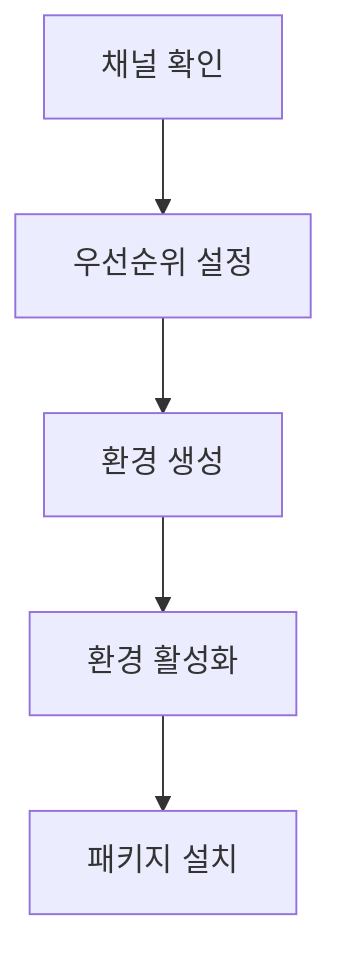

> [!NOTE]
> 이 구간은 Windows에서 Python 환경, Git, PowerShell 설정, VS Code 확장을 준비하는 체크리스트다. 화면 이미지에만 있는 값은 추출문에서 확인되지 않으므로 명령을 추정하지 않는다.

---

## Python 배포판 선택

```html preview
<div style="font-family:system-ui,sans-serif;padding:20px">
  <div id="cards" style="display:flex;gap:14px;flex-wrap:wrap"></div>
  <script>
    var stats = [
      ['Anaconda', '약 3GB+', '원문 설치 크기', 'var(--chart-2)'],
      ['Miniconda', '약 50–100MB', '원문 설치 크기', 'var(--chart-1)'],
      ['Python 예시', '3.12 / 3.11', 'Conda / pyenv', 'var(--chart-5)']
    ];
    document.getElementById('cards').innerHTML = stats.map(function (s) {
      return '<div style="flex:1;min-width:150px;padding:16px;background:var(--card);' +
        'color:var(--card-foreground);border:1px solid var(--border);' +
        'border-radius:var(--radius)">' +
        '<div style="font-size:13px;color:var(--muted-foreground)">' + s[0] + '</div>' +
        '<div style="font-size:26px;font-weight:700;margin-top:4px">' + s[1] + '</div>' +
        '<div style="font-size:12px;font-weight:600;margin-top:4px;color:' + s[3] + '">' +
        s[2] + '</div>' +
        '</div>';
    }).join('');
  </script>
</div>
```

| 항목 | Anaconda | Miniconda |
| :-- | :-- | :-- |
| 기본 구성 | 데이터 과학·머신러닝 라이브러리를 폭넓게 포함 | Conda와 최소 구성에서 시작 |
| 장점 | 초기 설정이 단순하고 주요 패키지를 빠르게 사용 | 필요한 패키지만 골라 가벼운 환경 구성 |
| 단점 | 저장 공간과 불필요 패키지 부담 | 초기 패키지 선택·설치 시간이 필요 |
| 선택 기준 | 즉시 쓸 패키지가 많을 때 | 프로젝트별 최소 환경을 만들 때 |

<details>
<summary>크기 수치의 경계</summary>

설치 파일과 기본 패키지 크기는 배포판·운영체제·시점에 따라 달라진다. 원문 수치는 현재 설치 용량을 보장하지 않는다.

</details>

---

## Conda 환경 구성 흐름



| 단계 | 원문 명령과 작업 |
| :-- | :-- |
| 채널 확인 | `conda config --show channels` |
| 채널 추가 | conda-forge 추가 후 strict 우선순위 설정 |
| 환경 생성 | 이름과 Python 버전을 지정해 생성 |
| 목록 확인 | `conda info --envs` |
| 활성화 | 선택한 환경 이름으로 활성화 |
| 패키지 설치 | notebook·seaborn·matplotlib·pandas·scikit-learn 설치 |

<Tabs>
  <Tab label="Conda 경로">가상환경을 만들고 필요한 패키지를 Conda로 설치한다.</Tab>
  <Tab label="pyenv 경로">원문 후반에는 Python 설치와 전역 버전 설정이 별도 경로로 제시된다.</Tab>
</Tabs>

> [!WARNING]
> 원문 환경 생성 명령의 옵션은 ASCII 하이픈이 아닌 긴 대시 `–y`로 보이고, 패키지 설치 예에는 `notebook, seaborn, matplotlib`처럼 쉼표가 들어 있다. 그대로 복사하지 말고 CLI가 인식하는 옵션과 공백 구분 패키지 목록으로 다시 확인해야 한다.

두 Python 버전 경로도 하나로 합치지 않는다.

> [!CAUTION]
> Conda 예시와 pyenv 예시는 서로 다른 Python 버전을 사용한다. 두 값은 별도 설치 경로의 예이며 하나의 동시 요구사항이 아니다.

---

## Git 설치와 확인

| 단계 | 원문 안내 |
| :-- | :-- |
| 설치 프로그램 | 64비트 Git for Windows Setup 다운로드 |
| 설치 옵션 | 옵션을 확인한 뒤 나머지 단계는 Next로 진행 |
| 동작 확인 | 관리자 권한 PowerShell에서 `git` 명령의 출력 확인 |

<details>
<summary>“전부 Next”를 그대로 따르지 않는 이유</summary>

원문은 설치 옵션을 확인한 뒤 나머지 단계를 Next 버튼으로 진행하라고 안내한다. 이미지에만 있는 개별 옵션 이름은 추출문에서 복원하지 않는다.

</details>

---

## PowerShell 정책과 관리자 권한

**핵심:** 원문은 PowerShell을 관리자 권한으로 열어 정책을 적용하고, 재시작한 뒤 pyenv 설치와 환경변수 추가를 진행하는 순서를 제시한다.

| 순서 | 확인 가능한 원문 내용 | 추출문에 없는 내용 |
| :-- | :-- | :-- |
| 1 | 관리자 권한 PowerShell 실행 | 적용할 정확한 정책 명령 |
| 2 | 정책 적용 후 PowerShell 재시작 | 정책 범위와 값 |
| 3 | 관리자 권한으로 pyenv 설치 | 설치 명령과 배포판 |
| 4 | 환경변수 추가 | 변수 이름·경로·적용 범위 |
| 5 | Python 설치·전역 지정 | 세부 화면과 출력 |

> [!DANGER]
> 원문은 관리자 권한 실행을 반복 안내하지만 정확한 정책·설치 명령은 추출문에 없다. 이 노트는 이미지에만 있는 명령을 추정하지 않는다.

이미지 의존 구간은 빈칸을 사실로 채우지 않는다.

> [!IMPORTANT]
> 정책 명령과 환경변수 값은 슬라이드 이미지에만 있었던 것으로 보이며 현재 추출 텍스트에 남지 않았다. 이 노트는 값을 추정하거나 재구성하지 않는다.

---

## VS Code 구성

| 구성 | 원문 작업 |
| :-- | :-- |
| VS Code | Windows 설치본 설치 |
| Python 확장 | 확장 검색에서 Python 설치 |
| Jupyter 확장 | 확장 검색에서 Jupyter 설치 |

> [!WARNING]
> 원문에는 “Window 키”라는 표기가 나오며 Windows 키의 오탈자로 보인다. 배포판 크기와 Python 예시, 확장 화면, PowerShell 정책은 자료 작성 시점의 안내다.

---

## 정리

- Anaconda와 Miniconda는 초기 패키지 범위와 설치 크기의 선택이다.
- Conda와 pyenv의 Python 예시는 별도 설치 경로로 읽는다.
- 긴 대시와 쉼표가 섞인 원문 명령은 그대로 실행하지 않는다.
- 정책·환경변수처럼 이미지에만 있는 명령은 추정하지 않는다.
- Git과 VS Code 확장 설치는 원문에 제시된 범위로만 정리한다.
