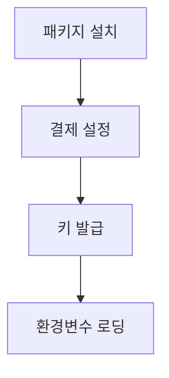
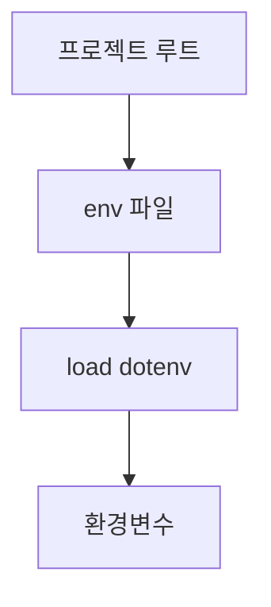

> [!NOTE]
> API 사용 준비는 패키지 설치, 계정·결제 설정, 키 발급, 환경변수 로딩으로 나뉜다.

---

## 준비 흐름



| 단계 | 원문 작업 |
| :-- | :-- |
| SDK | `pip install openai` |
| 계정 | 플랫폼 회원가입 또는 로그인 |
| 결제 | Billing에서 결제 수단과 크레딧 설정 |
| 키 | API Key 관리 메뉴에서 키 생성 |
| 환경 | 프로젝트 루트의 `.env`를 `load_dotenv`로 로딩 |

---

## 결제와 사용 한도

| 원문 화면 순서 | 제시된 작업 |
| :-- | :-- |
| Billing | Payment methods에서 카드 등록 |
| 결제 세부정보 | Individual 선택과 영문 주소 입력 |
| 크레딧 | 최소 USD 5부터 잔액 추가 |
| Limits | 월간 예산 입력 |
| 알림 | 이메일 알림 임계값 입력 |
| Usage | API 사용량 확인 |

> [!WARNING]
> 원문 UI에는 “Set a monthly budge”라고 적혀 있는데 budget의 오탈자로 보인다. 또한 예산을 0으로 넣어 None으로 만들면 과금 요청이 거부된다는 설명은 표현과 동작이 충돌하므로 하드 캡으로 믿지 말고 현재 콘솔의 실제 의미를 확인해야 한다.

<details>
<summary>금액 정보의 시점성</summary>

메뉴 이름, Individual 선택지, 예산 동작은 원문 작성 시점의 화면 안내다.

</details>

---

## 키 생명주기

| 순서 | 원문 작업 |
| :-- | :-- |
| 관리 메뉴 | API Key 관리 화면으로 이동 |
| 생성 | 새 키를 생성 |
| 복사 | 생성 창에서 표시된 값을 복사 |
| 저장 | 원문이 안내한 별도 위치에 저장 |

> [!IMPORTANT]
> 원문은 발급된 키가 생성 창에만 표시되고 이후 다시 볼 수 없다고 경고한다.

---

## 환경변수로 로딩

**핵심:** 원문은 프로젝트 루트의 `.env`에 키를 두고 `python-dotenv`의 `load_dotenv`로 불러오는 흐름을 제시한다.

```python
from dotenv import load_dotenv

load_dotenv()
```

| 원문 단계 | 내용 |
| :-- | :-- |
| 파일 생성 | 프로젝트 루트에 `.env` 생성 |
| 값 기록 | `OPENAI_API_KEY` 이름으로 발급 값을 기록 |
| 저장 | 파일을 저장하고 닫기 |
| 패키지 | `python-dotenv` 설치 |
| 로딩 | `load_dotenv()` 호출 |



---

## 오류와 대응

| 원문 오류 필드 | 원문 값 |
| :-- | :-- |
| message | 현재 쿼터 초과와 plan·billing details 확인 안내 |
| type | `insufficient_quota` |
| code | `insufficient_quota` |
| param | `null` |

---

## 원문 오류와 경계

> [!DANGER]
> 원문 마지막 예제는 환경변수의 API 키 전체를 콘솔에 출력한다. 이 노트는 해당 값과 출력 코드를 재현하지 않는다.

출력 예제와 외부 도구 사용은 서로 다른 경계다.

> [!WARNING]
> 원문은 외부 requirements 파일을 원격 주소에서 직접 설치하고, 결제 주소 입력에 별도 주소 변환 도구를 사용하는 절차를 제시한다. 이 노트는 해당 명령과 주소를 재현하지 않으며 현재 필수 절차로 일반화하지 않는다.

---

## 정리

- 원문 흐름은 패키지 설치, 결제 정보 입력, 키 발급, 환경변수 로딩으로 이어진다.
- `.env` 작성과 `load_dotenv()` 호출은 별도 단계다.

---

## 원본 강의 흐름 인터랙티브

```html preview
<div style="font-family:system-ui,sans-serif;padding:20px;color:var(--foreground)">
  <label for="noteFlow595757" style="font-size:14px;font-weight:600">OpenAI API 키·결제·환경변수 단계</label>
  <div id="noteFlow595757-out" style="font-size:26px;font-weight:700;color:var(--chart-1);margin:6px 0">OpenAI API 키·결제·환경변수 핵심 개념</div>
  <input id="noteFlow595757" type="range" min="1" max="3" step="1" value="1" style="width:100%;accent-color:var(--primary)" />
  <p style="font-size:13px;color:var(--muted-foreground)">슬라이더를 움직이면 원본 PDF에서 정리한 이 노트의 흐름을 확인합니다.</p>
  <script>
    var noteFlow595757 = document.getElementById('noteFlow595757');
    var noteFlow595757Out = document.getElementById('noteFlow595757-out');
    var noteFlow595757Steps = ["OpenAI API 키·결제·환경변수 핵심 개념","OpenAI API 키·결제·환경변수 처리 절차","OpenAI API 키·결제·환경변수 검증·응용"];
    noteFlow595757.addEventListener('input', function () { noteFlow595757Out.textContent = noteFlow595757Steps[Number(noteFlow595757.value) - 1]; });
  </script>
</div>
```
