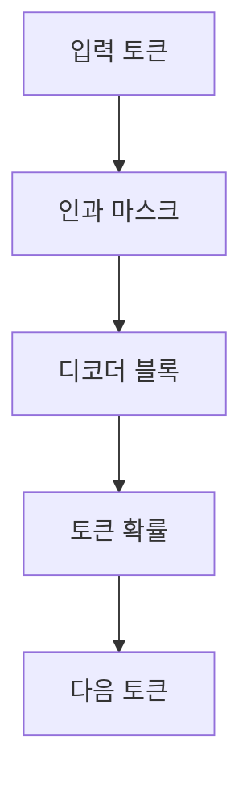
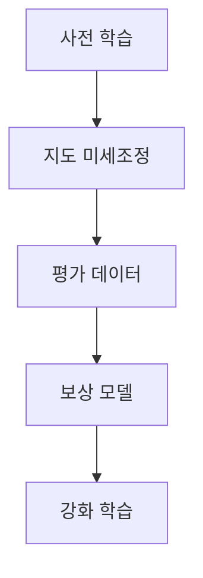

## GPT 구조와 학습 전략

> [!NOTE]
> GPT는 Transformer 디코더를 쌓고 인과적 마스크로 이전 토큰만 보게 하여 다음 토큰을 생성한다. 세대가 커지면서 문맥 안의 예시만으로 작업을 수행하는 능력과 인간 지시를 따르는 학습이 강조되었다.

---

## OpenAI와 API의 출발점

원본은 OpenAI가 2015년에 Elon Musk, Sam Altman, Greg Brockman 등에 의해 설립되었으며 자연어 처리, 강화학습, 생성 모델링을 개발한다고 소개한다.

| API 기능 | 원본의 적용 예 |
| :-- | :-- |
| 텍스트 생성 | 기사, 블로그, 이메일, 이야기 |
| 질문 응답 | FAQ, 학습 도우미, 고객 지원 |
| 번역·요약 | 문서 변환과 핵심 압축 |
| 코드 지원 | 코드 생성, 해석, 오류 수정 |
| 이미지·임베딩·음성 | 이미지 생성, 벡터 표현, 음성 텍스트 변환 |

> [!TIP]
> GPT 구조를 API 기능과 연결할 때는 모델의 생성 원리와 제품 엔드포인트를 같은 개념으로 혼동하지 않아야 한다.

---

## GPT라는 이름의 구조적 의미

| 구성어 | 구조적 의미 |
| :-- | :-- |
| Generative | 다음 토큰을 예측해 텍스트를 이어 생성 |
| Pre-trained | 대규모 말뭉치로 먼저 언어 패턴을 학습 |
| Transformer | 디코더 블록의 Attention과 Feed Forward 구조 사용 |



- **자기회귀:** 이미 생성한 텍스트를 다시 입력 문맥으로 사용한다.
- **Causal Masking:** 현재 시점보다 뒤의 토큰을 보지 못하게 한다.
- **단방향 Attention:** 앞선 토큰 관계를 이용해 다음 토큰을 결정한다.

---

## GPT 블록을 통과하는 정보

| 층 | 원본의 구성 | 역할 |
| :-- | :-- | :-- |
| Input Embedding | BPE 토큰 임베딩과 위치 임베딩 | 토큰 의미와 순서 표현 |
| Multi-Head Self-Attention | 여러 헤드가 토큰 관계 평가 | 다양한 문맥 관계 포착 |
| Feed Forward | 두 선형 변환과 비선형 활성화 | 각 위치 표현 확장 |
| Residual·Layer Norm | 잔차 연결과 층 정규화 | 정보 손실 완화와 학습 안정화 |
| Output Layer | 선형 변환 뒤 Softmax | 각 토큰의 발생 가능성 산출 |

<details>
<summary>GPT-1과 GPT-2의 구조 변화</summary>

- GPT-1은 Transformer 디코더 12개를 쌓고 Masked Self-Attention과 Feed Forward를 사용한다.
- GPT-2는 Layer Normalization 위치를 바꾸고 task conditioning, zero-shot learning, zero-shot task transfer를 강조한다.

</details>

---

## 세대별 규모 비교

| 모델 | 출시 | 문맥 토큰 | 디코더 층 | 원본의 숨은 표현 수치 |
| :-- | --: | --: | --: | --: |
| GPT-1 | 2018 | 512 | 12 | 768 |
| GPT-2 | 2019 | 1,024 | 48 | 1,600 |
| GPT-3 | 2020 | 2,048 | 96 | 12,288 |

```html preview
<div style="font-family:system-ui,sans-serif;padding:20px;color:var(--foreground)">
  <h3 style="margin:0 0 14px;font-size:15px;font-weight:600">GPT 계열 파라미터 수 (십억 개)</h3>
  <div id="bars" style="display:flex;align-items:flex-end;gap:14px;height:170px"></div>
  <script>
    var data = [['GPT-1', 0.117], ['GPT-2', 1.5], ['GPT-3', 175]];
    var max = Math.max.apply(null, data.map(function (d) { return d[1]; }));
    document.getElementById('bars').innerHTML = data.map(function (d, i) {
      return '<div style="flex:1;display:flex;flex-direction:column;align-items:center;' +
        'gap:6px;height:100%;justify-content:flex-end">' +
        '<span style="font-size:12px;font-weight:600">' + d[1] + '</span>' +
        '<div style="width:100%;height:' + (d[1] / max * 100) + '%;' +
        'background:var(--chart-' + (i + 1) + ');' +
        'border-radius:var(--radius) var(--radius) 0 0"></div>' +
        '<span style="font-size:12px;color:var(--muted-foreground)">' + d[0] + '</span>' +
        '</div>';
    }).join('');
  </script>
</div>
```

> [!IMPORTANT]
> 차트는 원본에서 같은 단위로 비교할 수 있는 GPT-1~3의 파라미터 수만 사용한다. 구조와 크기가 비공개라고 적힌 GPT-4의 추정치는 제외했다.

---

## 학습 데이터와 능력의 확장

<Tabs>
  <Tab label="GPT-1">

BooksCorpus를 이용한 비지도 사전학습과 레이블 데이터의 지도 미세조정을 결합한다. 원본은 자연어 이해, 추론, 분류, 질의응답, 개체명 인식, 감정 분석을 열거한다.

  </Tab>
  <Tab label="GPT-2">

WebText 800만 문서, 약 40GB를 사용하며 추가 지도 미세조정 없이 zero-shot downstream task를 수행하는 방향을 강조한다. 원본은 네 가지 크기를 비교해 규모가 커질수록 perplexity가 낮아졌다고 설명한다.

  </Tab>
  <Tab label="GPT-3">

Common Crawl, WebText2, Books1, Books2, Wikipedia를 가중 혼합해 학습한다. 원본은 약 753.4GB와 5,000억 단어 이상을 제시한다.

  </Tab>
  <Tab label="GPT-3.5">

GPT-3 기반 InstructGPT 계열에 인간 피드백 기반 강화학습을 도입해 지시 준수, 답변 정확도와 안정성을 높였다고 설명한다.

  </Tab>
</Tabs>

---

## 문맥 안에서 배우기와 가중치 조정

<Tabs>
  <Tab label="In-Context">

별도의 학습 과정이나 가중치 업데이트 없이 입력에 들어 있는 설명과 예시를 이용한다. 결과는 예시의 질과 양에 크게 좌우된다.

  </Tab>
  <Tab label="Fine-Tuning">

사전학습된 파라미터를 특정 작업 데이터로 추가 조정한다. 번역, 요약, 질의응답처럼 구체적인 작업의 정확도와 효율 개선을 목표로 한다.

  </Tab>
</Tabs>

| 방식 | 입력에 포함되는 예시 | 가중치 업데이트 |
| :-- | :-- | :-- |
| Zero-shot | 없음 | 없음 |
| One-shot | 하나 | 없음 |
| Few-shot | 여러 개 | 없음 |
| Fine-Tuning | 별도 학습 데이터 | 있음 |

> [!CAUTION]
> 원본의 one-shot 문장에는 “몇모델은”이라는 표현 오류가 있다. 의미는 단일 예시를 통해 작업을 추론하는 방식으로 읽되 오류를 숨기지 않는다.

---

## ChatGPT로 이어지는 학습 단계



- **사전 학습:** 대규모 텍스트에서 다음 단어 예측을 수행하며 언어 패턴을 학습한다.
- **미세조정:** 작은 작업 데이터로 번역·요약·질의응답에 맞춘다.
- **RLHF:** 사람의 평가 데이터로 보상 모델을 만들고, 그 보상을 사용해 출력 품질을 조정한다.
- 원본은 예측과 실제 단어의 차이를 줄이는 학습 기준으로 Cross-Entropy Loss를 언급하지만 수식은 제시하지 않는다.

---

## GPT-4와 원본의 경계

> [!WARNING]
> 원본은 GPT-4를 멀티모달 모델로 설명하면서 파라미터 수를 “약 1조 7,000억 개”라고 표기하지만, 같은 표에서 구조와 크기는 비공개라고 적어 서로 충돌한다. 문맥 창도 “8192, 32868 토큰”으로 적혀 있어 두 번째 수치는 오타 의심 값 그대로 보존한다. 이 수치들은 현재 사양으로 사용하면 안 된다.

<details>
<summary>추출과 반복 문제</summary>

소목차와 ChatGPT 구조 그림이 있는 일부 슬라이드는 추출 텍스트가 적다. GPT-3 설명에는 “96 decoders, 2048 tokens 생성” 문장이 같은 슬라이드에서 두 번 반복된다. GPT-1의 zero-shot 능력 설명과 “특정 작업마다 미세조정 필요”라는 표도 함께 존재하므로 원본 내부 관점 차이를 유지한다.

</details>

---

## 정리

| 관점 | 핵심 질문 | 확인할 근거 |
| :-- | :-- | :-- |
| 구조 | 미래 토큰을 보지 않고 생성하는가 | 인과 마스크와 디코더 |
| 규모 | 세대별로 무엇이 커졌는가 | 파라미터, 문맥, 층, 데이터 |
| 적응 | 입력 예시만 쓰는가 | zero·one·few-shot |
| 학습 | 파라미터를 바꾸는가 | 미세조정 |
| 정렬 | 사람의 선호를 반영하는가 | 보상 모델과 RLHF |
