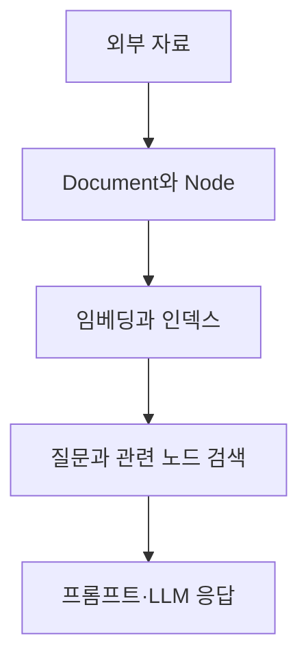

## 검색 최적화와 LlamaIndex·벡터 저장소

> [!NOTE]
> RAG의 성능은 생성 모델만이 아니라 **어떤 후보를 찾고, 얼마나 다양한 근거를 남기며, 어떤 순서로 다시 정렬하는가**에 크게 좌우된다.

---

## 검색기의 선택

<Tabs>
  <Tab label="키워드 검색">BM25는 정확한 단어 일치와 대규모 문서 검색에 강하지만, 표현이 다른 관련 문서를 놓치거나 긴 문서에 편향될 수 있다.</Tab>
  <Tab label="벡터 검색">임베딩 공간에서 의미가 가까운 문서를 찾는다. 표현 차이에 강하지만 임베딩 생성 비용과 모델 품질의 영향을 받는다.</Tab>
  <Tab label="결합 검색">MultiQuery는 질문 표현을 늘리고, Ensemble은 키워드·벡터 결과를 결합한다. 포괄성 대신 계산량과 조정 복잡도가 증가한다.</Tab>
</Tabs>

| 방식 | 얻는 것 | 주의점 |
| --- | --- | --- |
| MultiQuery | 여러 표현의 질문으로 재현율 확대 | 무관한 후보와 호출 비용 증가 |
| Ensemble | 서로 다른 검색기의 장점 결합 | 점수 통합과 튜닝 필요 |
| MMR | 관련성과 다양성의 균형 | 문서 간 유사도 계산 추가 |
| Rerank | 초기 후보를 질문 적합도순으로 재배치 | 재순위 모델의 언어·도메인 적합성 필요 |

---

## MMR의 조절점

MMR은 질문과 가까운 문서를 고르면서 이미 선택한 문서와의 중복을 줄인다.

- $\lambda=1$이면 질문과의 유사성을 우선한다.
- $\lambda=0$이면 결과 사이의 다양성을 우선한다.
- **k**는 최종 문서 수, **fetch_k**는 재선택 전에 모을 후보 수다.

> [!TIP]
> 유사 문서만 반복되면 다양성을 높이고, 근거가 질문에서 멀어지면 관련성 쪽으로 조정한다.

---

## 재순위화

초기 검색은 후보를 빠르게 모으고, reranker는 질문과 후보 문서를 다시 함께 읽어 상위 근거를 정교하게 고른다.

| 배포 범위 | 원문 예시 |
| --- | --- |
| 한국어 중심 | 한국어 데이터로 조정한 reranker |
| 다국어 서비스 | 여러 언어를 지원하는 reranker |

원문은 한국어 예시로 Dongjin-kr/ko-reranker를, 다국어 예시로 BAAI/bge-reranker-v2-m3를 제시한다. 두 이름은 구현 예시로만 보존하며 현재 지원 여부나 성능을 일반화하지 않는다.

---

## 검색에서 생성까지의 실제 체인

```python
template = """Answer the question based only on the following context:
{context}

Question: {question}"""
prompt = ChatPromptTemplate.from_template(template)
model = ChatOpenAI(model="gpt-4o-mini", temperature=0)
retriever = vectorstore.as_retriever()

rag_chain = (
    {
        "context": retriever | format_docs,
        "question": RunnablePassthrough(),
    }
    | prompt
    | model
    | StrOutputParser()
)
```

검색기는 문서를 가져오고, prompt는 문맥과 질문을 결합하며, model은 응답을 생성하고, parser는 메시지를 문자열로 변환한다.

---

## RAG Q&A 서비스의 구성

| 구성 요소 | 책임 |
| --- | --- |
| WikipediaLoader | 문서 수집 |
| RecursiveCharacterTextSplitter | 긴 문서 분할 |
| OpenAIEmbeddings | 텍스트의 벡터 표현 생성 |
| Chroma | 벡터 저장과 검색 |
| ChatOpenAI | 검색 문맥을 이용한 응답 생성 |
| RetrievalQA·PromptTemplate | 검색과 질문 응답 흐름 구성 |
| Streamlit | 입력·출력을 제공하는 웹 화면 |

Streamlit은 간단한 Python 코드로 데이터 앱을 만들고 코드 저장 시 화면을 갱신한다. 원문의 50행·3열 난수 예제는 화면과 차트 연결을 보여 주는 데 쓰인다.

---

## LlamaIndex의 역할



LlamaIndex는 데이터 로딩, 구조화, 인덱싱, 검색, LLM 연결을 모듈화해 RAG 구현을 단순화한다.

---

## 핵심 데이터 구조

| 구조 | 의미 |
| --- | --- |
| Document | 하나의 데이터 소스를 담는 컨테이너 |
| Node | Document를 나눈 검색 단위이며 메타데이터 포함 |
| Connector·Reader | 여러 소스를 읽어 Document와 Node 생성 |
| Index | 데이터를 질의 가능한 구조로 변환 |
| Query engine | 질문을 받아 관련 노드를 찾고 응답 생성 |

지원 소스 예시에는 텍스트, PDF, ePub, 문서 파일, 오디오와 웹 서비스가 포함된다.

<details>
<summary>최소 LlamaIndex 질의 흐름</summary>

```python
from llama_index.core import VectorStoreIndex, SimpleDirectoryReader

documents = SimpleDirectoryReader("data").load_data()
index = VectorStoreIndex.from_documents(documents)
query_engine = index.as_query_engine()
response = query_engine.query("질문을 입력하세요")
```

</details>

---

## 챗봇 구축 절차

1. 사용할 LLM과 임베딩 인터페이스를 정한다.
2. 벡터 저장소를 준비한다.
3. 입력 한도를 넘는 문서를 parser로 분할한다.
4. 노드를 임베딩하고 필요한 메타데이터를 추가한다.
5. 사용자 질문을 임베딩해 유사 노드를 찾는다.
6. 필요하면 post-processor로 후보를 다시 가공한다.
7. 프롬프트를 구성해 LLM에 전달한다.
8. 후보가 입력 한도를 넘으면 refine 방식으로 답을 누적한다.

표의 열 의미처럼 검색에는 쓰지 않지만 LLM에만 전달할 메타데이터도 설계할 수 있다.

---

## 로컬 모델과 데이터 커넥터

| 도구 | 원문에서의 역할 |
| --- | --- |
| Ollama | 모델 가중치·구성·데이터를 Modelfile 패키지로 묶고 로컬 LLM 실행을 지원 |
| LlamaHub | PDF, ePub, 문서, 오디오와 웹 서비스용 데이터 커넥터·에이전트 도구 제공 |

Ollama는 GPU를 포함한 로컬 실행 설정을 단순화하는 도구로 소개된다. 원문의 OS 지원 범위는 작성 시점 정보다.

---

## 벡터 저장소의 선택

| 저장소 | 형태 | 강점 |
| --- | --- | --- |
| FAISS | 로컬 라이브러리 | 대규모 고차원 벡터 검색 |
| Chroma | 오픈소스 DB | 로컬 환경에서 간단한 통합 |
| Qdrant | 벡터 DB | 비동기·실시간 애플리케이션 |
| Milvus | 패키지 예시 | 원문에 이름만 열거 |
| Pinecone | 클라우드 서비스 | 관리형 대규모 처리 |
| Weaviate | 클라우드 서비스 예시 | 원문에 이름만 열거 |

유사도는 코사인, 유클리드 거리, 맨해튼 거리 등으로 정의할 수 있다.

---

## Chroma 검색 설정

Chroma는 컬렉션 이름으로 저장 단위를 나누고, collection metadata에 코사인 공간을 지정할 수 있다.

<details>
<summary>코사인 유사도 저장소 예시</summary>

```python
db = Chroma.from_texts(
    texts,
    embeddings_model,
    collection_name="history",
    persist_directory="./db/chromadb",
    collection_metadata={"hnsw:space": "cosine"},
)
docs = db.similarity_search("누가 한글을 창제했나요?")
```

</details>

---

## FAISS 검색 구조

| 인덱스 | 방식 | 트레이드오프 |
| --- | --- | --- |
| IndexFlatL2 | 모든 벡터와 L2 거리 계산 | 높은 정확도, 큰 계산량 |
| IndexFlatIP | 내적 기반 검색 | 방향·코사인 유사도에 활용 |
| IndexIVFFlat | 가까운 클러스터 안에서 검색 | 대규모 검색 속도와 정확도 절충 |
| IndexIVFPQ·IndexPQ | 벡터를 양자화해 저장 | 메모리 절감 |
| IndexLSH | 유사 벡터를 같은 해시 버킷으로 매핑 | 매우 빠르나 정확도 저하 가능 |
| IndexHNSW | 계층 그래프를 따라 이웃 탐색 | 고차원에서 빠른 근접 검색 |
| IndexSQ | 차원별 스칼라 양자화 | 세밀한 압축 제어 |

---

## FAISS 실습의 독립 설정값

```html preview
<div style="font-family:system-ui,sans-serif;padding:20px">
  <div id="cards" style="display:flex;gap:14px;flex-wrap:wrap"></div>
  <script>
    var stats = [
      ['벡터 차원', '64', '난수 벡터 예제', 'var(--chart-2)'],
      ['저장 벡터', '1,000', '인덱스에 추가', 'var(--chart-1)'],
      ['최근접 이웃', 'k=5', '쿼리별 반환 수', 'var(--chart-5)']
    ];
    document.getElementById('cards').innerHTML = stats.map(function (s) {
      return '<div style="flex:1;min-width:150px;padding:16px;background:var(--card);' +
        'color:var(--card-foreground);border:1px solid var(--border);' +
        'border-radius:var(--radius)">' +
        '<div style="font-size:13px;color:var(--muted-foreground)">' + s[0] + '</div>' +
        '<div style="font-size:26px;font-weight:700;margin-top:4px">' + s[1] + '</div>' +
        '<div style="font-size:12px;font-weight:600;margin-top:4px;color:' + s[3] + '">' +
        s[2] +
        '</div>' +
        '</div>';
    }).join('');
  </script>
</div>
```

원문은 쿼리 벡터를 5개 생성하며, LlamaIndex와 결합한 별도 예제에서는 1,536차원 인덱스를 사용한다. 두 설정은 서로 다른 실습이다.

---

## LangChain으로 이어지는 경계

LangChain은 2022년 10월 공개된 LLM 애플리케이션 프레임워크로 소개된다.

| 구성 | 역할 |
| --- | --- |
| Core | 추상화·인터페이스·핵심 실행 구조 |
| Community·partner packages | 외부 서비스와 모델 통합 |
| Templates | 작업별 참조 아키텍처 |
| LangServe | 체인을 REST API로 배포 |
| LangSmith | 디버깅·테스트·평가·모니터링 |

프롬프트, 체인, 인덱스, 메모리, 에이전트가 다음 구간의 실행 단위를 이룬다.

> [!WARNING]
> 원문에는 비정상 따옴표, 생략된 코드, 패키지 철자 오류가 있다. LlamaIndex가 내부적으로 LangChain을 사용한다는 설명과 Ollama의 OS 지원 범위도 작성 시점의 주장으로 보존해야 하며, 현재 사실로 자동 교정하지 않는다.

---

## 핵심 정리

- 검색기는 키워드 정확성, 의미 유사성, 다양성, 비용 사이에서 선택한다.
- LlamaIndex는 외부 자료를 Document·Node·Index로 구조화한다.
- 벡터 저장소는 거리 함수와 인덱스 구조에 따라 속도·메모리·정확도가 달라진다.
- rerank와 metadata는 검색 후보를 실제 답변 근거로 정제하는 층이다.

---

## 원본 강의 흐름 인터랙티브

```html preview
<div style="font-family:system-ui,sans-serif;padding:20px;color:var(--foreground)">
  <label for="noteFlow528619" style="font-size:14px;font-weight:600">검색 최적화와 LlamaIndex·벡터 저장소 단계</label>
  <div id="noteFlow528619-out" style="font-size:26px;font-weight:700;color:var(--chart-1);margin:6px 0">검색 최적화와 LlamaIndex·벡터 저장소 핵심 개념</div>
  <input id="noteFlow528619" type="range" min="1" max="3" step="1" value="1" style="width:100%;accent-color:var(--primary)" />
  <p style="font-size:13px;color:var(--muted-foreground)">슬라이더를 움직이면 원본 PDF에서 정리한 이 노트의 흐름을 확인합니다.</p>
  <script>
    var noteFlow528619 = document.getElementById('noteFlow528619');
    var noteFlow528619Out = document.getElementById('noteFlow528619-out');
    var noteFlow528619Steps = ["검색 최적화와 LlamaIndex·벡터 저장소 핵심 개념","검색 최적화와 LlamaIndex·벡터 저장소 처리 절차","검색 최적화와 LlamaIndex·벡터 저장소 검증·응용"];
    noteFlow528619.addEventListener('input', function () { noteFlow528619Out.textContent = noteFlow528619Steps[Number(noteFlow528619.value) - 1]; });
  </script>
</div>
```
