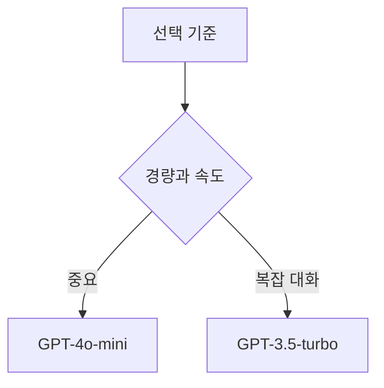

## ChatGPT 모델 선택과 활용 한계

> [!NOTE]
> 원본의 모델 비교는 속도·비용·문맥 이해·환경 제약을 함께 보는 선택 문제이며, 활용 구간은 정확성·문맥·감정·전문 분야의 한계도 함께 제시한다.

---

## 원본의 두 모델 비교

| 비교 기준 | GPT-3.5-turbo | GPT-4o-mini |
| :-- | :-- | :-- |
| 모델 성격 | 표준 GPT-3.5 모델 | 작고 경량화된 모델 |
| 응답 속도 | 매우 빠름 | 빠름 |
| 비용 | 저렴하고 비용 효율적 | 상대적으로 저렴 |
| 문맥 이해 | 기본적인 문맥 이해 | 향상된 문맥 이해 |
| 응답 품질 | 높은 품질의 자연어 처리 | GPT-4의 일부 기능 포함 |

> [!CAUTION]
> 이 표는 원본 제작 시점의 설명이다. 모델 이름, 제공 여부, 가격, 문맥 길이, 성능 우위는 바뀔 수 있으므로 현재의 제품 사양으로 재사용하면 안 된다.

---

## 선택 기준을 질문으로 바꾸기



빠른 프로토타입과 테스트 환경, 고객 지원과 문서 요약은 원본이 이 선택 기준에 붙인 대표 사례다.

---

## 대화와 지식 작업의 활용

<Tabs>
  <Tab label="고객·교육">

**고객 서비스:** 자동 응답과 FAQ 처리. **교육:** 개인 튜터링, 설명·예제·퀴즈·요약 생성. **목표:** 대기 시간과 반복 업무를 줄이고 자기주도 학습 지원.

  </Tab>
  <Tab label="콘텐츠·개발">

**콘텐츠:** 블로그·기사·소셜 미디어 초안과 아이디어. **개발:** 코드 작성·디버깅과 문서화. **문서:** 대량 자료 요약·분석과 주요 포인트 추출.

  </Tab>
  <Tab label="개인·전문">

**개인 비서:** 일정·할 일·정보 검색. **의료·상담:** 기초 정보와 초기 지원. **법률·금융:** 정보 제공·초안·문서 검토·상담 지원.

  </Tab>
</Tabs>

---

## 창작과 언어 활용

| 영역 | 원본의 활용 방식 |
| :-- | :-- |
| 게임 | 대화형 NPC와 스토리 전개 |
| 공동 창작 | 이야기와 캐릭터 아이디어 생성 |
| 번역 | 다국어 커뮤니케이션 지원 |
| 언어 학습 | 문법·어휘·발음 질문과 연습 |

---

## 정확성과 문맥의 한계

| 한계 | 원본의 설명 |
| :-- | :-- |
| 최신성 | 학습 데이터 이후 사건이 반영되지 않을 수 있음 |
| 허위 정보 | 사실이 아닌 내용을 생성할 수 있음 |
| 긴 대화 | 앞선 내용을 잊거나 잘못 이해할 수 있음 |
| 모호한 질문 | 의도와 다른 답을 만들 수 있음 |

---

## 감정·사회·창의성의 경계

- **감정 인식:** 사용자의 감정을 안정적으로 파악하거나 인간 수준의 정서적 지지를 제공하기 어렵다.
- **사회 규범:** 문화적 맥락과 규범을 충분히 이해하지 못해 부적절한 응답을 낼 수 있다.
- **창의성:** 학습된 패턴을 바탕으로 생성하므로 완전히 새로운 해결책을 보장하지 않는다.
- **맞춤화:** 개인의 배경·선호·요구를 충분히 알지 못하면 서로 다른 사용자에게 비슷한 답을 줄 수 있다.

---

## 전문 영역과 책임

> [!WARNING]
> 원본은 전문 분야의 활용에 전문가 검토가 필요한 경우가 많다고 경고한다.

| 제약 | 원본의 설명 |
| :-- | :-- |
| 법적·규제 문제 | 특정 산업에서 상업적 활용이 제한될 수 있음 |
| 전문 분야의 한계 | 의료·법률에서는 안정성과 정확성을 보장하기 어려움 |

---

## 원본의 문맥 창 설정값

```html preview
<div style="font-family:system-ui,sans-serif;padding:20px;color:var(--foreground)">
  <h3 style="margin:0 0 14px;font-size:15px;font-weight:600">원본의 문맥 창 (천 토큰)</h3>
  <div id="bars" style="display:flex;align-items:flex-end;gap:14px;height:170px"></div>
  <script>
    var data = [['GPT-3.5 Turbo', 16], ['GPT-4', 32]];
    var max = Math.max.apply(null, data.map(function (d) { return d[1]; }));
    document.getElementById('bars').innerHTML = data.map(function (d, i) {
      return '<div style="flex:1;display:flex;flex-direction:column;align-items:center;' +
        'gap:6px;height:100%;justify-content:flex-end">' +
        '<span style="font-size:12px;font-weight:600">' + d[1] + '</span>' +
        '<div style="width:100%;height:' + (d[1] / max * 100) + '%;' +
        'background:var(--chart-' + (i + 1) + ');' +
        'border-radius:var(--radius) var(--radius) 0 0"></div>' +
        '<span style="font-size:12px;color:var(--muted-foreground)">' + d[0] + '</span>' +
        '</div>';
    }).join('');
  </script>
</div>
```

> [!CAUTION]
> 차트의 모델 설정은 원본 제작 시점의 스냅숏이며 현재 문맥 길이로 해석하면 안 된다.

---

## 원본 오류와 시점 한계

> [!WARNING]
> 원본은 GPT-4o-mini를 GPT-4의 경량화 버전으로 표현하고, 일부 선택 기준에서는 복잡한 자연어 처리에 GPT-3.5-turbo를 선택하라고 설명한다. 이는 당시 강의의 비교 관점이며 현재 모델 우열로 확정할 수 없다. 법적·규제 문제 문장에는 “hatGPT”라는 오타가 있다.

---

## 정리

| 원본 범주 | 핵심 내용 | 함께 제시된 한계 |
| :-- | :-- | :-- |
| 모델 비교 | 속도·비용·문맥 이해·환경에 따른 선택 | 시점에 따라 정보가 달라짐 |
| 일반 활용 | 고객·교육·콘텐츠·개발·언어 작업 | 최신성과 허위 정보 |
| 대화 품질 | 긴 문맥과 모호한 질문 처리 | 일관성 저하 가능 |
| 사람 이해 | 감정·문화·개인 요구 반영 | 맞춤화와 사회적 맥락의 한계 |
| 전문 활용 | 의료·법률·금융 정보 지원 | 규제·정확성과 전문가 검토 |

---

## 원본 강의 흐름 인터랙티브

```html preview
<div style="font-family:system-ui,sans-serif;padding:20px;color:var(--foreground)">
  <label for="noteFlow2858610" style="font-size:14px;font-weight:600">ChatGPT 모델 선택과 활용 한계 단계</label>
  <div id="noteFlow2858610-out" style="font-size:26px;font-weight:700;color:var(--chart-1);margin:6px 0">ChatGPT 모델 선택과 활용 한계 핵심 개념</div>
  <input id="noteFlow2858610" type="range" min="1" max="3" step="1" value="1" style="width:100%;accent-color:var(--primary)" />
  <p style="font-size:13px;color:var(--muted-foreground)">슬라이더를 움직이면 원본 PDF에서 정리한 이 노트의 흐름을 확인합니다.</p>
  <script>
    var noteFlow2858610 = document.getElementById('noteFlow2858610');
    var noteFlow2858610Out = document.getElementById('noteFlow2858610-out');
    var noteFlow2858610Steps = ["ChatGPT 모델 선택과 활용 한계 핵심 개념","ChatGPT 모델 선택과 활용 한계 처리 절차","ChatGPT 모델 선택과 활용 한계 검증·응용"];
    noteFlow2858610.addEventListener('input', function () { noteFlow2858610Out.textContent = noteFlow2858610Steps[Number(noteFlow2858610.value) - 1]; });
  </script>
</div>
```
