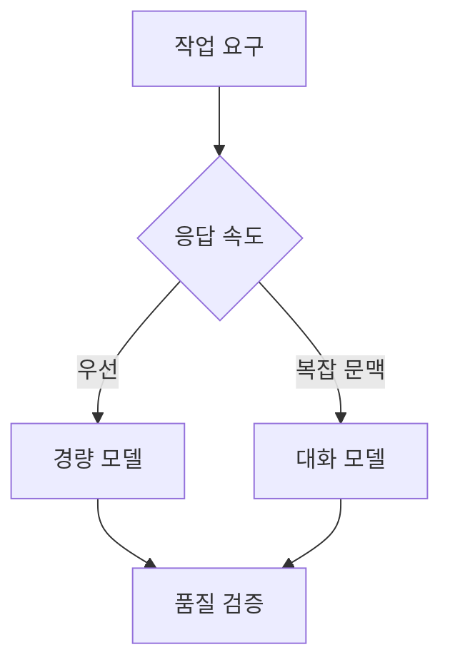
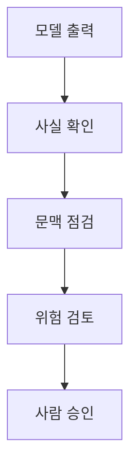

## ChatGPT 모델 선택과 활용 한계

> [!NOTE]
> 원본의 모델 비교는 속도·비용·문맥 이해·환경 제약을 함께 보는 선택 문제다. 활용 범위가 넓어질수록 사실 확인, 문맥 점검, 전문가 검토가 더 중요해진다.

---

## 원본의 두 모델 비교

| 비교 기준 | GPT-3.5-turbo | GPT-4o-mini |
| :-- | :-- | :-- |
| 모델 성격 | 표준 GPT-3.5 모델 | 작고 경량화된 모델 |
| 응답 속도 | 매우 빠름 | 빠름 |
| 비용 | 저렴하고 비용 효율적 | 상대적으로 저렴 |
| 문맥 이해 | 기본적인 문맥 이해 | 향상된 문맥 이해 |
| 응답 품질 | 높은 품질의 자연어 처리 | GPT-4의 일부 기능 포함 |
| 적합 사례 | 대화형 AI, 고객 서비스 | 저사양 환경, 빠른 응답 |

> [!CAUTION]
> 이 표는 원본 제작 시점의 설명이다. 모델 이름, 제공 여부, 가격, 문맥 길이, 성능 우위는 바뀔 수 있으므로 현재의 제품 사양으로 재사용하면 안 된다.

---

## 선택 기준을 질문으로 바꾸기

<Tabs>
  <Tab label="GPT-3.5-turbo">

원본은 자연스러운 대화, 실시간 상호작용, 고객 지원, 콘텐츠 생성, 문서 요약과 같은 작업에 연결한다.

  </Tab>
  <Tab label="GPT-4o-mini">

원본은 적은 자원, 모바일 앱, 빠른 프로토타입, 테스트 환경, 비용 효율이 중요한 경우에 연결한다.

  </Tab>
</Tabs>

**선택 질문**

- 응답 지연이 가장 중요한가?
- 긴 문맥이나 복잡한 대화가 필요한가?
- 요청량과 비용 한도가 정해져 있는가?
- 모델 출력 뒤에 별도 검증 단계가 있는가?

---

## 대화와 지식 작업의 활용

<Tabs>
  <Tab label="고객·교육">

- 고객 서비스: 자동 응답과 FAQ 처리
- 교육: 개인 튜터링, 설명과 예제, 퀴즈·요약 생성
- 목표: 대기 시간과 반복 업무를 줄이고 자기주도 학습 지원

  </Tab>
  <Tab label="콘텐츠·개발">

- 콘텐츠: 블로그, 기사, 소셜 미디어 초안과 아이디어
- 개발: 코드 작성·디버깅, API 문서와 사용자 매뉴얼 작성
- 문서: 대량 자료 요약, 분석, 주요 포인트 추출

  </Tab>
  <Tab label="개인·전문">

- 개인 비서: 일정, 할 일, 정보 검색
- 의료·상담: 기초 정보와 초기 지원
- 법률·금융: 정보 제공, 초안, 문서 검토, 상담 지원

  </Tab>
</Tabs>

---

## 창작과 언어 활용

| 영역 | 원본의 활용 방식 | 확인해야 할 경계 |
| :-- | :-- | :-- |
| 게임 | 대화형 NPC와 스토리 전개 | 일관성·안전 규칙 |
| 공동 창작 | 이야기와 캐릭터 아이디어 | 기존 패턴 모방 여부 |
| 번역 | 다국어 커뮤니케이션 지원 | 전문 용어와 문맥 검수 |
| 언어 학습 | 문법·어휘·발음 질문과 연습 | 설명의 정확성 |
| 문서 분석 | 요약과 주요 포인트 도출 | 누락과 왜곡 여부 |

> [!TIP]
> 활용 사례는 “모델이 최종 결정을 대신한다”가 아니라 “초안·탐색·설명·반복 작업을 지원한다”는 범위로 읽는 편이 안전하다.

---

## 정확성과 문맥의 한계

| 한계 | 원본의 설명 | 사용자가 할 일 |
| :-- | :-- | :-- |
| 최신성 | 학습 데이터 이후 사건이 반영되지 않을 수 있음 | 최신 근거 별도 확인 |
| 허위 정보 | 사실이 아닌 내용을 생성할 수 있음 | 출처와 원문 대조 |
| 긴 대화 | 앞선 내용을 잊거나 잘못 이해할 수 있음 | 핵심 조건 재제시 |
| 모호한 질문 | 의도와 다른 답을 만들 수 있음 | 목표·형식·범위 명시 |

---

## 감정·사회·창의성의 경계

- **감정 인식:** 사용자의 감정을 안정적으로 파악하거나 인간 수준의 정서적 지지를 제공하기 어렵다.
- **사회 규범:** 문화적 맥락과 규범을 충분히 이해하지 못해 부적절한 응답을 낼 수 있다.
- **창의성:** 학습된 패턴을 바탕으로 생성하므로 완전히 새로운 해결책을 보장하지 않는다.
- **맞춤화:** 개인의 배경·선호·요구를 충분히 알지 못하면 서로 다른 사용자에게 비슷한 답을 줄 수 있다.

모방적인 응답을 점검하는 질문

출력이 익숙한 문구를 단순 결합한 것은 아닌지, 사용자의 구체적 상황을 반영했는지, 다른 대안과 반례를 검토했는지 확인한다.

---

## 전문 영역과 책임

> [!WARNING]
> 의료, 법률, 금융과 같은 전문 영역에서 원본은 정보 제공과 상담 지원 사례를 제시하는 동시에 안정성과 정확성을 보장하기 어렵고 전문가 검토가 필요하다고 경고한다. 생성 결과를 진단·판단·계약·투자 결정으로 곧바로 사용하면 안 된다.

| 위험 | 영향 | 통제 |
| :-- | :-- | :-- |
| 사실 오류 | 잘못된 의사결정 | 근거 확인과 전문가 검토 |
| 개인정보 부족·과잉 입력 | 부적절한 개인화 또는 노출 | 최소 정보 원칙 |
| 법규 차이 | 산업별 규제 위반 | 적용 지역과 규정 확인 |
| 책임 주체 불명확 | 자동화 결과의 책임 공백 | 사람 승인 단계 유지 |

---

## 원본 오류와 시점 한계

> [!WARNING]
> 원본은 GPT-4o-mini를 GPT-4의 경량화 버전으로 표현하고, 일부 선택 기준에서는 복잡한 자연어 처리에 GPT-3.5-turbo를 선택하라고 설명한다. 이는 당시 강의의 비교 관점이며 현재 모델 우열로 확정할 수 없다. 법적·규제 문제 문장에는 “hatGPT”라는 오타가 있다.

문맥 길이 표기의 범위

원본은 gpt-4-32k와 gpt-3.5-turbo-16k 같은 설정값을 열거한다. 이 이름과 길이는 시점 의존적인 API 정보이므로 개념 이해용 기록으로만 유지한다.

---

## 정리

| 결정 단계 | 질문 | 실패를 줄이는 조치 |
| :-- | :-- | :-- |
| 모델 선택 | 속도·비용·문맥 중 무엇이 우선인가 | 실제 조건으로 비교 |
| 작업 설계 | 모델이 초안인지 최종 판단자인가 | 역할과 승인선 명시 |
| 출력 검토 | 최신성·사실성·문맥이 맞는가 | 근거와 입력 재점검 |
| 전문 활용 | 오류가 사람에게 큰 피해를 주는가 | 전문가 검토 필수 |
