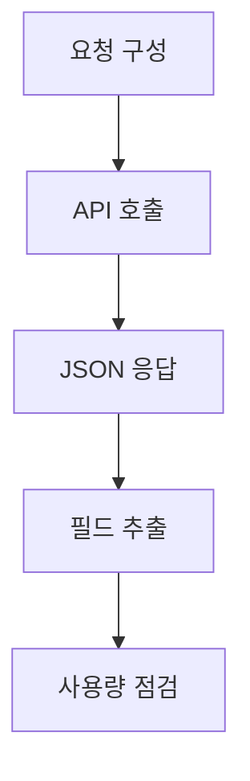
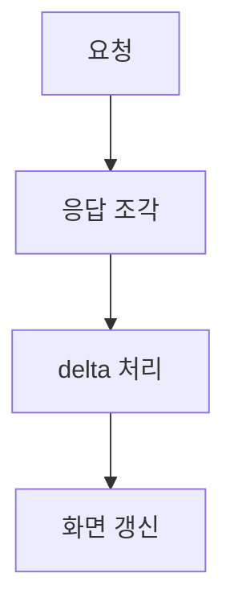
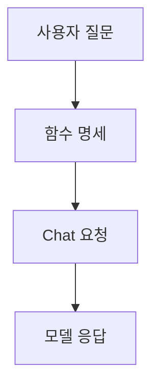

## OpenAI API 요청·응답과 도구 호출

> [!NOTE]
> API 연동은 모델 이름과 입력뿐 아니라 인증, 엔드포인트, 메시지 계약, JSON 응답, 예외, 사용량, 스트리밍과 도구 명세를 함께 다룬다.

---

## 연동 전에 확인할 계약

| 확인 항목 | 원본의 요구 | 실패 시 영향 |
| :-- | :-- | :-- |
| 모델 | 요청 목적에 맞는 모델 지정 | 지원하지 않는 기능 또는 요청 실패 |
| 입력 | role과 content 또는 작업별 입력 구성 | 의도와 다른 응답 |
| 응답 | JSON 구조에서 필요한 필드 추출 | 빈 값 또는 잘못된 경로 |
| 예외 | 요청 중 오류를 처리 | 사용자 흐름 중단 |
| 보안 | API 키를 안전하게 보관 | 무단 사용과 비용 발생 |
| 비용 | 사용량을 모니터링 | 예상하지 못한 청구 |
| 검증 | 요청·응답을 테스트하고 디버깅 | 통합 오류 누적 |

> [!CAUTION]
> 원본은 API 키를 안전한 곳에 보관하고 사용량을 모니터링해 비용을 관리하라고 설명한다.

---

## 엔드포인트와 기능의 대응

원본은 다음 경로와 모델 대응을 제시한다. 이는 제작 시점의 호환성 스냅숏이다.

| 엔드포인트 | 기능 | 원본의 모델 예 |
| :-- | :-- | :-- |
| `/v1/assistants` | 어시스턴트 생성·구성 | GPT-4o, GPT-4o-mini, GPT-4, GPT-3.5 Turbo 계열 |
| `/v1/chat/completions` | 메시지 기반 생성 | GPT-4o, GPT-4o-mini, GPT-4, GPT-3.5 Turbo 계열 |
| `/v1/completions` | legacy 문자열 완성 | gpt-3.5-turbo-instruct, babbage-002, davinci-002 |
| `/v1/embeddings` | 벡터 표현 생성 | text-embedding-3-small, text-embedding-3-large, text-embedding-ada-002 |
| `/v1/fine_tuning/jobs` | 미세조정 작업 | GPT-4o, GPT-4o-mini, GPT-4, GPT-3.5 Turbo |
| `/v1/audio/transcriptions` | 음성 인식 | whisper-1 |
| `/v1/audio/translations` | 음성 번역 | whisper-1 |
| `/v1/audio/speech` | 음성 합성 | tts-1, tts-1-hd |
| `/v1/images/generations` | 이미지 생성 | dall-e-2, dall-e-3 |
| `/v1/moderations` | 콘텐츠 검토 | text-moderation 계열 |
| `/v1/realtime` | 실시간 상호작용 | gpt-4o-realtime-preview 계열 |

> [!WARNING]
> “Latest models” 표와 모델 식별자는 시점 의존적이다. 특히 preview·beta·날짜가 붙은 모델과 Assistants 지원 범위는 현재 계약으로 간주하면 안 된다.

---

## 요청에서 응답까지



<Tabs>
  <Tab label="Assistants">

원본의 HTTP 예시는 이름, 설명, 모델, instructions를 담아 어시스턴트를 생성한다. 요약 도우미처럼 지속적인 역할과 지시를 하나의 객체로 구성하는 사례다.

  </Tab>
  <Tab label="Chat">

Chat Completions는 messages 배열을 보내 대화를 시작한다. 각 메시지는 발화 주체를 나타내는 role과 실제 입력인 content를 가진다.

  </Tab>
</Tabs>

---

## 안전한 SDK 요청 형태

```python
from openai import OpenAI

client = OpenAI()

completion = client.chat.completions.create(
    model="gpt-4o",
    messages=[
        {"role": "developer", "content": "You are a helpful assistant."},
        {"role": "user", "content": "Hello!"},
    ],
)

message = completion.choices[0].message
```

| 필드 | 의미 |
| :-- | :-- |
| `model` | 응답을 생성할 모델 |
| `messages` | 대화 이력을 담는 배열 |
| `role` | developer, user, assistant 등 발화 주체 |
| `content` | 텍스트 또는 복합 입력 |
| `choices` | 생성 후보 목록 |
| `message` | 선택된 후보의 메시지 객체 |

> [!TIP]
> 원본 예시는 `model`과 `messages`를 전달하고 반환된 `choices[0].message`를 읽는다.

---

## 응답 객체 읽기

| 응답 필드 | 원본의 설명 |
| :-- | :-- |
| `id` | 응답 고유 식별자 |
| `object` | `chat.completion` 객체 유형 |
| `created` | Unix timestamp |
| `model` | 응답에 사용된 모델 |
| `system_fingerprint` | 시스템 상태나 설정의 지문 |
| `choices[].index` | 후보 순서 |
| `choices[].message` | assistant 역할과 생성 내용 |
| `logprobs` | 로그 확률 정보 |
| `finish_reason` | 생성이 끝난 이유 |
| `service_tier` | 사용된 서비스 등급 |
| `usage` | 입력·출력·전체 토큰 사용량 |

### 원본의 사용량 예시

```html preview
<div style="font-family:system-ui,sans-serif;padding:20px;color:var(--foreground)">
  <h3 style="margin:0 0 14px;font-size:15px;font-weight:600">응답의 토큰 사용량</h3>
  <div id="bars" style="display:flex;align-items:flex-end;gap:14px;height:170px"></div>
  <script>
    var data = [['Prompt', 9], ['Completion', 12], ['Total', 21]];
    var max = Math.max.apply(null, data.map(function (d) { return d[1]; }));
    document.getElementById('bars').innerHTML = data.map(function (d, i) {
      return '<div style="flex:1;display:flex;flex-direction:column;align-items:center;' +
        'gap:6px;height:100%;justify-content:flex-end">' +
        '<span style="font-size:12px;font-weight:600">' + d[1] + '</span>' +
        '<div style="width:100%;height:' + (d[1] / max * 100) + '%;' +
        'background:var(--chart-' + (i + 1) + ');' +
        'border-radius:var(--radius) var(--radius) 0 0"></div>' +
        '<span style="font-size:12px;color:var(--muted-foreground)">' + d[0] + '</span>' +
        '</div>';
    }).join('');
  </script>
</div>
```

원본의 completion token details에서는 reasoning, accepted prediction, rejected prediction 항목이 모두 0이다.

> [!WARNING]
> 원본 JSON에는 `finish_reason`의 닫는 따옴표가 굽은 따옴표로 적혀 있고, `usage` 앞에는 여분의 따옴표가 있다. 또한 앞선 설명의 `response.choices[0].content`는 뒤의 `response.choices[0].message` 구조와 충돌한다. 그대로 실행 가능한 JSON이나 필드 경로로 복사하면 안 된다.

---

## 텍스트를 넘는 입력

원본의 이미지 입력 예시는 user 메시지의 content를 배열로 만들고 텍스트 항목과 image URL 항목을 함께 넣는다.

| content 항목 | 포함 정보 | 목적 |
| :-- | :-- | :-- |
| text | 이미지에 대한 질문 | 수행할 작업 전달 |
| image URL | 분석할 이미지 위치 | 시각 입력 전달 |

`max_tokens=300`은 content 배열의 항목이 아니라 요청 객체에 별도로 전달되는 생성 길이 매개변수다.

---

## 스트리밍 응답

스트리밍은 전체 응답이 끝날 때까지 기다리는 대신 준비된 조각을 순서대로 처리한다.



- `stream=True`로 스트리밍을 요청한다.
- 반환 객체를 순회하며 각 chunk를 받는다.
- 원본은 `chunk.choices[0].delta`에서 새로 생성된 부분을 읽는다.
- 긴 응답과 실시간 상호작용에서 점진적으로 결과를 보여 줄 수 있다.

---

## 도구 명세가 포함된 요청



| 도구 명세 요소 | 날씨 함수 예시의 역할 |
| :-- | :-- |
| `type` | function 도구임을 표시 |
| `name` | 호출 가능한 함수 이름 |
| `description` | 함수가 수행하는 일 |
| `parameters` | 입력 객체의 스키마 |
| `properties` | location과 unit 정의 |
| `required` | 반드시 필요한 location 지정 |
| `tool_choice` | 원본은 auto를 사용 |

---

## 로그 확률과 디버깅 단서

<Tabs>
  <Tab label="logprobs">

`logprobs=True`는 생성 토큰의 로그 확률 정보를 함께 반환하도록 요청한다.

  </Tab>
  <Tab label="top_logprobs">

원본은 `top_logprobs=2`로 상위 로그 확률 두 개를 요청한다.

  </Tab>
</Tabs>

---

## 정리

| 원본 단계 | 핵심 객체 | 확인 내용 |
| :-- | :-- | :-- |
| 인증 | API key, client | 키 보관 |
| 요청 | model, messages | 엔드포인트와 입력 형식 |
| 응답 | choices, message, usage | JSON 필드와 토큰 사용량 |
| 스트리밍 | chunk, delta | 조각 단위 응답 |
| 도구 명세 | tools, parameters | 함수 이름과 입력 스키마 |
| 확률 정보 | logprobs, top_logprobs | 상위 로그 확률 반환 |
