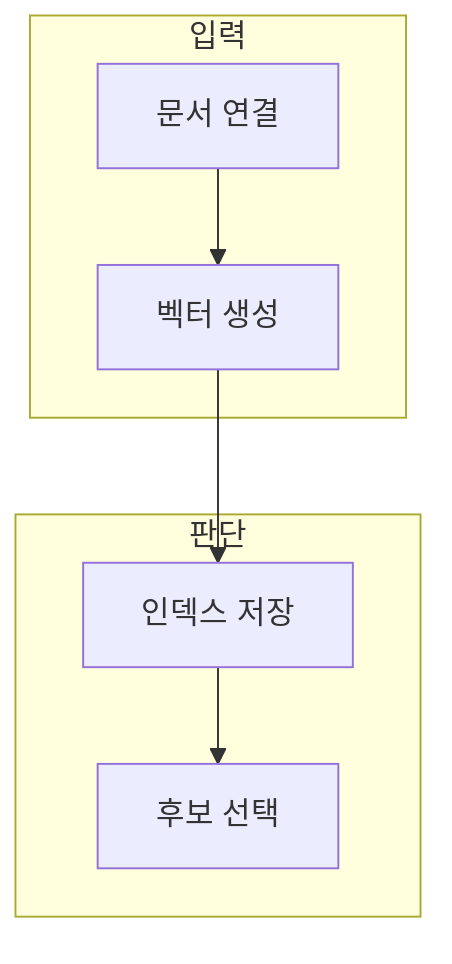

> [!abstract] 한 줄 요약
> 벡터 저장소는 임베딩만 담는 상자가 아니라 문서·메타데이터·검색 기준을 연결하는 검색 설계의 일부다.

## 이 노트의 지도



## 1. 연결 계층의 역할

데이터 연결 도구는 서로 다른 문서 원천을 읽고, 검색 가능한 노드와 메타데이터로 정리하는 흐름을 제공한다. ==메타데이터== 는 문서의 출처·시간·유형·권한처럼 검색 필터와 해석에 쓰는 부가 정보.

> [!note] 메타데이터
> 벡터 유사도만으로 권한·최신성·문서 유형을 해결할 수 없으므로 메타데이터 필터가 필요할 수 있다.

## 2. 다양성과 유사도

검색 결과가 서로 지나치게 비슷하면 근거 폭이 좁아질 수 있어, 관련성과 다양성을 함께 고려하는 전략을 쓴다.

<details>
<summary>벡터 비교의 예</summary>

벡터 방향의 유사도는 다음과 같이 표현할 수 있다.

$$
\cos(\theta) = \frac{\mathbf{u} \cdot \mathbf{v}}{\lVert\mathbf{u}\rVert\,\lVert\mathbf{v}\rVert}
$$

</details>

## 데이터로 보기

```html preview
<div style="font-family:system-ui,sans-serif;padding:20px">
  <div id="cards" style="display:flex;gap:14px;flex-wrap:wrap"></div>
  <script>
    var stats = [["문서","1","원천 연결","var(--chart-1)"],["벡터","1","의미 표현","var(--chart-2)"],["메타데이터","1","필터·해석","var(--chart-3)"]];
    document.getElementById('cards').innerHTML = stats.map(function (s) {
      return '<div style="flex:1;min-width:150px;padding:16px;background:var(--card);' +
        'color:var(--card-foreground);border:1px solid var(--border);' +
        'border-radius:var(--radius)">' +
        '<div style="font-size:13px;color:var(--muted-foreground)">' + s[0] + '</div>' +
        '<div style="font-size:26px;font-weight:700;margin-top:4px">' + s[1] + '</div>' +
        '<div style="font-size:12px;font-weight:600;margin-top:4px;color:' + s[3] + '">' +
        s[2] + '</div>' +
        '</div>';
    }).join('');
  </script>
</div>
```

> [!note] 저장소 수치의 한계
> 카드의 1은 저장소의 실제 개수·용량·성능을 나타내지 않고, 검색 설계의 세 요소를 구분한다.

## 핵심 정리

| 개념 | 정의 | 왜 중요한가 |
| :-- | :-- | :-- |
| 인덱스 | 검색용 구조 | 후보 조회를 돕는다 |
| 벡터 | 의미의 수치 표현 | 유사 후보를 찾는다 |
| 메타데이터 | 문서의 추가 속성 | 필터·설명·권한에 사용 |

## 관련 개념

- Embedding: 텍스트를 벡터로 표현하는 방법
- Rerank: 질문과 후보의 적합도를 다시 비교하는 단계

> [!question]- 스스로 점검
> **Q.** 벡터 유사도가 높은 문서만 선택하면 어떤 문제가 생길 수 있는가?
>
> **A.** 문서들이 서로 중복되거나 최신성·권한·유형 조건을 놓칠 수 있어 메타데이터와 다양성 기준을 함께 검토해야 한다.
