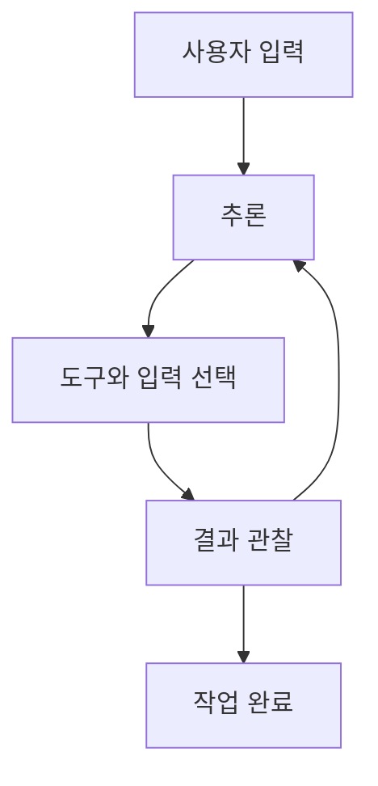

## LangChain 체인·에이전트·메모리와 LCEL

> [!NOTE]
> LangChain은 프롬프트, 모델, 출력 변환기, 도구와 메모리를 공통 인터페이스로 연결한다. **Chain은 정해진 경로를 실행하고, Agent는 관찰 결과에 따라 다음 행동을 선택한다.**

---

## 가장 작은 체인

| 구성 요소 | 입력과 출력 |
| --- | --- |
| ChatPromptTemplate | 변수에서 모델 입력 메시지 생성 |
| ChatOpenAI | 메시지를 받아 AIMessage 반환 |
| StrOutputParser | 모델 메시지를 문자열로 변환 |
| Chain | 앞 단계의 출력을 다음 단계 입력으로 연결 |

<details>
<summary>프롬프트·모델·파서 연결</summary>

```python
from langchain_core.prompts import ChatPromptTemplate
from langchain_core.output_parsers import StrOutputParser
from langchain_openai import ChatOpenAI

prompt = ChatPromptTemplate.from_template(
    "You are an expert in astronomy. Answer: {input}"
)
model = ChatOpenAI(model="gpt-4o-mini")
chain = prompt | model | StrOutputParser()
chain.invoke({"input": "지구의 자전 주기는?"})
```

</details>

---

## 여러 체인의 연결

첫 번째 체인의 결과를 다음 체인의 입력 키에 매핑하면 다단계 작업을 만들 수 있다.

1. 한국어 단어를 영어로 번역한다.
2. 번역된 단어를 사전식으로 설명하도록 두 번째 프롬프트에 전달한다.
3. 최종 결과를 다시 한국어 문자열로 파싱한다.

---

## Chain과 Agent

<Tabs>
  <Tab label="Chain">기능과 실행 순서가 미리 정해져 있다. 반복 가능한 변환과 요약에 적합하다.</Tab>
  <Tab label="Agent">요청과 관찰에 따라 어떤 도구를 어떤 순서로 쓸지 결정한다. 결과에 따라 다음 행동이 달라진다.</Tab>
</Tabs>

| 판단 기준 | Chain | Agent |
| --- | --- | --- |
| 경로 | 고정 | 동적 |
| 도구 선택 | 설계 시 결정 | 실행 중 결정 |
| 관찰 피드백 | 선택적 | 핵심 |

---

## 에이전트의 사고–행동 순환



ReAct는 Reason과 Act를 번갈아 수행하는 방식이다. 행동은 외부 환경에서 새로운 관찰을 얻고, 추론은 관찰을 바탕으로 내부 상태를 갱신한다.

---

## 에이전트 유형과 도구

| 유형 | 역할 |
| --- | --- |
| conversational-react-description | 대화 문맥을 포함하는 에이전트 |
| zero-shot-react-description | 도구 설명만으로 사용할 도구를 선택 |
| react-docstore | 문서 저장소와 상호작용 |
| self-ask-with-search | 중간 답을 검색 도구로 해결 |

원문 실습은 웹 검색 도구와 계산 도구를 함께 불러와 산술 계산과 서울 날씨 질문을 처리한다.

---

## Memory의 역할

Memory는 대화와 실행 과정에서 다음 추론에 필요한 상태를 유지한다.

| 유형 | 저장 방식과 용도 |
| --- | --- |
| Simple Memory | 단순 키·값, 복잡한 문맥에는 한계 |
| Persistent Memory | 파일·DB에 장기 저장 |
| Contextual Memory | 현재 대화 문맥을 빠르게 반영 |
| Distributed Memory | 분산 저장소로 대규모 상태 관리 |

LangChain 예시에는 전체 대화, 최근 K회, 최근 토큰, 대화 요약, 엔티티, 지식 그래프, 벡터 검색 기반 메모리가 제시된다.

---

## 대화 기억 실습

<details>
<summary>버퍼 메모리의 핵심 동작</summary>

```python
memory = ConversationBufferMemory(
    memory_key="chat_history",
    return_messages=True,
)

agent.run("우리집 반려견 이름은 몽실이입니다.")
agent.run("우리집 반려견 이름을 불러주세요.")
```

</details>

메모리 키와 프롬프트의 placeholder 이름이 일치해야 이전 메시지가 다음 호출에 포함된다.

---

## LangSmith로 실행 관찰

LangSmith는 LLM 애플리케이션의 개발, 모니터링, 테스트를 지원하는 추적 플랫폼으로 소개된다.

| 관찰 대상 | 진단 질문 |
| --- | --- |
| 검색 문서 | 질문과 관련된 근거가 선택되었는가 |
| 모델 입력·출력 | 프롬프트와 답변이 의도대로 이어지는가 |
| 실행 시간 | 어느 단계가 지연되는가 |
| 오류율·실행 횟수 | 실패가 특정 구성에 집중되는가 |
| 토큰·비용 | 불필요한 입력이나 반복이 있는가 |

검색 알고리즘을 바꿀지 프롬프트를 바꿀지는 trace의 단계별 기록으로 구분한다.

---

## Runnable 프로토콜

| 메서드 | 실행 방식 |
| --- | --- |
| invoke | 단일 입력을 동기 실행 |
| batch | 입력 목록을 동기 일괄 처리 |
| stream | 결과 조각을 순차적으로 반환 |
| ainvoke | 단일 입력을 비동기 실행 |
| abatch | 입력 목록을 비동기 실행 |
| astream | 비동기 결과 스트림 |
| astream_log | 최종 결과와 중간 단계를 함께 스트리밍 |

| Runnable | 책임 |
| --- | --- |
| RunnablePassthrough | 입력을 다음 단계로 전달 |
| RunnableMap | 입력에 처리 함수를 매핑 |
| RunnableFilter | 조건에 맞는 데이터 선택 |
| RunnableReduce | 여러 조각을 하나로 통합 |
| RunnableInvoke | 외부 함수·메서드 호출 |
| RunnableSequence·Parallel | 순차 또는 병렬 실행 |

---

## batch·stream·비동기 호출

<details>
<summary>같은 체인의 여러 실행 방식</summary>

```python
topics = ["지구 공전", "화산 활동", "대륙 이동"]
results = chain.batch([{"topic": topic} for topic in topics])

for chunk in chain.stream({"topic": "지진"}):
    print(chunk, end="")

async def run_async():
    return await chain.ainvoke({"topic": "해류"})
```

</details>

---

## LCEL

LCEL은 Runnable 구성 요소를 파이프 연산자로 연결해 데이터 흐름을 드러낸다.

```text
prompt | model | output_parser
```

- 앞 구성 요소의 출력이 뒤 구성 요소의 입력이 된다.
- 순차·병렬·조건형 Runnable을 조합할 수 있다.
- 동일 체인에 invoke, batch, stream, 비동기 인터페이스를 적용한다.
- 외부 시스템과의 통합도 Runnable 경계로 캡슐화한다.

---

## 프롬프트의 구성

| 요소 | 질문 |
| --- | --- |
| 지시 | 모델이 무엇을 해야 하는가 |
| 예시 | 원하는 작업 방식이나 출력 모양은 무엇인가 |
| 맥락 | 답변에 필요한 배경 정보는 무엇인가 |
| 질문 | 구체적으로 어떤 결과를 요구하는가 |

명확성, 필요한 배경, 핵심 정보, 열린 질문, 원하는 결과 형식과 문체를 함께 설계한다.

---

## PromptTemplate과 메시지 역할

<Tabs>
  <Tab label="PromptTemplate">문자열 변수로 단일 프롬프트를 만들고, 템플릿이나 문자열을 결합한다.</Tab>
  <Tab label="ChatPromptTemplate">system·human·AI·function·tool 메시지를 순서 있는 대화 입력으로 구성한다.</Tab>
  <Tab label="MessagesPlaceholder">기존 대화 메시지 목록을 프롬프트의 지정 위치에 삽입한다.</Tab>
</Tabs>

메시지 placeholder는 대화 요약이나 memory가 만든 기록을 다음 호출에 넣을 때 유용하다.

---

## Few-shot으로 이어지는 경계

Few-shot은 몇 개의 질문·답변 예시를 제공해 작업 형식과 판단 기준을 보여 준다. 예시 선택에는 고정 목록뿐 아니라 입력과 의미가 가까운 사례를 찾는 방식도 사용할 수 있다.

| 주요 입력 | 의미 |
| --- | --- |
| examples | 사용할 답변 예시 |
| example_prompt | 예시의 출력 형식 |
| prefix·suffix | 예시 앞뒤의 지시와 새 질문 |
| input_variables | 실행 시 채울 변수 |
| example_separator | 예시 사이 구분자 |

> [!WARNING]
> 원문에는 환경·영향 관련 오탈자, Memory 클래스 이름의 반복 철자 오류, placeholder 제목과 실제 클래스 이름의 불일치가 있다. SystemMessagePromptTemplate와 HumanMessagePromptTemplate를 가져오는 import 문장도 줄 중간에서 분절되어 그대로는 Python 문법 오류다. 일부 Agent·Memory API는 이전 인터페이스를 사용하므로 코드의 개념적 흐름과 현재 실행 가능성을 구분한다.

---

## 핵심 정리

1. Chain은 고정된 단계 연결, Agent는 관찰 기반의 동적 선택이다.
2. Memory는 다음 추론에 필요한 대화·실행 상태를 보존한다.
3. LangSmith trace는 검색·프롬프트·모델 중 어느 층을 조정할지 보여 준다.
4. Runnable과 LCEL은 동일 구성 요소에 단일·배치·스트림·비동기 실행을 제공한다.
