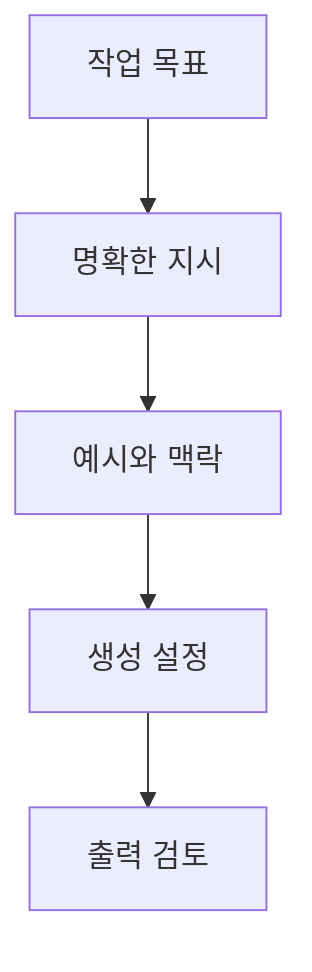

## Completion API 매개변수와 텍스트 생성

> [!NOTE]
> Completion은 자유 형식 문자열 prompt를 입력해 텍스트를 완성하는 계약이다. 좋은 결과를 얻으려면 작업 지시와 맥락을 분명히 하고, 생성 길이·무작위성·반복 억제를 목적에 맞게 조정해야 한다.

---

## Completion과 Chat의 입력 차이

| 관점 | Completion | Chat Completions |
| :-- | :-- | :-- |
| 입력 형태 | 하나의 연속된 prompt 문자열 | role과 content를 가진 messages 배열 |
| 대표 용도 | 단발성 질의응답, 글·코드 생성 | 대화 문맥과 역할 지시 |
| 출력 접근 | `choices[0].text` | 메시지 객체의 content |
| 원본 상태 | legacy API와 과거 모델 중심 | 당시의 대화형 API |

> [!CAUTION]
> 이 구간의 Completion 모델과 메서드는 원본 제작 시점의 legacy 예시다. 현재 사용 가능 여부를 전제로 하지 말고, 문자열 프롬프트와 생성 매개변수의 개념을 이해하는 자료로 사용한다.

---

## 프롬프트 엔지니어링의 구성

원본은 프롬프트 엔지니어링을 올바른 출력을 얻기 위해 지시, 예시, 필요한 맥락을 구성하는 과정으로 설명한다.



| 구성 요소 | 질문 |
| :-- | :-- |
| 작업 | 모델이 무엇을 해야 하는가 |
| 형식 | 어떤 언어·길이·구조로 답해야 하는가 |
| 맥락 | 학습 데이터에 없을 수 있는 어떤 정보가 필요한가 |
| 예시 | 원하는 입력과 출력의 패턴을 보여 주는가 |
| 검토 | 결과가 사실·형식·목적을 만족하는가 |

---

## 문자열 프롬프트 요청

```python
from openai import OpenAI

client = OpenAI()

response = client.completions.create(
    model="gpt-3.5-turbo-instruct",
    prompt="커피 전문점을 위한 짧은 문구를 작성해주세요.",
)

text = response.choices[0].text.strip()
```

> [!TIP]
> 코드는 원본의 구조를 읽기 쉽게 정규화한 역사적 예시다. 자격 증명 문자열은 포함하지 않으며 SDK가 실행 환경에서 읽도록 둔다.

---

## temperature와 생성 길이

| 설정 | 원본 범위·기본값 | 원본의 해석 | 대표 작업 |
| :-- | :-- | :-- | :-- |
| temperature | 0~2, 기본 1 | 낮을수록 예측 가능, 높을수록 무작위성 증가 | 코드·요약 ↔ 시·아이디어 |
| max_tokens | 최대 생성 토큰 수 | 출력 길이의 상한 | 응답 길이 관리 |

<Tabs>
  <Tab label="낮은 값">

0에 가까우면 확률이 높은 토큰을 선택하는 경향이 강해진다. 원본은 코드 생성, 간단한 요약, 공식적 응답을 예로 든다.

  </Tab>
  <Tab label="기본값">

1은 창의성과 다양성을 어느 정도 유지하는 일반적인 설정으로 설명된다. 이야기와 마케팅 문구가 예시다.

  </Tab>
  <Tab label="높은 값">

2에 가까우면 예상하지 못한 출력을 만들 수 있지만 응답 품질이 낮아질 수 있다. 시와 창의적 아이디어가 예시다.

  </Tab>
</Tabs>

---

## 반복과 새 주제의 제어

| 설정 | 범위·기본값 | 음수 방향 | 양수 방향 |
| :-- | :-- | :-- | :-- |
| frequency_penalty | -2.0~2.0, 기본 0 | 동일 단어 반복 제한이 약함 | 반복 단어를 강하게 억제 |
| presence_penalty | -2.0~2.0, 기본 0 | 새 단어 도입을 억제 | 새 단어와 주제를 적극 도입 |
| top_p | 상위 누적 확률 범위 | 낮으면 후보를 좁힘 | 원본은 상세 범위를 제시하지 않음 |

> [!IMPORTANT]
> 높은 penalty가 항상 좋은 것은 아니다. frequency_penalty가 지나치면 비문법적 문장이 생길 수 있고, presence_penalty가 지나치면 주제에서 벗어날 수 있다고 원본은 설명한다.

---

## 나머지 Completion 매개변수

| 매개변수 | 원본의 설명 |
| :-- | :-- |
| `n` | 생성 결과 수, 기본값 1 |
| `stream` | 진행 상황 스트리밍 여부, 기본값 false |
| `logprobs` | 선택된 토큰의 확률 정보 |
| `echo` | 결과와 함께 prompt 반환, 기본값 false |
| `stop` | 생성을 멈출 문자열, 최대 4개 |
| `best_of` | 서버에서 여러 결과를 만든 뒤 최선의 결과 반환, 기본값 1 |
| `logit_bias` | 지정 토큰의 생성 가능성 조정 |
| `user` | 최종 사용자 식별 정보 |

<details>
<summary>interactive-control을 사용하지 않는 이유</summary>

원본은 일부 매개변수의 최소·최대·기본값을 제시하지만 조절 step은 제공하지 않는다. 따라서 범위 슬라이더를 만들지 않고 표로만 범위를 보존한다.

</details>

---

## 세 가지 텍스트 생성 사례

<Tabs>
  <Tab label="질의응답">

“인공지능에 대해 알려주세요”라는 질문에 `temperature=0`, `max_tokens=500`을 사용한다. 사실 중심의 집중된 답변을 의도한 예다.

  </Tab>
  <Tab label="요약">

긴 AI 설명 뒤에 요약 지시를 붙이고 `temperature=0`, `max_tokens=500`을 사용한다. 원본은 prompt 끝에서 작업을 명확히 지정한다.

  </Tab>
  <Tab label="번역">

한국어 문장과 “영어:”라는 출력 시작점을 함께 제공하고 `temperature=0`을 사용한다. 입력·출력 언어의 대응을 prompt 안에 직접 보여 준다.

  </Tab>
</Tabs>

| 공통 단계 | 구현 |
| :-- | :-- |
| 지시 작성 | 질문, 요약, 번역 목표를 prompt에 명시 |
| 보수적 생성 | 세 사례에서 temperature 0 사용 |
| 응답 추출 | `choices[0].text`를 읽고 앞뒤 공백 제거 |
| 결과 검토 | 작업 형식과 내용 확인 |

---

## 원본에 열거된 모델

| 모델군 | 원본의 설명 |
| :-- | :-- |
| text-davinci 계열 | 복잡한 prompt, 고품질 생성, 요약·번역·이야기·추론 |
| text-curie 계열 | 더 가볍고 빠르며 질의응답·감정 분석·중급 콘텐츠에 사용 |
| gpt-4o | 높은 성능과 더 높은 토큰 비용 |
| gpt-4o-mini | 더 빠르고 낮은 토큰 비용 |
| o1 | 느리지만 고급 추론·코딩·다단계 계획에 사용 |

> [!WARNING]
> text-davinci와 text-curie 목록은 legacy 모델 정보이며 gpt-4o·o1 설명도 시점 의존적이다. 원본의 “-001이 붙지 않은 모델은 파인튜닝 전 사전학습 모델”이라는 문구는 일반 규칙으로 신뢰하면 안 된다.

---

## 원본의 세 가지 생성 설정

| 목적 | temperature | frequency_penalty | presence_penalty |
| :-- | --: | --: | --: |
| 사실 기반·간결 | 0.2 | 0 | 0 |
| 창의적·독창적 | 1.5 | 0.5 | 1.5 |
| 중복을 줄인 균형 | 1.0 | 1.0 | 1.0 |

> [!CAUTION]
> 위 값은 원본의 예시 조합이지 보편적인 최적값이 아니다. 실제 prompt와 평가 기준으로 출력 품질을 확인해야 한다.

---

## Completion 응답 구조

| 필드 | 원본의 의미 |
| :-- | :-- |
| `id` | 생성 응답의 고유 ID |
| `object` | 객체 유형 |
| `created` | Unix timestamp 형식의 생성 시점 |
| `model` | 사용된 모델 |
| `choices` | text, index, logprobs, finish_reason를 담은 후보 목록 |
| `usage` | prompt, completion, total token 수 |

> [!WARNING]
> 원본은 Completion 응답의 `object` 값을 `chat.completion`으로 적어 API 계열이 혼재한다. 또 매개변수 표의 `logprobs` 설명은 사실상 `top_p` 설명과 중복되어 있다. 코드의 모델 이름에는 ASCII 하이픈이 아닌 문자가 섞여 있으므로 그대로 복사하면 안 된다.

---

## 정리

| 설계 축 | 핵심 질문 | 원본의 제어점 |
| :-- | :-- | :-- |
| 입력 | 작업과 맥락이 문자열에 분명한가 | prompt |
| 길이 | 출력 상한이 필요한가 | max_tokens |
| 무작위성 | 예측 가능성과 창의성 중 무엇이 중요한가 | temperature, top_p |
| 반복 | 같은 단어를 얼마나 억제할 것인가 | frequency_penalty |
| 주제 확장 | 새 단어와 주제를 얼마나 허용할 것인가 | presence_penalty |
| 응답 | 어떤 후보와 사용량을 읽을 것인가 | choices, usage |
