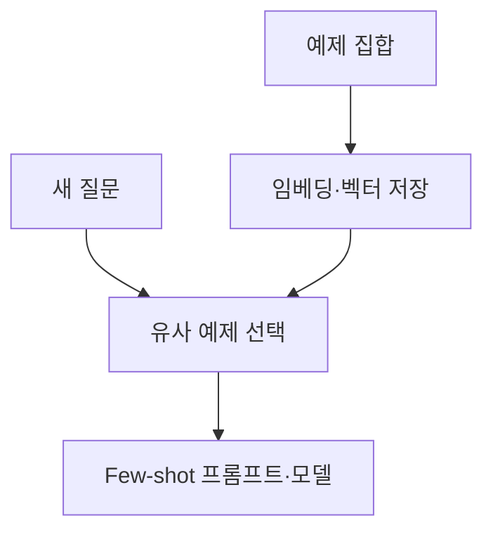

## Few-shot 프롬프트·모델·출력 파서와 도구

> [!NOTE]
> 이 구간은 **적절한 예시를 고르고, 모델을 호출하고, 결과를 검증 가능한 구조로 바꾸는 흐름**을 다룬다. 도구와 체인은 이 구조화된 출력을 다음 행동으로 연결한다.

---

## 고정 예시와 동적 예시

<Tabs>
  <Tab label="고정 Few-shot">미리 정한 예시를 모두 프롬프트에 넣는다. 동작이 단순하고 재현하기 쉽지만 예시가 많아지면 입력이 길어진다.</Tab>
  <Tab label="동적 Few-shot">새 질문과 관련된 예시만 selector로 고른다. 입력을 줄이고 관련성을 높일 수 있지만 임베딩과 검색 단계가 추가된다.</Tab>
</Tabs>

원문은 과학 질문·답변 예시를 사용해 화성의 표면, 지구의 자전, 광합성 같은 새 질문에 맞는 사례를 선택한다.

---

## 예제 선택 흐름



FewShotPromptTemplate은 examples, example_prompt, suffix, input variables를 결합한다. SemanticSimilarityExampleSelector 예제는 가장 가까운 사례 1개를 고른다.

---

## ExampleSelector 비교

| Selector | 선택 기준 | 주요 설정 |
|---|---|---|
| LengthBasedExampleSelector | 문자열 길이 | examples, example_prompt, max_length |
| SemanticSimilarityExampleSelector | 입력과의 코사인 유사도 | embeddings, vector store, k |
| MaxMarginalRelevanceExampleSelector | 관련성과 예시 다양성 | embeddings, vector store, k |

LengthBased 실습은 반의어 예시와 최대 길이 10을 사용한다.

<details>
<summary>의미 유사도 예제 선택</summary>

```python
selector = SemanticSimilarityExampleSelector.from_examples(
    examples,
    OpenAIEmbeddings(),
    Chroma,
    k=1,
)
selected = selector.select_examples(
    {"question": "화성의 표면이 붉은 이유는 무엇인가요?"}
)
```

</details>

---

## FewShotChatMessagePromptTemplate

고정 예시는 human 입력과 AI 출력 메시지 쌍으로 구성한다. 동적 방식은 selector가 고른 메시지를 system 지시와 새 human 입력 사이에 넣는다.

| 메시지 | 역할 |
|---|---|
| system | 모델의 역할과 답변 기준 |
| few-shot examples | 작업 방식의 구체적 사례 |
| human | 새 입력 |
| AI response | 모델이 생성한 결과 |

---

## LLM과 Chat Model

<Tabs>
  <Tab label="LLM">문자열을 입력받아 문자열을 반환한다. 요약, 생성, 단일 질의 같은 작업에 적합하다.</Tab>
  <Tab label="Chat Model">역할이 있는 메시지 목록을 입력받아 하나의 AI 메시지를 반환한다. 연속 대화와 문맥 관리에 적합하다.</Tab>
</Tabs>

| 통합 예시 | 입력 구조 | 원문 모델 예시 |
|---|---|---|
| OpenAI | 문자열 또는 채팅 메시지 | gpt-4o-mini |
| Anthropic | system·user 메시지 | Claude Haiku 계열 |
| Google | system·user 메시지 | Gemini Flash 계열 |

모델명과 패키지 경로는 작성 시점의 구현 예시다.

---

## 모델 파라미터 전달

| 경로 | 용도 |
|---|---|
| 인스턴스 생성 시 | 공통 기본값 설정 |
| invoke 호출 시 | 한 번의 요청만 다른 값 적용 |
| bind | 기존 모델을 특정 설정으로 묶어 체인에 연결 |

원문 예시는 temperature 0.7, 최대 토큰 100, frequency penalty 0.5, presence penalty 0.5와 줄바꿈 정지 조건을 사용한다. 값의 허용 범위나 최적값은 제시하지 않는다.

---

## max_tokens 설정 비교

```html preview
<div style="font-family:system-ui,sans-serif;padding:20px;color:var(--foreground)">
  <h3 style="margin:0 0 14px;font-size:15px;font-weight:600">호출별 최대 토큰 설정</h3>
  <div id="bars" style="display:flex;align-items:flex-end;gap:14px;height:170px"></div>
  <script>
    var data = [['기본 모델', 100], ['bind 호출', 10]];
    var max = Math.max.apply(null, data.map(function (d) { return d[1]; }));
    document.getElementById('bars').innerHTML = data.map(function (d, i) {
      return '<div style="flex:1;display:flex;flex-direction:column;align-items:center;' +
        'gap:6px;height:100%;justify-content:flex-end">' +
        '<span style="font-size:12px;font-weight:600">' + d[1] + '</span>' +
        '<div style="width:100%;height:' + (d[1] / max * 100) + '%;' +
        'background:var(--chart-' + (i + 1) + ');' +
        'border-radius:var(--radius) var(--radius) 0 0"></div>' +
        '<span style="font-size:12px;color:var(--muted-foreground)">' + d[0] + '</span>' +
        '</div>';
    }).join('');
  </script>
</div>
```

이는 성능 측정값이 아니라 같은 질문에 적용한 출력 상한 설정의 비교다.

---

## Output Parser의 책임

모델의 자유 형식 텍스트를 애플리케이션이 처리할 수 있는 구조로 바꾼다.

1. 출력에서 필요한 필드를 식별한다.
2. 원하는 형식을 프롬프트 지시에 포함한다.
3. 모델 출력을 목록·사전·JSON·날짜 등으로 파싱한다.
4. 실패하면 오류를 감지하거나 보정한다.
5. 구조화된 결과를 다음 체인이나 도구에 전달한다.

---

## 출력 파서 선택

| Parser | 출력 |
|---|---|
| PydanticOutputParser | 정의한 자료 구조에 맞춘 객체 |
| CommaSeparatedListOutputParser | 쉼표로 나뉜 목록 |
| StructuredOutputParser | 여러 key/value 필드 |
| JsonOutputParser | 지정한 JSON 구조 |
| PandasDataFrameOutputParser | 표 데이터 처리 결과 |
| DatetimeOutputParser | 날짜·시간 |
| EnumOutputParser | 허용된 열거 값 |
| OutputFixingParser | 파싱 오류 보정 시도 |

---

## 목록과 JSON 파싱

<details>
<summary>쉼표 목록 파서</summary>

```python
parser = CommaSeparatedListOutputParser()
instructions = parser.get_format_instructions()
prompt = PromptTemplate(
    template="List five {subject}.\n{format_instructions}",
    input_variables=["subject"],
    partial_variables={"format_instructions": instructions},
)
chain = prompt | model | parser
```

</details>

<details>
<summary>JSON 자료 구조 파서</summary>

```python
class CuisineRecipe(BaseModel):
    name: str = Field(description="name of a cuisine")
    recipe: str = Field(description="recipe to cook the cuisine")

parser = JsonOutputParser(pydantic_object=CuisineRecipe)
chain = prompt | model | parser
```

</details>

---

## Chain의 분류

| 계열 | 예시 책임 |
|---|---|
| 제네릭 체인 | 단일 LLM 호출, 단일·다중 입출력의 순차 연결 |
| 인덱스 체인 | 검색 기반 질의응답, 출처 포함 응답, 요약 |
| 유틸리티 체인 | Python·SQL·수학·shell·웹 요청·검토·moderation 연결 |

체인 이름은 원문 목록을 개념적으로 묶은 것이며, 현재 패키지에서의 존속 여부는 별도 확인 대상이다.

---

## Tool과 Agent

Tool은 Agent의 행동 단계가 실행하는 기능이다. 외부 환경에 영향을 주고 결과를 관찰로 돌려준다.

<Tabs>
  <Tab label="계산·코드">python_repl, 수학 추론 도구, terminal 계열이 예시로 제시된다.</Tab>
  <Tab label="검색·지식">웹 검색, Wikipedia, Wolfram Alpha, 뉴스·영화·팟캐스트 검색이 포함된다.</Tab>
  <Tab label="외부 API">날씨 API와 HTTP 요청 도구처럼 실행 시 네트워크나 인증이 필요한 기능이다.</Tab>
</Tabs>

> [!CAUTION]
> 코드 실행, 터미널, 웹 요청 도구는 모델 출력만으로 바로 실행하지 않는다. 입력 검증과 권한 제한이 필요하다.

---

## 보충 항목

| 항목 | 원문에서의 위치 |
|---|---|
| Prompt engineering | 공식 가이드의 진입점만 제시 |
| ChromaDB | 임베딩 저장과 빠른 유사도 검색, 다국어·간단한 통합 |
| Ollama | 로컬 LLM 다운로드·모델 라이브러리 진입점 |

Ollama 부록은 실제 설치 명령이나 검증 절차 없이 화면과 주소 중심으로 끝나므로 완결된 실습으로 볼 수 없다.

> [!WARNING]
> 원문에는 Few-shot, cuisine, chain 이름, 터미널·질문 관련 철자 오류가 있다. 일부 parser·chain·agent 명칭과 import 경로도 버전 의존적이다. 불완전한 부록과 URL만 있는 슬라이드는 새로운 절차로 보충하지 않는다.

---

## 핵심 정리

- Few-shot은 예시의 개수보다 새 입력에 맞는 예시 선택이 중요하다.
- LLM과 Chat Model은 입력·출력 자료형과 문맥 관리 방식이 다르다.
- 호출 파라미터는 기본값, 일회성 override, bind로 적용 범위를 나눈다.
- Output Parser는 자연어 출력을 목록·JSON·자료 구조로 바꾼다.
- Tool은 외부 행동 경계이므로 권한과 실패 처리가 필요하다.
