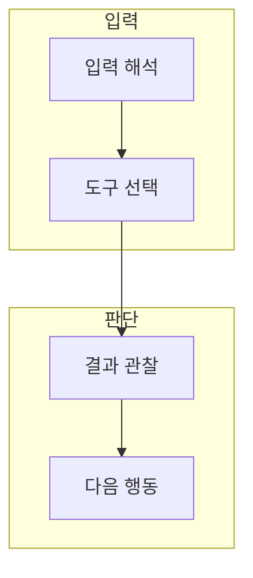

> [!abstract] 한 줄 요약
> 체인은 미리 정한 흐름을, 에이전트는 관찰에 따라 도구와 다음 단계를 고르는 흐름을 다룬다.

## 이 노트의 지도



## 1. 체인과 에이전트

체인은 정해진 입력·출력 연결을 재현하기 좋고, 에이전트는 상황에 따라 도구 사용과 다음 행동을 선택한다. ==도구 호출== 는 모델 출력이 아닌 외부 기능·데이터·작업을 요청하는 단계.

> [!warning] 도구 권한
> 도구 호출은 모델의 언어 능력과 별개로 권한·입력 검증·실행 기록이 필요하다.

## 2. 추적과 메모리

실행 기록은 어떤 입력·도구·결과가 최종 답에 영향을 줬는지 확인하게 하고, 메모리는 저장 범위와 민감 정보를 설계해야 한다.

<details>
<summary>에이전트 실행 체크</summary>

- 도구를 쓸 조건
- 허용된 입력과 권한
- 결과 검증과 실패 처리
- 추적 로그와 메모리 보존 범위

</details>

## 데이터로 보기

```html preview
<div style="font-family:system-ui,sans-serif;padding:20px;color:var(--foreground)">
  <label for="amt" style="font-size:14px;font-weight:600">예시 도구 호출 단계</label>
  <div id="out" style="font-size:30px;font-weight:700;color:var(--chart-1);margin:6px 0">단계 3</div>
  <input id="amt" type="range" min="1" max="8" step="1" value="3"
    style="width:100%;accent-color:var(--primary)" />
  <p style="font-size:13px;color:var(--muted-foreground)">값을 바꿔 다단계 실행이 늘수록 관찰·검증 지점도 늘어난다는 점을 생각한다.</p>
  <script>
    var amt = document.getElementById('amt');
    var out = document.getElementById('out');
    amt.addEventListener('input', function () {
      out.textContent = '단계 ' + Number(amt.value).toLocaleString();
    });
  </script>
</div>
```

> [!warning] 도구 실행 경계
> 단계 수는 실제 성능이나 안전성을 뜻하지 않는다. 도구 권한과 결과 검증은 각 단계에서 필요하다.

## 핵심 정리

| 개념 | 정의 | 왜 중요한가 |
| :-- | :-- | :-- |
| 체인 | 정해진 실행 연결 | 재현 가능한 흐름 구성 |
| 에이전트 | 상황에 따른 다음 행동 선택 | 유연하지만 관찰 필요 |
| 추적 | 실행의 기록 | 원인 분석과 검증을 돕는다 |

## 관련 개념

- API 계약: 도구의 입력·출력 형식을 확인하는 방법
- 보안 경계: 외부 실행 전 권한과 영향을 검토하는 방법

> [!question]- 스스로 점검
> **Q.** 에이전트가 도구를 선택할 수 있으면 왜 더 많은 검증이 필요한가?
>
> **A.** 언어 출력이 실제 외부 작업으로 이어질 수 있어, 권한·입력·결과·실패 처리를 명시해야 하기 때문이다.
