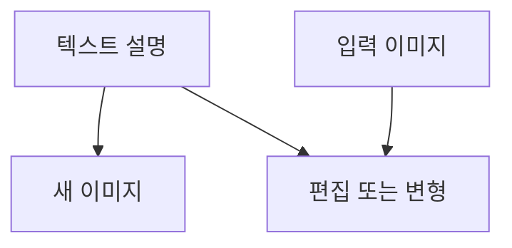

> [!NOTE]
> 이미지 API는 새 이미지 생성, 마스크 기반 부분 편집, 입력 이미지 변형의 세 작업으로 나뉘며 원문에서는 편집과 변형을 DALL·E 2에만 연결한다.

---

## 세 가지 이미지 작업

| 작업 | 입력 | 원문 모델 범위 | 결과 |
| :-- | :-- | :-- | :-- |
| 생성 | 텍스트 프롬프트 | DALL·E 3, DALL·E 2 | 처음부터 만든 이미지 |
| 편집 | 원본 이미지, 마스크, 프롬프트 | DALL·E 2 | 지정 영역을 바꾼 이미지 |
| 변형 | 원본 이미지 | DALL·E 2 | 입력을 바탕으로 한 다른 버전 |

<Tabs>
  <Tab label="생성">프롬프트가 장면과 스타일을 설명하고, 크기·품질·결과 수를 함께 지정한다.</Tab>
  <Tab label="편집">투명 영역을 가진 마스크로 변경 위치를 지정하고 프롬프트로 새 내용을 설명한다.</Tab>
  <Tab label="변형">원본 PNG를 입력해 실험적 디자인이나 브랜딩에 사용할 변형을 만든다.</Tab>
</Tabs>



---

## 원문이 제시한 요청 한계

```html preview
<div style="font-family:system-ui,sans-serif;padding:20px">
  <div id="cards" style="display:flex;gap:14px;flex-wrap:wrap"></div>
  <script>
    var stats = [
      ['DALL·E 3 요청', '1개', '한 번의 요청', 'var(--chart-2)'],
      ['DALL·E 2 요청', '최대 10개', 'n 매개변수', 'var(--chart-1)'],
      ['편집 이미지', '4MB 미만', '정사각형 PNG', 'var(--chart-5)']
    ];
    document.getElementById('cards').innerHTML = stats.map(function (s) {
      return '<div style="flex:1;min-width:150px;padding:16px;background:var(--card);' +
        'color:var(--card-foreground);border:1px solid var(--border);' +
        'border-radius:var(--radius)">' +
        '<div style="font-size:13px;color:var(--muted-foreground)">' + s[0] + '</div>' +
        '<div style="font-size:26px;font-weight:700;margin-top:4px">' + s[1] + '</div>' +
        '<div style="font-size:12px;font-weight:600;margin-top:4px;color:' + s[3] + '">' +
        s[2] + '</div>' +
        '</div>';
    }).join('');
  </script>
</div>
```

> [!NOTE]
> 원문은 DALL·E 3에서 추가 이미지가 필요하면 병렬 요청을 사용할 수 있다고 덧붙인다.

| 모델·작업 | 원문 크기·품질 조건 |
| :-- | :-- |
| DALL·E 3 생성 | 1024×1024, 1024×1792, 1792×1024 |
| DALL·E 3 품질 | 표준 또는 세부 묘사를 강화한 hd |
| 구형 Image 설명 | 256×256, 512×512, 1024×1024 |
| DALL·E 2 실습 | 512×512 생성, 1024×1024 편집·변형 |

> [!TIP]
> 원문은 정사각형·표준 품질 생성이 가장 빠르다고 설명한다. 이는 해당 자료의 모델과 API 시점에 한정된 비교다.

---

## 생성 요청의 구성

| 필드 | 역할 | 원문 제약 |
| :-- | :-- | :-- |
| prompt | 생성할 이미지 설명 | 한 표에서 최대 1,000자 |
| size | 출력 크기 | 모델·API 설명에 따라 값이 다름 |
| quality | 표준 또는 hd | hd는 DALL·E 3 설명에만 등장 |
| n | 생성 결과 수 | 모델에 따라 허용 범위가 다름 |
| response_format | 반환 형식 | url 또는 b64_json |
| user | 최종 사용자 식별 | 요청 추적에 사용 |

<details>
<summary>생성 실습의 처리 순서</summary>

- 클라이언트를 준비한다.
- 모델, 프롬프트, 크기, 품질, 결과 수를 전달한다.
- 반환 데이터의 첫 이미지 URL을 확인한다.

원문 예시는 DALL·E 2, 512×512, standard 설정을 사용한다.

</details>

---

## 마스크 편집의 입력 계약

| 입력 | 원문 조건 | 의미 |
| :-- | :-- | :-- |
| image | 정사각형 PNG | 편집할 원본 |
| mask | 원본과 같은 용량 조건의 정사각형 RGBA PNG | 투명 영역으로 변경 위치 지정 |
| prompt | 텍스트 설명 | 편집 영역에 반영할 내용 |
| n, size | 결과 수와 크기 | 실습의 출력 크기 지정 |
| response_format, user | 반환 형식과 사용자 식별 | 선택적 요청 정보 |

> [!IMPORTANT]
> 편집 결과는 프롬프트만으로 결정되지 않는다. 원본 이미지와 마스크의 크기·형식·투명 영역이 함께 요청 계약을 이룬다.

---

## 변형과 적용 맥락

| 구분 | 편집 | 변형 |
| :-- | :-- | :-- |
| 변경 위치 | 마스크로 지정 | 별도 마스크 없음 |
| 텍스트 지시 | prompt 필수 | 원문 함수 설명에는 prompt 없음 |
| 입력 이미지 | PNG | PNG |
| 원문 활용 | 제품 이미지의 새 스타일 | 실험적 디자인·브랜딩 |

<Tabs>
  <Tab label="제품 편집">특정 부분만 바꾸는 작업으로 제시된다.</Tab>
  <Tab label="디자인 탐색">같은 입력에서 여러 변형을 만들어 방향을 탐색한다.</Tab>
</Tabs>

---

## 원문 충돌과 시점 경계

> [!WARNING]
> 원문은 DALL·E 3 크기를 1024×1024·1024×1792·1792×1024로 설명하면서 다른 표에서는 256×256·512×512·1024×1024만 열거한다. 같은 표의 246x256은 256x256과 충돌하는 원문 오탈자다. 또한 Image.create(), Image.create_edit(), Image.create_variation() 표와 client.images.generate(), edit(), create_variation() 실습이 서로 다른 SDK 세대를 섞고 있다.

모델 지원 상태의 시점 문제는 API 세대 충돌과 별도로 구분한다.

> [!CAUTION]
> 모델별 생성 수, 크기, 품질, 편집·변형 지원은 원문 작성 시점의 스냅샷이다. 현재 지원 규칙으로 일반화하지 않는다.

<details>
<summary>현재 구현으로 옮길 때 재확인할 항목</summary>

- 사용 모델이 생성·편집·변형 중 무엇을 지원하는가
- size, quality, n의 허용값
- 이미지·마스크의 형식과 용량 제한
- URL과 base64 반환 방식
- SDK의 실제 메서드 이름과 응답 구조

</details>

---

## 정리

| 핵심 개념 | 의미 | 적용 또는 경계 |
| :-- | :-- | :-- |
| 생성 | 텍스트에서 새 이미지 작성 | 모델별 크기·품질 확인 |
| 마스크 편집 | 지정 영역만 프롬프트로 변경 | RGBA 투명 영역 필요 |
| 변형 | 입력 이미지의 다른 버전 생성 | 원문은 DALL·E 2에 연결 |
| 결과 수 | 한 요청에서 생성할 이미지 수 | DALL·E 3과 2의 원문 한계가 다름 |
| 반환 형식 | URL 또는 base64 JSON | 저장·전송 방식에 맞춰 선택 |
| API 시점 | 구형 클래스와 신형 클라이언트 혼재 | 현재 문서로 재검증 필요 |

---

## 원본 강의 흐름 인터랙티브

```html preview
<div style="font-family:system-ui,sans-serif;padding:20px;color:var(--foreground)">
  <label for="noteFlow7240116" style="font-size:14px;font-weight:600">이미지 생성·편집·변형 API 단계</label>
  <div id="noteFlow7240116-out" style="font-size:26px;font-weight:700;color:var(--chart-1);margin:6px 0">이미지 생성·편집·변형 API 핵심 개념</div>
  <input id="noteFlow7240116" type="range" min="1" max="3" step="1" value="1" style="width:100%;accent-color:var(--primary)" />
  <p style="font-size:13px;color:var(--muted-foreground)">슬라이더를 움직이면 원본 PDF에서 정리한 이 노트의 흐름을 확인합니다.</p>
  <script>
    var noteFlow7240116 = document.getElementById('noteFlow7240116');
    var noteFlow7240116Out = document.getElementById('noteFlow7240116-out');
    var noteFlow7240116Steps = ["이미지 생성·편집·변형 API 핵심 개념","이미지 생성·편집·변형 API 처리 절차","이미지 생성·편집·변형 API 검증·응용"];
    noteFlow7240116.addEventListener('input', function () { noteFlow7240116Out.textContent = noteFlow7240116Steps[Number(noteFlow7240116.value) - 1]; });
  </script>
</div>
```
