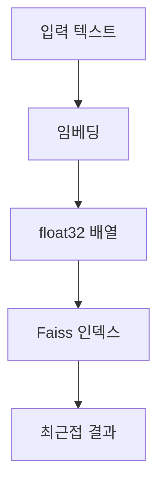

> [!NOTE]
> 토큰화는 문자열을 모델 입력 단위로 바꾸고, 임베딩은 텍스트 의미를 실수 벡터로 바꾼다. Faiss 검색은 그 벡터의 자료형과 차원을 맞춘 뒤 가까운 항목을 찾는 단계다.

---

## 토큰화의 역할

**핵심:** tiktoken은 OpenAI 모델용 BPE 토크나이저이며, 텍스트를 토큰 ID로 인코딩하고 다시 문자열로 디코딩한다.

| 관점 | 원문이 제시한 BPE 특성 | 실무 의미 |
| :-- | :-- | :-- |
| 복원 | 가역적이고 무손실 | 토큰 ID에서 원문을 다시 구성할 수 있다 |
| 범용성 | 임의 텍스트 처리 | 사전에 없던 문자열도 분해해 표현한다 |
| 압축 | 자주 쓰는 부분 문자열 인식 | 반복되는 단위를 더 큰 토큰으로 묶을 수 있다 |
| 크기 감각 | 평균 토큰 약 4바이트 | 문자 수와 토큰 수가 항상 같지는 않다 |

<Tabs>
  <Tab label="BPE">빈도가 높은 바이트 쌍을 반복 병합해 부분 단어 단위를 만든다.</Tab>
  <Tab label="WordPiece">부분 단어 후보를 점수화해 어휘를 구성하는 계열이다.</Tab>
  <Tab label="Unigram">후보 어휘의 확률 모델로 분할을 선택하는 계열이다.</Tab>
  <Tab label="문자 단위">개별 문자를 기본 단위로 삼아 미등록 단어 문제를 줄인다.</Tab>
  <Tab label="정규화">여러 분할을 학습에 노출해 부분 단어 선택의 편향을 낮춘다.</Tab>
</Tabs>

<details>
<summary>원문에 나온 인코딩 이름</summary>

`cl100k_base`, `p50_base`, `gpt2`가 열거된다. 각 인코딩과 모델의 대응은 라이브러리·모델 버전에 따라 바뀔 수 있으므로 실행 시점의 설정을 확인해야 한다.

</details>

---

## tiktoken 처리 순서

| 단계 | 원문 API | 결과 |
| :-- | :-- | :-- |
| 인코딩 선택 | `get_encoding` | 이름에 해당하는 인코딩 객체 |
| 텍스트 인코딩 | `encode` | 정수 토큰 ID 목록 |
| 토큰 디코딩 | `decode` | 복원된 문자열 |
| 특수 토큰 추가 | `add_special_token` | 사용자 정의 토큰을 포함한 인코딩 |

```text
문자열 → 인코딩 선택 → 토큰 ID 목록 → 디코딩 → 문자열 확인
```

> [!TIP]
> 원문은 한국어 문장을 대상으로 토크나이저를 실행하는 실습 문제를 제시한다.

---

## 임베딩의 의미와 용도

**핵심:** 임베딩은 텍스트를 실수 벡터로 표현하며, 의미가 비슷한 텍스트일수록 벡터 공간에서 가까워지도록 설계된다.

| 활용 | 벡터로 하는 일 |
| :-- | :-- |
| 검색 | 질의와 문서의 가까운 항목 찾기 |
| 군집화 | 유사 항목을 묶기 |
| 추천 | 사용자·항목과 가까운 후보 제시 |
| 이상치 탐지 | 주변에서 멀리 떨어진 항목 찾기 |
| 다양성 분석 | 후보 사이의 거리 분포 확인 |
| 분류 | 벡터를 특징으로 사용해 범주 예측 |



---

## MIRACL 비교

```html preview
<div style="font-family:system-ui,sans-serif;padding:20px;color:var(--foreground)">
  <h3 style="margin:0 0 14px;font-size:15px;font-weight:600">MIRACL 평균 성능 (%)</h3>
  <div id="bars" style="display:flex;align-items:flex-end;gap:14px;height:170px"></div>
  <script>
    var data = [['ada-002', 31.4], ['3-small', 44.0], ['3-large', 54.9]];
    var max = Math.max.apply(null, data.map(function (d) { return d[1]; }));
    document.getElementById('bars').innerHTML = data.map(function (d, i) {
      return '<div style="flex:1;display:flex;flex-direction:column;align-items:center;' +
        'gap:6px;height:100%;justify-content:flex-end">' +
        '<span style="font-size:12px;font-weight:600">' + d[1] + '</span>' +
        '<div style="width:100%;height:' + (d[1] / max * 100) + '%;' +
        'background:var(--chart-' + (i + 1) + ');' +
        'border-radius:var(--radius) var(--radius) 0 0"></div>' +
        '<span style="font-size:12px;color:var(--muted-foreground)">' + d[0] + '</span>' +
        '</div>';
    }).join('');
  </script>
</div>
```

---

## MTEB 비교

```html preview
<div style="font-family:system-ui,sans-serif;padding:20px;color:var(--foreground)">
  <h3 style="margin:0 0 14px;font-size:15px;font-weight:600">MTEB 평균 성능 (%)</h3>
  <div id="bars" style="display:flex;align-items:flex-end;gap:14px;height:170px"></div>
  <script>
    var data = [['ada-002', 61.0], ['3-small', 62.3], ['3-large', 64.6]];
    var max = Math.max.apply(null, data.map(function (d) { return d[1]; }));
    document.getElementById('bars').innerHTML = data.map(function (d, i) {
      return '<div style="flex:1;display:flex;flex-direction:column;align-items:center;' +
        'gap:6px;height:100%;justify-content:flex-end">' +
        '<span style="font-size:12px;font-weight:600">' + d[1] + '</span>' +
        '<div style="width:100%;height:' + (d[1] / max * 100) + '%;' +
        'background:var(--chart-' + (i + 1) + ');' +
        'border-radius:var(--radius) var(--radius) 0 0"></div>' +
        '<span style="font-size:12px;color:var(--muted-foreground)">' + d[0] + '</span>' +
        '</div>';
    }).join('');
  </script>
</div>
```

> [!IMPORTANT]
> MIRACL과 MTEB는 서로 다른 평가이므로 한 축에 합치지 않는다. 위 값은 원문 시점의 평균 성능 표이며 현재 모델 품질을 보증하지 않는다.

---

## 모델 크기와 가격 정보

| 모델 | 원문에 명시된 정보 | 가격 표기 |
| :-- | :-- | :-- |
| text-embedding-3-small | ada-002보다 MIRACL·MTEB 향상, 5배 저렴하다고 설명 | 입력 1,000토큰당 USD 0.00002 |
| text-embedding-3-large | 최대 3,072차원 | 입력 1,000토큰당 USD 0.00013 |
| ada-002 | 비교 기준으로 제시 | 원문에 절대 가격 없음 |

<details>
<summary>가격과 벤치마크를 읽는 경계</summary>

가격, 모델 지원 상태, 차원 기본값, 벤치마크 결과는 모두 원문 작성 시점의 스냅샷이다. 현재 사용 가능 여부와 청구 단위는 실행 전에 공식 모델 문서와 계정 콘솔에서 다시 확인한다.

</details>

---

## Faiss 최근접 검색

| 순서 | 원문 예제의 작업 | 확인점 |
| :-- | :-- | :-- |
| 1 | 입력 문장을 임베딩 | 같은 모델로 질의와 후보를 변환 |
| 2 | 목록을 NumPy `float32`로 변환 | Faiss가 받을 자료형으로 맞춤 |
| 3 | `IndexFlatL2(1536)` 생성 | 벡터 차원과 인덱스 차원이 같아야 함 |
| 4 | 후보 벡터를 `add` | 검색 대상 등록 |
| 5 | `search`에 `k=1` 전달 | 거리 배열과 인덱스 배열 확인 |

> [!SUCCESS]
> `IndexFlatL2`는 유클리드 L2 거리를 사용한다. 원문 예제에서는 거리 값이 작을수록 더 유사한 후보로 해석한다.

<details>
<summary>검색 결과의 두 배열</summary>

`D`는 거리, `I`는 해당 후보의 인덱스를 담는다. 검색 결과를 원문 텍스트에 연결하려면 `I`를 후보 목록의 위치로 사용한다.

</details>

---

## 원문 오류와 API 경계

> [!WARNING]
> 원문 제목의 “titoken”, 활용 목록의 “이상치 타지”, 예제 문장의 “오늘안 날씨가 화창합니다”는 각각 tiktoken, 이상치 탐지, 오늘은으로 보이는 표기 오류다. 인코딩 이름 `p50_base`도 `p50k_base`를 잘못 적은 것으로 보인다. 조용히 고치지 않고 오류로 기록한다.

표기 오류와 별개로 구현 세대 충돌도 구분해야 한다.

> [!CAUTION]
> 원문은 레거시 `Embedding.create` 형식과 클라이언트 기반 임베딩 호출을 함께 사용하고, 임베딩 REST 요청을 “채팅 완성 엔드포인트”라고 설명한다. 또한 `IndexFlatL2(1536)`은 예제 출력 차원에 묶인 값이므로 실제 반환 벡터 길이를 기준으로 인덱스를 만들어야 한다.

키처럼 보이는 문자열은 별도의 재현 경계로 구분한다.

> [!DANGER]
> 원문 코드에는 키처럼 보이는 문자열을 직접 대입하는 예가 있다. 이 노트는 해당 키 값을 재현하지 않는다.

---

## 정리

- 토큰화는 문자열과 토큰 ID 사이의 변환이고 임베딩은 텍스트와 의미 벡터 사이의 변환이다.
- MIRACL과 MTEB는 별도 차트로 읽고, 가격은 독립 표에서 시점 정보로 다룬다.
- Faiss 검색 전에는 자료형과 차원을 실제 임베딩 결과에 맞춘다.
- 원문의 오탈자, API 세대 혼합, 키 하드코딩은 구현 지시가 아니라 경고 대상이다.

---

## 원본 강의 흐름 인터랙티브

```html preview
<div style="font-family:system-ui,sans-serif;padding:20px;color:var(--foreground)">
  <label for="noteFlow5082017" style="font-size:14px;font-weight:600">토큰화·임베딩·Faiss 유사도 검색 단계</label>
  <div id="noteFlow5082017-out" style="font-size:26px;font-weight:700;color:var(--chart-1);margin:6px 0">토큰화·임베딩·Faiss 유사도 검색 핵심 개념</div>
  <input id="noteFlow5082017" type="range" min="1" max="3" step="1" value="1" style="width:100%;accent-color:var(--primary)" />
  <p style="font-size:13px;color:var(--muted-foreground)">슬라이더를 움직이면 원본 PDF에서 정리한 이 노트의 흐름을 확인합니다.</p>
  <script>
    var noteFlow5082017 = document.getElementById('noteFlow5082017');
    var noteFlow5082017Out = document.getElementById('noteFlow5082017-out');
    var noteFlow5082017Steps = ["토큰화·임베딩·Faiss 유사도 검색 핵심 개념","토큰화·임베딩·Faiss 유사도 검색 처리 절차","토큰화·임베딩·Faiss 유사도 검색 검증·응용"];
    noteFlow5082017.addEventListener('input', function () { noteFlow5082017Out.textContent = noteFlow5082017Steps[Number(noteFlow5082017.value) - 1]; });
  </script>
</div>
```
