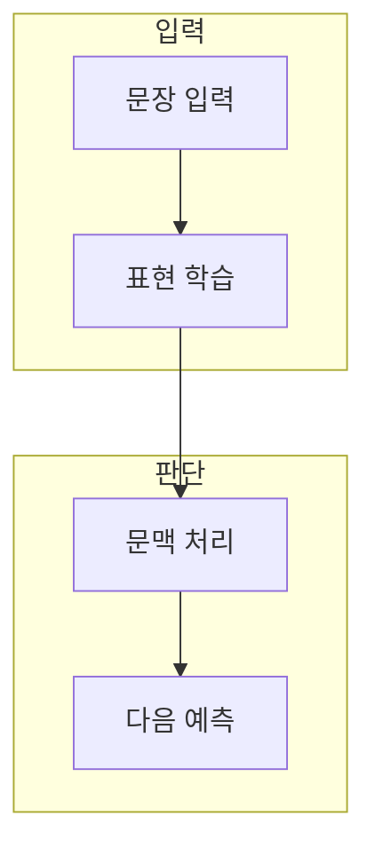

> [!abstract] 한 줄 요약
> 언어 처리는 규칙의 나열에서 문맥을 표현하고 다음 단위를 예측하는 모델로 확장되었다.

## 이 노트의 지도



## 1. 언어 처리 관점의 변화

규칙 기반 접근은 사람이 규칙을 작성하고, 통계·신경망 접근은 데이터에서 표현과 확률을 학습한다. ==문맥== 는 한 단어·토큰의 해석에 영향을 주는 앞뒤 정보.

> [!note] 판단 기준
> 새 방법이 이전 방법을 완전히 지우는 것이 아니라, 문제·데이터·계산 조건에 따라 적합한 표현이 달라진다.

## 2. Transformer가 바꾼 질문

순차 처리의 제약 대신, 입력 사이의 관계를 동시에 다루는 주의 메커니즘이 긴 문맥 학습의 중심 도구가 되었다.

<details>
<summary>모델 변화를 비교할 때</summary>

- 어떤 입력 단위를 쓰는가
- 문맥을 어디까지 볼 수 있는가
- 학습과 추론 비용을 어떻게 감당하는가

</details>

## 데이터로 보기

```html preview
<div style="font-family:system-ui,sans-serif;padding:20px;color:var(--foreground)">
  <h3 style="margin:0 0 14px;font-size:15px;font-weight:600">언어 처리의 비교 축</h3>
  <div id="bars" style="display:flex;align-items:flex-end;gap:14px;height:170px"></div>
  <script>
    var data = [["규칙",1],["통계",1],["표현",1],["문맥",1]];
    var max = Math.max.apply(null, data.map(function (d) { return d[1]; }));
    document.getElementById('bars').innerHTML = data.map(function (d, i) {
      return '<div style="flex:1;display:flex;flex-direction:column;align-items:center;' +
        'gap:6px;height:100%;justify-content:flex-end">' +
        '<span style="font-size:12px;font-weight:600">' + d[1] + '</span>' +
        '<div style="width:100%;height:' + (d[1] / max * 100) + '%;' +
        'background:var(--chart-' + (i + 1) + ');' +
        'border-radius:var(--radius) var(--radius) 0 0"></div>' +
        '<span style="font-size:12px;color:var(--muted-foreground)">' + d[0] + '</span>' +
        '</div>';
    }).join('');
  </script>
</div>
```

값 1은 시대별 성능 비교가 아니라, 접근을 비교할 때 확인할 개념 축의 표시다.

> [!important] 해석의 경계
> 이 차트는 모델의 우열이나 실제 벤치마크 수치를 나타내지 않는다.

## 핵심 정리

| 개념 | 정의 | 왜 중요한가 |
| :-- | :-- | :-- |
| 규칙 | 사람이 작성한 처리 조건 | 예외와 해석 가능성을 관리 |
| 표현 | 입력을 수치로 바꾼 내부 상태 | 데이터에서 유사성과 패턴을 학습 |
| 문맥 | 주변 정보의 관계 | 의미와 다음 예측을 바꾼다 |

## 관련 개념

- 토큰화: 언어 입력을 모델 단위로 나누는 과정
- Transformer: 문맥 관계를 주의로 계산하는 구조

> [!question]- 스스로 점검
> **Q.** 문맥 처리가 길어지면 항상 더 좋은 언어 모델이 되는가?
>
> **A.** 아니다. 관련 없는 정보·비용·평가 과제를 함께 고려해야 하며, 필요한 문맥을 정확히 선택하는 것이 중요하다.
