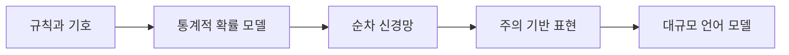

> [!abstract] 핵심 질문
> 언어 모델의 발전은 “문장을 어떤 규칙으로 다룰까”에서 “문맥 전체에서 다음 표현을 어떻게 예측할까”로 문제를 옮겨 왔다.

언어 처리의 모델은 데이터 표현, 문맥을 보존하는 방식, 계산을 병렬화하는 방식이 달라지며 발전했다. ==LLM은 하나의 알고리즘 이름이 아니라 대규모 언어 데이터를 처리하는 모델 계열==로 이해하는 편이 정확하다.



## 변화의 축

| 접근 | 중심 생각 | 강점 | 학습 시 확인할 한계 |
| :-- | :-- | :-- | :-- |
| n-gram·HMM | 인접 단어와 상태 전이의 확률 | 해석이 비교적 직접적 | 긴 문맥을 다루기 어렵다 |
| RNN·LSTM·GRU | 순서를 따라 은닉 상태를 갱신 | 시계열·문장 순서를 반영 | 긴 거리 의존성과 병렬 처리에 부담 |
| Seq2Seq | 입력을 표현으로 압축하고 출력을 생성 | 변환 문제를 하나의 구조로 다룸 | 고정 길이 표현의 병목 |
| Attention·Transformer | 관련된 위치에 선택적으로 집중 | 멀리 떨어진 토큰 관계와 병렬 계산 | 입력 품질과 계산 자원이 중요 |

> [!important] 관점 전환
> Transformer의 핵심은 순서를 완전히 버린 것이 아니라, 순서 외에도 **모든 위치 사이의 관련성**을 함께 계산할 수 있게 한 데 있다.

```html preview h=175
<div style="font-family:system-ui,sans-serif;padding:18px;color:var(--foreground)">
  <div style="font-weight:700;margin-bottom:12px">문맥을 다루는 범위가 넓어지는 과정</div>
  <div style="display:flex;gap:10px;align-items:stretch;flex-wrap:wrap">
    <div style="flex:1;min-width:120px;padding:12px;border:1px solid var(--border);border-radius:var(--radius);background:var(--card)"><b>근접 확률</b><br><span style="font-size:12px;color:var(--muted-foreground)">짧은 단어 묶음</span></div>
    <div style="flex:1;min-width:120px;padding:12px;border:1px solid var(--border);border-radius:var(--radius);background:var(--card)"><b>순차 상태</b><br><span style="font-size:12px;color:var(--muted-foreground)">앞에서 뒤로 누적</span></div>
    <div style="flex:1;min-width:120px;padding:12px;border:1px solid var(--border);border-radius:var(--radius);background:var(--card)"><b style="color:var(--chart-1)">관계 선택</b><br><span style="font-size:12px;color:var(--muted-foreground)">필요한 위치를 참조</span></div>
  </div>
</div>
```

## 같은 문장을 보는 세 방법

<Tabs>
<Tab label="확률 모델">

이전 단어들의 조합을 바탕으로 다음 단어의 확률을 계산한다. 관측이 적은 조합에는 추정이 불안정해질 수 있다.

</Tab>
<Tab label="순차 모델">

토큰을 순서대로 읽으며 상태를 갱신한다. 현재 상태에 이전 정보가 압축되므로, 아주 먼 단서가 약해질 수 있다.

</Tab>
<Tab label="주의 기반 모델">

질문·대명사·핵심 용어처럼 현재 판단에 필요한 위치를 직접 연결해 문맥 표현을 만든다.

</Tab>
</Tabs>

<details>
<summary>학습 점검: Seq2Seq와 Attention을 분리해 이해하기</summary>

Seq2Seq는 입력 시퀀스를 출력 시퀀스로 바꾸는 문제 설정과 기본 구조를 가리킨다. Attention은 그 과정에서 입력의 어떤 부분을 참고할지 가중치를 두는 메커니즘이다. 둘은 경쟁 개념이 아니라 함께 쓰일 수 있다.

</details>

> [!tip] 복습 방법
> “문맥을 어디에 저장하는가?”를 기준으로 각 모델을 한 줄씩 다시 설명해 보면, 모델 이름 암기보다 구조 차이가 잘 드러난다.

## 정리

- 언어 모델은 확률·상태·주의라는 서로 다른 방식으로 문맥을 표현해 왔다.
- LLM의 성능을 볼 때는 모델명보다 입력 맥락, 생성 목표, 계산 규모를 함께 살펴야 한다.
- 다음 노트에서는 이 흐름이 GPT 계열의 구조와 학습 방식으로 어떻게 이어지는지 다룬다.

> [!warning] 해석의 경계
> 이 노트의 흐름은 강의가 제시한 개념적 발전사를 재구성한 것이다. 개별 모델의 출시 순서나 현재 사용 가능 여부를 판단하는 문서가 아니다.
