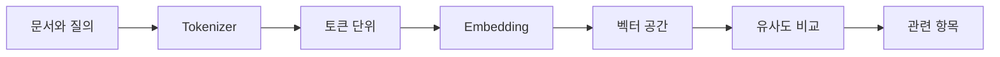

> [!abstract] 핵심 연결
> Tokenizer는 텍스트를 모델 입력 단위로 나누고, Embedding은 그 단위를 의미 비교가 가능한 벡터 공간으로 옮긴다.

문자 수와 토큰 수는 같지 않다. 모델은 텍스트를 토큰 단위로 처리하며, 생성 범위·비용·문맥 길이의 해석도 이 단위에 기대어 있다. Embedding은 텍스트 조각을 벡터로 바꿔 의미상 가까운 항목을 찾는 데 사용한다.



## 두 개념의 역할

| 구분 | Tokenizer | Embedding |
| :-- | :-- | :-- |
| 입력 | 문자열 | 텍스트 또는 토큰의 의미 |
| 출력 | 토큰 시퀀스 | 숫자 벡터 |
| 주된 목적 | 모델 처리 단위 설정 | 의미 기반 비교 |
| 확인할 값 | 토큰 수·분할 결과 | 거리·유사도·검색 순위 |
| 흔한 오해 | 단어와 항상 일치한다고 생각 | 벡터가 사실을 보증한다고 생각 |

> [!note] 유사도는 답변이 아니다
> 벡터 검색은 관련 후보를 고르는 단계다. 검색된 내용이 질문에 정확히 답하는지와, 생성된 답이 그 내용을 충실히 따르는지는 별도의 검토 문제다.

```html preview h=175
<div style="font-family:system-ui,sans-serif;padding:18px;color:var(--foreground)">
  <div style="font-weight:700;margin-bottom:10px">같은 질의에 대한 후보 거리</div>
  <div style="display:flex;align-items:center;gap:9px"><span style="width:90px;font-size:12px">후보 A</span><div style="height:16px;flex:1;background:var(--chart-2);border-radius:var(--radius)"></div><span style="font-size:12px">가까움</span></div>
  <div style="display:flex;align-items:center;gap:9px;margin-top:8px"><span style="width:90px;font-size:12px">후보 B</span><div style="height:16px;flex:.63;background:var(--chart-3);border-radius:var(--radius)"></div><span style="font-size:12px">중간</span></div>
  <div style="display:flex;align-items:center;gap:9px;margin-top:8px"><span style="width:90px;font-size:12px">후보 C</span><div style="height:16px;flex:.28;background:var(--border);border-radius:var(--radius)"></div><span style="font-size:12px;color:var(--muted-foreground)">멀다</span></div>
</div>
```

## 검색 흐름

<Tabs>
<Tab label="분할">

문서를 검색 가능한 조각으로 나눈다. 너무 크면 주제가 섞이고, 너무 작으면 필요한 문맥이 분리될 수 있다.

</Tab>
<Tab label="표현">

각 조각과 질의를 같은 종류의 벡터 표현으로 바꾼다. 비교가 가능하려면 표현 방식이 일관되어야 한다.

</Tab>
<Tab label="비교">

질의 벡터와 문서 벡터의 유사도를 계산해 후보를 정렬한다. 상위 결과는 관련성의 후보이지 정답 확정이 아니다.

</Tab>
</Tabs>

<details>
<summary>코사인 유사도의 직관</summary>

두 벡터의 방향이 비슷할수록 유사도가 높다고 보는 방식이다. 벡터의 크기보다 방향 관계를 보므로, 의미상 가까운 텍스트 조각을 찾는 기준으로 설명할 수 있다.

$$
operatorname{cos}(\theta) = \frac{\mathbf{u}\cdot\mathbf{v}}{\lVert\mathbf{u}\rVert\lVert\mathbf{v}\rVert}
$$

</details>

> [!tip] 검색 품질을 나눠 점검하기
> 토큰 분할, 임베딩 표현, 검색 순위, 최종 답변을 따로 확인한다. 한 단계의 문제를 다른 단계의 파라미터로 가리지 않는다.

## 정리

- Tokenizer는 입력 길이와 모델 처리 단위를 결정한다.
- ==Embedding은 텍스트를 유사도 비교 가능한 벡터로 표현==한다.
- 의미상 가까운 검색 결과도 사실성·완전성·답변 적합성을 자동으로 보장하지 않는다.

> [!warning] 실습 해석
> 유사도 검색의 숫자는 후보 순위를 위한 신호다. 특정 임계값을 절대적인 정답 기준으로 사용하지 않는다.
