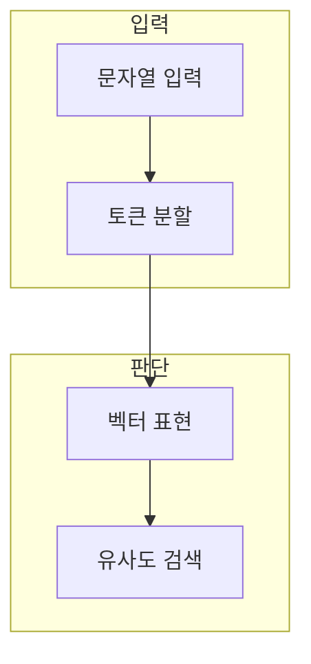

> [!abstract] 한 줄 요약
> 토큰화는 모델이 읽는 단위를, 임베딩은 비교·검색에 쓰는 의미 표현을 정한다.

## 이 노트의 지도



## 1. 토큰화의 영향

같은 문장도 토크나이저에 따라 나뉘는 단위가 달라지므로 길이·절단 위치·비용 추정이 달라질 수 있다. ==토큰== 는 모델이 입력과 출력을 처리하는 기본 단위.

> [!note] 판단 기준
> 문자 수나 단어 수만으로 실제 토큰 수를 정확히 알 수 없으므로 사용 환경에서 확인한다.

## 2. 임베딩과 유사도

임베딩은 텍스트·문서를 벡터로 표현해 의미적으로 가까운 후보를 찾는 데 쓴다.

<details>
<summary>코사인 유사도</summary>

두 벡터의 방향이 얼마나 비슷한지 보는 한 방법은 다음과 같다.

$$
\cos(\theta) = \frac{\mathbf{u} \cdot \mathbf{v}}{\lVert\mathbf{u}\rVert\,\lVert\mathbf{v}\rVert}
$$

</details>

## 데이터로 보기

```html preview
<div style="font-family:system-ui,sans-serif;padding:20px;color:var(--foreground)">
  <label for="amt" style="font-size:14px;font-weight:600">예시 입력 토큰 수</label>
  <div id="out" style="font-size:30px;font-weight:700;color:var(--chart-1);margin:6px 0">토큰 24</div>
  <input id="amt" type="range" min="1" max="128" step="1" value="24"
    style="width:100%;accent-color:var(--primary)" />
  <p style="font-size:13px;color:var(--muted-foreground)">값을 바꿔 입력 단위가 문맥 예산과 처리 범위에 영향을 준다는 점을 생각한다.</p>
  <script>
    var amt = document.getElementById('amt');
    var out = document.getElementById('out');
    amt.addEventListener('input', function () {
      out.textContent = '토큰 ' + Number(amt.value).toLocaleString();
    });
  </script>
</div>
```

> [!important] 해석의 경계
> 값은 실제 특정 문자열의 토큰 수나 비용이 아니다. 실제 토크나이저와 모델 설정에서 계산한다.

## 핵심 정리

| 개념 | 정의 | 왜 중요한가 |
| :-- | :-- | :-- |
| 토큰 | 모델의 처리 단위 | 길이·비용·절단에 영향 |
| 임베딩 | 의미의 수치 표현 | 검색·군집·비교의 입력 |
| 유사도 | 벡터 관계의 측정 | 후보 정렬을 돕는다 |

## 관련 개념

- RAG: 검색 결과를 생성 맥락으로 연결하는 방식
- 벡터 저장소: 임베딩과 메타데이터를 검색하는 저장 구조

> [!question]- 스스로 점검
> **Q.** 임베딩 유사도가 높으면 항상 정답 문서라는 뜻인가?
>
> **A.** 아니다. 유사도는 후보 정렬 신호일 뿐이며, 메타데이터·내용·최종 답변 근거를 함께 검토해야 한다.
