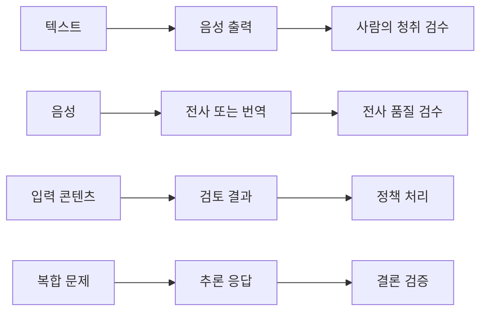

> [!abstract] 핵심 연결
> 오디오·안전 검토·추론은 모두 모델 호출이지만, 기대하는 입력과 사람이 확인해야 하는 결과가 서로 다르다.

텍스트만 생성하는 시스템으로 LLM을 이해하면 적용 범위를 놓치기 쉽다. 강의는 텍스트를 음성으로 바꾸고, 음성을 텍스트로 옮기며, 입력을 검토하고, 복잡한 문제를 단계적으로 다루는 작업을 각각 소개한다.



## 작업별 계약

| 작업 | 대표 입력 | 대표 출력 | 반드시 확인할 것 |
| :-- | :-- | :-- | :-- |
| Text to Speech | 텍스트·음성 설정 | 음성 파일 | 발음·속도·의미 전달 |
| Speech to Text | 음성 파일 | 전사 텍스트 | 누락·화자·언어 |
| Speech Translation | 음성 파일·목표 언어 | 번역된 전사 | 번역 방향·고유명사 |
| Moderation | 검사할 콘텐츠 | 분류·판정 신호 | 후속 정책과 사람 검토 |
| Reasoning | 구조화된 문제 | 단계적 해결 응답 | 결론·계산·근거의 타당성 |

> [!important] 출력 형식이 검수 방법을 바꾼다
> 음성 출력은 듣기 전에는 품질을 단정할 수 없고, 전사는 원본 음성과 대조해야 하며, Moderation 신호는 자동 차단 규칙과 분리해 다뤄야 한다.

```html preview h=175
<div style="font-family:system-ui,sans-serif;padding:18px;color:var(--foreground)">
  <div style="font-weight:700;margin-bottom:11px">입력과 검수의 짝</div>
  <div style="display:grid;grid-template-columns:repeat(3,minmax(0,1fr));gap:9px">
    <div style="padding:11px;border:1px solid var(--border);border-radius:var(--radius);background:var(--card)">텍스트 → 음성<br><span style="font-size:12px;color:var(--muted-foreground)">청취 검사</span></div>
    <div style="padding:11px;border:1px solid var(--border);border-radius:var(--radius);background:var(--card)">음성 → 텍스트<br><span style="font-size:12px;color:var(--muted-foreground)">대조 검사</span></div>
    <div style="padding:11px;border:1px solid var(--border);border-radius:var(--radius);background:var(--card);color:var(--chart-5)">콘텐츠 → 신호<br><span style="font-size:12px;color:var(--muted-foreground)">정책 검사</span></div>
  </div>
</div>
```

## 결과를 읽는 방법

<Tabs>
<Tab label="오디오">

음성 합성과 전사는 텍스트 정확도만으로 평가하지 않는다. 발음·억양·잡음·문맥에서의 생략을 실제 사용 장면에서 확인한다.

</Tab>
<Tab label="Moderation">

검토 결과는 위험 가능성을 다루는 신호다. 이 신호를 어떤 사용자 경험과 운영 절차로 연결할지는 서비스가 명시해야 한다.

</Tab>
<Tab label="추론">

복잡한 문제에 대한 답은 길이가 아니라 제약을 지켰는지, 중간 계산과 결론이 서로 맞는지로 검토한다.

</Tab>
</Tabs>

<details>
<summary>음성 전사에서 고유명사가 어려운 이유</summary>

발음이 비슷한 단어, 전문 용어, 외국어 표기가 같은 소리로 들릴 수 있다. 따라서 업무상 중요한 이름·숫자·약어는 전사 결과를 원본 음성과 대조하는 후속 확인이 필요하다.

</details>

> [!tip] 테스트 세트 구성
> 짧고 깨끗한 음성만으로 테스트하지 말고, 속도·잡음·다국어·전문 용어가 다른 입력을 포함한다. 검토 시스템도 경계 사례를 따로 모아 본다.

## 정리

- 오디오·안전 검토·추론은 서로 다른 입력과 검수 기준을 가진다.
- ==Moderation 결과는 최종 정책 결정 자체가 아니라 판단을 위한 신호==다.
- 모델 출력이 멀티모달이 될수록 사람의 검수 지점도 달라진다.

> [!warning] 안전 운영
> 검토 결과만으로 맥락을 무시한 자동 결정을 내리면 오판을 낳을 수 있다. 민감한 후속 조치는 서비스 정책과 사람의 검토 경로를 함께 설계한다.
